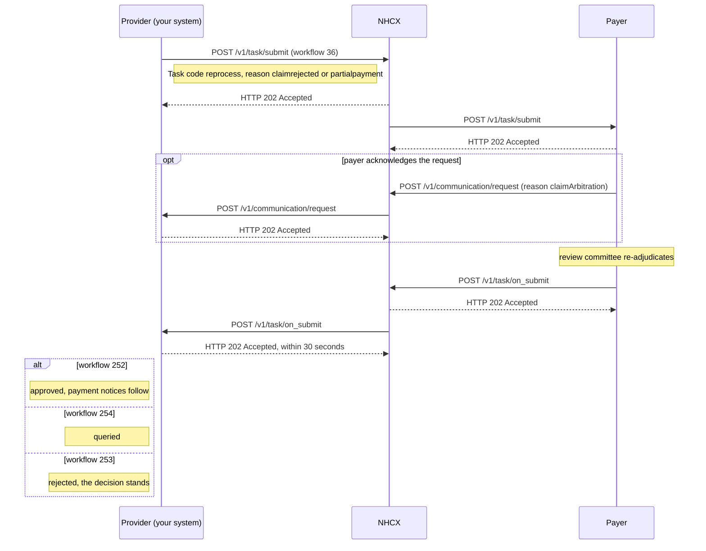

# Ask the payer to reprocess a claim

## In plain words

[Reprocessing](../glossary/reprocess.md) asks the payer to look at an adjudicated claim again. You send it as a FHIR Task on `/v1/task/submit`, with evidence. The payer re-adjudicates and answers on `/v1/task/on_submit`.

There are two cases. Both use workflow `36` and Task code `reprocess`.

| | Rejected claim | Partly paid claim, the erroneous claim |
|---|---|---|
| When you may send it | As soon as the rejection arrives | Only after the payment settles, workflow `33`, and you acknowledged it, workflow `17` |
| Reason code | `claimrejected` | `partialpayment` |
| Amount | Not sent. The full claim is implied | The shortfall, never more than the claimed amount minus the approved amount |
| Supporting document | Mandatory | Mandatory |
| How often, under [PMJAY](../glossary/pmjay.md) | Once per claim | Once per claim |

A reprocess request goes to the [CRC](../glossary/crc.md). Its decision is final. No erroneous claim can follow a CRC decision.

## Before you start

- The claim was adjudicated. It was rejected, `outcome` `complete` with reason `cancelled`, or it was paid in part.
- For a partly paid claim, you received the payment notice with workflow `33` and sent your acknowledgement with workflow `17`. See [receive a payment notice](payment-notice.md).
- You have the claim number. It is the preauthorisation number your hospital generated, carried forward unchanged.
- You have the document that justifies the request.
- No reprocess or erroneous claim was raised for this claim before.

## What happens

1. Build a Task bundle, as in [the Task bundle](../fhir/task.md). Set `status` to `requested`, `intent` to `order`, and `code` to `reprocess`.
2. Set `reasonCode` to `claimrejected` for a rejected claim, or `partialpayment` for a partly paid one. Add the claim number as an input, and point `basedOn` at the original claim.
3. Attach the supporting document as a `valueAttachment`. For a partly paid claim, send the shortfall amount.
4. Seal and set the headers, as in [send a sealed request](send-a-sealed-request.md). Set `x-hcx-workflow_id` to `36` and `x-hcx-status` to `request.initiated`.
5. Start a new correlation. Set `x-hcx-correlation_id` to the value of this call's `x-hcx-api_call_id`.
6. Call [POST /v1/task/submit](../endpoints/task-submit.md). NHCX answers `202 Accepted`. It is not the decision.
7. The payer may confirm it received the request with a [communication request](../glossary/communication-request.md), reason `claimArbitration`. Answer its delivery with `202`, then acknowledge it on [/v1/communication/on_request](../endpoints/communication-on-request.md).
8. Receive [POST /v1/task/on_submit](../callbacks/task-on-submit.md). Answer `202 Accepted` within 30 seconds, then process.
9. Read `type`. `ProtocolResponse` means the payer could not process the request. Otherwise decrypt `payload` with your private key.
10. Find the Task, with `status` `completed`. Follow `Task.output` to the ClaimResponse in the same bundle. Read it as you read a [claim decision](claim-submit.md).

| `x-hcx-workflow_id` | Meaning | What to do |
|---|---|---|
| `252` | Reprocess approved | Wait for [payment notices](payment-notice.md), workflows `30`, `31` and `33` |
| `254` | Reprocess queried | Send the information the payer asks for, with workflow `19` |
| `253` | Reprocess rejected | The original decision stands. The case is closed |

## How you know it worked

The reprocess request is decided when all of these hold:

- You received `POST /v1/task/on_submit` whose `x-hcx-correlation_id` equals the one you sent.
- Its `payload` decrypts, and the Task in it has `status` `completed`.
- `Task.output` resolves to a ClaimResponse inside the same bundle.
- `x-hcx-workflow_id` is `252`, approved, or `253`, rejected.
- You recorded the decision against the claim. After `252`, you watch for the payment notice.

## When it goes wrong

The payer cannot find the claim. [ERR-PYR-CLM-007](../errors/err-pyr-clm-007.md) means no preauthorisation or claim record exists for the case number. Send the preauthorisation number your hospital generated as the claim number.

The request is refused as too early or repeated. An erroneous claim sent before workflow `33` arrives is out of order. A second request on the same claim exceeds the once-per-claim limit under PMJAY. Neither can be fixed by resending.

NHCX rejects the request as a duplicate. [NHCX-1006](../errors/nhcx-1006.md) means you reused a correlation id. Start a new correlation.

The callback is a `ProtocolResponse`. [PAYR-1001](../errors/payr-1001.md) means the payer could not decrypt your request. Fetch its certificate again and reseal.

No decision arrives. Reprocess has no fixed turnaround time. [Check the request's status](status-check.md) to confirm the payer holds it. An undeliverable request comes back on [/v1/error](../callbacks/error.md).
