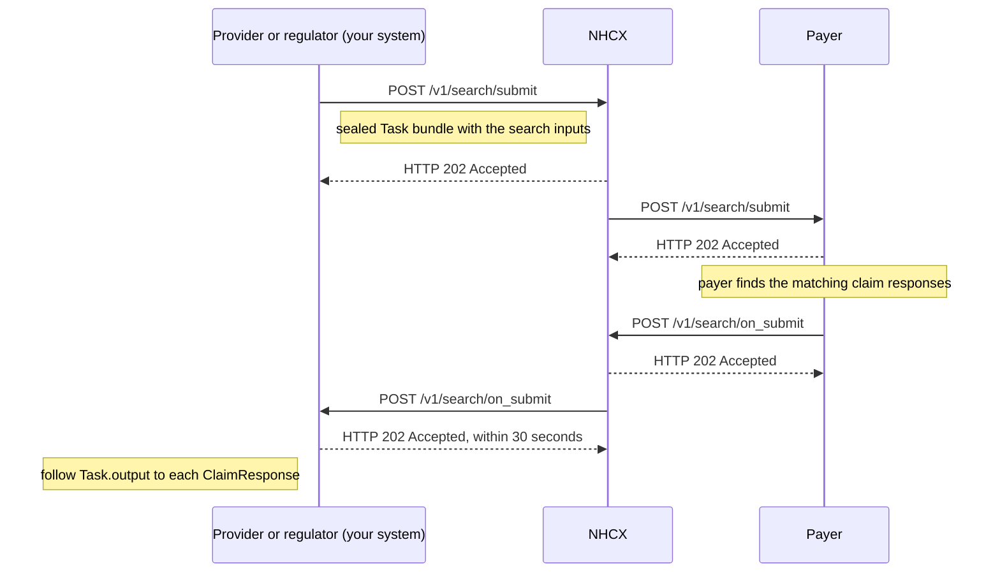

# Search for claims

## In plain words

A claim search asks a [payer](../glossary/payer.md) for the claim responses that match your criteria. You can search by claim number, policy number, product number and a date range. Providers use it, and so do regulators.

You send the criteria in a FHIR Task on `/v1/search/submit`. The payer answers on `/v1/search/on_submit` with a Task whose outputs point to the matching ClaimResponse resources.

Search only reads. It changes nothing about a claim. To find where a request of yours stands in the exchange, use a [status check](status-check.md) instead.

## Before you start

- You are a registered participant with a valid [session token](../concepts/session-token.md) and a callback endpoint that answers within 30 seconds.
- You know the payer to search, and hold its encryption certificate.
- You have at least one criterion: a claim number, a policy number, a product number, or a from and to date.

## What happens

1. Build a Task bundle with `status` `requested`, as in [the Task bundle](../fhir/task.md). It names the search Task code.
2. Add one Task input per criterion. The input types are `ClaimNumber`, `PolicyNumber`, `ProductNumber`, `FromDate` and `ToDate`.
3. Seal and set the headers, as in [send a sealed request](send-a-sealed-request.md). Set `x-hcx-status` to `request.initiated`. Set `x-hcx-correlation_id` to the value of this call's `x-hcx-api_call_id`.
4. Call [POST /v1/search/submit](../endpoints/search-submit.md). NHCX answers `202 Accepted`. The results are not in it.
5. Receive [POST /v1/search/on_submit](../callbacks/search-on-submit.md). Answer `202 Accepted` within 30 seconds, then process.
6. Read `type`. `ProtocolResponse` means the payer could not process the search. Otherwise decrypt `payload` with your private key.
7. Find the Task. Its `status` is `completed`. Follow each `Task.output` reference to a [ClaimResponse](../fhir/claim-response.md) in the same bundle.
8. Read `x-hcx-status`. `response.partial` means more results may follow on the same correlation id. `response.complete` closes the search.

## How you know it worked

The search is finished when all of these hold:

- You received `POST /v1/search/on_submit` whose `x-hcx-correlation_id` equals the one you sent.
- Its `type` is not `ProtocolResponse`, and `payload` decrypts with your private key.
- The Task in it has `status` `completed`, and each `Task.output` resolves to a ClaimResponse in the bundle.
- The last callback for the search carried `x-hcx-status` `response.complete`.

## When it goes wrong

The 202 arrives and no results follow. [Check the request's status](status-check.md). An undeliverable request comes back on [/v1/error](../callbacks/error.md). See [accepted, then no callback](../troubleshooting/accepted-then-no-callback.md).

NHCX rejects the call. [NHCX-1003](../errors/nhcx-1003.md) means the recipient code is not registered. [NHCX-1006](../errors/nhcx-1006.md) means the correlation id was used before. Start a new correlation for every search.

The callback is a `ProtocolResponse`. [PAYR-1001](../errors/payr-1001.md) means the payer could not decrypt your request. Fetch its certificate again and reseal.

The results do not match the claim you meant. Check the input types and values. Values are case-sensitive and must match exactly, with no stray spaces.
