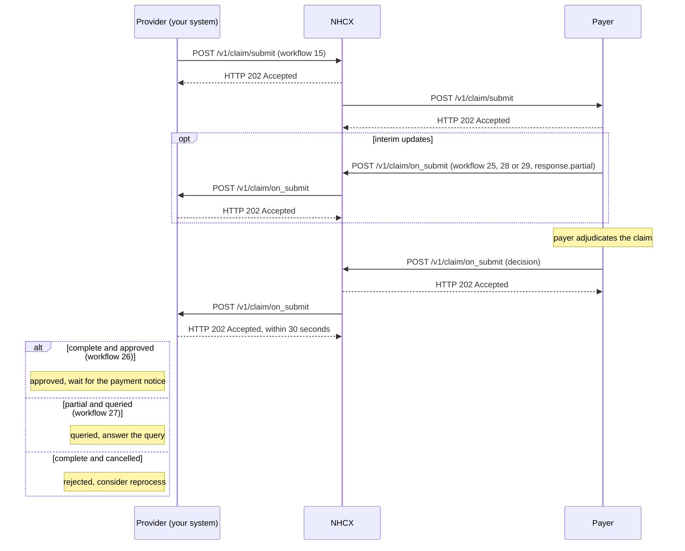

# Submit a claim after discharge

## In plain words

A [claim](../glossary/claim.md) asks the payer to pay for treatment already delivered. It uses the same Claim structure as the [preauthorisation](preauth-submit.md), with `Claim.use` set to `claim`. It carries final amounts and the full record: discharge summary, operative notes, diagnostics and the itemised bill.

For [PMJAY](../glossary/pmjay.md) there is no separate discharge submission. Discharge details travel inside the claim, with workflow `15`.

The [payer](../glossary/payer.md) may answer more than once. `x-hcx-status` `response.partial` means the claim is still open. `response.complete` closes it, and no further submissions are accepted against that claim identifier.

## Before you start

- The case holds an approved preauthorisation with a `preAuthRef`.
- No claim has been raised for the case yet.
- The amount you will claim is no more than the preauthorisation's approved amount.
- You authenticated the beneficiary at discharge by [fingerprint or iris](biometric-fingerprint-iris.md) or [face](biometric-face.md). Where that is not possible, you have the Authentication Consent Questionnaire response to attach.
- The discharge documents are ready: discharge summary, operative notes, diagnostic reports and the final itemised bill.
- Your session token, callback endpoint and the payer's certificate are in place, as in [send a sealed request](send-a-sealed-request.md).

## What happens

1. Start from the preauthorisation bundle. Change `Claim.use` to `claim`. Keep `Claim.identifier`, and reference the approved `preAuthRef`.
2. Replace the estimates with final amounts. Keep the diagnoses and procedures unless the treatment changed. Add the discharge documents to `supportingInfo`. See [the claim request bundle](../fhir/claim-request.md).
3. For PMJAY, record the discharge in `supportingInfo` with category `DIS`. Its code is `DTH`, `DTM`, `LAMA` or `DAMA`, and its value is `Before Surgery` or `After Surgery`.
4. Seal and set the headers, as in [send a sealed request](send-a-sealed-request.md). Set `x-hcx-workflow_id` to `15` and `x-hcx-status` to `request.initiated`. Send `x-hcx-ben-abha-id`.
5. Start a new correlation. Set `x-hcx-correlation_id` to the value of this call's `x-hcx-api_call_id`. Store it against the case.
6. Call [POST /v1/claim/submit](../endpoints/claim-submit.md). NHCX answers `202 Accepted`. It is not the adjudication.
7. Wait. Interim callbacks may arrive on `/v1/claim/on_submit` with `x-hcx-status` `response.partial`: workflow `25` received, `28` in process, `29` forwarded. Answer each with `202` and keep waiting.
8. Receive the decision on [POST /v1/claim/on_submit](../callbacks/claim-on-submit.md). Answer `202 Accepted` within 30 seconds, then process.
9. Read `type`. `ProtocolResponse` means the payer could not process the claim. Otherwise decrypt `payload` and read the [ClaimResponse](../fhir/claim-response.md).
10. Read `ClaimResponse.outcome` and `adjudication[0].reason` together. Both an approval and a rejection carry `outcome` `complete`.

| `outcome` | Adjudication reason | Meaning | What to do |
|---|---|---|---|
| `complete` | `approved` | Approved, workflow `26` | Wait for the [payment notice](payment-notice.md) |
| `partial` | `approved` | Partly approved at a reduced amount | Read `processNote` for the reduction. Wait for payment |
| `partial` | `queried` | Queried, workflow `27`, totals `0` | [Answer the query](claim-query-response.md) |
| `complete` | `cancelled` | Rejected. The claim is closed | Decide whether to [ask for reprocessing](claim-reprocess.md) |

## How you know it worked

The claim is adjudicated when all of these hold:

- You received `POST /v1/claim/on_submit` whose `x-hcx-correlation_id` equals the one you sent.
- Its `type` is not `ProtocolResponse`, and `payload` decrypts with your private key.
- The ClaimResponse has `use` `claim`, `outcome` `complete`, adjudication reason `approved`, and a `benefit` total above zero.
- `x-hcx-workflow_id` is `26` and `x-hcx-status` is `response.complete`.
- You stored the approved amount against the case, ready to reconcile the payment notice.

A rejection, `complete` with reason `cancelled`, also ends this flow. A query hands over to the query flow.

## When it goes wrong

The payer finds no approved preauthorisation. [PAYR-1302](../errors/payr-1302.md) means no approved record exists for the case number. Check that the claim carries the preauthorisation's claim identifier.

A claim already exists. [PAYR-1301](../errors/payr-1301.md) means the case number already has a claim. To add documents to a queried claim, [answer the query](claim-query-response.md) instead.

Authentication is missing at discharge. [PAYR-1363](../errors/payr-1363.md) means you sent neither biometric authentication nor the consent questionnaire response.

The 202 arrives and no decision follows. Interim `response.partial` callbacks mean the payer is still working. For long waits, [check the request's status](status-check.md). An undeliverable request comes back on [/v1/error](../callbacks/error.md).

NHCX or the payer rejects the envelope. [NHCX-1006](../errors/nhcx-1006.md) means the correlation id was used before. A `ProtocolResponse` with [PAYR-1001](../errors/payr-1001.md) means the payer could not decrypt your request.
