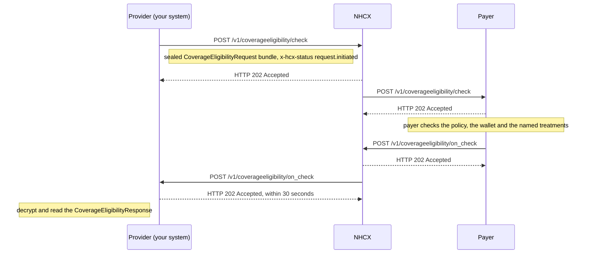

# Check coverage eligibility

## In plain words

A coverage eligibility check asks a payer about one patient before treatment. Is the policy in force? How much balance is left? Does the planned treatment need approval, and with which documents?

Your system sends the question to the [NHCX](../../shared/glossary/nhcx.md) exchange, sealed so that only the [payer](../glossary/payer.md) can read it. The exchange forwards it. The payer's answer arrives later, as a callback to the endpoint you registered.

Every request names a purpose. The purpose decides what the payer returns.

| Purpose | What the payer returns |
|---|---|
| `validation` | Whether the policy is in force, the amount already used and the balance left |
| `benefits` | The benefits the policy covers |
| `auth-requirements` | For each treatment you name: whether it is covered at your hospital, the covered amount, and the documents and questionnaires preauthorisation needs |
| `discovery` | The active policy code, when the policy lookup finds nothing for the patient |

[Which coverage eligibility purpose to send](../decisions/eligibility-purpose.md) explains when each one fits. [The three coverage eligibility purposes](../concepts/coverage-eligibility-purposes.md) explains the model.

## Before you start

- Your hospital is an active participant with a [participant code](../glossary/participant-code.md). [Sandbox onboarding](sandbox-onboarding.md) gets you there.
- You hold a valid [session token](../concepts/session-token.md).
- Your callback endpoint is registered and meets the [callback URL rules](../sandbox/callback-url-requirements.md). It answers every callback within 30 seconds.
- You know who adjudicates this patient's policy. The [policy lookup](../endpoints/participant-get-policies.md) returns a `payerid` and a `processingid`. Address the request to the `processingid`.
- You hold that participant's encryption certificate, fetched with [/fetch/certs](../endpoints/fetch-certs.md).
- You have the patient's [ABHA number](../../shared/glossary/abha-number.md). For [PMJAY](../glossary/pmjay.md) you also have the member ID.
- For `auth-requirements`, you know the package codes you plan to treat. The [insurance plan](insurance-plan-request.md) lists them.
- In the sandbox, address the request to the [dummy payer](../sandbox/dummy-payer.md).

## What happens

1. Build the [CoverageEligibilityRequest bundle](../fhir/coverage-eligibility-request.md). Include the patient, the active coverage, your hospital and the payer as organisations, and the person running the check as `enterer`.
2. Set `purpose`. For `auth-requirements`, add one `item` per package, with its category code, package code and quantity.
3. Seal the bundle as a [JWE](../glossary/jwe.md) and set the protected headers, as in [send a sealed request](send-a-sealed-request.md). Set `x-hcx-status` to `request.initiated` and send `x-hcx-ben-abha-id`.
4. Start a new correlation. Set `x-hcx-correlation_id` to the value of this call's `x-hcx-api_call_id`.
5. Call [POST /v1/coverageeligibility/check](../endpoints/coverageeligibility-check.md). NHCX answers `202 Accepted`. The envelope passed validation and is on its way to the payer. It is not the answer.
6. Wait for the callback. The payer answers once it has checked the policy. A payer may instead ask NHCX to forward the same request to another payer.
7. Receive [POST /v1/coverageeligibility/on_check](../callbacks/coverageeligibility-on-check.md). Answer `202 Accepted` within 30 seconds, then process.
8. Read the body's `type`. `ProtocolResponse` means the payer could not process the request, and `x-hcx-error_details` says why. Any other type carries the sealed answer in `payload`. Decrypt it with your private key.
9. Read the [CoverageEligibilityResponse](../fhir/coverage-eligibility-response.md). Business problems, such as an expired policy, sit inside this sealed response, never in the headers.

## How you know it worked

The check is finished when all of these hold:

- You received `POST /v1/coverageeligibility/on_check` whose `x-hcx-correlation_id` equals the correlation id you sent.
- Its `type` is not `ProtocolResponse`, and `payload` decrypts with your private key.
- The bundle holds a `CoverageEligibilityResponse` with `outcome` `complete`.
- For `validation`, `insurance[].inforce` is `true` and the benefit carries the balance left in `allowedMoney`.
- For `auth-requirements`, each item carries `excluded`, `authorizationRequired` and the `authorizationSupporting` document codes, such as `MAND0409`.
- You answered the callback with `202` within 30 seconds, so NHCX does not deliver it again.

## When it goes wrong

The 202 arrives and the callback never does. Check your endpoint against the [callback URL rules](../sandbox/callback-url-requirements.md), then [check the request's status](status-check.md). A request NHCX cannot deliver comes back to you on [/v1/error](../callbacks/error.md). See [accepted, then no callback](../troubleshooting/accepted-then-no-callback.md).

NHCX rejects the call. [NHCX-1006](../errors/nhcx-1006.md) means the correlation id was used before. [NHCX-1003](../errors/nhcx-1003.md) means the recipient code is not registered. [NHCX-1018](../errors/nhcx-1018.md) means the ABHA number in `x-hcx-ben-abha-id` is in the wrong format.

The callback is a `ProtocolResponse` with [PAYR-1001](../errors/payr-1001.md). The payer could not decrypt your request. Fetch its certificate again and reseal. See [the recipient cannot decrypt your message](../troubleshooting/recipient-cannot-decrypt.md).

The payer refuses the purpose or the items. [PAYR-1032](../errors/payr-1032.md) is an invalid purpose. [PAYR-1033](../errors/payr-1033.md) means `auth-requirements` arrived without items.

The policy or the hospital does not qualify. From a payer on the published standard, [PAYR-1004](../errors/payr-1004.md) means your hospital is not registered with it for this policy. [PAYR-1007](../errors/payr-1007.md) means the policy has expired. [PAYR-1116](../errors/payr-1116.md) means your hospital may not raise cases under this policy.
