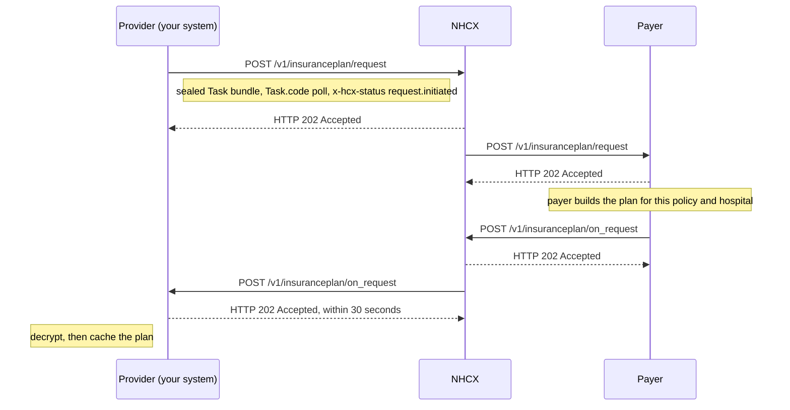

# Request a patient's insurance plan

## In plain words

The [insurance plan](../glossary/insurance-plan.md) is the patient's policy in machine-readable form, as it applies at your hospital. It lists the specialties and packages your hospital is empanelled for, the package rates, the claim conditions, and the documents each treatment needs.

You ask the [payer](../glossary/payer.md) for it through the [NHCX](../../shared/glossary/nhcx.md) exchange, with a Task. The plan arrives later, on your callback. Fetch it before any preauthorisation or claim for a payer and policy, then cache it.

The plan is filtered to your hospital. It shows only what the payer's agreement with your hospital covers. [The insurance plan](../concepts/insurance-plan.md) explains the model.

## Before you start

- Your hospital is an active participant, holds a valid [session token](../concepts/session-token.md), and has a registered callback endpoint that answers within 30 seconds.
- You have the policy number and the payer's `processingid` from the [policy lookup](../endpoints/participant-get-policies.md). The `processingid` goes in `x-hcx-recipient_code`.
- You have your hospital's [HFR](../../shared/glossary/hfr.md) ID.
- You hold the recipient's encryption certificate, fetched with [/fetch/certs](../endpoints/fetch-certs.md).
- No other plan request for this hospital and policy is still open.
- In the sandbox, use the [dummy payer](../sandbox/dummy-payer.md) with the test provider id and policy number it names.

## What happens

1. Build a Task bundle, as in [the insurance plan bundles](../fhir/insurance-plan-bundle.md). Set Task `status` to `requested`, `intent` to `order` and `code` to `poll`.
2. Add two Task inputs: the policy number, and your HFR ID as the provider id. Send both, so the payer returns the view contracted for your hospital.
3. Seal the bundle and set the headers, as in [send a sealed request](send-a-sealed-request.md). Set `x-hcx-status` to `request.initiated`. Set `x-hcx-correlation_id` to the value of this call's `x-hcx-api_call_id`.
4. Call [POST /v1/insuranceplan/request](../endpoints/insuranceplan-request.md). NHCX answers `202 Accepted` and forwards the request.
5. Wait. Do not send a second plan request for the same hospital and policy until this one completes.
6. Receive [POST /v1/insuranceplan/on_request](../callbacks/insuranceplan-on-request.md). Answer `202 Accepted` within 30 seconds, then process.
7. Read the body's `type`. `ProtocolResponse` carries `x-hcx-error_details`. Any other type carries the sealed plan in `payload`. Decrypt it with your private key.
8. Find the `InsurancePlan` resource in the decrypted bundle, with its `Organization` and `Questionnaire` resources.
9. Cache the plan with the date you fetched it. Fetch it again once every 15 days, and after a policy update or a change of treatment.

For [PMJAY](../glossary/pmjay.md), read the plan like this. [The PMJAY InsurancePlan profile](../fhir/pmjay-insurance-plan.md) has the full mapping.

| Plan element | What it holds |
|---|---|
| `plan.specificCost.category` | A specialty, such as General Medicine |
| `plan.specificCost.benefit` | A package, such as `SE012A`, Corneal Grafting |
| `specificCost.benefit.cost` | The package rate |
| `cost.qualifiers` | Extra cost types: `Implant`, and `Stratification` for the bed category |
| `claimCondition` extension | Package rules, such as `EnhancementAllowed`, `ApprovalNotRequired` and `IsDayCare` |
| `claimSupportingInfoRequirement` extension | Documents the payer requires during claim processing |

## How you know it worked

The request is finished when all of these hold:

- You received `POST /v1/insuranceplan/on_request` whose `x-hcx-correlation_id` equals the one you sent.
- Its `type` is not `ProtocolResponse`, and `payload` decrypts with your private key.
- The bundle holds an `InsurancePlan` resource listing benefits for the specialties your hospital is empanelled for.
- You answered the callback with `202` within 30 seconds.
- The plan sits in your cache with its fetch date, ready for eligibility and preauthorisation.

## When it goes wrong

The payer answers [PAYR-1406](../errors/payr-1406.md). An earlier plan request is still in progress with the payer. Wait 15 to 60 minutes, then ask again with a new correlation id.

The 202 arrives and the callback never does. [Check the request's status](status-check.md) and your [callback URL](../sandbox/callback-url-requirements.md). An undeliverable request comes back on [/v1/error](../callbacks/error.md). See [accepted, then no callback](../troubleshooting/accepted-then-no-callback.md).

The payer refuses the policy or your hospital. [PAYR-1401](../errors/payr-1401.md) means the policy is not allowed for your hospital. [PAYR-1402](../errors/payr-1402.md) means no payer holds the policy. [PAYR-1405](../errors/payr-1405.md) means the payer has no enrolled hospital for your HFR ID or sender code. Each message asks you to contact [technical support](../sandbox/support-contacts.md).

The plan arrives empty. No coverage matches this policy and hospital. Check the policy number and the HFR ID you sent.

The callback is a `ProtocolResponse` with [PAYR-1001](../errors/payr-1001.md). The payer could not decrypt your request. Fetch its certificate again and reseal.
