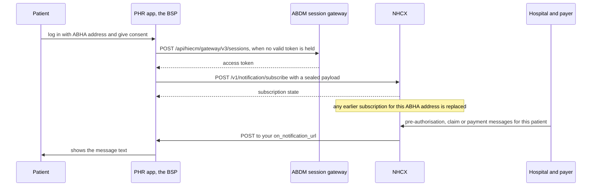

# Subscribe a patient app to notifications

## In plain words

A patient's [PHR](../../shared/glossary/phr.md) app can show the patient what is happening to their pre-authorisations, claims and payments. The app acts as a Beneficiary Service Provider (BSP). It subscribes the patient's [ABHA address](../../shared/glossary/abha-address.md) to the [National Health Claims Exchange](../../shared/glossary/nhcx.md) (NHCX). NHCX then pushes a short, readable message to the app whenever a matching event occurs.

Only one app receives a patient's notifications at a time. The most recent subscription for an ABHA address replaces any earlier one, so the app subscribes again at every login.

## Before you start

- Your app has completed [ABDM](../../shared/glossary/abdm.md) [Milestone 1](../../shared/glossary/m1.md) integration.
- You are registered as a BSP: sandbox testing on `hcxsbx.abdm.gov.in`, sandbox certification, then production registry onboarding. An [end user application](../../shared/glossary/eua.md) such as a PHR app registers with role `10009`. See [Onboard as a participant in the NHCX sandbox](sandbox-onboarding.md).
- You host an HTTPS endpoint with TLS 1.2 or higher, where notifications will arrive.
- You have the NHCX gateway's participant code and certificate, which you seal the subscription for. See [Where to get help with NHCX](../sandbox/support-contacts.md).
- The patient has given explicit consent to receive claim updates in your app. See [beneficiary consent](../concepts/beneficiary-consent.md).
- You hold a client ID and secret for the session token.

## What happens



### 1. Log in and ask for consent

The patient logs in with their ABHA address. Your app reads their ABHA ID and asks for consent before subscribing.

### 2. Hold a valid token

If your token has expired, get a new one. [Which session token endpoint to call](../decisions/session-endpoint.md) settles the address. Read the token's lifetime from the answer, and refresh before it lapses.

### 3. Build the subscription

The payload:

```json
{
  "subscription_id": "<YOUR_SUBSCRIPTION_ID>",
  "topic_code": ["workflow_events"],
  "recipient_code": "<YOUR_BSP_PARTICIPANT_CODE>",
  "subscriber": {
    "id": "<PATIENT_ABHA_ADDRESS>"
  },
  "on_notification_url": "<YOUR_NOTIFICATION_ENDPOINT>"
}
```

An optional `expiry` sets when the subscription ends. The topics:

| `topic_code` | Covers |
|---|---|
| `workflow_events` | Claim lifecycle events: pre-authorisation, claim, payment |
| `network_events` | NHCX platform updates and maintenance |
| `participant_events` | Changes to payer and provider registrations |

Most PHR apps need only `workflow_events`.

Seal the payload as a JWE. Its protected header carries `alg`, `enc` `A256GCM`, `x-hcx-sender_code` set to your BSP code, and `x-hcx-recipient_code` set to the NHCX gateway code. It also carries `x-hcx-timestamp` in ISO 8601 and a fresh UUID in `x-hcx-correlation_id` for every attempt. For `alg`, see [RSA-OAEP or RSA-OAEP-256](../decisions/key-encryption-algorithm.md).

### 4. Subscribe

`POST https://hcxsbx.abdm.gov.in/v1/notification/subscribe` with `Authorization: Bearer <ACCESS_TOKEN_FROM_SESSION_TOKEN>` and `Content-Type: application/json`. The body is `{"payload": "<JWE_COMPACT_STRING>"}`.

The answer returns the subscription state, including `subscription_id` and `subscription_status`. Store `subscription_id` in your app.

### 5. Wait for events

**Wait:** there is no fixed time. When a hospital sends a pre-authorisation or claim for this patient and the payer responds, NHCX posts a notification to your `on_notification_url`:

| Field | Meaning |
|---|---|
| `notification_id` | Unique notification identifier |
| `topic_code` | The topic, for example `workflow_events` |
| `timestamp` | Event time, ISO 8601 |
| `subscriber.id` | The patient's ABHA ID |
| `message` | Readable text you can show the patient as it is |
| `domain_values` | Optional. The `x-hcx-*` values behind the event, for audit or custom display |

The events under `workflow_events`:

| Event type | Meaning | Status values |
|---|---|---|
| `preauth_request` | The provider submitted a pre-authorisation | `queued`, `processing` |
| `preauth_response` | The payer decided it | `approved`, `rejected` |
| `claim_request` | The provider submitted a claim | `queued`, `processing` |
| `claim_response` | The payer adjudicated it | `approved`, `rejected` |
| `payment_notice` | Payment processed | `paid`, `pending` |
| `communication` | Information requested | `information_required` |

In `domain_values`, `x-hcx-action` names the event and `x-hcx-status` carries its protocol status.

On every incoming notification, enforce TLS 1.2 or higher, validate the JWT from NHCX, and check that the sender code is NHCX's. Rate-limit the endpoint. The full delivery is described in [Receiving a notification on a patient app](../callbacks/notification-delivery.md).

### 6. Show the state

Display the subscription status in your app's settings. At the next login, subscribe again.

## How you know it worked

The subscribe call returns `subscription_status` `active` for your `subscription_id`. Later, after a hospital and payer exchange a message for that patient, your `on_notification_url` receives a notification. Its `subscriber.id` is the patient's ABHA ID, and your app shows its `message`.

```observation schema=exit-condition
channel: callback
path: <YOUR_NOTIFICATION_ENDPOINT>
precondition:
  subscribe answer: subscription_status active
match:
  subscriber.id: <PATIENT_ABHA_ADDRESS>
  topic_code: workflow_events
```

## When it goes wrong

| Status | Meaning | What to do |
|---|---|---|
| `401 Unauthorized` | Token expired | Get a new token and subscribe again |
| `403 Forbidden` | Not authorised | Check your BSP registration and status in the registry |
| `409 Conflict` | A conflict on the subscription | Subscribe again under a fresh correlation ID |
| `500 Server Error` | Gateway issue | Retry with backoff |

- **Notifications stop arriving.** Another app subscribed this patient more recently, so yours was replaced. Subscribe again at the next login, and show the status in settings.
- **Nothing ever arrives.** Your endpoint does not offer TLS 1.2 or higher, or NHCX cannot reach it. See [Callback URL rules and the egress addresses to allow](../sandbox/callback-url-requirements.md).
- **Values are refused or never match.** A copied value carries a stray space, such as a trailing space in a URL. Trim every value before sending it.
