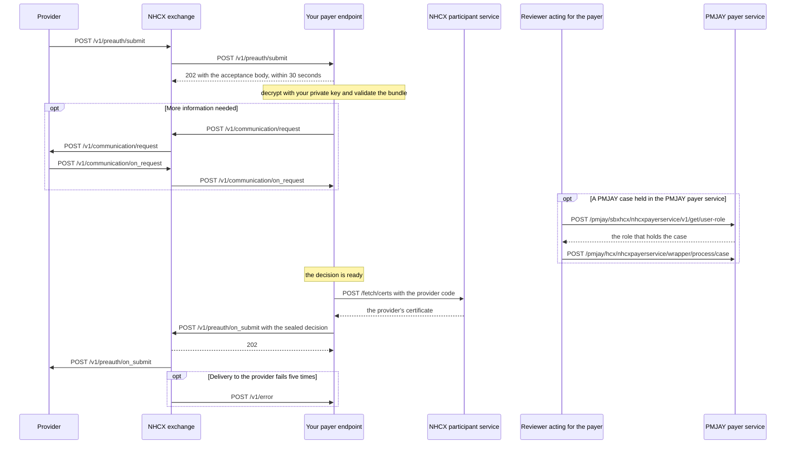

# Receive, adjudicate and answer a request as a payer

## In plain words

As a [payer](../glossary/payer.md), you receive providers' requests from the [National Health Claims Exchange](../../shared/glossary/nhcx.md) (NHCX): eligibility checks, pre-authorisations, claims and more. Each arrives at your registered address on the request path, for example `/v1/preauth/submit`. You acknowledge it at once, decide it in your own time, and send the decision back on the paired answer path, for example `/v1/preauth/on_submit`.

The decision is sealed for the provider. If you cannot process the request at all, you send an unsealed `ProtocolResponse` instead.

## Before you start

- You are onboarded as a payer or [TPA](../glossary/tpa.md). Your registered address serves the request paths for your use cases, and `/v1/error`. See [Onboard as a participant in production](production-onboarding.md).
- Your private key matches the certificate in your participant record.
- Your policies are linked, so providers can find them. See [Link and de-link an ABHA and a policy](policy-link-and-delink.md).
- You hold a session token.
- You can validate bundles against the [NRCeS](../../shared/glossary/nrces.md) profiles.

| Request you receive | Answer you send | What the answer carries |
|---|---|---|
| `/v1/coverageeligibility/check` | `/v1/coverageeligibility/on_check` | Eligibility and plan details |
| `/v1/insuranceplan/request` | `/v1/insuranceplan/on_request` | The insurance plan details |
| `/v1/preauth/submit` | `/v1/preauth/on_submit` | The adjudicated pre-authorisation |
| `/v1/claim/submit` | `/v1/claim/on_submit` | The adjudicated claim |
| `/v1/search/submit` | `/v1/search/on_submit` | The claim responses that match the criteria |
| `/v1/task/submit` | `/v1/task/on_submit` | The answer to a reprocess or cancel task |

## What happens



### 1. Receive and acknowledge

Acknowledge within 30 seconds, before any processing. Follow [Receive, open and acknowledge a sealed message](receive-a-sealed-callback.md).

### 2. Open and validate

Decrypt the payload with your private key. Validate the bundle against the NRCeS profiles.

If you cannot decrypt it, the payload is invalid, or a protocol error occurs, do not adjudicate. Answer with a `ProtocolResponse` as in [Report a processing failure on /v1/error](report-a-processing-error.md). A payload you cannot decrypt takes [PAYR-1001](../errors/payr-1001.md).

### 3. Adjudicate

Decide the request in your own system, with no fixed turnaround.

**Wait, when you need documents:** send `POST /v1/communication/request` to the provider, with `x-hcx-status` `request.initiated`. The payload is a TaskBundle that carries a CommunicationRequest. The provider's answer arrives on your `/v1/communication/on_request`. See [queries and communication](../concepts/queries-and-communication.md).

### 4. Seal the answer

Fetch the provider's certificate with `POST /fetch/certs`, using the request's `x-hcx-sender_code`. Cache it for 24 hours. Then build the protected header:

| Header | Rule |
|---|---|
| `x-hcx-sender_code` | Your participant code |
| `x-hcx-recipient_code` | The request's `x-hcx-sender_code` |
| `x-hcx-api_call_id` | A new UUID, different from the correlation ID |
| `x-hcx-correlation_id` | As [message identifiers](../concepts/message-identifiers.md) sets out, so the provider can match your answer |
| `x-hcx-status` | `response.complete` for a final decision. A claim answer can be `response.partial` |
| `x-hcx-workflow_id` | The payer-side stage code, for example `21` approved, `23` rejected or `24` queried. See [workflow codes](../concepts/workflow-codes.md) |

The answer's `type` is `JWEPayloadResponse` for a sealed decision. Only a request you could not process gets `ProtocolResponse`.

### 5. Send it

`POST /v1/preauth/on_submit`, or the paired path from the table, with `{"payload": "<JWE_COMPACT_STRING>"}`. NHCX answers `202` and forwards it to the provider. The provider acknowledges it to NHCX.

**Wait:** if NHCX cannot deliver your answer after five attempts, the report arrives on your `/v1/error`.

### 6. PMJAY cases in the PMJAY payer service

A PMJAY case is adjudicated role by role in the PMJAY payer service. `POST /pmjay/sbxhcx/nhcxpayerservice/v1/get/user-role`, with `caseid` and `payerid`, returns the role that holds the case now. `POST /pmjay/hcx/nhcxpayerservice/wrapper/process/case` applies an action as that role. Call the role lookup before every claim action.

| Stage | Role | Actions | `usecase` |
|---|---|---|---|
| Pre-authorisation | `PPD-Trust` | `Approve`, `Reject`, `Query` | `PREAUTH` |
| Claim step 1 | `CEX-Trust` | `Forward` | `CLAIM` |
| Claim step 2 | `CPD-Trust` | `Pending`, `cpdApprove`, `cpdReject` | `CLAIM` |
| Claim step 3 | `Medical Audit Committee` | `Approve`, `Reject`, `iQuery` | `Medical Audit Committee` |
| Claim step 4 | `ACO-Trust` | `Approve`, `Reject`, `Pending` | `CLAIM` |
| Claim step 5 | `SHA-Trust` | `Approve`, `Reject`, `Pending` | `CLAIM` |
| Claim step 6 | `Claim Review Committee` | `Approve`, `Reject`, `Pending` | `Claim Review Committee` |

The `process/case` body carries `casenumber`, `action`, `receivercode`, `usecase`, `correlationid`, `sendercode`, `memberid` and `remarks`. Action names are case-sensitive. Give each call a unique correlation ID. See [POST /pmjay/hcx/nhcxpayerservice/wrapper/process/case](../endpoints/payer-service-process-case.md) and [Answer as your own payer system or through the PMJAY payer service](../decisions/payer-implementation.md).

## How you know it worked

NHCX answered `202` to your answer on the paired path, and no `/v1/error` arrives for it. To confirm delivery, send `POST /v1/status` about your answer. The reply on `/v1/on_status` carries `x-hcx-status` `request.dispatched`, meaning the provider's system received it.

```observation schema=exit-condition
channel: callback
path: <YOUR_ENDPOINT_URL>/v1/on_status
precondition:
  your answer on /v1/preauth/on_submit: HTTP 202 from NHCX
match:
  x-hcx-status: request.dispatched
absent:
  /v1/error report for your answer
```

## When it goes wrong

- **The same request keeps arriving.** You process inside the 30-second window, or your acknowledgement has the wrong code or body. Acknowledge first, then process.
- **You cannot decrypt the request.** The provider sealed it with an old copy of your certificate. Answer with a `ProtocolResponse` carrying [PAYR-1001](../errors/payr-1001.md), and check [Rotate your encryption certificate](rotate-certificate.md).
- **NHCX refuses your answer, saying no data exists for its correlation ID.** Your `x-hcx-correlation_id` does not match the request. See [NHCX-1010](../errors/nhcx-1010.md).
- **The provider never gets your answer.** `x-hcx-recipient_code` is not the request's sender code. Swap sender and recipient.
- **You sent a `ProtocolResponse` for a rejection.** The provider treats it as a protocol failure. Send a sealed decision with the rejected workflow code.
- **A PMJAY action is refused.** The case sits with another role, or the action name is misspelt. Call `get/user-role` first, and use the action names exactly as in the table.
