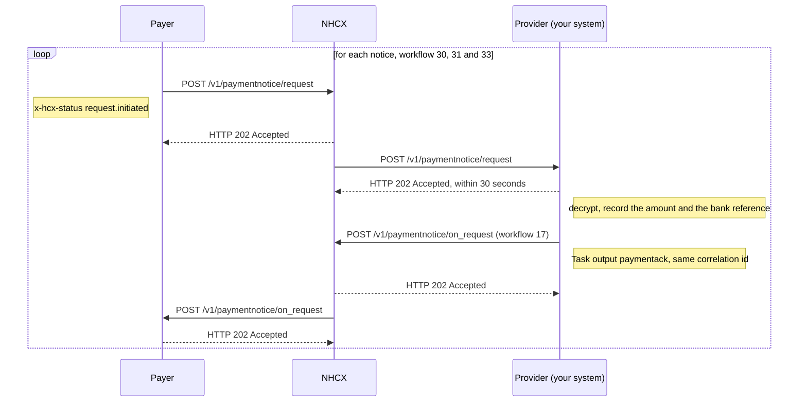

# Receive a payment notice and acknowledge it

## In plain words

A [payment notice](../glossary/payment-notice.md) tells your hospital that the payer is paying an approved claim. It carries the amount, the tax deducted at source, the payment date and the bank's Unique Transaction Reference. The claim decision says what will be paid. The notice says what was paid.

This flow runs the other way from the others. The [payer](../glossary/payer.md) starts it, and your system answers. It arrives some time after the claim approval, not straight away.

| Workflow | Stage |
|---|---|
| `30` | Payment initiated |
| `31` | Payment processed |
| `33` | Payment settled. The Unique Transaction Reference is available |
| `17` | Your acknowledgement of a notice |

Acknowledge each notice. The claim is financially closed when you have received workflow `33`, stored its Unique Transaction Reference, and acknowledged it.

## Before you start

- A claim for the case was approved: `outcome` `complete`, reason `approved`, workflow `26`. See [submit a claim](claim-submit.md).
- Your callback endpoint is registered, answers within 30 seconds, and receives `/v1/paymentnotice/request`.
- Your current encryption certificate is registered, so the payer can seal the notice for you.
- You can match a notice to a claim by its claim number.
- In the sandbox, trigger a notice from the [dummy payer](../sandbox/dummy-payer.md) with [POST /paymentNotice/init](../endpoints/dummy-payer-paymentnotice-init.md), giving your participant code and the claim number.

## What happens

1. Receive [POST /v1/paymentnotice/request](../callbacks/paymentnotice-request.md). Answer `202 Accepted` within 30 seconds, then process.
2. Read `x-hcx-workflow_id`: `30`, `31` or `33`. Decrypt `payload` with your private key.
3. Read the [PaymentNotice bundle](../fhir/payment-notice.md). A Task with `code` `deliver` points to the `PaymentNotice`. The notice points to the `PaymentReconciliation`.
4. Take the claim number from `PaymentNotice.identifier` and the net amount from `PaymentNotice.amount`.
5. From `PaymentReconciliation`, take `paymentDate` and the Unique Transaction Reference in `paymentIdentifier.value`. In `detail`, the entry of type `TDS` is the tax deducted, and the entry of type `Payment` is the net amount.
6. Check that the net amount plus the tax deducted equals the approved claim amount. Store the Unique Transaction Reference against the claim.
7. Build the acknowledgement: a Task with `status` `completed` and `code` `status`. Set `output[0]` to `paymentack`, Payment is acknowledged, and `output[1]` to the claim number.
8. Seal it for the payer. Set `x-hcx-workflow_id` to `17` and `x-hcx-status` to `response.complete`.
9. Set `x-hcx-correlation_id` to the notice's correlation id. Use a fresh `x-hcx-api_call_id`. Address it to the payer that sent the notice.
10. Call [POST /v1/paymentnotice/on_request](../endpoints/paymentnotice-on-request.md). NHCX answers `202 Accepted` and delivers it to the payer.

## How you know it worked

The payment is closed when all of these hold:

- You received `POST /v1/paymentnotice/request` with `x-hcx-workflow_id` `33`, and its `payload` decrypted.
- You stored `PaymentReconciliation.paymentIdentifier.value` against the claim.
- The net amount plus the tax deducted equals the approved amount.
- NHCX answered `202` to your `POST /v1/paymentnotice/on_request` for that notice, with workflow `17` and output `paymentack`.
- You acknowledged the earlier notices, `30` and `31`, the same way.

## When it goes wrong

No notice arrives. The notice follows the claim approval after a delay, not straight away. If none comes, check your endpoint against the [callback URL rules](../sandbox/callback-url-requirements.md). See [your callback URL is rejected or never called](../troubleshooting/callback-url-rejected.md).

You cannot decrypt the notice. The payer sealed it with the certificate registered for you. A payer on the published standard reports [PAYR-1002](../errors/payr-1002.md) when it cannot encrypt for you. [Update your certificate](rotate-certificate.md) and ask the payer to resend.

NHCX rejects your acknowledgement. [NHCX-1010](../errors/nhcx-1010.md) means no request exists with the correlation id you set. Copy it from the notice exactly. [NHCX-1011](../errors/nhcx-1011.md) means the `x-hcx-status` value is not valid.

The amounts do not reconcile. Keep the notice, acknowledge it, and raise the shortfall with an [erroneous claim](claim-reprocess.md) after workflow `33`.
