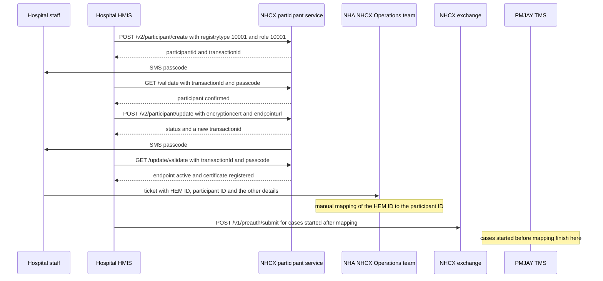

# Migrate a PMJAY hospital to HMIS through NHCX

## In plain words

A [PMJAY](../glossary/pmjay.md)-empanelled hospital submits claims through the [TMS](../glossary/tms.md) Provider portal until it migrates. After migration, its own [HMIS](../../shared/glossary/hmis.md) sends pre-authorisations and claims through the [National Health Claims Exchange](../../shared/glossary/nhcx.md) (NHCX). Cases already in flight finish in TMS.

Migration has six steps. The first four are production onboarding with PMJAY's rules. The fifth is a manual mapping by NHA's NHCX Operations team, and that mapping is the switch that takes the hospital live.

## Before you start

- The hospital is active in PMJAY, and you know its Hospital Empanelment Module (HEM) ID, the hospital ID used in TMS.
- The hospital is registered in the [Health Facility Registry](../../shared/glossary/hfr.md) (HFR). Someone can receive SMS on the mobile number in that record.
- Your HMIS has passed the NHCX sandbox exit. See [The sandbox exit process and sign-off](../sandbox/sandbox-exit.md).
- You hold a production client ID with the provider role, and a production certificate in base64. See [Generate an encryption certificate and register it](generate-and-register-certificate.md).
- Your HMIS endpoint is HTTPS, publicly accessible and reachable from NHCX. See [the callback address rules](../sandbox/callback-url-requirements.md).

## What happens



Every call goes to the production participant service, `https://apisprod.nha.gov.in/pmjay/hcx/participanthcxservice`, with your session token. The mechanics of steps 1 to 4 are in [Onboard as a participant in production](production-onboarding.md). This flow adds PMJAY's rules.

### 1. Create the participant

`POST /v2/participant/create`:

```json
{
  "registrytype": "10001",
  "registryid": "<HOSPITAL_HFR_ID>",
  "role": ["10001"],
  "endpoint_url": "",
  "mobilenumber": "<MOBILE_REGISTERED_IN_HFR>",
  "email": "<HOSPITAL_EMAIL>"
}
```

- `registrytype` must be `10001`, HFR. A PMJAY hospital cannot use the other registry codes.
- `role` must be `10001`, provider. Any other role is rejected.
- `registryid` must exist in HFR.
- `mobilenumber` must exist in NHCX and match the HFR record exactly. This is the check that fails most.
- If a participant already exists for the registry ID, the call may reject or return the existing participant.

The answer carries `participantid`, `facilityname`, `facilitycontact`, `facilityemail`, `transactionid` and a null `error`. The participant starts in a pending state.

**Wait:** a passcode arrives by SMS.

### 2. Confirm it

`GET /validate?transactionId=<TRANSACTION_ID_FROM_CREATE>&passcode=<PASSCODE_FROM_SMS>`. On success the participant becomes active, and you can register the technical details.

### 3. Register the endpoint and certificate

`POST /v2/participant/update` with `participantcode`, `encryptioncert` (the base64 certificate) and `endpointurl` (the HMIS base address). The participant must be active. The answer carries `participant_code`, `status` and a new `transactionid`.

**Wait:** a second passcode arrives by SMS.

### 4. Confirm the update

`GET /update/validate?transactionId=<TRANSACTION_ID_FROM_UPDATE>&passcode=<PASSCODE_FROM_SMS>`. The passcode is valid for 24 hours. On success the endpoint is active and the certificate is registered, so NHCX can send requests to your HMIS and receive its responses.

### 5. Ask for the mapping

Raise a ticket with NHA's NHCX Operations team. They map the hospital's HEM ID to its NHCX participant ID by hand. The ticket carries:

| Detail | Must be |
|---|---|
| PMJAY Hospital ID (HEM ID) | Active in TMS |
| NHCX participant ID | Active and configured |
| Hospital name | The same as in official records |
| Registered mobile | The same as in HFR |
| Endpoint URL | Live |
| Confirmation status | Step 4 completed |

**Wait:** the mapping is manual. See [Where to get help with NHCX](../sandbox/support-contacts.md) for the channel.

### 6. Go live

The mapping is the go-live trigger. After it, processing splits by when each case was submitted:

| Case | Processed in |
|---|---|
| Pre-authorisations and claims submitted before mapping | The TMS Provider portal |
| Pre-authorisations and claims submitted after mapping | Your HMIS, through NHCX |

Your HMIS starts sending claim requests and status updates through NHCX. TMS stops taking new claims from the hospital and receives only the statuses of existing cases.

Before go-live, confirm the checklist: participant created and validated, endpoint accessible, certificate configured, APIs tested, mapping completed, pilot successful.

## How you know it worked

`GET /update/validate` succeeded, and `POST /fetch/certs` for the hospital's participant code returns its certificate. After the mapping, a new pre-authorisation sent from the HMIS on `/v1/preauth/submit` receives `202`. The payer's answer then arrives at the HMIS endpoint on `/v1/preauth/on_submit`.

```observation schema=exit-condition
channel: callback
path: <HMIS_ENDPOINT_URL>/v1/preauth/on_submit
precondition:
  mapping of HEM ID to participant ID: completed by the NHCX Operations team
match:
  x-hcx-recipient_code: <HOSPITAL_PARTICIPANT_CODE>
```

## When it goes wrong

| Symptom | Cause | Action |
|---|---|---|
| Create rejected for the registry | `registrytype` is not `10001` | Send `10001` |
| Create rejected for the role | `role` is not `10001` | Send `10001` |
| Create rejected for the mobile | It does not match HFR | Update the mobile number, then create again |
| No passcode arrives | A network issue | Retry the call |
| The transaction is lost | A session issue | Start the step again for a fresh transaction ID |

- **The participant already exists.** The call rejected the create or returned the existing participant. Continue with the existing participant ID.
- **The mapping ticket is sent back.** One detail fails its check. It may be an inactive HEM ID, a participant not yet configured, or a name or mobile mismatch. An endpoint that is not live, or an incomplete step 4, also fails.
- **New cases still go to TMS.** The mapping has not been done yet. Nothing on your side switches routing.
- **`401` on any call.** The token has expired, or it came from a sandbox client ID. See [NHCX-401](../errors/nhcx-401.md).
