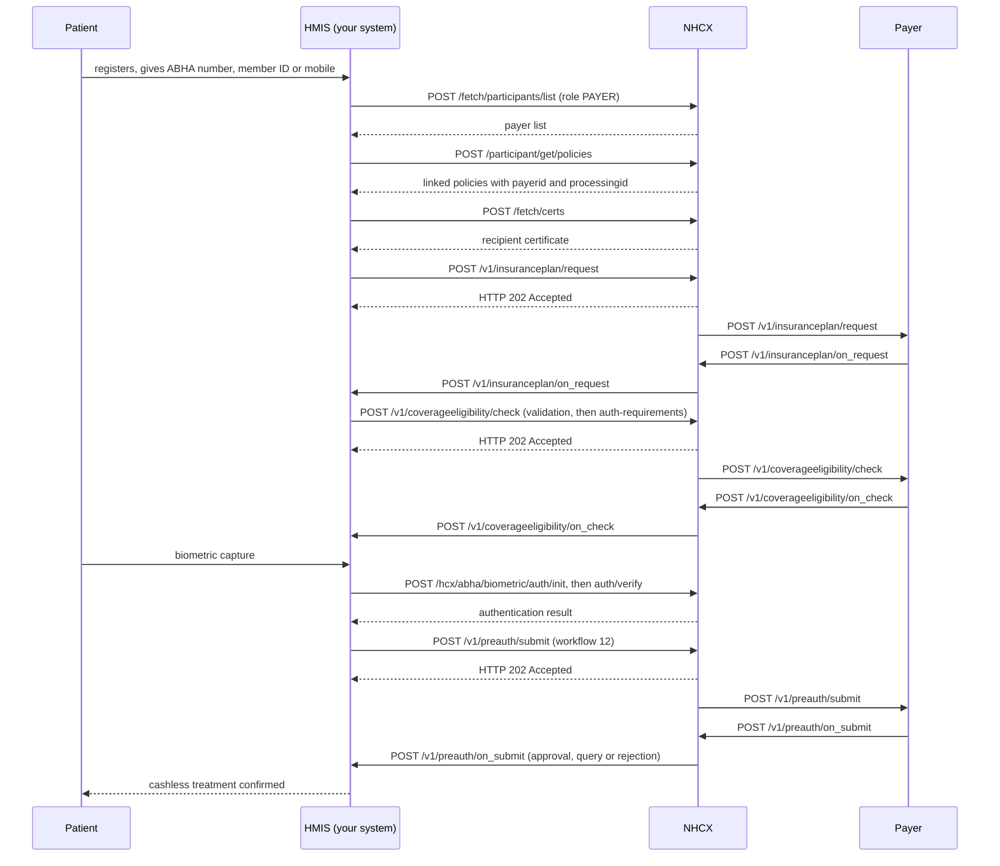

# Take a PMJAY patient from registration to cashless treatment

## In plain words

A [PMJAY](../glossary/pmjay.md) patient does not become cashless because they hold a card. Your hospital must first find the payer, confirm the linked policy, and learn the plan's rules. Only then can you check eligibility and ask for preauthorisation.

Two things must both be true. In your [HMIS](../../shared/glossary/hmis.md), the admission is converted from cash to insurance, with the scheme, payer, identifier and policy number attached. For the [NHCX](../../shared/glossary/nhcx.md) exchange, you have resolved the payer's code, the policy and the member ID.

The order is fixed: find the payer, find the policy, resolve the codes, fetch the plan, check eligibility, authenticate, submit the preauthorisation. [PMJAY on NHCX](../concepts/pmjay-on-nhcx.md) explains how PMJAY differs from the standard exchange.

## Before you start

- Your hospital is migrated to HMIS through NHCX and mapped to its PMJAY hospital ID. See [migrate a PMJAY hospital](pmjay-hospital-migration.md).
- You hold your client credentials and can get a [session token](../concepts/session-token.md) from [/get/session](../endpoints/get-session.md).
- Your callback endpoint is registered and answers within 30 seconds.
- The patient is present, with their [ABHA number](../../shared/glossary/abha-number.md), member ID or registered mobile number.
- Your HMIS supports all three biometric methods: fingerprint, iris and face.

## What happens

Every exchange call is acknowledged with `202 Accepted`. Its answer arrives later on your callback, which you acknowledge with `202` within 30 seconds.

1. Register the patient. In your HMIS, convert the admission from cash to insurance, with the scheme, payer, identifier type and value, and policy number.
2. Find the payer. Call [POST /fetch/participants/list](../endpoints/fetch-participants-list.md) with role `PAYER`, and let the user pick one.
3. Find the linked policies. Call [POST /participant/get/policies](../endpoints/participant-get-policies.md). Try the ABHA number first, then the member ID, then the mobile number.
4. If no policy comes back, send a [coverage eligibility check](coverage-eligibility-check.md) with purpose `discovery` to get the active policy code.
5. Resolve three values: the policy number, the member ID and the recipient code. Use the `processingid` from the policy lookup as `x-hcx-recipient_code`, not the `payerid`.
6. If you cannot resolve a recipient code, stop. Do not send eligibility or preauthorisation until the policy lookup succeeds.
7. Fetch the recipient's certificate with [POST /fetch/certs](../endpoints/fetch-certs.md).
8. [Request the insurance plan](insurance-plan-request.md) and cache it. It holds the packages, rates, conditions and document rules.
9. [Check coverage eligibility](coverage-eligibility-check.md). Use `validation` after registration for the wallet balance. Use `benefits` before the preauthorisation, and `auth-requirements` once the packages are chosen.
10. Authenticate the beneficiary by [fingerprint or iris](biometric-fingerprint-iris.md) or [face](biometric-face.md). Where that is not possible, complete the Authentication Consent Questionnaire.
11. [Submit the preauthorisation](preauth-submit.md) with workflow `12`, for no more than the balance left.

## How you know it worked

The patient is cashless when all of these hold:

- The admission in your HMIS is marked insurance, with the scheme, payer, member ID and policy number.
- You stored the recipient code, from the policy lookup's `processingid`, against the admission.
- The insurance plan and the eligibility responses are stored against the admission.
- You received `POST /v1/preauth/on_submit` with `x-hcx-workflow_id` `21`, and stored its `preAuthRef`.

A preauthorisation query, workflow `24`, hands over to [answer a payer query](preauth-query-response.md). A rejection, workflow `23`, ends the cashless path for this admission.

## When it goes wrong

The policy lookup returns nothing. Try the next identifier in the order ABHA number, member ID, mobile number. Then use eligibility with purpose `discovery`. See [linking an ABHA to a policy](../concepts/policy-linking.md).

The request goes to the wrong participant. The `payerid` names the insurer. The `processingid` names who adjudicates, the [TPA](../glossary/tpa.md) where there is one. Address every request to the `processingid`.

The payer refuses the policy or your hospital. [PAYR-1401](../errors/payr-1401.md) means the policy is not allowed for your hospital. [PAYR-1405](../errors/payr-1405.md) means the payer has no enrolled hospital for your [HFR](../../shared/glossary/hfr.md) ID. [PAYR-1004](../errors/payr-1004.md) from a payer on the published standard means your hospital is not registered for this policy.

Authentication is missing. [PAYR-1256](../errors/payr-1256.md) means the preauthorisation carried neither biometric authentication nor the consent questionnaire response.

Every call returns 401. [NHCX-401](../errors/nhcx-401.md) means your session token is missing or expired. Get a new one and retry. See [every NHCX call returns 401](../troubleshooting/everything-returns-401.md).
