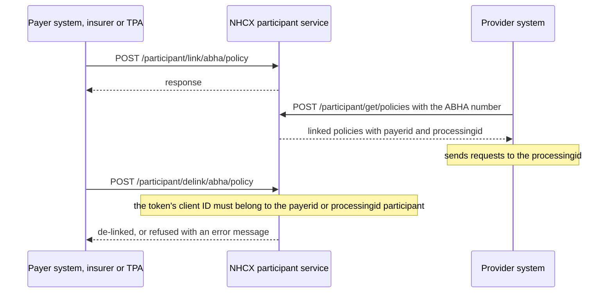

# Link and de-link an ABHA and a policy

## In plain words

A hospital finds a patient's insurance on the [National Health Claims Exchange](../../shared/glossary/nhcx.md) (NHCX) by looking up the patient's [ABHA number](../../shared/glossary/abha-number.md), member ID or mobile. The lookup finds only policies a [payer](../glossary/payer.md) has linked. A link records which products a member holds, and which participants handle them.

The payer links a policy when the individual buys it. It de-links the policy when the policy ends, or when the insurer moves to another [TPA](../glossary/tpa.md).

## Before you start

- Every insurer has its own participant code, even when a TPA processes its claims. See [Onboard as a participant in production](production-onboarding.md).
- You hold a session token minted with the client ID used when the payer or TPA participant was created. De-linking checks this.
- For each member you have the ABHA number, mobile number and member ID, and each product's ID and name.
- You know the participant service base address: `https://apisbx.abdm.gov.in/pmjay/sbxhcx/participanthcxservice` in the sandbox, `https://apisprod.nha.gov.in/pmjay/hcx/participanthcxservice` in production.

## What happens



Every call answers in its own response. Nothing arrives later.

### 1. Link

`POST {base}/participant/link/abha/policy`:

```json
{
  "requestid": "<NEW_UUID>",
  "abhanumber": "<MEMBER_ABHA_NUMBER>",
  "mobilenumber": "<MEMBER_MOBILE>",
  "memberid": "<MEMBER_ID>",
  "payerid": "<INSURER_PARTICIPANT_CODE>",
  "processingid": "<TPA_PARTICIPANT_CODE>",
  "policies": [
    {
      "productid": "<PRODUCT_ID>",
      "productname": "<PRODUCT_NAME>"
    }
  ]
}
```

- `payerid` is always the insurer's own participant code.
- `processingid` is the participant code of the TPA under which the insurer is mapped.
- `policies` lists every product the member holds with this insurer.

Put `/participant/link/abha/policy` directly after the base address. The base already ends in `/participanthcxservice`, so that segment appears once.

### 2. Check the link

`POST {base}/participant/get/policies`:

```json
{
  "identifiertype": "AbhaNumber",
  "identifiervalue": "<MEMBER_ABHA_NUMBER>"
}
```

`identifiertype` is `AbhaNumber`, `MemberId` or `MobileNo`. This is the same call a hospital makes. The hospital then addresses its requests to the `processingid` in the answer.

### 3. De-link

`POST {base}/participant/delink/abha/policy`:

```json
{
  "requestid": "<NEW_UUID>",
  "payerid": "<INSURER_PARTICIPANT_CODE>",
  "memberid": "<MEMBER_ID>",
  "processingid": "<TPA_PARTICIPANT_CODE>",
  "policies": [
    {
      "productid": "<PRODUCT_ID>",
      "productname": "<PRODUCT_NAME>"
    }
  ]
}
```

Include `processingid` when the policy was linked with one. List only the products to remove.

NHCX reads the client ID from your token. It allows the de-link only when that client ID registered the insurer named in `payerid` or the TPA named in `processingid`.

### 4. When the insurer changes TPA

De-link the existing policies. Link them again with the new TPA's participant code as `processingid`.

## How you know it worked

After linking, `POST /participant/get/policies` with the member's ABHA number returns the policy with your `payerid` and `processingid`. After de-linking, the same lookup no longer returns the products you removed.

```observation schema=exit-condition
channel: synchronous
call: POST /participant/get/policies
request:
  identifiertype: AbhaNumber
  identifiervalue: <MEMBER_ABHA_NUMBER>
match:
  after link: the policy appears with your payerid and processingid
  after de-link: the removed products are absent
```

## When it goes wrong

- **The de-link is refused.** Your token was minted with a client ID that did not register the `payerid` or `processingid` participant. Mint it with the right client ID. If the IDs still do not match, confirm them with the NHCX team by email. See [Where to get help with NHCX](../sandbox/support-contacts.md).
- **"There is no policies with requested details".** The product you asked to de-link is not in the member's linked list. Check `productid`, `productname` and `memberid` against what you linked.
- **`404` on link or de-link.** The address repeats `/participanthcxservice`. Use it once.
- **Hospitals send requests to the wrong participant.** They addressed the `payerid` instead of the `processingid` from the lookup.
- **`401` on any call.** Get a new session token. See [NHCX-401](../errors/nhcx-401.md).
