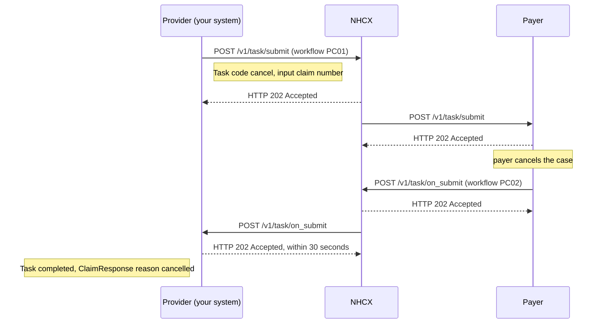

# Cancel a preauthorisation

## In plain words

Cancelling withdraws a preauthorisation you no longer need. The patient may have changed treatment, or left before the procedure. Until the claim is raised, you can cancel.

An open preauthorisation blocks a new one for the same beneficiary, at your hospital and at any other. Cancelling releases it.

You cancel with a FHIR Task, not a Claim, on `/v1/task/submit`. The workflow code is `PC01`. The [payer](../glossary/payer.md) confirms on `/v1/task/on_submit` with a completed Task that points to a ClaimResponse whose adjudication reason is `cancelled`.

## Before you start

- The preauthorisation exists and no claim has been raised against it.
- You have its claim identifier, the case number the payer knows it by.
- You know why you are cancelling. `treatmentplanchanged` is the published reason code for a changed treatment plan.
- Your session token, callback endpoint and the payer's certificate are in place, as in [send a sealed request](send-a-sealed-request.md).

## What happens

1. Build a Task bundle, as in [the preauthorisation cancel bundles](../fhir/preauth-cancel.md). Set Task `status` to `requested`, `intent` to `order`, and `code` to `cancel` from the financial task code system.
2. Set `reasonCode`, for example `treatmentplanchanged`. Add the inputs for the claim number and the intimation number. Both carry the preauthorisation's claim identifier. Set `requester` to your organisation and `owner` to the payer.
3. Seal and set the headers, as in [send a sealed request](send-a-sealed-request.md). Set `x-hcx-workflow_id` to `PC01`, Preauthorization Cancellation, and `x-hcx-status` to `request.initiated`.
4. Start a new correlation. Set `x-hcx-correlation_id` to the value of this call's `x-hcx-api_call_id`.
5. Call [POST /v1/task/submit](../endpoints/task-submit.md). NHCX answers `202 Accepted`. It is not the confirmation.
6. Receive [POST /v1/task/on_submit](../callbacks/task-on-submit.md). Answer `202 Accepted` within 30 seconds, then process.
7. Read `type`. `ProtocolResponse` means the payer could not process the request. Otherwise decrypt `payload` with your private key.
8. Find the Task. Its `status` is `completed`. Follow its `output` reference to the ClaimResponse in the same bundle.
9. Confirm the ClaimResponse `outcome` is `complete` and its adjudication reason is `cancelled`. Workflow `PC02`, Preauthorization Cancellation Accomplished, names this answer.

## How you know it worked

The preauthorisation is cancelled when all of these hold:

- You received `POST /v1/task/on_submit` whose `x-hcx-correlation_id` equals the one you sent.
- Its `payload` decrypts, and the Task in it has `status` `completed`.
- The ClaimResponse the Task points to has `outcome` `complete` and adjudication reason `cancelled`.
- You marked the case cancelled, and stopped any claim work on it.

## When it goes wrong

The payer cannot find the case. [ERR-PYR-CLM-007](../errors/err-pyr-clm-007.md) means no preauthorisation or claim record exists for the case number. Check the claim number in the Task inputs against the identifier you used on the preauthorisation.

A claim was already raised. Cancelling is allowed only until the claim is raised. Continue with the [claim](claim-submit.md) instead.

NHCX rejects the request as a duplicate. [NHCX-1006](../errors/nhcx-1006.md) means you reused a correlation id. Start a new correlation for the cancellation.

The callback is a `ProtocolResponse`. [PAYR-1001](../errors/payr-1001.md) means the payer could not decrypt your request. Fetch its certificate again and reseal.

The 202 arrives and no confirmation follows. [Check the request's status](status-check.md). An undeliverable request comes back on [/v1/error](../callbacks/error.md).
