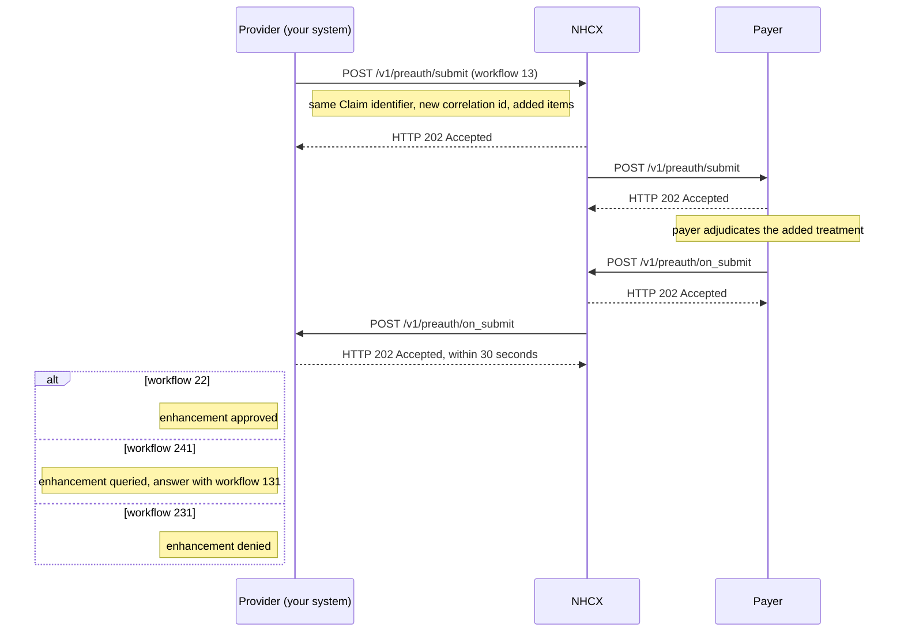

# Request a preauthorisation enhancement

## In plain words

An [enhancement](../glossary/enhancement.md) asks the payer to raise an approved preauthorisation. You send it when the patient needs more than was approved. A transfer from the ward to intensive care is the common case.

It travels on the same path as the first [preauthorisation](preauth-submit.md), `/v1/preauth/submit`, with workflow `13`. It is a new request: new correlation id, same claim identifier. The Claim lists the approved items plus the new ones.

The [payer](../glossary/payer.md) answers on `/v1/preauth/on_submit`. Workflow `22` approves the enhancement, `231` denies it and `241` queries it.

## Before you start

- The case holds an approved preauthorisation: you received workflow `21` and stored its `preAuthRef`.
- No adjudication is running on the case. A pending query or an earlier enhancement must finish first.
- Each package you plan to add allows enhancement. Check its `EnhancementAllowed` claim condition in the cached [insurance plan](insurance-plan-request.md).
- You ran a [coverage eligibility check](coverage-eligibility-check.md) with `benefits`, and with `auth-requirements` for the new packages, and collected the documents it named.
- You still have the claim identifier and the bundle you sent for the approved preauthorisation.

## What happens

1. Start from the bundle of the approved preauthorisation. Keep `Claim.identifier` and keep `use` `preauthorization`.
2. Add the new items, such as an intensive care stratification, with their procedures and documents in `supportingInfo`. Update `Claim.total`. See [the enhancement bundles](../fhir/preauth-enhancement.md).
3. Seal and set the headers, as in [send a sealed request](send-a-sealed-request.md). Set `x-hcx-workflow_id` to `13` and `x-hcx-status` to `request.initiated`. `x-hcx-use_case` `Enhancement` is optional.
4. Start a new correlation. Set `x-hcx-correlation_id` to the value of this call's `x-hcx-api_call_id`. The claim identifier, not the correlation id, ties the enhancement to the case.
5. Call [POST /v1/preauth/submit](../endpoints/preauth-submit.md). NHCX answers `202 Accepted`. It is not the decision.
6. Receive [POST /v1/preauth/on_submit](../callbacks/preauth-on-submit.md). Answer `202 Accepted` within 30 seconds, then process.
7. Read `type`. `ProtocolResponse` means the payer could not process the request. Otherwise decrypt `payload` with your private key.
8. Read `x-hcx-workflow_id`:

| `x-hcx-workflow_id` | Meaning | What to do |
|---|---|---|
| `22` | Enhancement approved | Store the new approved `benefit` amount against the case |
| `241` | Enhancement queried | [Answer the query](preauth-query-response.md) with workflow `131` |
| `231` | Enhancement denied | Read `disposition` and the adjudication for the reason |

## How you know it worked

The enhancement is approved when all of these hold:

- You received `POST /v1/preauth/on_submit` whose `x-hcx-correlation_id` equals the correlation id of your enhancement request.
- Its `type` is not `ProtocolResponse`, and `payload` decrypts with your private key.
- `x-hcx-workflow_id` is `22`, and the ClaimResponse carries the approved `benefit` for the added items.
- You updated the approved amount stored against the case.

A callback with workflow `231` also ends this flow, as a denial.

## When it goes wrong

The payer finds no approved preauthorisation. [PAYR-1212](../errors/payr-1212.md) means no approved record exists for the case number. Check that you kept the original claim identifier. If the case was never approved, submit a new [preauthorisation](preauth-submit.md).

The payer finds work in progress. [PAYR-1213](../errors/payr-1213.md) means adjudication is still running on the case. Wait for the current decision, then send the enhancement.

NHCX rejects the request as a duplicate. [NHCX-1006](../errors/nhcx-1006.md) means you reused the correlation id of the original preauthorisation. Start a new correlation for every enhancement.

The wallet cannot cover the increase. [PAYR-1235](../errors/payr-1235.md) means the balance is too low. Run a `validation` eligibility check to see the balance.

The 202 arrives and no decision follows. [Check the request's status](status-check.md). An undeliverable request comes back on [/v1/error](../callbacks/error.md).
