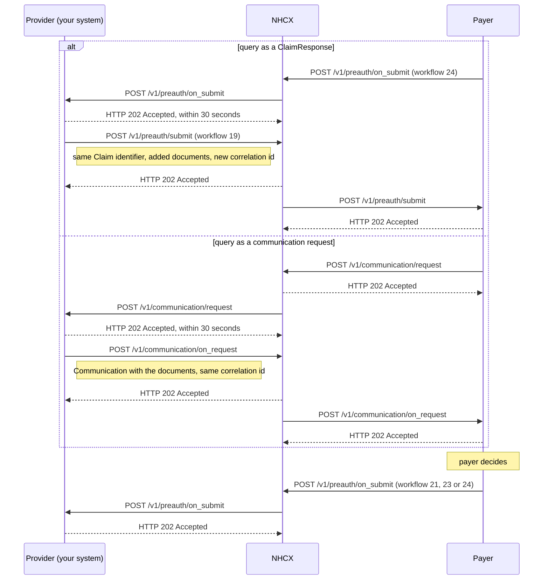

# Answer a payer query on a preauthorisation

## In plain words

A payer query means the [payer](../glossary/payer.md) cannot decide your preauthorisation yet. It needs more documents or a clarification. The case stays open until you answer.

A query reaches you by one of two routes. Where it arrives tells you how to answer.

| The query arrives on | It looks like | You answer on |
|---|---|---|
| `/v1/preauth/on_submit` | Workflow `24`, or `241` for an enhancement. ClaimResponse `outcome` `partial`, adjudication reason `queried` | `/v1/preauth/submit`, workflow `19`, or `131` for an enhancement |
| `/v1/communication/request` | A Task with `code` `poll` carrying a [communication request](../glossary/communication-request.md) | `/v1/communication/on_request` |

After your answer, the payer sends its decision on `/v1/preauth/on_submit`. [Payer queries and the communication cycle](../concepts/queries-and-communication.md) explains both routes.

## Before you start

- You submitted a [preauthorisation](preauth-submit.md) or an [enhancement](preauth-enhancement.md), and kept its claim identifier and bundle.
- A query has arrived by one of the two routes above, and you answered its delivery with `202` within 30 seconds.
- You have collected the documents or the clarification the query asks for.
- In the sandbox, the [dummy payer](../sandbox/dummy-payer.md) raises a query when you drive it with the action `Query`, and uses the communication route.

## What happens

### The query arrives as a ClaimResponse

1. Receive [POST /v1/preauth/on_submit](../callbacks/preauth-on-submit.md) with workflow `24`. Answer `202` within 30 seconds, then decrypt.
2. Read what the payer asked. For [PMJAY](../glossary/pmjay.md), `ClaimResponse.item[].adjudication[].reason.coding.display` carries a trail of entries in the form `USER~datetime~type~comment~trust`, separated by `|`. Parse it as plain text. The comment is the question.
3. Add the requested documents to `supportingInfo` in the same Claim. Keep `Claim.identifier` and `use` `preauthorization`.
4. Set `x-hcx-workflow_id` to `19`, or `131` when the query was on an enhancement. Set `x-hcx-status` to `request.initiated`.
5. Start a new correlation: set `x-hcx-correlation_id` to the value of this call's `x-hcx-api_call_id`. The claim identifier ties the answer to the case.
6. Call [POST /v1/preauth/submit](../endpoints/preauth-submit.md). NHCX answers `202 Accepted`.

### The query arrives as a communication request

1. Receive [POST /v1/communication/request](../callbacks/communication-request.md). Answer `202` within 30 seconds, then decrypt.
2. Read `Task.reasonCode` and the communication resource. They say what the payer needs.
3. Build the answer as a Task bundle whose Task carries a `Communication`. Put the documents in `Communication.payload` as `contentAttachment`. See [the Task bundle](../fhir/task.md).
4. Set `x-hcx-status` to `response.complete`. Set `x-hcx-correlation_id` to the correlation id of the communication request. Use a fresh `x-hcx-api_call_id`.
5. Address it to the sender of the communication request. Call [POST /v1/communication/on_request](../endpoints/communication-on-request.md). NHCX answers `202 Accepted`.

### Either route: wait for the decision

The payer re-adjudicates and sends its decision on `/v1/preauth/on_submit`. Read it as in [submit a preauthorisation](preauth-submit.md): `21` approved, `23` rejected, `24` queried again.

## How you know it worked

The query is resolved when all of these hold:

- NHCX accepted your answer with `202`: on `/v1/preauth/submit` with workflow `19` or `131`, or on `/v1/communication/on_request`.
- You then received `POST /v1/preauth/on_submit` for this case, and its `payload` decrypts.
- Its `x-hcx-workflow_id` is `21` or `22` with a `preAuthRef`, or `23`, a rejection.

A further `24` or `241` means the payer asks again. Repeat this flow.

## When it goes wrong

The payer says the case is not queried. [PAYR-1219](../errors/payr-1219.md) means the case number is not in a queried state. [PAYR-1218](../errors/payr-1218.md) means the payer has no queried preauthorisation for it. Check that you kept the original claim identifier, and that you answered the query rather than the first submission.

NHCX rejects your query update as a duplicate. [NHCX-1006](../errors/nhcx-1006.md) means you reused an earlier correlation id on `/v1/preauth/submit`. Start a new correlation.

NHCX rejects your communication answer. [NHCX-1010](../errors/nhcx-1010.md) means no request exists with the correlation id you set. Copy the correlation id from the communication request exactly. [NHCX-1011](../errors/nhcx-1011.md) means the `x-hcx-status` value is not valid.

The payer cannot open your answer. A `ProtocolResponse` with [PAYR-1001](../errors/payr-1001.md) means it could not decrypt. Fetch its certificate again and reseal.

No decision follows your answer. [Check the status](status-check.md) of your answer's correlation id. See [accepted, then no callback](../troubleshooting/accepted-then-no-callback.md).
