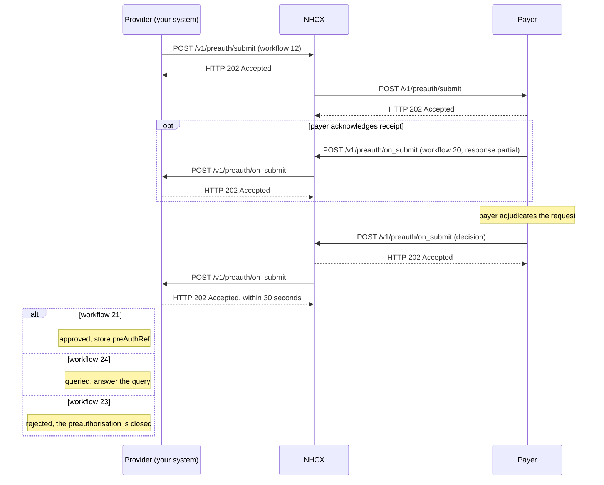

# Submit a preauthorisation

## In plain words

[Preauthorisation](../glossary/preauthorisation.md) asks the payer to approve a treatment before you deliver it. You send a Claim bundle whose `Claim.use` is `preauthorization`. The [payer](../glossary/payer.md) answers later with one of four decisions: approved, partially approved, queried or rejected.

An approval carries a preauthorisation reference, `ClaimResponse.preAuthRef`. It is the payer's commitment to pay the approved amount. You need it to submit the [claim](claim-submit.md) after discharge.

The request travels through the [NHCX](../../shared/glossary/nhcx.md) exchange, sealed for the payer. The decision comes back as a callback to your registered endpoint.

## Before you start

- You have run a [coverage eligibility check](coverage-eligibility-check.md) with `auth-requirements` for the packages, and collected the documents it named.
- You hold the patient's [insurance plan](insurance-plan-request.md), so package codes, rates and document rules are known.
- The amount you will request is no more than the balance the eligibility check returned.
- The Patient resource carries the patient's [ABHA number](../../shared/glossary/abha-number.md). For [PMJAY](../glossary/pmjay.md) it also carries the member ID.
- You authenticated the beneficiary by [fingerprint or iris](biometric-fingerprint-iris.md) or [face](biometric-face.md). Where that is not possible, you have the completed Authentication Consent Questionnaire response to attach.
- You have the treating practitioner's [HPR](../../shared/glossary/hpr.md) ID.
- The beneficiary has no other active preauthorisation, here or at another hospital.
- Your session token, callback endpoint and the payer's certificate are in place, as in [send a sealed request](send-a-sealed-request.md).

## What happens

1. Build the [preauthorisation request bundle](../fhir/preauth-request.md). It is a Claim with `use` `preauthorization` and `type` [SNOMED CT](../../shared/glossary/snomed-ct.md) `737481003`, Inpatient care management.
2. Add the diagnoses, coded in ICD-10, and the care team. Add one `item` per package, with its category and package code.
3. Add a `supportingInfo` entry for every document the eligibility check or the plan named. Set `total` to the amount you request.
4. Give the Claim an identifier and keep it for the whole case. The claim after discharge carries the same identifier.
5. Seal the bundle and set the headers, as in [send a sealed request](send-a-sealed-request.md). Set `x-hcx-workflow_id` to `12` and `x-hcx-status` to `request.initiated`. Send `x-hcx-ben-abha-id`.
6. Start a new correlation. Set `x-hcx-correlation_id` to the value of this call's `x-hcx-api_call_id`. Store it against the case.
7. Call [POST /v1/preauth/submit](../endpoints/preauth-submit.md). NHCX answers `202 Accepted`. The request is on its way to the payer. It is not the decision.
8. Wait. The payer may first acknowledge receipt on `/v1/preauth/on_submit` with workflow `20` and `x-hcx-status` `response.partial`. Answer `202` and keep waiting.
9. Receive the decision on [POST /v1/preauth/on_submit](../callbacks/preauth-on-submit.md). Answer `202 Accepted` within 30 seconds, then process.
10. Read the body's `type`. `ProtocolResponse` means the payer could not process the request. Any other type carries the sealed [ClaimResponse](../fhir/preauth-response.md). Decrypt it with your private key.
11. Read `x-hcx-workflow_id` first. It names the decision. Do not decide on `ClaimResponse.outcome` alone.

| `x-hcx-workflow_id` | What the ClaimResponse shows | What to do |
|---|---|---|
| `21` | Approved. `preAuthRef` is present. If the approved `benefit` is lower than submitted, `processNote` explains the reduction | Store `preAuthRef` and the approved amount. Treat within that amount |
| `24` | Queried. `outcome` `partial`, adjudication reason `queried`, totals `0` | [Answer the query](preauth-query-response.md) |
| `23` | Rejected. `outcome` `complete`, adjudication reason `cancelled`, a `disposition` giving the reason | The preauthorisation is closed |

Some payers ask for documents with a communication request on `/v1/communication/request` instead of workflow `24`. [Answer a payer query on a preauthorisation](preauth-query-response.md) covers both routes. The codes are listed in [workflow codes](../concepts/workflow-codes.md).

## How you know it worked

The preauthorisation is approved when all of these hold:

- You received `POST /v1/preauth/on_submit` whose `x-hcx-correlation_id` equals the one you sent.
- Its `type` is not `ProtocolResponse`, and `payload` decrypts with your private key.
- `x-hcx-workflow_id` is `21`, and the ClaimResponse has `use` `preauthorization` and a `preAuthRef`.
- You stored `preAuthRef` and the approved `benefit` amount against the case.
- You answered every callback with `202` within 30 seconds.

A callback with workflow `23` also ends this flow, as a rejection. Workflow `24` hands over to the query flow.

## When it goes wrong

The 202 arrives and no decision follows. Answer any workflow `20` acknowledgement and keep waiting. For long waits, [check the request's status](status-check.md). An undeliverable request comes back on [/v1/error](../callbacks/error.md). See [accepted, then no callback](../troubleshooting/accepted-then-no-callback.md).

The payer finds an open case for the beneficiary. [PAYR-1238](../errors/payr-1238.md) means an active preauthorisation exists at your hospital. [PAYR-1237](../errors/payr-1237.md) means one exists at another hospital. [PAYR-1216](../errors/payr-1216.md) means a case is still being adjudicated. [Cancel](preauth-cancel.md) the stale preauthorisation, or claim against it.

The case already moved on. [PAYR-1217](../errors/payr-1217.md) means an approved preauthorisation exists: send an [enhancement](preauth-enhancement.md) instead. [PAYR-1231](../errors/payr-1231.md) means a claim was already raised.

The amount or authentication is refused. [PAYR-1201](../errors/payr-1201.md) means the amount is zero or above the wallet balance. [PAYR-1235](../errors/payr-1235.md) means the wallet balance is too low. [PAYR-1256](../errors/payr-1256.md) means you sent neither biometric authentication nor the consent questionnaire response.

NHCX or the payer rejects the envelope. [NHCX-1006](../errors/nhcx-1006.md) means the correlation id was used before. A `ProtocolResponse` with [PAYR-1001](../errors/payr-1001.md) means the payer could not decrypt your request. See [the payer rejects your FHIR bundle](../troubleshooting/bundle-rejected.md) for bundle problems.
