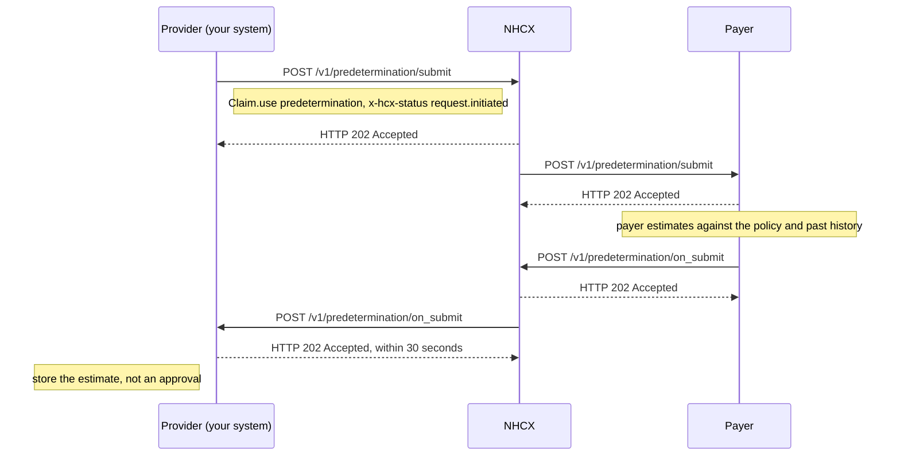

# Request a predetermination

## In plain words

A [predetermination](../glossary/predetermination.md) asks the payer what it would approve for a treatment you are planning. You send it before the patient is admitted. The payer answers with an estimate, judged against the policy and the beneficiary's history.

The estimate commits nobody. Nothing is reserved against the policy. When the patient is admitted, you still send a [preauthorisation](preauth-submit.md).

The request is a Claim bundle with `Claim.use` set to `predetermination`, on `/v1/predetermination/submit`. The answer is a ClaimResponse on `/v1/predetermination/on_submit`. [Preauthorisation or predetermination](../decisions/preauth-or-predetermination.md) compares the two.

## Before you start

- The payer answers predetermination requests. Confirm this with the payer before you build the exchange.
- You have the planned treatment: diagnosis, packages and the estimated amounts.
- Your session token, callback endpoint and the payer's certificate are in place, as in [send a sealed request](send-a-sealed-request.md).
- The sandbox [dummy payer](../sandbox/dummy-payer.md) does not answer predetermination. Test against a payer that does.

## What happens

1. Build a Claim bundle shaped like the preauthorisation bundle, as in [the claim request bundle](../fhir/claim-request.md). Set `Claim.use` to `predetermination`.
2. Give the Claim your own predetermination reference as its identifier. Add the planned items, diagnoses and amounts.
3. Seal and set the headers, as in [send a sealed request](send-a-sealed-request.md). Set `x-hcx-status` to `request.initiated`. No workflow code is published for predetermination.
4. Start a new correlation. Set `x-hcx-correlation_id` to the value of this call's `x-hcx-api_call_id`.
5. Call [POST /v1/predetermination/submit](../endpoints/predetermination-submit.md). NHCX answers `202 Accepted`. It is not the estimate.
6. Receive [POST /v1/predetermination/on_submit](../callbacks/predetermination-on-submit.md). Answer `202 Accepted` within 30 seconds, then process.
7. Read `type`. `ProtocolResponse` means the payer could not process the request. Otherwise decrypt `payload` with your private key.
8. Read the [ClaimResponse](../fhir/claim-response.md). Its `use` is `predetermination`. The estimated benefit is in `ClaimResponse.total`, category `benefit`.

## How you know it worked

The estimate is in when all of these hold:

- You received `POST /v1/predetermination/on_submit` whose `x-hcx-correlation_id` equals the one you sent.
- Its `type` is not `ProtocolResponse`, and `payload` decrypts with your private key.
- The ClaimResponse has `use` `predetermination` and a `total` with category `benefit`.
- You stored the amount against the planned case, labelled as an estimate.

## When it goes wrong

The 202 arrives and no estimate follows. The payer may not answer predetermination. Confirm support with the payer, then [check the request's status](status-check.md). See [accepted, then no callback](../troubleshooting/accepted-then-no-callback.md).

NHCX rejects the call. [NHCX-1003](../errors/nhcx-1003.md) means the recipient code is not registered. [NHCX-1006](../errors/nhcx-1006.md) means the correlation id was used before.

The callback is a `ProtocolResponse`. [PAYR-1001](../errors/payr-1001.md) means the payer could not decrypt your request. Fetch its certificate again and reseal.

The estimate treated as an approval. A predetermination reserves nothing. Send a preauthorisation at admission, with workflow `12`.
