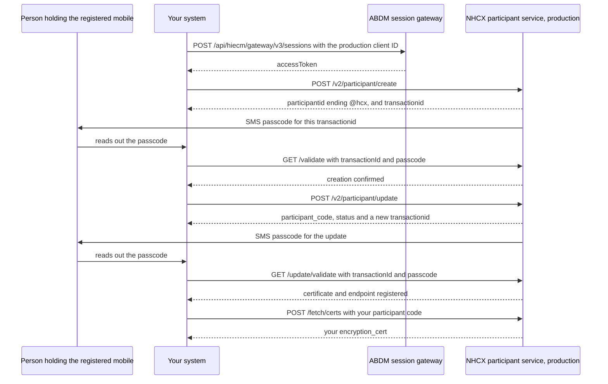

# Onboard as a participant in production

## In plain words

Production on the [National Health Claims Exchange](../../shared/glossary/nhcx.md) (NHCX) has its own participant registry. You create a separate production record in four calls. Two of them confirm a passcode sent by SMS, so the person holding your registered mobile takes part.

The first pair creates the participant and returns a [participant code](../glossary/participant-code.md) ending in `@hcx`. The second pair registers your encryption certificate and callback address. Only after the second pair can NHCX send requests to you and receive your responses.

## Before you start

- **Sandbox sign-off.** You passed the [sandbox exit](../glossary/sandbox-exit.md): bundle validation by [NRCeS](../../shared/glossary/nrces.md), an internal demo, a Health Tech Committee demo, and NHA's confirmation email. See [The sandbox exit process and sign-off](../sandbox/sandbox-exit.md).
- **Production credentials.** NHA has assigned your role to your [Milestone 1](../../shared/glossary/m1.md) production client ID. You use that client ID for every production call.
- **The registered mobile.** For a [provider](../glossary/provider.md), the number recorded against the facility in the [Health Facility Registry](../../shared/glossary/hfr.md) (HFR). For a [payer](../glossary/payer.md), the number in the NHCX payer details. A person with that phone is available during the calls.
- **Your registry ID.** The HFR ID for a provider. The [IRDAI](../glossary/irdai.md) registry ID for a payer, without leading zeros: `0123` is sent as `123`.
- **A production certificate** in base64, from [Generate an encryption certificate and register it](generate-and-register-certificate.md).
- **A live callback address** that meets the [callback address rules](../sandbox/callback-url-requirements.md).

## What happens

Every call goes to the production participant service, `https://apisprod.nha.gov.in/pmjay/hcx/participanthcxservice`, with your session token.



### 1. Get a session token

Use your production client ID. [Which session token endpoint to call](../decisions/session-endpoint.md) settles the address, and [NHCX environments, hosts and base URLs](../sandbox/environments-and-base-urls.md) lists the production hosts.

### 2. Create the participant

`POST /v2/participant/create`:

```json
{
  "registrytype": "10001",
  "registryid": "<YOUR_HFR_ID>",
  "role": ["10001"],
  "endpoint_url": "",
  "mobilenumber": "<MOBILE_REGISTERED_IN_HFR>",
  "email": "<YOUR_EMAIL>"
}
```

`registrytype` takes a registry code: `10001` HFR, `10002` NIN, `10003` ROHINI or `10004` PAYER. `role` takes role codes: `10001` provider, `10002` payer, `10003` TPA or `10009` end user application. The full enum list is in [POST /v2/participant/create](../endpoints/v2-participant-create.md). You can leave `endpoint_url` empty here, because step 4 sets it.

The answer carries `participantid`, `facilityname`, `facilitycontact`, `facilityemail`, `transactionid` and an `error` object with `code`, `message` and `trace`. On success the three error fields are null.

**Wait:** the passcode arrives by SMS on the registered mobile.

### 3. Confirm the creation

```text
GET /validate?transactionId=<TRANSACTION_ID_FROM_CREATE>&passcode=<PASSCODE_FROM_SMS>
```

The transaction ID and passcode stay valid for 24 hours. Each create call issues a new pair, and a passcode works only with its own transaction ID.

### 4. Register the certificate and callback address

`POST /v2/participant/update`, after step 3 has succeeded:

```json
{
  "participantcode": "<YOUR_PARTICIPANT_CODE>",
  "encryptioncert": "<BASE64_OF_CERTIFICATE_CRT>",
  "endpointurl": "<YOUR_CALLBACK_BASE_ADDRESS>"
}
```

The answer carries `participant_code`, `status` and a new `transactionid`.

**Wait:** a second passcode arrives by SMS.

### 5. Confirm the update

```text
GET /update/validate?transactionId=<TRANSACTION_ID_FROM_UPDATE>&passcode=<PASSCODE_FROM_SMS>
```

The same 24-hour rule applies. When this succeeds, your callback address is active and your certificate is registered.

### 6. Read your record back

`POST /fetch/certs` with your `@hcx` code returns the certificate stored against it. Later certificate changes can skip the passcode through `POST /v2/update/cert`. See [Rotate your encryption certificate](rotate-certificate.md).

## How you know it worked

`GET /update/validate` succeeds for the transaction ID from step 4. `POST /fetch/certs` on the production participant service returns, for your `@hcx` code, a certificate whose public key matches your production `certificate.crt`.

```observation schema=exit-condition
channel: synchronous
call: POST /fetch/certs
host: https://apisprod.nha.gov.in/pmjay/hcx/participanthcxservice
request:
  participantid: <YOUR_PRODUCTION_PARTICIPANT_CODE>
match:
  encryption_cert: public key equals the one in your production certificate.crt
```

Your production code now goes in `x-hcx-sender_code` on everything you send. Next steps:

- A PMJAY hospital continues with [Migrate a PMJAY hospital to HMIS through NHCX](pmjay-hospital-migration.md).
- A payer links its policies with [Link and de-link an ABHA and a policy](policy-link-and-delink.md).
- Plan staff training and a pilot with a few clients before full go-live. See [Going live on NHCX production](../sandbox/going-live.md).

## When it goes wrong

- **Create fails on the mobile number.** It must match the HFR record for a provider, or the NHCX payer details for a payer, exactly. Correct the number at its source, then create again.
- **Create fails on the registry ID for a payer.** Strip leading zeros from the IRDAI ID.
- **Create is refused on `registrytype` or `role`.** Use only codes from the lists in step 2.
- **The passcode is refused.** It is older than 24 hours, or it belongs to another transaction ID. Run the create or update call again for a fresh pair.
- **You lost the transaction ID.** Run the create or update call again. There is no way to look it up.
- **The update is refused.** Step 3 has not succeeded yet. The update needs a participant whose creation is confirmed.
- **Every call returns `401`.** The token has expired, or it was minted with a sandbox client ID. See [NHCX-401](../errors/nhcx-401.md).
