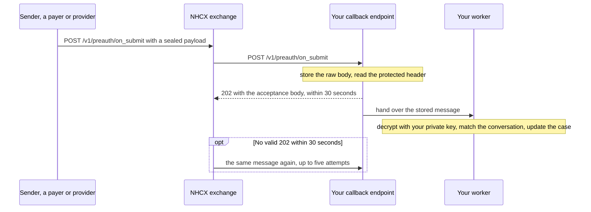

# Receive, open and acknowledge a sealed message

## In plain words

The [National Health Claims Exchange](../../shared/glossary/nhcx.md) (NHCX) delivers messages to you as HTTP calls to your registered callback address. Answers to your requests arrive this way, and so do requests addressed to you. Each delivery needs an immediate acknowledgement: HTTP `202` with a fixed JSON body, within 30 seconds.

Acknowledge first, open later. The acknowledgement only says you received the message. Decrypting it and acting on it happen after you have answered.

## Before you start

- Your `endpoint_url` is registered and meets the [callback address rules](../sandbox/callback-url-requirements.md).
- Your private key matches the certificate in your participant record. See [Generate an encryption certificate and register it](generate-and-register-certificate.md).
- You have a store that keeps each raw message before any processing.
- You host the paths that can reach you. Everyone hosts `/v1/error`. A sender hosts the answer paths, such as `/v1/preauth/on_submit`. A payer hosts the request paths, such as `/v1/preauth/submit`. A provider also hosts `/v1/communication/request` and `/v1/paymentnotice/request`.

## What happens



### 1. Receive

NHCX posts to your `endpoint_url` plus the path, for example `/v1/preauth/on_submit`. The body takes one of two forms:

- A sealed message: `{"payload": "<JWE_COMPACT_STRING>"}`.
- A plain JSON object with `"type": "ProtocolResponse"`, sent when the other side could not process your request. It is not sealed.

NHCX signs its calls to you with its own JWT, using `RS256`. Validate that signature with the public key of the NHCX instance.

### 2. Store, then acknowledge within 30 seconds

Store the raw body. Read the identifiers from the protected header: it is the first of the five parts, base64url-encoded but not encrypted. Then answer HTTP `202` with this body:

```json
{
  "timestamp": "DD/MM/YYYY hh:mm:ss:sss",
  "api_call_id": "<API_CALL_ID_OF_THE_MESSAGE>",
  "correlation_id": "<CORRELATION_ID_OF_THE_MESSAGE>",
  "result": {
    "sender_code": "<SENDER_PARTICIPANT_CODE>",
    "recipient_code": "<YOUR_PARTICIPANT_CODE>",
    "entity_type": "coverageeligibility/preauth/claim/task/payment/insuranceplan",
    "protocol_status": "request.queued/request.dispatched/request.error"
  },
  "error": {
    "code": "",
    "message": ""
  }
}
```

`timestamp` uses the pattern shown. `entity_type` takes one of the listed values, and `protocol_status` one of its three. The error `code` and `message` stay empty when you accept. [Synchronous acknowledgement](../concepts/synchronous-acknowledgement.md) covers the body in detail.

### 3. Open it

Check that the payload has five dot-separated parts. Decrypt it with your PKCS#8 private key. If the authentication tag fails, reject the message without using any of its content.

From the protected header, read `x-hcx-sender_code`, `x-hcx-recipient_code`, `x-hcx-api_call_id`, `x-hcx-correlation_id`, `x-hcx-workflow_id` and `x-hcx-status`. `x-hcx-recipient_code` must be your own code.

### 4. Match it

Keep the `x-hcx-api_call_id` and the `x-hcx-correlation_id` of every request you send. Match an incoming answer on its `x-hcx-correlation_id` against both. Its `x-hcx-sender_code` must be the participant you addressed. The rule for each identifier is in [message identifiers](../concepts/message-identifiers.md).

### 5. Recognise repeats

NHCX resends a message when your acknowledgement was late, not `202`, or not in the format above. A repeat carries the same `x-hcx-api_call_id`. Acknowledge it again, and do not process it twice.

### 6. Act

Deserialise the plaintext into its FHIR bundle and update the case. `x-hcx-status` tells you what kind of answer it is:

| `x-hcx-status` | Meaning |
|---|---|
| `response.complete` | The final answer, closing the request cycle |
| `response.partial` | A partial or intermediate answer |
| `response.error` | The request was rejected, or an error occurred |

`x-hcx-workflow_id` names the stage. See [workflow codes](../concepts/workflow-codes.md). If the message is a request to you, answer it later on its paired path. A payer follows [Receive, adjudicate and answer a request as a payer](payer-process-a-request.md).

If the body is a `ProtocolResponse`, read `x-hcx-error_details`. Its `code` names the failure. See [Report a processing failure on /v1/error](report-a-processing-error.md).

## How you know it worked

Your endpoint answered `202` with the acceptance body within 30 seconds, and NHCX does not deliver the same `x-hcx-api_call_id` again. The decrypted bundle is stored against the case its identifiers name.

```observation schema=exit-condition
channel: callback
path: <YOUR_ENDPOINT_URL>/<the path delivered>
acknowledge: HTTP 202 with the acceptance body within 30 seconds
match:
  redelivery of the same x-hcx-api_call_id: none
```

## When it goes wrong

- **Nothing arrives.** The address uses an IP address or a port, or the server is outside India. A firewall or router may also block the NHCX addresses. See [Your callback URL is rejected or never called](../troubleshooting/callback-url-rejected.md) and [The request was accepted with 202 and no callback arrives](../troubleshooting/accepted-then-no-callback.md).
- **The same message keeps arriving.** Your acknowledgement is late, uses a code other than `202`, or has the wrong body. After five failed attempts NHCX deletes the request, and the sender hears on `/v1/error`.
- **Processing runs past 30 seconds.** Move decryption and business logic after the acknowledgement.
- **Decryption fails.** The sender used a copy of your certificate from before a rotation. Try your previous key, as in [Rotate your encryption certificate](rotate-certificate.md). Otherwise see [The recipient cannot decrypt your message](../troubleshooting/recipient-cannot-decrypt.md).
- **An answer matches no request.** See [Responses arrive against the wrong request](../troubleshooting/duplicate-or-mismatched-correlation.md).
