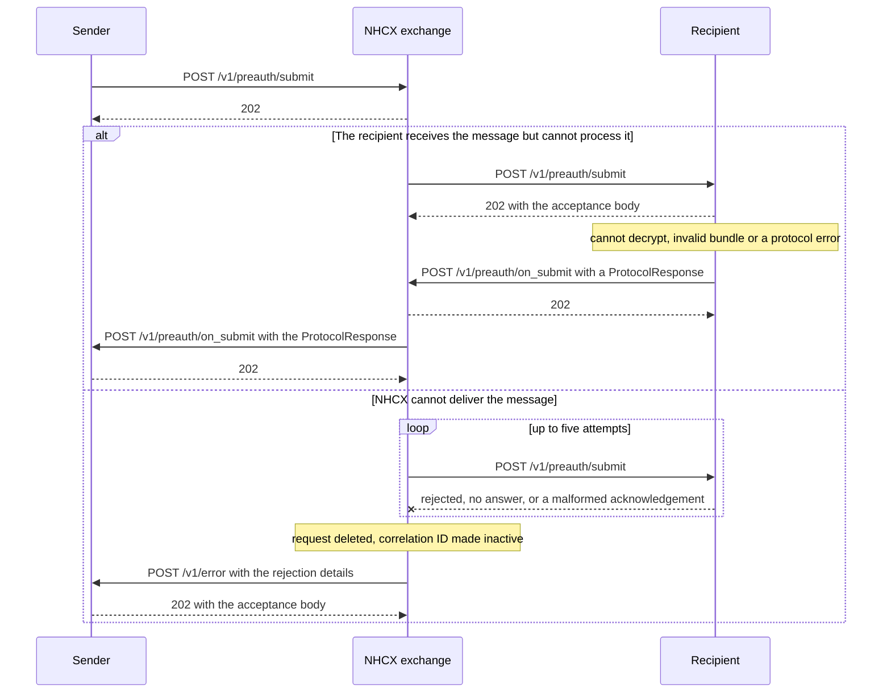

# Report a processing failure on /v1/error

## In plain words

A failed message must be reported back, or its sender waits for a decision that will never come. On the [National Health Claims Exchange](../../shared/glossary/nhcx.md) (NHCX) there are two reports, and every participant handles both.

When you receive a message you cannot process, you answer with a `ProtocolResponse`: a plain, unsealed JSON error on the paired answer path. When NHCX cannot deliver your own message, it gives up after five attempts. It then posts the rejection details to your `/v1/error` endpoint, which every participant must host.

## Before you start

- You acknowledge deliveries as in [Receive, open and acknowledge a sealed message](receive-a-sealed-callback.md).
- Your registered address serves `/v1/error`.
- You record the `x-hcx-api_call_id` and `x-hcx-correlation_id` of every message you send and receive.
- You know which error codes your side uses. See [error code spaces](../concepts/error-code-spaces.md).

## What happens



### Part 1: report a message you cannot process

Send a `ProtocolResponse` only when you could not validate or process the request. The three cases are an invalid payload, a payload you cannot decrypt, and a protocol error. A business decision, even a rejection, is sealed and sent as a normal answer instead.

Send it on the paired answer path, the call you would have used for a decision. Its shape:

```json
{
  "type": "ProtocolResponse",
  "x-hcx-sender_code": "<YOUR_PARTICIPANT_CODE>",
  "x-hcx-recipient_code": "<SENDER_OF_THE_FAILED_MESSAGE>",
  "x-hcx-api_call_id": "<NEW_UUID>",
  "x-hcx-correlation_id": "<CORRELATION_ID_PER_MESSAGE_IDENTIFIERS>",
  "x-hcx-workflow_id": "<WORKFLOW_ID>",
  "x-hcx-timestamp": "<CURRENT_TIMESTAMP>",
  "x-hcx-debug_flag": "Error",
  "x-hcx-status": "response.error",
  "x-hcx-redirect_to": "",
  "x-hcx-error_details": {
    "code": "<ERROR_CODE>",
    "message": "<SHORT_DESCRIPTION>",
    "trace": ""
  },
  "x-hcx-debug_details": {
    "code": "",
    "message": "",
    "trace": ""
  },
  "x-hcx-domain-header": {
    "use_case_name": "<USE_CASE>",
    "amt_processed": "<AMOUNT_PROCESSED>"
  },
  "x-hcx-entity-type": "coverageeligibility | payment | insuranceplan | task | claim | preauth",
  "x-hcx-ben-abha-id": "<ABHA_NUMBER>"
}
```

- `x-hcx-recipient_code` is the sender of the message you are answering.
- `x-hcx-api_call_id` is new, and differs from the correlation ID.
- `x-hcx-correlation_id` follows [message identifiers](../concepts/message-identifiers.md), so the sender can match it.
- `x-hcx-error_details.code` is a code from your error space, such as [PAYR-1001](../errors/payr-1001.md) for a payload you could not decrypt.

NHCX acknowledges your `ProtocolResponse` with `202` and forwards it to the sender.

### Part 2: handle `/v1/error` for a message you sent

NHCX treats a delivery as failed when the recipient rejects the payload, does not answer, or answers outside the acceptance format. It resends the same request, up to five attempts in all. Then it ends the request, deletes it from NHCX, and makes its correlation ID inactive.

**Wait:** the report arrives on your `/v1/error` after the fifth failed attempt. What it carries is the rejection details for the request NHCX gave up on.

When it arrives:

1. Store the report whole, as received. Accept a body shape you do not recognise rather than refusing it.
2. Answer `202` with the acceptance body, as for any delivery.
3. Mark the case it names as undelivered, so nobody waits for a decision.
4. When the recipient is reachable again, send a fresh request with a new correlation ID.

If a case goes quiet and no `/v1/error` has arrived, ask with `POST /v1/status`. The answer on `/v1/on_status` carries `x-hcx-status`. `request.stopped` means NHCX stopped trying to reach the recipient. See [Poll with /v1/status or wait for the callback](../decisions/status-poll-or-wait.md).

## How you know it worked

As the recipient reporting a failure, NHCX answered `202` to your `ProtocolResponse`. As the sender, your `/v1/error` handler answered `202`, stored the report and marked the case undelivered. A fresh request under a new correlation ID then receives `202`.

```observation schema=exit-condition
channel: callback
path: <YOUR_ENDPOINT_URL>/v1/error
acknowledge: HTTP 202 with the acceptance body within 30 seconds
state:
  case named in the report: marked undelivered
```

## When it goes wrong

- **You never learn that a request died.** You do not host `/v1/error`. Host it before anything else asynchronous.
- **Your `/v1/error` handler answers `4xx`.** It validates the body against a fixed schema. Accept any body and store it.
- **A retry fails.** It reuses the correlation ID of the failed request, which NHCX made inactive. Start again with a new one. See [Responses arrive against the wrong request](../troubleshooting/duplicate-or-mismatched-correlation.md).
- **NHCX refuses your answer, saying no data exists for its correlation ID.** Your `x-hcx-correlation_id` does not match the request. See [NHCX-1010](../errors/nhcx-1010.md).
- **You sent a `ProtocolResponse` for a business rejection.** The sender handles it as a protocol failure. Send a sealed decision instead.
