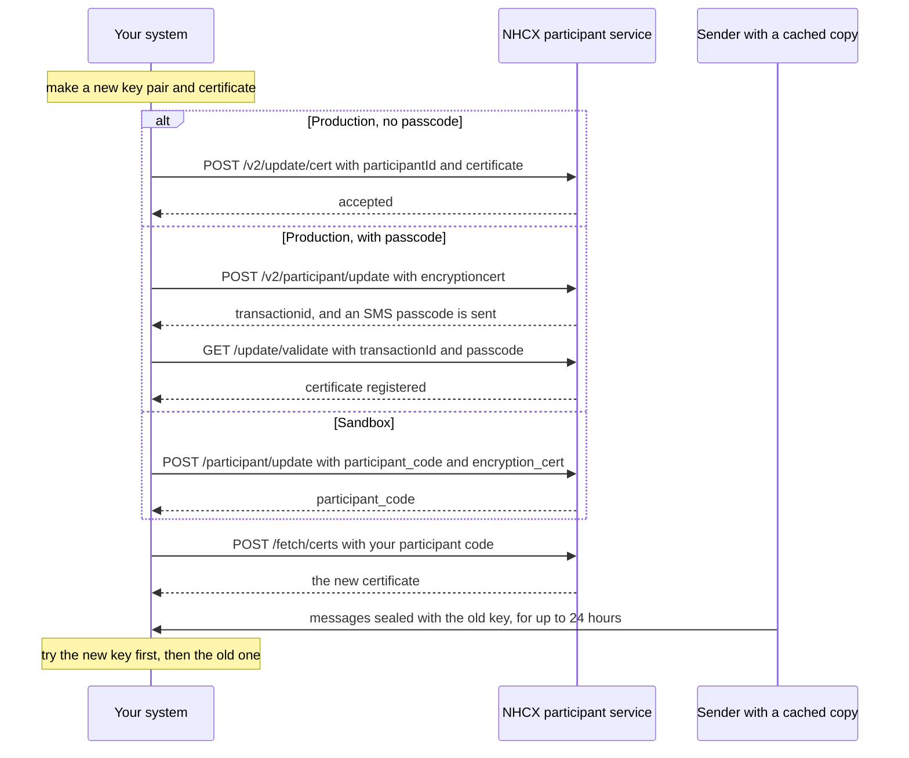

# Rotate your encryption certificate

## In plain words

Your encryption certificate lasts as long as you set when you made it: 365 days with the standard command. Rotate your encryption keys once a year, and at once if a private key may have leaked.

Rotation has one catch. Senders cache your certificate for 24 hours. For a day after the switch, some messages still arrive sealed with your old key. Keep the old key working until that window closes.

## Before you start

- A new key pair and base64 certificate, made as in [Generate an encryption certificate and register it](generate-and-register-certificate.md). Give the files new names, such as `private-2027.key`, so the old ones survive.
- The old private key, still available to your decryption code.
- A session token and your [participant code](../glossary/participant-code.md).
- For the production passcode route only: the person holding your registered mobile.

## What happens



### 1. Make the new pair

Follow steps 1 to 4 of [the certificate flow](generate-and-register-certificate.md) with new file names.

### 2. Register the new certificate

In production, the direct route needs no passcode:

```json
{
  "participantId": "<YOUR_PARTICIPANT_CODE>",
  "certificate": "<BASE64_OF_NEW_CERTIFICATE_CRT>"
}
```

Post it to `POST /v2/update/cert` on `https://apisprod.nha.gov.in/pmjay/hcx/participanthcxservice`. Both fields are mandatory, and the certificate is base64-encoded. See [POST /v2/update/cert](../endpoints/v2-update-cert.md).

The passcode route, `POST /v2/participant/update` followed by `GET /update/validate`, also works. It is described in [Onboard as a participant in production](production-onboarding.md).

In the sandbox, send `POST /participant/update` with your `participant_code` and the new `encryption_cert`. See [POST /participant/update](../endpoints/participant-update.md).

### 3. Run both keys for 24 hours

From the moment of registration, decrypt with the new key first. If that fails, try the old key. Senders that fetched your certificate before the switch keep using it until their 24-hour cache expires.

### 4. Retire the old key

After 24 hours, remove the old key from your decryption path and destroy it.

If you rotated because a key may have leaked, report the compromise to the NHCX operators at once. See [Where to get help with NHCX](../sandbox/support-contacts.md).

## How you know it worked

`POST /fetch/certs` for your participant code returns the new public key. Compare it with the commands in [the certificate flow](generate-and-register-certificate.md). Messages sealed after the 24-hour window open with the new key, and none needs the old one.

```observation schema=exit-condition
channel: synchronous
call: POST /fetch/certs
request:
  participantid: <YOUR_PARTICIPANT_CODE>
match:
  encryption_cert: public key equals the one in the new certificate
```

## When it goes wrong

- **A message will not open with the new key.** The sender used a cached copy of the old certificate. Open it with the old key. If both keys fail, answer as in [Report a processing failure on /v1/error](report-a-processing-error.md). A payer uses [PAYR-1001](../errors/payr-1001.md) for this.
- **A payer reports it cannot encrypt to you.** The certificate you registered is wrong or expired. Register a valid one. See [PAYR-1002](../errors/payr-1002.md).
- **The production passcode expired.** It lasts 24 hours. Start the update again, or use `POST /v2/update/cert`.
- **You destroyed the old key too early.** Messages sealed with it inside the 24-hour window cannot be opened. Ask each sender to resend under a fresh request. See [The recipient cannot decrypt your message](../troubleshooting/recipient-cannot-decrypt.md).
