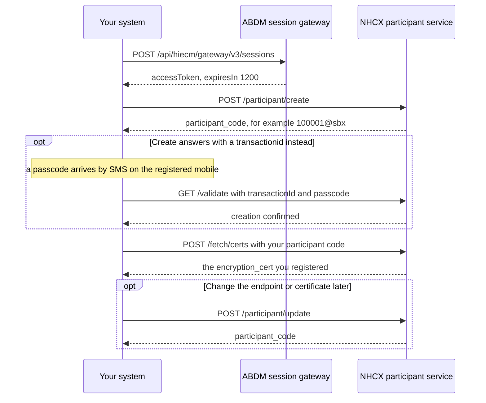

# Onboard as a participant in the NHCX sandbox

## In plain words

Every system that sends or receives claims messages on the [National Health Claims Exchange](../../shared/glossary/nhcx.md) (NHCX) must first exist in its participant registry. Onboarding creates that record.

The record gives you a [participant code](../glossary/participant-code.md), such as `100001@sbx`. It holds your public encryption certificate and the address where NHCX delivers your messages. Nothing else on NHCX works for you until the record exists.

## Before you start

Each item is something you can check before the first call.

- **Registry identity.** A [provider](../glossary/provider.md) has its facility in the [Health Facility Registry](../../shared/glossary/hfr.md) (HFR) and knows its HFR ID. A [payer](../glossary/payer.md) or [TPA](../glossary/tpa.md) knows the ID its [IRDAI](../glossary/irdai.md) or equivalent authority issued. An end user application, such as a [PHR](../../shared/glossary/phr.md) app, uses its client ID.
- **Sandbox credentials.** You hold an [ABDM](../../shared/glossary/abdm.md) sandbox client ID and secret. Apply at `https://sandbox.abdm.gov.in/sandbox/v3/` with the intent "Providers and Payer" and [Milestone 1](../../shared/glossary/m1.md). See [What you need before you register on the NHCX sandbox](../sandbox/prerequisites.md).
- **Milestone 1 working, for a provider.** Your software creates and verifies [ABHA](../../shared/glossary/abha.md) numbers.
- **NHCX sandbox access.** You registered at `https://sandbox.abdm.gov.in/sandbox/v3/sandbox-registration` with that client ID and secret, and roles were assigned to you.
- **A certificate.** You have `certificate_base64.txt` from [Generate an encryption certificate and register it](generate-and-register-certificate.md).
- **A callback address.** Your HTTPS endpoint meets the [callback address rules](../sandbox/callback-url-requirements.md). It uses a domain name with no IP address or port. The server is in India, and its firewall is open to `3.109.99.210`, `13.126.152.0` and `13.200.129.223`.

## What happens



Every call in this flow answers in its own response. Two waits sit outside the calls. The manual review of your sandbox registration comes before step 1. The SMS passcode arrives in step 3, when that step applies.

### 1. Get a session token

Call the session endpoint with your client ID and secret. [Which session token endpoint to call](../decisions/session-endpoint.md) settles the address. The token lasts 1200 seconds (20 minutes), which the answer states as `expiresIn`. Get a new token before it lapses, and after any `401`.

Every participant service call below carries this token. The [session token endpoint](../endpoints/session-token.md) shows the header.

### 2. Create the participant

Call `POST /participant/create` on the sandbox participant service, `https://apisbx.abdm.gov.in/pmjay/sbxhcx/participanthcxservice`. The body carries your profile:

| Field | What to put |
|---|---|
| `linked_registry_codes` | Your registry code, from the table below |
| `registryid` | Your ID in that registry, as listed under Before you start |
| `participant_name` | Your legal or facility name |
| `scheme_code`, `state`, `district` | Your scheme, for example `PMJAY`, and your location |
| `roles` | Your role code, from the table below |
| `primaryEmail`, `phone`, `primaryMobile` | Your contacts |
| `signing_cert_path` | Path to your signing certificate, if you have one |
| `encryption_cert` | The contents of `certificate_base64.txt` |
| `endpoint_url` | Your callback base address |

| You are | `roles` | `linked_registry_codes` |
|---|---|---|
| Provider | `10001` | `10001` (HFR) |
| Payer | `10002` | `10004` (PAYER) |
| TPA | `10003` | `10004` (PAYER) |
| End user application | `10009` | `10001` |

The answer carries your `participant_code`. The full request is in [POST /participant/create](../endpoints/participant-create.md).

An entity with several facilities creates one participant code per HFR ID. It uses the same client credentials for all of them.

### 3. Confirm, when the answer asks for it

If the create answer carries a `transactionid` instead of a participant code, a passcode arrives by SMS on the registered mobile. Confirm with `GET /validate`, passing `transactionId` and `passcode`. The rules for that pair are in [Onboard as a participant in production](production-onboarding.md).

### 4. Read your record back

Call `POST /fetch/certs` with `{"participantid": "<YOUR_PARTICIPANT_CODE>"}`. The answer carries the `encryption_cert` stored against your code. Compare it with your certificate as shown in [Generate an encryption certificate and register it](generate-and-register-certificate.md).

### 5. Change it later

`POST /participant/update` changes the endpoint address, the certificate or any other attribute. `participant_code` is mandatory in its body.

On success every call here answers HTTP `200`. Failures answer `400` for a client error, `404` for a resource not found, or `500` when downstream systems are down.

## How you know it worked

You hold a `participant_code` from `POST /participant/create`, or from `GET /validate` when a passcode was asked for. `POST /fetch/certs` with that code returns an `encryption_cert` whose public key matches your `certificate.crt`.

```observation schema=exit-condition
channel: synchronous
call: POST /fetch/certs
request:
  participantid: <YOUR_PARTICIPANT_CODE>
match:
  encryption_cert: public key equals the one in certificate.crt
```

Next, build your message handling with [Receive, open and acknowledge a sealed message](receive-a-sealed-callback.md) and [Report a processing failure on /v1/error](report-a-processing-error.md). Then work through [the sandbox exit process](../sandbox/sandbox-exit.md).

## When it goes wrong

- **Every call returns `401`.** The token is missing, lacks the `Bearer ` prefix, or has expired. Get a new token and retry once. See [NHCX-401](../errors/nhcx-401.md) and [Every NHCX call returns 401](../troubleshooting/everything-returns-401.md).
- **Create is refused with `400`.** Check `roles` and `linked_registry_codes` against the table in step 2. A wrong pairing causes rejection or misrouted traffic later.
- **Use-case calls say the sender is not registered.** You are calling before the record exists, or with a different code. See [NHCX-1002](../errors/nhcx-1002.md).
- **Nothing ever reaches your endpoint.** The address uses an IP address or a port, or the server is outside India. A firewall may also block the NHCX addresses. See [Your callback URL is rejected or never called](../troubleshooting/callback-url-rejected.md).
- **`/fetch/certs` returns a different key.** You registered a certificate from another key pair. Replace it with `POST /participant/update`.
- **You are still waiting for sandbox access.** Registration approval is a manual review with no published turnaround. You cannot call anything until roles are assigned. See [Where to get help with NHCX](../sandbox/support-contacts.md).
