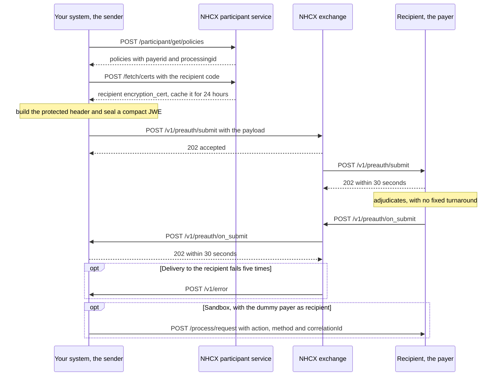

# Send a sealed request through NHCX

## In plain words

The [National Health Claims Exchange](../../shared/glossary/nhcx.md) (NHCX) carries claims messages between providers and payers, but it cannot read them. You seal the business content, a [FHIR](../../shared/glossary/fhir.md) bundle, with the recipient's public key. The routing details ride in the sealed envelope's [protected header](../glossary/protected-header.md).

NHCX answers your call at once, but only to say it accepted the message. The recipient's decision arrives later, as a separate call from NHCX to your callback address. No NHCX use-case call returns a decision in its own response.

## Before you start

- You are onboarded, with a participant code and a registered callback address. See [Onboard as a participant in the NHCX sandbox](sandbox-onboarding.md).
- Your callback endpoint acknowledges within 30 seconds. See [Receive, open and acknowledge a sealed message](receive-a-sealed-callback.md).
- Your `/v1/error` endpoint is live, so you hear when delivery fails. See [Report a processing failure on /v1/error](report-a-processing-error.md).
- You hold a session token.
- You have a FHIR bundle for the use case that passes validation against the [NRCeS](../../shared/glossary/nrces.md) profiles. See [FHIR in NHCX](../concepts/fhir-in-nhcx.md).

## What happens

The example is a pre-authorisation from a provider to a payer. Every use case follows the same four legs.



### 1. Find the recipient

A provider looks up the patient's policies with `POST /participant/get/policies`. Send `identifiertype` as `AbhaNumber`, `MemberId` or `MobileNo`, with the value in `identifiervalue`. Address the request to the `processingid` in the answer, not the `payerid`.

To browse payers instead, call `POST /fetch/participants/list` with `role`, `fromdate` and `todate`. Dates are `dd/MM/yyyy`.

### 2. Fetch the recipient's certificate

Call `POST /fetch/certs` with `{"participantid": "<RECIPIENT_PARTICIPANT_CODE>"}`. Cache the answer for 24 hours. Import it as an X.509 certificate. If that fails, import it as a bare public key.

### 3. Build the protected header

| Header | Value |
|---|---|
| `alg` | The key algorithm from [RSA-OAEP or RSA-OAEP-256](../decisions/key-encryption-algorithm.md) |
| `enc` | `A256GCM` |
| `x-hcx-sender_code` | Your participant code |
| `x-hcx-recipient_code` | The recipient's participant code |
| `x-hcx-api_call_id` | A new random UUID for this call |
| `x-hcx-request_id` | A new random UUID for this request |
| `x-hcx-correlation_id` | The conversation's UUID, as [message identifiers](../concepts/message-identifiers.md) sets out |
| `x-hcx-workflow_id` | The stage code, for example `12` for a new pre-authorisation. See [workflow codes](../concepts/workflow-codes.md) |
| `x-hcx-timestamp` | The current time, in the format [protocol headers](../concepts/protocol-headers.md) gives |
| `x-hcx-status` | `request.initiated` |
| `x-hcx-ben-abha-id` | The beneficiary's ABHA number, where the use case carries it |

The `x-hcx-*` values travel only inside the protected header, never as plain HTTP headers.

### 4. Seal it

Encrypt the bundle into a [JWE](../glossary/jwe.md) in compact serialisation: five base64url parts joined by dots. See [Compact or flattened JWE serialisation](../decisions/jwe-serialisation.md). The request body is:

```json
{
  "payload": "<JWE_COMPACT_STRING>"
}
```

### 5. Post it

Post to the use-case path on the use-case base address in [NHCX environments, hosts and base URLs](../sandbox/environments-and-base-urls.md). Send `Accept: application/json` and `Content-Type: application/json`. Send the session token in both `bearer_auth` and `Authorization`, each as `Bearer <ACCESS_TOKEN_FROM_SESSION_TOKEN>`.

NHCX answers `202` at once. A gateway error, an `NHCX-` code, comes back in this response instead.

### 6. Wait for the answer

NHCX forwards your message and the recipient acknowledges it. The recipient then decides, with no fixed turnaround. Its answer arrives at your registered address on the paired path:

| You posted | The answer arrives on |
|---|---|
| `/v1/coverageeligibility/check` | `/v1/coverageeligibility/on_check` |
| `/v1/insuranceplan/request` | `/v1/insuranceplan/on_request` |
| `/v1/preauth/submit` | `/v1/preauth/on_submit` |
| `/v1/claim/submit` | `/v1/claim/on_submit` |
| `/v1/task/submit` | `/v1/task/on_submit` |
| `/v1/search/submit` | `/v1/search/on_submit` |

The answer is a sealed decision, or a plain `ProtocolResponse` when the recipient could not process your request. Handle it with [Receive, open and acknowledge a sealed message](receive-a-sealed-callback.md). A payer that needs more documents first sends you `/v1/communication/request`.

### 7. When it goes quiet

Check your `/v1/error` records first. Then ask with `POST /v1/status`, whose answer arrives on `/v1/on_status`. See [Poll with /v1/status or wait for the callback](../decisions/status-poll-or-wait.md).

If you resend a message, give it a new `x-hcx-api_call_id`. After a failure, NHCX makes the correlation ID inactive, so start a fresh request with a new correlation ID.

### 8. In the sandbox

The dummy payer is `1000003538@hcx`. After a pre-authorisation or claim, trigger its answer with `POST /process/request` on `https://apisbx.abdm.gov.in/pmjay/sbxhcx/dummyhcxpayer`:

```json
{
  "action": "Approve",
  "method": "Preauth",
  "correlationId": "<CORRELATION_ID_OF_YOUR_REQUEST>"
}
```

`action` is `Approve`, `Reject` or `Query`, and `method` is `Preauth` or `Claim`. A `Query` makes the dummy payer send `/v1/communication/request` first. You answer it on `/v1/communication/on_request`, and the final answer follows on the `on_submit` path. See [The dummy payer and what it answers](../sandbox/dummy-payer.md).

## How you know it worked

NHCX answered `202` to your post. Later, NHCX delivered the paired answer to your registered address, and you answered it `202` within 30 seconds. In that answer's protected header:

- `x-hcx-sender_code` is the recipient you addressed.
- `x-hcx-recipient_code` is your participant code.
- The identifiers match your request as [message identifiers](../concepts/message-identifiers.md) sets out.
- `x-hcx-status` is `response.complete`, `response.partial` or `response.error`.

```observation schema=exit-condition
channel: callback
path: <YOUR_ENDPOINT_URL>/v1/preauth/on_submit
match:
  x-hcx-sender_code: <RECIPIENT_PARTICIPANT_CODE>
  x-hcx-recipient_code: <YOUR_PARTICIPANT_CODE>
  x-hcx-status: one of response.complete, response.partial, response.error
acknowledge: HTTP 202 within 30 seconds
```

## When it goes wrong

- **`401` on any call.** Get a new session token and retry once. See [NHCX-401](../errors/nhcx-401.md).
- **The sender or receiver is not registered.** One of the codes in your header is wrong or not onboarded. For a payer, use the `processingid` from the policy lookup. See [NHCX-1002](../errors/nhcx-1002.md) and [NHCX-1003](../errors/nhcx-1003.md).
- **Invalid request header.** A mandatory protected header is missing, or its prefix is not `x-hcx-`. See [NHCX-1005](../errors/nhcx-1005.md).
- **Duplicate request.** The correlation ID already belongs to another request. See [NHCX-1006](../errors/nhcx-1006.md) and [Responses arrive against the wrong request](../troubleshooting/duplicate-or-mismatched-correlation.md).
- **The recipient cannot decrypt.** You sealed with a stale certificate, or a key algorithm it does not accept. Fetch the certificate again. See [PAYR-1001](../errors/payr-1001.md) and [The recipient cannot decrypt your message](../troubleshooting/recipient-cannot-decrypt.md).
- **The timestamp is refused.** The PMJAY reference payer refuses a timestamp more than 24 hours away from its clock. Keep your clock synchronised. See [PAYR-1005](../errors/payr-1005.md).
- **Accepted, and no answer arrives.** See [The request was accepted with 202 and no callback arrives](../troubleshooting/accepted-then-no-callback.md).
