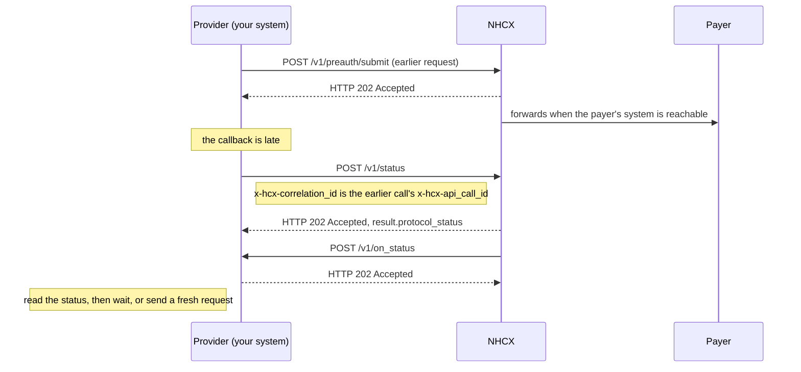

# Check the status of a request

## In plain words

A status check asks the [NHCX](../../shared/glossary/nhcx.md) exchange where a request you sent now stands. It answers with the request's protocol status: still queued at the exchange, delivered to the recipient's system, or stopped.

It does not return the payer's decision. The decision arrives on the request's own callback, such as `/v1/preauth/on_submit`.

Providers and payers both use it, for requests they sent. Use it when a callback is late, before you think of resubmitting. [Poll or wait](../decisions/status-poll-or-wait.md) helps you decide when.

## Before you start

- You sent the request you want to check, and you stored its `x-hcx-api_call_id` and recipient code.
- Your session token and callback endpoint are in place. The status answer arrives on `/v1/on_status`.

## What happens

1. Find the `x-hcx-api_call_id` of the request you are checking.
2. Build the protected header. Set `x-hcx-correlation_id` to that earlier `x-hcx-api_call_id`. Use a fresh `x-hcx-api_call_id` for the status call itself.
3. Set `x-hcx-status` to `request.initiated`. Use the same sender and recipient codes as the earlier request, and send `x-hcx-ben-abha-id`.
4. Seal the body as `{"payload": "<JWE_COMPACT_STRING>"}`, as for every call. See [send a sealed request](send-a-sealed-request.md).
5. Call [POST /v1/status](../endpoints/status.md). NHCX answers `202 Accepted`. The body's `result.protocol_status` names where the request stands.
6. Receive [POST /v1/on_status](../callbacks/on-status.md). Its protected header carries the request's attributes, including `x-hcx-status`. Answer `202 Accepted`.
7. Act on the status:

| Status | Meaning | What to do |
|---|---|---|
| `request.queued` | Queued at the exchange, ready to be picked up | Wait. Do not resend |
| `request.dispatched` | Reached the recipient's system | The recipient holds it. Wait for its callback |
| `request.stopped` | Stopped after failed attempts to reach the recipient | It will not be delivered. Check `/v1/error`, then send a fresh request |

A fresh request always gets a new correlation id. After a failure, the old one is inactive.

## How you know it worked

The check is finished when all of these hold:

- NHCX answered `POST /v1/status` with `202` and a `result.protocol_status`.
- You received `POST /v1/on_status` with the correlation id you asked about, and answered `202`.
- You hold one protocol status for the request: `request.queued`, `request.dispatched` or `request.stopped`.
- You acted on it: waited, or sent a fresh request with a new correlation id.

## When it goes wrong

NHCX finds no request. [NHCX-1012](../errors/nhcx-1012.md) means no record matches the api call id you gave. You probably put a new id in `x-hcx-correlation_id`. Use the earlier request's `x-hcx-api_call_id`.

The request was deleted. After five failed delivery attempts, the exchange deletes a request. Its details come back to you on [/v1/error](../callbacks/error.md). Send a fresh request.

You resent instead of checking. [NHCX-1006](../errors/nhcx-1006.md) means a request with that correlation id already exists. A queued request is still being worked on. Check its status rather than resending.

Every call returns 401. [NHCX-401](../errors/nhcx-401.md) means your session token is missing or expired. See [every NHCX call returns 401](../troubleshooting/everything-returns-401.md).
