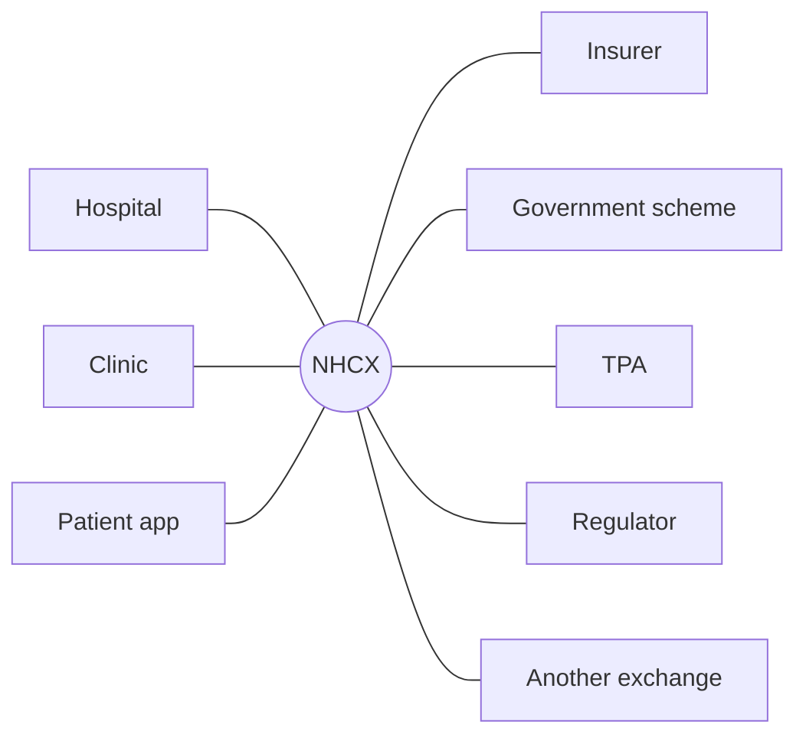

# Introduction

## What it is

The National Health Claims Exchange is a single road between hospitals and insurers. A hospital asks whether a patient is covered, asks permission to treat, sends the bill, and gets paid. Today each of those steps runs differently for every insurer. On the exchange they run the same way for all of them.

It carries the whole journey: checking cover before admission, getting treatment approved, submitting the claim at discharge, being paid, and arguing when the answer is wrong. Every step is a message out and an answer back later, so nothing is left hanging and there is a record of both halves.

Hospitals, insurers, patients, regulators and observers all connect to it the same way.

NHCX is developed under the Ayushman Bharat Digital Mission (ABDM) by the National Health Authority (NHA), in consultation with the Insurance Regulatory and Development Authority of India (IRDAI). The idea is to introduce a platform of exchange to Providers and Payers so that both can transfer digitised health records and other pertinent information directly, in a machine readable format, to their counterpart.

## What NHCX aims to achieve

NHA states five objectives for the exchange.

- **Wider cover.** Bring new kinds of claim onto the network, including outpatient (OPD) visits and pharmacy bills, so insurance is not only about hospital stays.
- **Faster money.** Shorten the time between treatment and payment, and make cashless treatment workable even in small hospitals.
- **Room to innovate.** Give insurers the structured data they need to automate decisions and to spot fraud.
- **One way of doing things.** A single, rule-based process that both sides trust, instead of every insurer running its own.
- **A better patient experience.** Fewer forms, fewer delays, fewer surprises at discharge.

Underneath all five sits one requirement. A hospital's software and an insurer's software are built by different people on different technology, and a message has to mean exactly the same thing at both ends. That is why everything on the exchange is written in one agreed format, with agreed words for diagnoses, procedures and test results. How Claims Move on NHCX introduces that format, and Bundles and Conventions in the FHIR Reference sets out its rules.

## NHCX operating framework

A stock exchange works because a buyer and a seller each connect to the exchange rather than to each other. NHCX works the same way. A hospital connects once, an insurer connects once, and from then on either can reach the other without having built anything specific to them.

## What NHCX is made of

It helps to think of NHCX as three rulebooks and one referee.

- **The protocol** says how a message travels: how it is addressed, sealed, acknowledged and answered. It is deliberately like email: a message goes to the exchange, the exchange passes it on, and the reply comes back the same way.
- **The data specifications** say what goes inside a message. Claims, policies, payments and the rest are written as FHIR records, using profiles published by NRCeS, so that both sides read the same thing.
- **The operational guidelines** say who may join, how they are checked, what they may do, and how they can be removed.
- **NHA is the referee.** It publishes the rules, runs the exchange, and works with NRCeS and IRDAI to change them.

The portal also publishes a sandbox Swagger specification for each of the exchange's services, and Environments and Addresses in the Reference section lists them.

Five principles run through all of it. The rules are **open**, published under a permissive licence so anyone can build against them. They are **evolvable**, so a scheme can add what it needs without breaking everyone else. They are **minimal**, so they are easy to understand and do not hold back innovation. They protect **privacy and security**, with sealed contents and tamper-proof records. And they are **unbundled**, so a participant can adopt one part without adopting all of it.

## Who is on the network

Most of this documentation talks about two parties, the hospital and the insurer. The network recognises more.

- **Providers.** Hospitals and clinics, identified by their Health Facility Registry entry.
- **Payers.** Insurance companies, and the government agencies that pay for schemes.
- **TPAs.** Third-party administrators who process claims on an insurer's behalf. On the network a TPA behaves like a payer.
- **Regulators.** IRDAI and bodies like it, who can search claims across every payer.
- **Scheme sponsors.** The owner of a programme, for example NHA for Ayushman Bharat, with payer-level access.
- **Researchers and insurance marketplaces.** Given aggregated or consented data only.
- **Patient apps.** Personal health record apps that receive notifications on a beneficiary's behalf.
- **Other exchanges.** NHCX is designed so that more than one instance can exist and relay to each other.

Each role comes with a fixed list of what it may send and receive. A hospital can ask about eligibility and submit claims; it cannot search another hospital's claims. A regulator can search; it cannot submit.

## What changes in practice

Four things are different once a hospital is on the exchange, and the rest of this documentation is about making them work.

**Records go across as records.** A hospital's software already holds the diagnosis, the test results and the treatment as data. Today most of it is printed or turned into a picture before it is sent, and the insurer's software cannot read a picture. On the exchange it goes across as data and stays readable.

**That makes automatic decisions possible.** An insurer can only decide a claim by machine if it can read the values. A blood test sent as ten separate results can be checked automatically; the same test sent as a scan cannot.

**One place to type things.** The hospital's own system becomes the single place the information is entered, rather than being re-keyed into an insurer's portal afterwards. Most rejections on technical grounds come from that second typing.

**Any hospital can reach any insurer.** A small hospital that could never afford to integrate with thirty insurers separately can integrate once.

How Claims Move on NHCX follows a claim from admission to payment, in the ordinary language of the people who do it, before any of this becomes technical.
