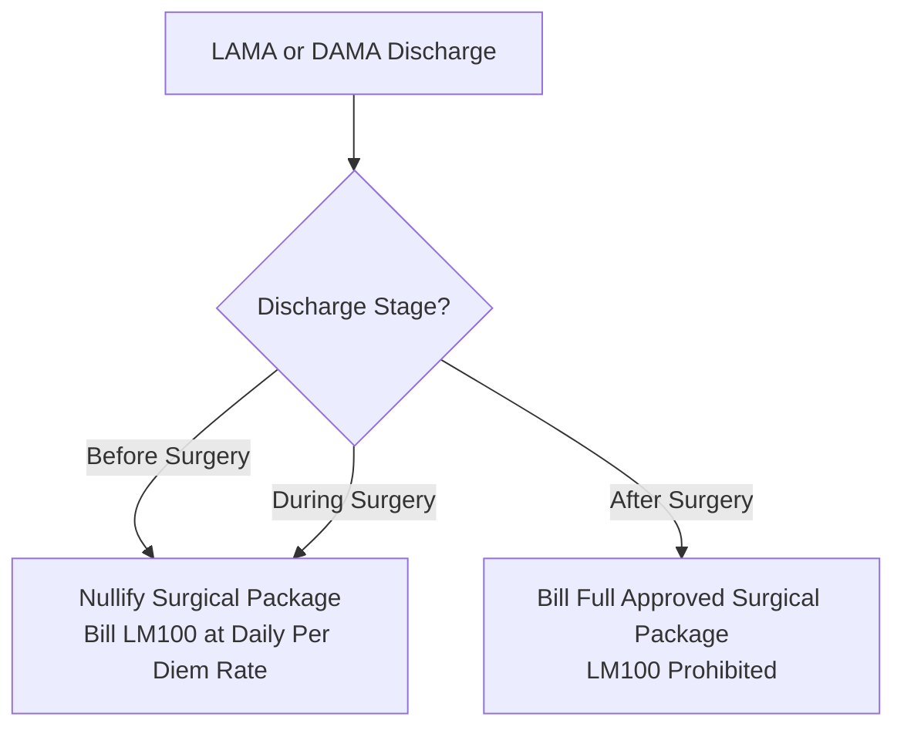

# PMJAY Scheme Rules and HMIS Integration

The Pradhan Mantri Jan Arogya Yojana (PMJAY) operates under strict operational, clinical, and financial guidelines that diverge significantly from commercial, fee-for-service insurance exchanges. This chapter details the scheme-specific business rules, calculation models, and clinical workflows that a Hospital Management Information System (HMIS) must implement.

---

## 1. Core Principles of PMJAY Adjudication

1. **Strictly Package-Based**: PMJAY does not reimburse fee-for-service line items. All admissions are governed by Health Benefit Packages (HBP) with bundled tariffs covering registration, bed charges, nursing, consultations, procedures, medicines, consumables, and standard post-discharge follow-up.
2. **100% Cashless Mandate**: Empanelled healthcare providers cannot collect out-of-pocket co-payments from beneficiaries for covered procedures (`adjudication.copay` = ₹0).
3. **Pre-Authorization Gating**: Pre-authorization is mandatory for all secondary and tertiary surgical interventions. Final claims must reference the approved pre-authorisation number (`preAuthRef`).
4. **Mandatory Biometric Verification**: Live biometric capture (Fingerprint, Iris, or Face) is required at registration/admission, pre-authorisation, every cyclic treatment visit, and discharge.

---

## 2. Discharge Types and Stages

Under PMJAY, a hospital cannot record an open-ended "referral" or "transfer" discharge. Every patient episode must terminate in one of four standardized discharge types, qualified by the surgical timing stage:

| Discharge Type Code | Display                           | Criteria & Adjudication Rule                                                                   |
| ------------------- | --------------------------------- | ---------------------------------------------------------------------------------------------- |
| `DTH`               | Discharge to Home                 | Patient successfully completes inpatient care. Standard package adjudication applies.          |
| `DTM`               | Discharge to Mortuary             | In-hospital mortality. Claim carries death date (`ONS`/`DTM`) and death summary questionnaire. |
| `LAMA`              | Left Against Medical Advice       | Patient absconds or departs against clinical counsel without formal documentation.             |
| `DAMA`              | Discharged Against Medical Advice | Patient or attendant executes an informed refusal undertaking.                                 |

### The Discharge Stage Qualification

Every claim records the clinical timing stage under `supportingInfo` category `DIS` ("Discharge status"):

- `Before Surgery`
- `During Surgery`
- `After Surgery`

---

## 3. Package LM100 and LAMA/DAMA Billing Rules

When a patient departs under `LAMA` or `DAMA`, the scheme strictly prohibits billing the full surgical package if the surgical intervention was not completed:

### 1. Before or During Surgery

- **Nullification**: Submitting a LAMA/DAMA claim before or during surgery immediately **nullifies all prior approved surgical pre-authorisation packages**.
- **Item Code `LM100`**: The claim replaces all surgical line items with a single item: procedure code `LM100` (Conservative / Per Diem Inpatient Care).
- **Daily Quantity Multiplier & `los` Bound**: The quantity on `LM100` is set to the exact number of days the patient was admitted (`Discharge Date - Admission Date`). This quantity is strictly bounded by the `los` (Maximum Length of Stay) attribute declared in the scheme package master (`InsurancePlan`). Admitted days billed cannot exceed `los` without prior clinical justification; stays extending beyond standard procedure limits in ordinary admissions require an approved pre-authorisation enhancement request (workflow 13).
- **Stratification Tariffs**: Procedure `LM100` is stratified by bed tier in the PMJAY master: Routine Ward (₹1,800/day, `STRAT006a`), High Dependency Unit HDU (₹2,700/day, `STRAT006b`), ICU Without Ventilator (₹3,600/day, `STRAT006c`), and ICU With Ventilator (₹4,500/day, `STRAT006d`).
- **Error Safeguard**: Submitting a surgical package code alongside LAMA/DAMA before or during surgery triggers automated rejection with error `PAYR-1362`.
- **Pre-Auth Prohibition**: `LM100` is strictly a claim-time adjudication code. Submitting `LM100` in a pre-authorisation request triggers error `PAYR-1270`.

### 2. After Surgery

- If surgery was successfully performed and the patient subsequently leaves against medical advice during post-operative recovery:

  - The approved surgical package remains valid.
  - `LM100` is **not** used.
  - The discharge stage is recorded as `After Surgery`, and the hospital is reimbursed for the surgical package.

---

## 4. In-Hospital Death Claims (`DTM`)

If a patient expires during hospitalisation:

1. The discharge code is set to `DTM` (Discharge to Mortuary).
2. The claim retains the package appropriate to the clinical management provided up to the point of death.
3. The claim **must** include the date and time of death under `supportingInfo` category `ONS` with code `DTM`. Omitting the death timestamp causes rejection with error `PAYR-1096`.
4. The hospital must complete and attach the PMJAY Death Summary Questionnaire defined in the InsurancePlan.

---

## 5. Cyclic Procedures (Dialysis, Chemotherapy)

Cyclic treatments represent recurring therapy requiring multiple sessions under a single overarching pre-authorisation:

- **Plan Identification**: Packages flag cyclic eligibility with `cyclic_proc_yn = Y` and `no_of_cycles` in the `InsurancePlan`.
- **Pre-Auth Booking**: Pre-authorisation is requested and approved for the entire block of sessions (e.g., 10 cycles).
- **The Rolling 24-Hour Rule**: Two cycles of the same procedure cannot occur within a **rolling 24-hour window** (measured strictly from biometric timestamp to biometric timestamp, not calendar days). Submitting cycles within 24 hours triggers rejection with error `PAYR-1369`.
- **Biometric Enforcement**: Live biometric capture is mandatory at pre-auth, at **every individual treatment visit**, and at final discharge.
- **Payment Settlement**: The claim is submitted once after all sessions conclude. Payment is released exclusively for sessions backed by a verified biometric capture. (E.g., 10 sessions approved, 8 biometric captures recorded = 8 sessions paid).
- **Clinical Mapping**: Each cycle is recorded under `supportingInfo` category `CD` (Clinical document) with code `TD` (Treatment detail), carrying exact start and end timestamps matching the biometric verification log.

---

## 6. Unspecified Surgical and Medical Procedures

When a patient requires a clinically necessary surgical intervention not present in the PMJAY Health Benefit Package master:

1. **Strictly Planned**: Unspecified procedures are permitted **only for elective/planned admissions**; emergency cases cannot utilize unspecified package codes.

2. **Specialty Alignment**: Must be booked under the patient’s treating specialty.

3. **Coding Convention**:

   - In live PMJAY plans, the procedure code is constructed as the **Specialty Prefix + `U100`** (e.g., `SGU100` for General Surgery, `SMU100` for Oral & Maxillofacial Surgery).
   - Some earlier NHA documentation referenced `Specialty + 215` (e.g., `SG215`). Systems must echo the exact code returned in the hospital’s dynamic `InsurancePlan`.

4. **Free-Text Specification**: The procedure name, clinical description, and requested tariff are entered by the hospital staff rather than selected from fixed master lists.

5. **Wallet Validation**: The entered amount cannot exceed the beneficiary’s available wallet balance. HMIS systems must validate this balance server-side before submission.

6. **Standalone Requirement**: An unspecified procedure must be a solitary line item; it cannot be clubbed with standard packages, implants, or stratified ICU addons.

---

## 7. Biometric Authentication and Aadhaar Exemption

The captures these rules call for, at registration, preauthorisation, every cyclic visit and discharge, are made through ABDM's biometric APIs, not over NHCX. Biometric Authentication, in Building a Provider, gives the calls: fingerprint and iris on one host, face on another, the user token they return and its refresh, the `K-547` device error, and the Aadhaar exemption consent and questionnaire that stand in where a capture is not possible.
