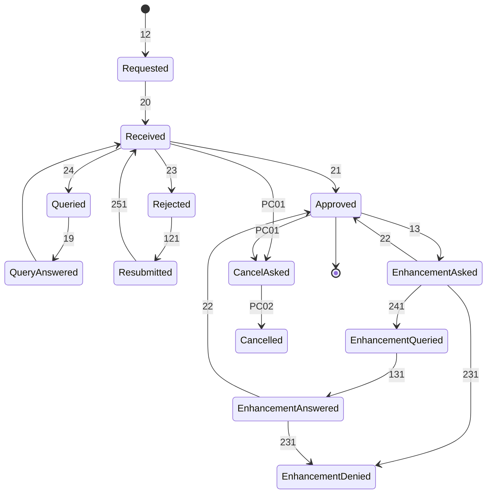
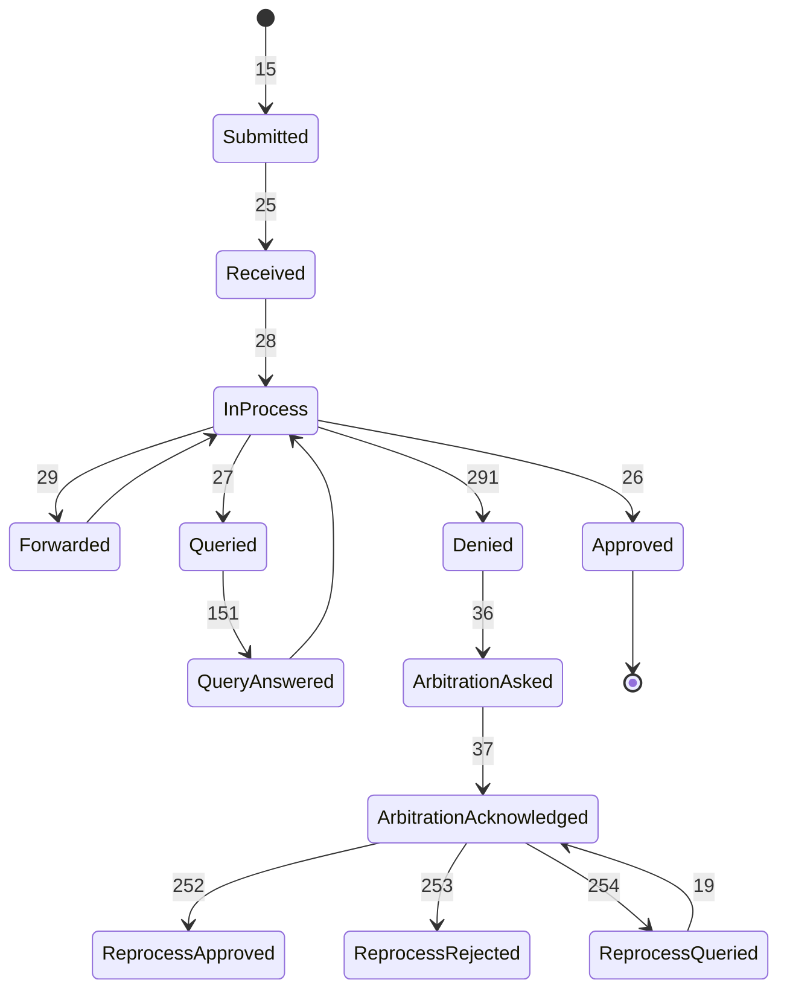
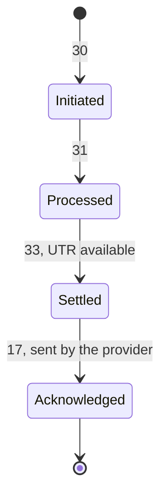

# Workflow Codes

The address a message is sent to does not say which step of a claim it is. A new preauthorisation, a resubmission, an enhancement and an answer to a query all go to the same place, in the same kind of bundle. The workflow code in the message header is what tells them apart. Each code also comes with a status that says whether the message starts a request, answers one, or refuses it. The official Workflow Status Sheet is the authority, and new codes appear there first.

## Every workflow code

Search by code, name or status, and switch between the codes a provider sends, the codes a payer sends, every row of the Workflow Status Sheet, and the lettered families.

Search by code, name or status

Spellings are as published, such as `Initimation`, `Reimburstment` and `protocal`, so that searching for what you saw in a payload finds the row.

- `12`Preauth Request Initiatedrequest.initiated
- `121`Preauth Reprocess(Resubmission) Initimationrequest.initiated
- `13`Enhancement Request Initiatedrequest.initiated
- `131`Enhancement Query Ack Successresponse.partial
- `131`Enhancement Query Ack Failedresponse.error
- `131`Enhancement Query Response Submittedresponse.complete
- `18`Preauth Query Ack Successresponse.partial
- `18`Preauth Query Ack Failedresponse.error
- `19`Preauth Query Response Submittedresponse.complete
- `20`Preauth Ack Successresponse.partial
- `20`Preauth Ack Failedresponse.error
- `21`Preauth Request Approvedresponse.complete
- `22`Enhancement Request Approvedresponse.complete
- `23`Preauth Request Rejectedresponse.complete
- `231`Enhancement Denyresponse.complete
- `24`Preauth Request Queriedrequest.initiated
- `241`Enhancement Query Raiserequest.initiated
- `251`Preauth Reprocess Ackresponse.complete
- `41`Preauth Arbitration Intimationrequest.initiated
- `42`Preauth Arbitration Acknowledgementresponse.complete
- `PC01`Preauthorization Cancellationrequest.initiated
- `PC02`Preauthorization Cancellation Accomplishedresponse.complete
- `10`Patient Registeredrequest.initiated
- `11`Patient Admittedrequest.initiated
- `14`Discharge Submittedrequest.initiated
- `28`Claim Request In Processresponse.partial
- `29`Claim Forwardedresponse.partial
- `31`Payment Processedrequest.initiated
- `33`Payment Settledrequest.initiated
- `141`Discharge Query Response Submittedresponse.complete
- `151`Claim Query Response Submittedresponse.complete
- `252`Reprocess Request Approvedresponse.complete
- `253`Reprocess Request Rejectedresponse.complete
- `254`Reprocess Request Queriedrequest.initiated
- `261`Discharge Request Approvedresponse.partial
- `262`Discharge Request Rejectedresponse.complete
- `263`Discharge Request Queriedrequest.initiated
- `45`Final Bill Initimationrequest.initiated
- `45`Final Bill Ack Successresponse.partial
- `45`Final Bill Ack Failedresponse.error
- `15`Claim Request Initiatedrequest.initiated
- `181`Final Bill Query Responseresponse.complete
- `161`Claim Doc Query Responseresponse.complete
- `17`Payment Notice Recivedresponse.complete
- `25`Claim Doc Ack Successresponse.partial
- `25`Claim Doc Ack Failedresponse.error
- `46`Final Bill Approveresponse.complete
- `26`Claim Request Approvedresponse.complete
- `47`Final Bill Query Raiserequest.initiated
- `47`Final Bill Query Ack Successresponse.partial
- `47`Final Bill Query Ack Failedresponse.error
- `27`Claim Request Queriedrequest.initiated
- `27`Claim Request Queriedresponse.partial/complete
- `491`Final Bill Denyresponse.complete
- `291`Claim Doc Denyresponse.complete
- `30`Payment Notice Initmationrequest.initiated
- `30`Payment Notice Ack Successresponse.partial
- `30`Payment Notice Ack Failedresponse.error
- `R122`Reimburstment Claim Reprocess Requestedrequest.initiated
- `R15`Reimburstment Claim Submittedrequest.initiated
- `R151`Reimburstment Claim Query Response Submittedresponse.complete
- `R252`Reimburstment Claim Reprocess Request Approvedresponse.complete
- `R253`Reimburstment Claim Reprocess Request Rejectedresponse.complete
- `R254`Reimburstment Claim Reprocess Request Queriedrequest.initiated
- `R26`Reimburstment Claim Approvedresponse.complete
- `R27`Reimburstment Claim Queriedrequest.initiated
- `R28`Reimburstment Claim Evaluation In Processresponse.partial
- `R291`Reimburstment Claim Rejectedresponse.complete
- `34`Wallet Upgrade Intimationrequest.initiated
- `36`Claim Arbitration Intimationrequest.initiated
- `38`Fraud Alertrequest.initiated
- `35`Wallet Upgrade Acknowledgementresponse.complete
- `37`Claim Arbitration Acknowledgementresponse.complete
- `39`Fraud Alert Acknowledgementresponse.complete
- `G11`Grievance Intimationrequest.initiated
- `G12`Grievance Acknowledmentresponse.complete
- `G13`Grievance Intimation Failureresponse.error
- `RP1`Return Payment Intimationrequest.initiated
- `RP2`Return Payment Acknowledgementresponse.complete
- `RP3`Return Payment Failureresponse.error
- `N01`Notifications Intended To Payerrequest.initiated
- `N02`Notifications Intended To Providerrequest.initiated
- `N03`Notifications Intended To Beneficiaryrequest.initiated
- `N04`Acknowledgement Of The Notificaionresponse.complete
- `DC01`Discharge Correction Intimationrequest.initiated
- `DC02`Acknowledgement For Discharge Correctionresponse.complete

## Mainline Cashless State Machines

In the diagrams below, each arrow carries the workflow code of the message that moves the case.

### Preauthorisation Lifecycle

### Claim Lifecycle

### Payment & Settlement Lifecycle

