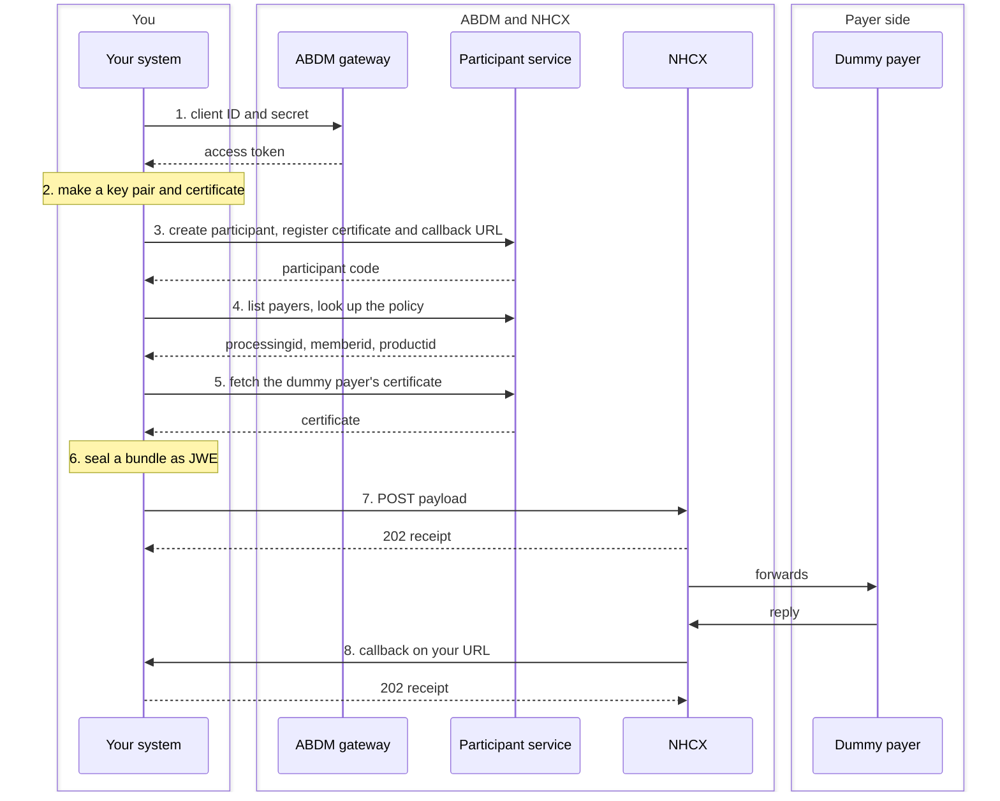

# The base framework

Every participant on NHCX, whether it sends claims or answers them, needs the same seven things working before a single use case can be built. This section builds them in order, and ends with a live round trip: a message out to the sandbox, and the reply back on your own server.

None of it is specific to a hospital or an insurer. A provider goes on from here to the B-series use cases; a payer to the C-series. The framework underneath is identical.

## What you will have at the end



1. A way to get and refresh an access token.
2. Your own encryption key and certificate.
3. A participant record on the sandbox with your certificate and callback address on it.
4. A way to find the participant a message goes to, and the policy it concerns.
5. A way to fetch any other participant's certificate.
6. Code that turns a FHIR bundle into a sealed message and sends it.
7. A callback endpoint that accepts a message, acknowledges it, opens it and reads it.

Put together, that is the whole loop:

## Before you start

- **An identity in a registry.** A hospital needs its Health Facility Registry (HFR) ID. An insurer or TPA needs its IRDAI registry ID.
- **ABDM sandbox credentials.** A client ID and secret from the ABDM sandbox, with Milestone 1 completed. NHCX uses these same credentials; there is no separate login.
- **A public HTTPS server in India** with a domain name, for the callback. The exchange will not call an IP address or a port number.
- **openssl** on the machine that will hold the private key.
- **A JOSE library** in your language. The portal's own samples use Nimbus for Java. The examples here use `jwcrypto` and `cryptography` for Python, because they are short; any library that does RSA-OAEP-256 with A256GCM will do.

## Addresses used in this section

All sandbox.

| What                | Where                                                           |
| ------------------- | --------------------------------------------------------------- |
| Session token       | `https://dev.abdm.gov.in/api/hiecm/gateway/v3/sessions`         |
| Participant service | `https://apisbx.abdm.gov.in/pmjay/sbxhcx/participanthcxservice` |
| Use-case calls      | `https://apisbx.abdm.gov.in/hcx/v1`                             |
| Dummy payer         | participant `1000003538@hcx`                                    |

Every call to the participant service and the use-case endpoints carries the same three headers:

```text
Accept: application/jsonContent-Type: application/jsonbearer_auth: Bearer <access token>
```

Note the header name. It is `bearer_auth`, not `Authorization`, on NHCX's own endpoints. The biometric endpoints used later under PMJAY use `Authorization` instead.
