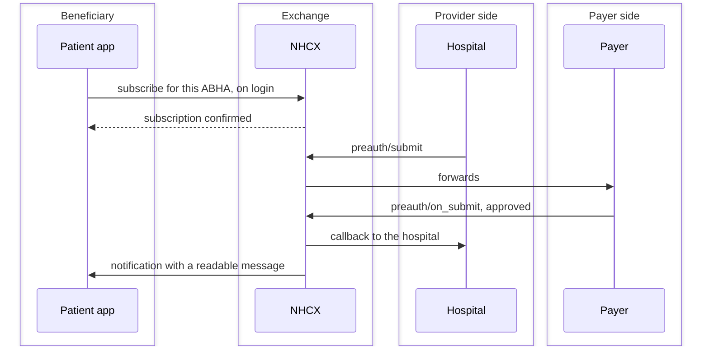

# Notifications and patient apps

The third kind of participant. A personal health record app registers on the exchange as a beneficiary service provider, subscribes on a beneficiary's behalf, and receives a readable message every time something happens to that beneficiary's claim. It sends no claims and answers no queries. It is the only role on the network whose whole job is to be told things.

This chapter is for anyone building such an app, and for a hospital or payer that also runs one.

## The model: subscribe on login, last linked wins



When a beneficiary logs into an app with their ABHA, that app calls subscribe and becomes the recipient of every notification for that ABHA. **Any earlier subscription is replaced.** Only one app receives notifications for a beneficiary at any moment.

That rule is deliberate and it has consequences worth designing around.

- There is no duplicate delivery to handle, and no fan-out.
- A beneficiary who opens a second app silently stops receiving notifications in the first. Neither app is told.
- Subscription is an action to take on every login, not once at install.

## Before you start

- **Milestone 1.** The app must have completed ABDM Milestone 1 integration.
- **Registration as a beneficiary service provider.** Sandbox testing, sandbox certification, then onboarding to the production registry. The role code is 10009 and the registry ID may be the app's own client ID.
- **An HTTPS endpoint** with TLS 1.2 or newer, and the ability to generate and validate JWTs.

## Subscribing

```bash
curl --location --request POST 'https://hcxsbx.abdm.gov.in/v1/notification/subscribe' \  --header 'Content-Type: application/json' \  --header 'Authorization: Bearer <access token>' \  --header 'x-hcx-sender_code: phr-app-xyz@bsp' \  --header 'x-hcx-recipient_code: nhcx-gateway@hcx' \  --header 'x-hcx-timestamp: <iso timestamp>' \  --header 'x-hcx-correlation_id: <uuid>' \  --data-raw '{    "payload": "eyJhbGciOiJSU0EtT0FFUCIsImVuYyI6IkEyNTZHQ00iLCJ4LWhjeC1zZW5kZXJfY29kZSI6InBoci1hcHAteHl6QGJzcCJ9.encrypted_key.iv.ciphertext.tag",    "_payload_plaintext": {      "subscription_id": "sub_ravi_001",      "topic_code": [        "workflow_events"      ],      "recipient_code": "phr-app-xyz@bsp",      "subscriber": {        "id": "ravi@abdm"      },      "on_notification_url": "https://api.phrapp.com/v1/hcx/notification/on_subscribe"    }  }'
```

[Notification subscribe in the API reference](/docs/main/docs/nhcx/v1/api/other/endpoints/other-v1-notification-subscribe)

The call is sealed like any other message on the exchange, with the app as sender and the gateway as recipient. The subscription service's live specification is at `https://hcxsbx.abdm.gov.in/subscriptionhcxservice/swagger-ui/index.html`, and Environments and Addresses lists it with the others.

| Field                 | Required | What it carries                                         |
| --------------------- | -------- | ------------------------------------------------------- |
| `subscription_id`     | Yes      | Your own unique identifier for this subscription        |
| `topic_code`          | Yes      | An array of topics, see below                           |
| `recipient_code`      | Yes      | Your participant code                                   |
| `subscriber.id`       | Yes      | The beneficiary's ABHA address, for example `ravi@abdm` |
| `on_notification_url` | Yes      | Where notifications should be delivered                 |
| `expiry`              | No       | When the subscription lapses                            |

```json
{  "subscription_id": "sub_ravi_001",  "topic_code": ["workflow_events"],  "recipient_code": "phr-app-xyz@bsp",  "subscriber": { "id": "ravi@abdm" },  "on_notification_url": "https://api.phrapp.example/v1/hcx/notification/on_subscribe"}
```

### Topics

| Topic                | What arrives                                      |
| -------------------- | ------------------------------------------------- |
| `workflow_events`    | Claim lifecycle: preauthorisation, claim, payment |
| `network_events`     | Exchange platform updates and maintenance         |
| `participant_events` | Changes to payer and provider registrations       |

Most apps need `workflow_events` alone. The field is an array, so subscribe to more than one where you have a reason.

The workflow codes for this exchange are N01 to a payer, N02 to a provider, N03 to a beneficiary and N04 for the acknowledgement.

## Receiving a notification

The exchange posts to the `on_notification_url` you registered.

| Field             | What it carries                                                   |
| ----------------- | ----------------------------------------------------------------- |
| `notification_id` | Unique per notification                                           |
| `topic_code`      | The topic it arrived under                                        |
| `timestamp`       | ISO 8601                                                          |
| `subscriber.id`   | The beneficiary's ABHA                                            |
| `message`         | **A human-readable sentence the app can display as it stands**    |
| `domain_values`   | Optional map of the domain headers, for audit or richer rendering |

```json
{  "notification_id": "notif_20260428_001",  "topic_code": "workflow_events",  "timestamp": "2026-04-28T14:30:00+05:30",  "subscriber": { "id": "ravi@abdm" },  "message": "Preauthorization approved for Rs. 50,000. Valid from 2026-04-28 to 2026-05-05. Reference: PA-2026-004567",  "domain_values": {    "x-hcx-correlation_id": "corr_20260428_12345",    "x-hcx-status": "response.complete",    "x-hcx-action": "preauth_response",    "x-hcx-amount_submitted": "75000.00"  }}
```

**The `message` field is the point of the whole exchange.** It is written by the exchange to be shown to a patient without parsing, and an app that ignores it and renders its own sentence from `domain_values` is doing avoidable work and will drift from what every other app shows.

`domain_values` is where the named domain headers actually appear, and it is the clearest evidence in the corpus that domain headers are a real mechanism rather than a placeholder. Envelope Fields lists them.

## Event types

| Event              | Status values          |
| ------------------ | ---------------------- |
| `preauth_request`  | `queued`, `processing` |
| `preauth_response` | `approved`, `rejected` |
| `claim_request`    | `queued`, `processing` |
| `claim_response`   | `approved`, `rejected` |
| `payment_notice`   | `paid`, `pending`      |
| `communication`    | `information_required` |

Note that this vocabulary is not the workflow-code vocabulary and not the status-word vocabulary. It is a third, simpler set, designed for display.

## Errors

| Code  | Meaning                     | What to do                              |
| ----- | --------------------------- | --------------------------------------- |
| `401` | Token expired               | Regenerate and retry                    |
| `403` | Not authorised              | Check your registry entry and role      |
| `409` | Subscription already exists | Should not occur under last-linked-wins |
| `500` | Gateway problem             | Retry with backoff                      |

## What the payer and provider do

Nothing extra. The exchange generates notifications from the traffic that already flows. A payer's ordinary responses feed them, and the payer's own notifications carry workflow N01.

For a hospital that also runs a patient app, the two are separate participants with separate codes and separate certificates, even inside one organisation.

## Security and privacy

Four requirements from the integration document, none of them optional in production.

- Store the access token encrypted, refresh before expiry, and never log the participant secret.
- Enforce HTTPS with TLS 1.2 or newer on the callback.
- Validate the JWT the exchange signs its call with, and check that `sender_code` is the exchange. The public key problem described in Governance and Audit applies here too.
- **Obtain explicit consent from the beneficiary before subscribing**, and show the subscription state somewhere the beneficiary can find and change it.

That last one is the substantive difference between this role and the others. A hospital's participation is contracted; a patient app's is consented to, one beneficiary at a time.

## What this chapter cannot tell you

The integration document is written against an older reading of the protocol than the rest of the corpus. It gives `alg` as `RSA-OAEP` rather than `RSA-OAEP-256`, and a token life of 6,000 seconds where other sources say 300 or 1,200. Follow the current protocol as Envelope Fields and Session Token give it, and treat the document's payload shapes as the part that is specific to notifications.

No sample notification bundle exists in the corpus, and no participant is recorded as having exercised this exchange.
