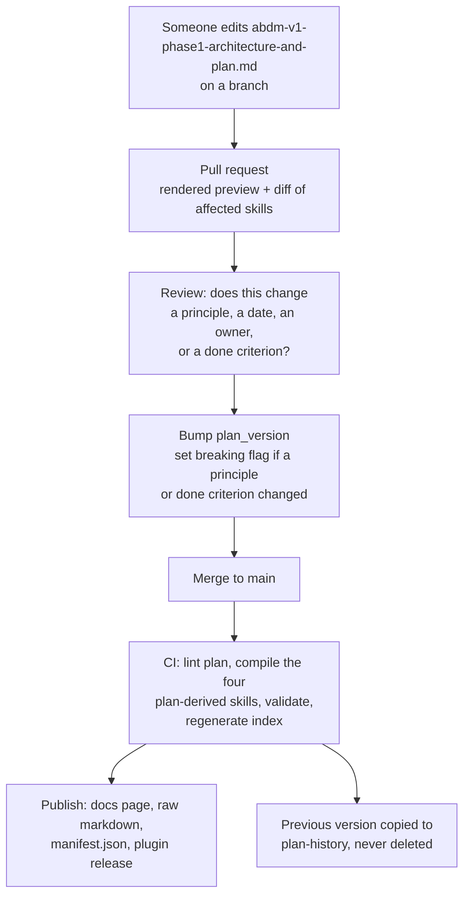

# The plan as a versioned source: addendum to the V1 Phase 1 architecture

**Status:** Draft v0.1, refineable. Extends the V1 Phase 1 architecture and execution plan. No em dashes.

---

## 1. The problem

The architecture and execution plan is currently a document that people read and then encode by hand into skills. That is exactly the drift problem the Catalogue exists to solve, one level up. Three skills in the `abdm-portal` plugin restate the plan: `portal-architecture`, `portal-planning` and `dpg-governance`. Today, if the plan changes, those three skills silently become wrong.

So the plan must become a source, watched and compiled like any NHA specification.

## 2. Two readings of "the plugin uses the latest plan through RAG"

The same separation applies here as applies to NHA sources. One reading is right and one is a trap.

**Retrieval at question time, which is right.** A human or an agent asks a question about the plan. Something searches the published plan and answers. This is what the Docs MCP and Ask AI already do, and the plan should be published so they can. No new machinery.

**Runtime fetching inside skills, which is a trap.** Every skill fetches the plan from a URL when it loads, so it is "always current". This looks like the same thing and is not. It breaks five properties we rely on:

| Property | How runtime fetching breaks it |
|---|---|
| Skills install alone and work offline | A network dependency on load. The skill fails when the network does. |
| Content is reviewed before it reaches an agent | The plan changes and every installed agent picks it up with no review gate. |
| Builds are reproducible | Two agents running the same task on the same day can get different instructions. |
| DPG decoupling | A hard runtime dependency on one hosted URL is exactly what P6 forbids. |
| Identifier validation | The validator cannot diff facts it has not seen at build time. |

The fix is not to fetch at runtime. It is to make the plan a compiled source and add a cheap staleness check.

**Recommendation A1.** Retrieval for questions, compilation for content, and a version check to detect the gap. Never runtime fetching of instructions.

## 3. Where the plan lives

**Recommendation A2.** The canonical plan is a file in the public Catalogue git repository at a stable path, published to the docs site as a rendered page and as raw markdown.

```
catalogue/
  governance/
    plan.md              <- canonical, the only editable copy
    plan-history/        <- superseded versions, never deleted
  ...
```

Published at:

| Surface | URL shape | For |
|---|---|---|
| Rendered page | `https://github.com/obadiah-1/abdm-ai-sandbox-plan/blob/main/abdm-v1-phase1-architecture-and-plan.md` | People reading it |
| Raw markdown | `https://raw.githubusercontent.com/obadiah-1/abdm-ai-sandbox-plan/main/abdm-v1-phase1-architecture-and-plan.md` | Agents fetching directly |
| Changelog | `https://github.com/obadiah-1/abdm-ai-sandbox-plan/commits/main/abdm-v1-phase1-architecture-and-plan.md` | What changed and when |
| Version manifest | `https://raw.githubusercontent.com/obadiah-1/abdm-ai-sandbox-plan/main/manifest.json` | Cheap staleness checks, see §6 |
| Index entry | `docs-domain/llms.txt` | Agent discovery, once the docs site is up |
| Docs MCP | `docs-domain/mcp` | Question answering over it, once the docs site is up |

Until the docs site exists, GitHub is the published surface. The raw URLs above are live now and are what `manifest.json`, the index skill and `/plan-check` point at.

It must be git, not a document in a collaboration tool. The entire P7 mechanism depends on hashing, diffing and pull request review. A document with no content hash cannot be watched, and a change with no review gate cannot be trusted.

## 4. The plan gets frontmatter and stable section ids

The plan becomes an atom, with one new type. This is a schema change and needs sign-off before atoms are written against it.

```yaml
id: governance.plan.v1-phase1
type: plan                    # new value in the type enum
gateway: shared
milestone: n/a
plan_version: 2026.08.24      # bumped on every merge that changes meaning
title: ABDM Developer Portal, V1 Phase 1 architecture and execution plan
summary: >
  How the portal is built: the four building blocks, the seven principles,
  the schedule, and the definition of done.
supersedes: governance.plan.v0-2
sources:
  - url: abdm-v1-phase1-architecture-and-plan.md
    role: canonical
    hash: sha256:...
compiles_to:
  - portal-architecture
  - portal-planning
  - dpg-governance
  - abdm-portal-index
```

Every section carries a stable id, declared as an anchor tag above its heading, so compiled skills cite `plan#p4-skills` rather than a heading anchor that moves. The scheme is `p<number>-<short slug>`, with subsections appending their own number: `p4-2-ooda` for §4.2. Renaming or removing an id is a breaking change and needs every citation fixed in the same commit, exactly like renaming an atom id. `scripts/plan-check.sh` enforces resolution.

The five dummy-proof body sections do not apply to a plan atom. Plan atoms are exempt in the lint rule set, and they carry their own required sections instead: principles, scope, schedule, definition of done, risks.

## 5. Compilation, not transcription

The three plan-derived skills stop being hand-written and become build outputs, like every other skill.

```
abdm-v1-phase1-architecture-and-plan.md
        |
   Selector reads compiles_to
        |
   Templates: orient kind
        |
   Compiler: deterministic assembly + constrained prose pass
        |
   Validator: identifiers, principle count, section ids cited must resolve
        |
   skills/portal-architecture   stamped plan_version
   skills/portal-planning       stamped plan_version
   skills/dpg-governance        stamped plan_version
   skills/abdm-portal-index     stamped plan_version and catalogue_version
```

Validator rules specific to plan compilation:

| Rule | Why |
|---|---|
| `plan.principles-complete` | Every principle in the plan appears in a compiled skill. A dropped principle is unenforceable. |
| `plan.section-refs-resolve` | Every `plan#id` cited by a skill exists in the plan. |
| `plan.no-new-commitments` | The prose pass may not invent a date, an owner, a checkpoint or a done criterion. Same identifier diff discipline as NHA facts. |
| `plan.done-criteria-count` | The definition of done has the same number of items in the plan and in `portal-planning`. Silent loss of a criterion is the failure this catches. |

**Recommendation A3.** After this lands, nobody edits `portal-architecture`, `portal-planning` or `dpg-governance` directly. Editing the plan is the only way to change them.

## 6. The staleness check

This is what delivers "always the latest" without runtime fetching of instructions.

A tiny manifest is published alongside the plan. It is a few hundred bytes, cacheable, and cheap to fetch.

```json
{
  "plan_version": "2026.08.24",
  "plan_hash": "sha256:...",
  "catalogue_version": "2026.08.30",
  "plan_url": "https://raw.githubusercontent.com/obadiah-1/abdm-ai-sandbox-plan/main/abdm-v1-phase1-architecture-and-plan.md",
  "changelog_url": "https://github.com/obadiah-1/abdm-ai-sandbox-plan/commits/main/abdm-v1-phase1-architecture-and-plan.md",
  "breaking": false
}
```

Every compiled skill carries the `plan_version` it was built from. The index skill checks the manifest at the start of a session, once, and compares.

| Comparison | Behaviour |
|---|---|
| Versions match | Proceed silently. No mention. |
| Manifest version newer, `breaking: false` | Proceed, and tell the person once: your skills are built from plan 2026.08.24, the current plan is 2026.08.31, run update when convenient. |
| Manifest version newer, `breaking: true` | Say so before doing planning or architecture work, and name what changed. Offer to read the plan directly for the affected question. |
| Manifest unreachable | Proceed on the installed version and say the check failed. Never block on it. |

Three properties make this safe. The check is one small file, not the plan. It reports rather than mutates behaviour. And it degrades to working offline, which is what keeps P6 intact.

**Recommendation A4.** The manifest check is advisory and never blocking. A skill that refuses to work because it could not reach a URL is worse than a skill that is two days out of date and says so.

## 7. When the plan changes

The same pipeline as any source, with the plan as an internal source rather than an NHA one.



The pull request preview shows the diff of the compiled skills, not only the diff of the plan. A reviewer needs to see what an agent will actually be told, because a small prose change in the plan can materially change a compiled instruction.

## 8. Which questions get retrieval and which get compilation

Worth being explicit, because the boundary is where mistakes will happen.

| Question | Answered by |
|---|---|
| "What are the seven principles?" | Compiled skill. Stable, needs no network. |
| "What ships at the next checkpoint?" | Compiled skill, with a version check, because dates move. |
| "Why is NHCX out of scope?" | Compiled skill. It is in the plan's rationale. |
| "What changed in the plan last week?" | Retrieval, over `plan-history`. |
| "Has anyone written down how we handle X?" | Retrieval, over the whole docs site including the plan. |
| "Is my understanding of the schedule current?" | Manifest check, then retrieval if stale. |

Compilation answers what the plan says. Retrieval answers what the plan has said over time, and finds things nobody thought to compile.

## 9. Open questions

| # | Question | Who | Why it matters |
|---|---|---|---|
| A-Q1 | Does `type: plan` enter the schema enum now, or does the plan sit outside the atom model as a governance file with its own lint profile? | Shyamjith | Determines whether the existing lint rules need a per-type exemption path, which is a bigger change than it looks. |
| A-Q2 | Who may bump `plan_version` and set the breaking flag? | Product | A version bump changes what every installed agent is told. |
| A-Q3 | Is the plan public from the first commit, or private until V1 ships? | Product | It contains the schedule and the risk register. Publishing early is more credible and more exposed. |
| A-Q4 | Does the manifest live on the docs domain or in the git repository as a raw file? | Shyamjith | Docs domain is cheaper to fetch. Raw git has no hosting dependency, which is better for P6. |
| A-Q5 | Do we publish the plan to Context7 alongside the OpenAPI and llms.txt? | Product | Makes the plan discoverable to agents outside our repo, which is the point of a DPG and also means our schedule is indexed. |

## 10. What this does not solve

The plan is one document with one owner. This mechanism keeps the plugin honest about the plan; it does not make the plan correct. A wrong plan compiles cleanly into confidently wrong skills, faster than before. The review gate in §7 is the only defence, and it is a human one.
