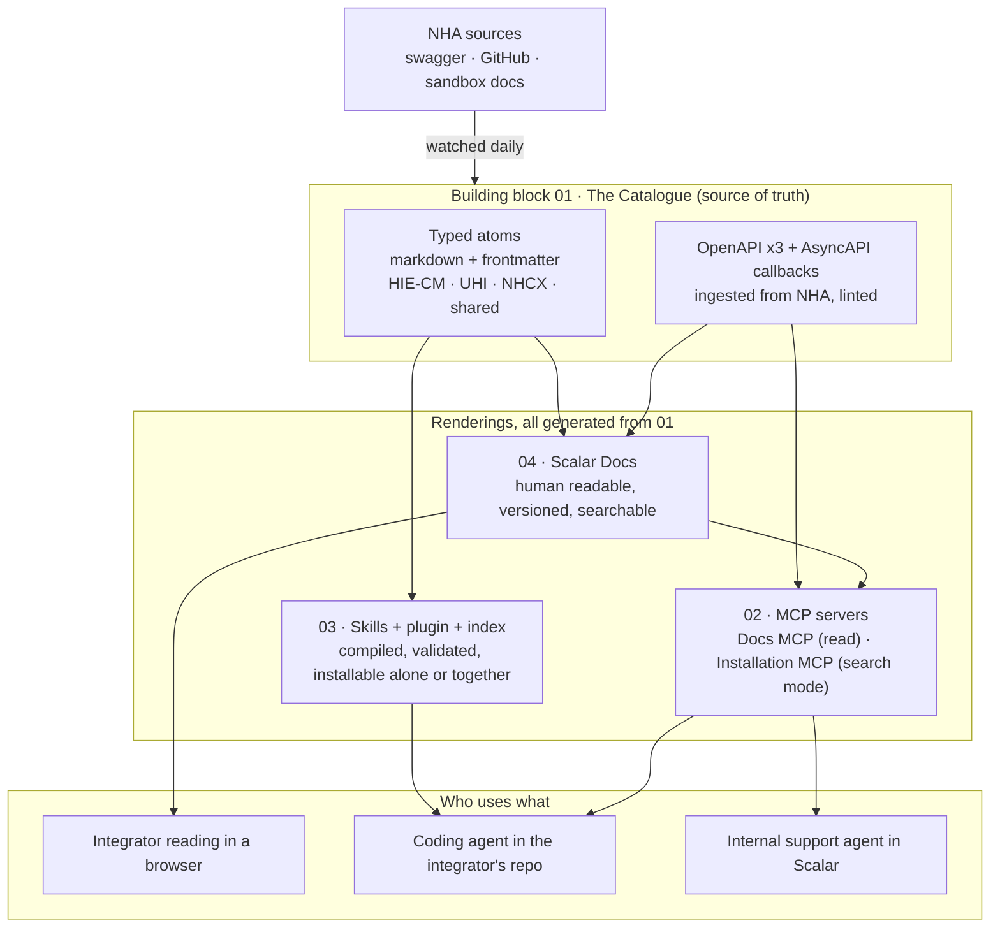
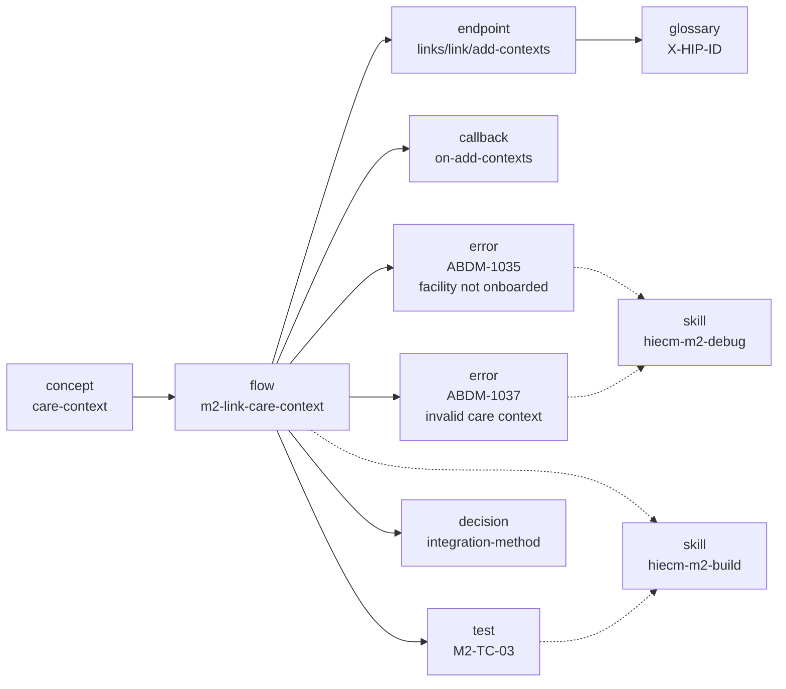
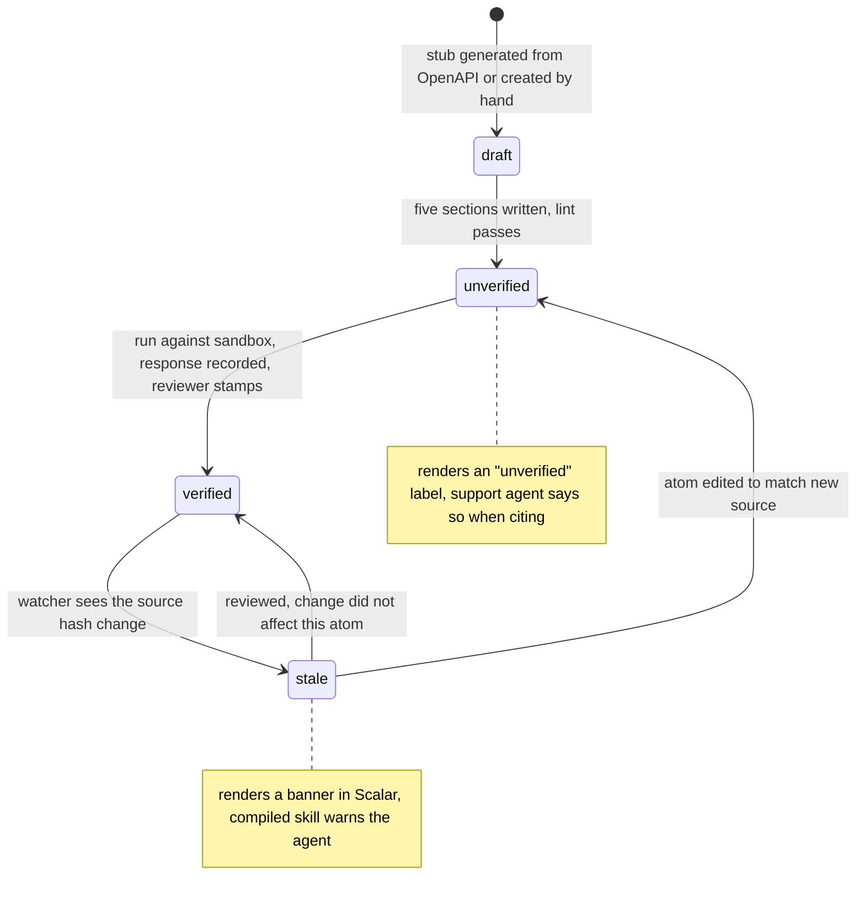
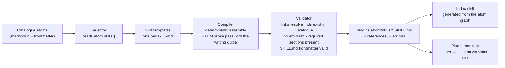
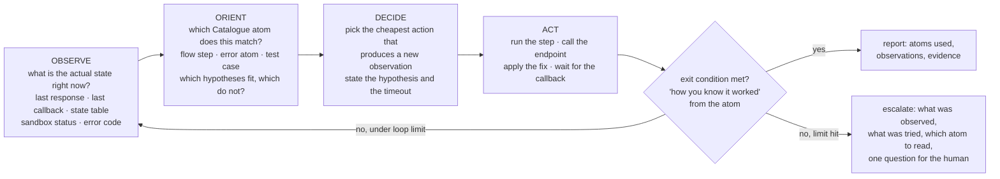
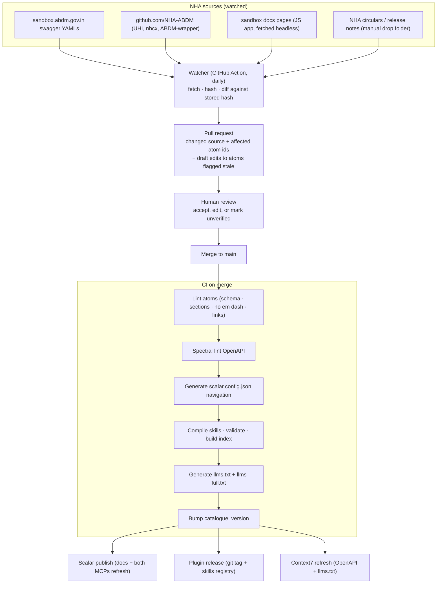
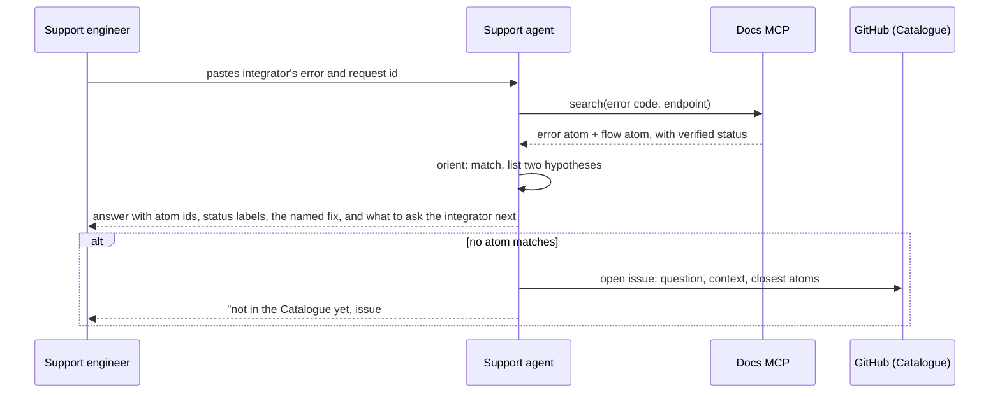
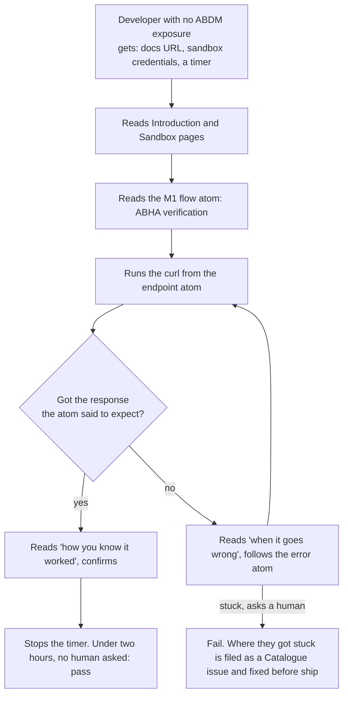

# ABDM Developer Portal, V1 Phase 1: Architecture and Execution Plan

**Bedrock:** "The ABDM Developer Portal, shipped in six weeks" deck (four building blocks, weekly increments)
**Target:** usable V1 in the first week of September 2026 (roughly ten working days from 23 August)
**Functional and strategic owner:** Product · **Technical owner:** Shyamjith
**Status:** Draft v1.0, refineable. No em dashes anywhere in this document or in anything it produces.

---

<a id="p0-summary"></a>
## 0. The one-paragraph version

We are building one knowledge catalogue of India's three health gateways (HIE-CM, UHI, NHCX), written so a first-day developer can follow it and structured so a machine can compile it. Scalar renders the human side and gives us two MCP servers for free. A build pipeline compiles the same catalogue into agent skills, a plugin, and an index, and re-runs whenever NHA changes something. The first consumer of the MCP is an internal support agent inside Scalar. Everything is FOSS and runs without Eka. Eka is the first user, not a dependency.

---

<a id="p1-building-blocks"></a>
## 1. The four building blocks and how they connect

Four things are built. One is the source, three are renderings of it.



| Block | What it is in V1 | Rule that keeps it honest |
|---|---|---|
| 01 Catalogue | NHA's endpoints across three gateways, written as atoms that a first-day developer can read and a compiler can parse (§3) | Nothing downstream is hand-maintained. CI fails if a skill names an endpoint or error the Catalogue does not have. |
| 02 MCP | Two Scalar-generated servers. First consumer is the internal support agent (§6) | Execute mode off by default. |
| 03 Skills | Compiled from atoms. One index skill, per-milestone build/test/debug skills, one plugin bundle. Every skill runs an OODA loop (§4.2) | The compiler may reword, never add facts. |
| 04 Docs | Scalar Docs, structured after developer.eka.care's flow pages | Stale atoms render a banner; unverified ones say so. |

Every two days ends with something an integrator can actually use (§8.2).

<a id="p2-principles"></a>
## 2. Principles (the ones we will be held to)

| # | Principle | How it is enforced, not just stated |
|---|---|---|
| P1 | Cover all three gateways: HIE-CM, UHI, NHCX | Catalogue schema has a mandatory `gateway` field. The index skill refuses to build if any gateway has zero verified atoms. |
| P2 | The documentation is the knowledge base that powers everything | Skills, llms.txt, MCP resources and the support agent are all build outputs of the Catalogue. Nothing is hand-maintained downstream. CI fails if a skill references an endpoint or error code that is not in the Catalogue. |
| P3 | No em dashes anywhere, write like a person | A lint rule in CI blocks any U+2014 character. A writing guide (§3.5) is part of the repo and the skill-compiler prompt. |
| P4 | Human readable and machine readable from one source, not two versions | Typed atoms with frontmatter plus structured blocks inside prose (§3). One file, many renderings. |
| P5 | Fool, idiot and dummy proof | Every atom must carry the five dummy-proof fields (§3.4) or CI rejects it. A "first-day developer" test is part of the definition of done (§9). |
| P6 | FOSS, replicable, no Eka dependency | Catalogue in a public git repo under a neutral licence. Scalar hosted for speed in V1, with Scalar's MIT self-host path documented as the exit. No `eka.care` URL anywhere in the core Catalogue. Eka-specific content, if any, lives in a separate overlay repo. |
| P7 | Update once, everything moves | A source watcher opens a pull request when NHA changes a spec. Merge triggers docs publish, skill recompile, plugin version bump (§5). |

---

<a id="p3-catalogue"></a>
## 3. The Catalogue: one source, many renderings

<a id="p3-1-problem"></a>
### 3.1 The problem we are solving

Humans need narrative, context, warnings and examples. Machines need schemas, identifiers, typed relationships and exact values. Most teams write both and they drift within a month. We will not write both. We will write atoms.

<a id="p3-2-atom"></a>
### 3.2 What an atom is

An atom is one markdown file with YAML frontmatter. The frontmatter is the machine half. The body is the human half. Structured facts inside the body live in fenced blocks with a declared schema so the compiler can lift them out without parsing prose.

```
catalogue/
  hiecm/
    concepts/        consent-artefact.md, care-context.md, hip-hiu-roles.md ...
    flows/           m1-abha-create-aadhaar.md, m2-link-care-context.md ...
    endpoints/       (generated stubs, one per OpenAPI operation, prose added by hand)
    callbacks/       on-fetch-modes.md, hip-data-request.md ...
    errors/          abdm-1035.md, gateway-1401.md ...
    tests/           m1-tc-01.md ... (NHA functional test cases, one atom each)
    decisions/       data-custody.md, integration-method.md ...
  uhi/
    concepts/ flows/ endpoints/ callbacks/ errors/ tests/
  nhcx/
    concepts/ flows/ endpoints/ callbacks/ errors/ tests/
  shared/
    glossary/        abha.md, hfr.md, x-cm-id.md ...
    fhir/            opconsultation.md, prescription.md, diagnosticreport.md ...
    sandbox/         registration.md, credentials.md, callback-url.md ...
  openapi/
    hiecm-v3.yaml    (ingested from NHA, cleaned, linted)
    uhi-v1.yaml
    nhcx-v1.yaml
    callbacks.asyncapi.yaml   (callbacks described as AsyncAPI so Scalar renders them)
```

<a id="p3-3-frontmatter"></a>
### 3.3 The frontmatter schema (mandatory fields)

```yaml
id: hiecm.flow.m2-link-care-context      # stable, never reused
type: flow                               # concept | flow | endpoint | callback | error | test | decision | glossary | fhir | sandbox
gateway: hiecm                           # hiecm | uhi | nhcx | shared
milestone: M2                            # M1 | M2 | M3 | M4 | n/a
version: abdm-v3                         # the NHA spec version this is true for
title: Link a care context to a patient's ABHA
summary: >                               # one sentence a new developer understands
  Tell ABDM that this patient had a visit at your facility so their records can be found later.
sources:                                 # where this came from, always at least one
  - url: https://sandbox.abdm.gov.in/swagger/ndhm-hip.yaml
    fetched: 2026-08-24
    hash: sha256:...
verified:
  status: verified                       # verified | unverified | stale
  against: sandbox                       # sandbox | prod | docs-only
  on: 2026-08-25
  by: shyamjith
related:
  endpoints: [hiecm.endpoint.links-link-add-contexts]
  callbacks: [hiecm.callback.on-add-contexts]
  errors: [hiecm.error.abdm-1035, hiecm.error.abdm-1037]
  tests: [hiecm.test.m2-tc-03]
  concepts: [hiecm.concept.care-context]
skills:                                  # which compiled skills consume this atom
  - hiecm-m2-build
  - hiecm-m2-test
```

The `related` map is what turns the Catalogue into a graph. The index skill is generated by walking it.

<a id="p3-4-dummy-proof"></a>
### 3.4 The five dummy-proof fields (every atom, no exceptions)

Inside the body, five headings are required. The compiler checks for them. A reviewer checks they are honest.

1. **In plain words.** What this is, for someone who has never heard of ABDM. No acronyms without a glossary link.
2. **Before you start.** What must already be true. Credentials, registrations, a previous step. Each item links to the atom that gets you there.
3. **What happens.** The sequence, with who calls whom. Flows get a mermaid sequence diagram. Endpoints get a working curl with every placeholder named like `<YOUR_CLIENT_ID>`.
4. **How you know it worked.** The exact response, callback or state change to look for. Not "success" but "you receive a callback at `/on-add-contexts` with `status: SUCCESS` within 60 seconds."
5. **When it goes wrong.** The three to five most common failures, each linking to an error atom that names the fix.

<a id="p3-5-writing-guide"></a>
### 3.5 Writing guide (short, binding)

- Short sentences. One idea per sentence.
- Say "you" and "your system." Say "NHA's gateway," not "the platform."
- Explain the why once, then get to the how.
- No em dashes. Use a full stop, a comma, or a colon.
- No "simply," "just," "obviously." If it were simple they would not be reading.
- Every acronym links to the glossary on first use in every atom.
- Every code sample runs against sandbox as written, once placeholders are filled.
- When we are not sure, we say "unverified" in the frontmatter and in the prose. Never guess.

<a id="p3-6-scalar"></a>
### 3.6 How Scalar renders it

Scalar Docs reads markdown and MDX and renders OpenAPI into interactive references. The Catalogue is the Scalar project. `scalar.config.json` navigation is **generated** from atom frontmatter, grouped gateway, then milestone, then type, mirroring developer.eka.care's "flows" structure that integrators already find readable. Endpoint atoms embed the OpenAPI operation; prose around it is the atom body. Callbacks render from the AsyncAPI file. Scalar Versions handle `abdm-v3` versus any later spec.

What we get from Scalar without building it: search, Ask AI over the docs, a Docs MCP at `docs-domain/mcp`, an Installation MCP from the OpenAPI files, preview deployments per pull request, GitHub sync, Spectral linting of the OpenAPI files in CI, a mock server from the OpenAPI (`scalar mock`) that lets a developer hit fake NHA endpoints before they have sandbox credentials.

What Scalar does not do for us: author long guides (that is the atom bodies), compile skills (§4), watch NHA for changes (§5), enforce our lint rules (§6).


<a id="p3-7-graph"></a>
### 3.7 What the Catalogue looks like as a graph

The `related` map turns files into a graph. This is what the index skill walks and what the support agent cites. A small slice for M2:



<a id="p3-8-atom-life"></a>
### 3.8 The life of an atom




---

<a id="p4-skills"></a>
## 4. Skills, plugin and index: compiled, not written

<a id="p4-1-model"></a>
### 4.1 The model

The existing `abdm-connect` plugin is the structural template: a `plugins/<name>/` directory with `skills/`, `agents/`, `commands/`, and a manifest. We keep the shape and change the content source. Every skill is a build output of the Catalogue.



The LLM prose pass exists because deterministic assembly produces stilted text. It is constrained: it may reword, it may not add facts. The validator diffs every identifier, URL, header name and status code in the output against the Catalogue. Anything new fails the build.


<a id="p4-2-ooda"></a>
### 4.2 Every skill runs an OODA loop

Integration against NHA is asynchronous, the sandbox is flaky, and the counterparty you need (a PHR app, a live HIP) is often not there. A skill that reads like a recipe fails the first time the sandbox returns something the recipe did not expect. So every build, test and debug skill is written as a loop, not a list. The loop is Boyd's OODA: observe, orient, decide, act, and back to observe. Speed through the loop matters more than perfection in any one pass.



What each phase reads from the Catalogue, and what it writes:

| Phase | Reads | Writes | Time box |
|---|---|---|---|
| Observe | Nothing from the Catalogue. Only live facts: responses, callbacks, state, logs. The skill is forbidden from assuming the previous step worked. | An observation record: timestamp, request id, what came back. | The atom's "how you know it worked" wait time, for example 60 seconds for a callback. |
| Orient | The atom graph. Match the observation to a flow step, an error atom, or a test case. List at least two hypotheses when the match is not exact. | A short orientation note: "matches `hiecm.error.abdm-1035`, facility not onboarded; alternative: wrong `X-HIP-ID`." | One pass. No re-reading the whole Catalogue. |
| Decide | The matched atom's "when it goes wrong" and "before you start" sections. | A decision with a hypothesis, the observation that will confirm it, and a fallback. Reversible actions first. | Immediate. Seventy percent confidence now beats certainty after the sandbox session expires. |
| Act | The atom's curl, script or fix. | The action and its raw result, appended to the loop log. | The action's own timeout. |

Three rules make the loop dummy proof rather than merely iterative:

1. **Exit conditions come from the atom, not the agent.** A skill is done when the matched atom's "how you know it worked" is observed. It is never done because the agent feels finished.
2. **Loop limits are explicit.** Build skills allow eight loops per step, test skills allow three per test case, debug skills allow five per error. Hitting the limit is an escalation, and the escalation must name the observation, the hypotheses tried, and the one atom the human should read.
3. **Pre-planned responses skip Decide.** For error atoms with a single known fix (reused REQUEST-ID, missing X-CM-ID, clock skew), the skill goes Observe, Orient, Act. The Catalogue marks these atoms `fix.deterministic: true` and the compiler emits them as direct actions.

The skill kinds differ only in where they start and what counts as exit:

| Skill kind | Starts by observing | Exit condition | Typical loops |
|---|---|---|---|
| build | the repo: what exists, which credentials are configured, which steps are already done | every flow step's "how you know it worked" observed once against sandbox | one per flow step |
| test | the test atom's preconditions | every NHA test case in the milestone passes or is marked "needs human" with the reason | one per test case |
| debug | the error, the last request id, the state table | the error atom's fix applied and the original step's exit condition observed | one per hypothesis |

Parallel loops are allowed where steps are independent (FHIR bundles per hi_type, test cases without shared state). The index skill says which steps are independent; everything else runs one loop at a time because the state it depends on (token, hip id, patient id, consent id) is shared.


<a id="p4-3-skill-set"></a>
### 4.3 The skill set for V1

Each milestone has three independently installable skills, because an integrator debugging M2 on a Tuesday should not have to load M1 build instructions.

| Skill | Kind | Atoms it draws from | Installs alone? |
|---|---|---|---|
| `abdm-index` | router | whole graph | yes, and it is the recommended first install |
| `abdm-overview` | orient | shared concepts, milestones, which-do-I-need table | yes |
| `abdm-sandbox` | orient | sandbox registration, credentials, callback URL, test ABHAs | yes |
| `hiecm-m1-build` / `-test` / `-debug` | build, test, debug | M1 flows, endpoints, callbacks, tests, errors | yes, each |
| `hiecm-m2-build` / `-test` / `-debug` | same | M2 incl. discovery, on-fetch, ECDH | yes, each |
| `hiecm-m3-build` / `-test` / `-debug` | same | M3 incl. consent lifecycle, keysets, decryption | yes, each |
| `hiecm-m4-build` / `-test` / `-debug` | same | HPR, HFR, bridge linkage | yes, each |
| `fhir-bundles` | build | shared FHIR atoms per hi_type, NRCeS validator | yes |
| `uhi-build` / `-test` / `-debug` | same | UHI flows (search, select, init, confirm, status and their on_ callbacks) | yes, each |
| `nhcx-build` / `-test` / `-debug` | same | NHCX flows (coverage eligibility, preauth, claim, communication, payment notice) | yes, each |
| `abdm-errors` | debug | every error atom across gateways | yes |
| `abdm-plugin` | bundle | all of the above | the whole thing in one install |

`build` skills scaffold code and say exactly which atoms they used. All three kinds run the loop in §4.2. `test` skills drive the NHA functional test cases as runnable steps and mark which need a human (OTP). `debug` skills take an error or a stuck state and walk the error atoms to a named fix.

<a id="p4-4-index"></a>
### 4.4 The index skill

`abdm-index` is generated, not written. It lists every skill, every agent and every tool with a one-line trigger description, and a decision tree: "What are you building?" leads to "Which gateway?" leads to "Which milestone?" leads to "Build, test or debug?" It is the only skill that needs to be loaded for an agent to know what else exists. It also carries `catalogue_version`, so an agent can tell the developer "your skills are from catalogue 2026.08.30, the docs are at 2026.09.02, run update."

<a id="p4-5-accumulation"></a>
### 4.5 Agent and tool accumulation

Agents (sub-agent definitions) and tools (scripts under `skills/*/scripts/`) accumulate in the same plugin. V1 ships: a `fhir-validate` script wrapping the NRCeS validator, a `callback-tunnel` script that sets up a public URL for sandbox callbacks, a `request-id` helper, and an `error-decode` script that reads a response and prints the matching error atom. Each is registered in the index.

---

<a id="p5-update-pipeline"></a>
## 5. The update pipeline (the "RAG that updates skills")

Two different things hide behind the word RAG. We separate them.

**Retrieval at question time.** Scalar's Docs MCP and Ask AI do this over the published docs. Our support agent uses the same MCP. No custom vector store in V1.

**Regeneration at change time.** This is the pipeline that makes skills follow the docs. It is not retrieval; it is a build.



Rules that make this dummy proof:

- A source change never edits a verified atom silently. It flips `verified.status` to `stale` and opens a PR. Stale atoms render with a visible banner in Scalar and the compiled skill says "this step may have changed, check the docs."
- Every skill and every page carries the `catalogue_version` and the source hashes it was built from.
- The watcher cannot merge. A person does.

---

<a id="p6-mcp"></a>
## 6. MCP in V1 and the internal support agent

<a id="p6-1-surfaces"></a>
### 6.1 What we stand up

| MCP | Where it comes from | What it exposes | Auth | Use in V1 |
|---|---|---|---|---|
| Docs MCP | Scalar, automatic, `docs-domain/mcp` | search and read the published Catalogue | public, rate limited by Scalar | internal support agent; any external agent that wants the docs |
| Installation MCP | Scalar, from the three OpenAPI files | every NHA operation as a tool, **search mode only** by default | Scalar personal token; passthrough auth when execute mode is enabled per installation | agents generating correct requests; sandbox execution for trusted testers only |
| Harness MCP | custom, Phase 2 | ledger, gate, evidence (per v0.2 architecture) | n/a | not in V1 |

Execute mode is off by default because an MCP that can call the NHA sandbox with a shared credential is a footgun. When enabled, it uses passthrough so each caller brings their own sandbox credentials.

<a id="p6-2-support-agent"></a>
### 6.2 The internal support agent

First consumer of the MCP. Lives in Scalar's Ask AI surface and, through the Docs MCP, in a Slack or Claude-based agent for the Eka support team. It answers integrator questions strictly from the Catalogue, cites the atom id, and says "unverified" when the atom says so. When it cannot answer, it opens a GitHub issue against the Catalogue with the question, which is how gaps get found. Paste an error, get the error atom and its fix.

The support agent runs the same loop as the skills, with a human in the Act phase:




---

<a id="p7-coverage"></a>
## 7. Gateway coverage in V1 (honest scope)

Three gateways in ten days cannot all be dummy proof. We will be explicit about depth per gateway on the landing page, in the index skill, and in frontmatter.

| Gateway | V1 target depth | What "done" means |
|---|---|---|
| HIE-CM (ABDM V3) | **Dummy proof** for M1, M2, M3. M4 at concept plus endpoint level. | All five dummy-proof sections on every M1 to M3 atom. Every endpoint curl verified against sandbox. Every NHA functional test case is an atom. All nine skills compile and pass validation. First-day developer test passes for M1 (§9). |
| UHI | **Structurally complete, reference depth** | OpenAPI ingested and rendered. Concepts (EUA, HSP, gateway, registry, Beckn verbs) written. Each flow atom has sections 1 to 3. Sections 4 and 5 marked unverified where we have not run them. `uhi-*` skills compile but are labelled reference depth in the index. |
| NHCX | **Structurally complete, reference depth** | Same as UHI. FHIR claim bundle atoms reuse the shared FHIR atoms. |

This is a deliberate choice. A half-verified UHI page that says "unverified" is useful. A confident wrong one is harmful.

---

<a id="p8-schedule"></a>
## 8. Execution plan: 23 August to 5 September

Five workstreams, two owners, two-day increments. Functional and strategic work (Product) runs in front of technical work (Shyamjith) by about two days on every stream.

```mermaid
gantt
    dateFormat  YYYY-MM-DD
    axisFormat  %d %b
    section Catalogue
    Atom schema, writing guide, lint rules      :a1, 2026-08-24, 2d
    Ingest NHA OpenAPI x3, callbacks AsyncAPI    :a2, 2026-08-25, 2d
    HIE-CM M1 atoms (all types)                  :a3, 2026-08-26, 2d
    HIE-CM M2 + M3 atoms                         :a4, 2026-08-28, 3d
    HIE-CM M4, shared FHIR, glossary, sandbox    :a5, 2026-08-31, 2d
    UHI + NHCX concepts, flows (ref depth)       :a6, 2026-09-01, 2d
    section Scalar
    Project, config generator, theme, domain     :b1, 2026-08-25, 2d
    Nav generation from frontmatter, versions    :b2, 2026-08-27, 1d
    Docs MCP + Installation MCP (search mode)    :b3, 2026-08-28, 1d
    Preview deploys, publish pipeline            :b4, 2026-08-29, 1d
    section Skills
    Compiler, templates, validator               :c1, 2026-08-27, 3d
    Index generator, plugin manifest             :c2, 2026-08-30, 1d
    Compile M1 set, iterate with Catalogue       :c3, 2026-08-31, 2d
    Compile full set, per-skill install test     :c4, 2026-09-02, 2d
    section Pipeline
    Watcher, hash store, PR bot                  :d1, 2026-08-29, 2d
    CI: lint, spectral, compile, publish         :d2, 2026-08-31, 2d
    llms.txt, Context7 publish                   :d3, 2026-09-02, 1d
    section Proof
    Support agent on Docs MCP                    :e1, 2026-09-01, 2d
    First-day developer test (M1)                :e2, 2026-09-03, 1d
    Eval set, score, fix               :e3, 2026-09-03, 2d
    Ship V1                                      :milestone, 2026-09-05, 0d
```

<a id="p8-1-owners"></a>
### 8.1 Who does what

| Stream | Product (functional, strategic) | Shyamjith (technical) |
|---|---|---|
| Catalogue | Atom schema decisions, writing guide, every atom body's five sections, review every PR for dummy-proofness, glossary | OpenAPI ingestion and cleanup, AsyncAPI for callbacks, endpoint atom stubs, sandbox verification runs, `verified` stamps |
| Scalar | Information architecture mirroring developer.eka.care flows, theme, landing page copy, depth labels | Project setup, config generator, MCP setup, domains, self-host evaluation note |
| Skills | Skill templates' prose, index decision tree, trigger descriptions, what each skill must refuse to guess | Compiler, validator, plugin manifest, per-agent adapters (Claude Code first, Cursor and Copilot by manifest) |
| Pipeline | Source inventory (which NHA URLs, which repos, who owns the manual drop folder), review rota | Watcher, PR bot, CI, publishers |
| Proof | Recruit the first-day developer, run the test, write up gaps | Wire the support agent, run the eval set, fix |

<a id="p8-2-increments"></a>
### 8.2 Two-day increments (what an integrator can use at each checkpoint)

| By end of | An integrator can |
|---|---|
| 26 Aug | Open a Scalar site with NHA's three OpenAPI references rendered and searchable, with the sandbox registration guide. |
| 28 Aug | Read dummy-proof M1 pages, run the M1 curls against sandbox, ask the Docs MCP questions. |
| 30 Aug | Install `abdm-index` and `hiecm-m1-*` skills into Claude Code and scaffold M1. |
| 2 Sep | Read M2 and M3 at the same depth, install the full plugin, see UHI and NHCX references with honest depth labels. |
| 5 Sep | Use the whole thing, file a gap from the support agent, and see that a source change to NHA's swagger opens a PR. |

---

<a id="p9-done"></a>
## 9. Definition of done for V1

Every item is checkable. None is a judgement call.

1. Catalogue lint passes on main: schema valid, five sections present, no em dash, all `related` ids resolve, all sources have hashes.
2. Every HIE-CM M1 to M3 endpoint atom has a curl that was run against sandbox on or after 28 August and the response recorded in the atom.
3. Every NHA functional test case for M1 to M3 exists as a test atom and is referenced by a `-test` skill.
4. All skills compile, validate, and install individually with the skills CLI into Claude Code; the plugin installs as one unit.
5. `abdm-index` is generated from the graph and lists every skill, agent and tool.
6. Scalar site live on a custom domain, with versions, search, Ask AI, Docs MCP and Installation MCP in search mode.
7. The watcher has opened at least one real PR from a real NHA source change (or a staged one if NHA is quiet that week).
8. The support agent answered the six eval tasks (§9.1) from the Catalogue, citing atom ids, with the score recorded.
9. **First-day developer test:** a developer with no ABDM exposure, given only the docs URL and sandbox credentials, reaches a successful M1 ABHA verification sandbox call in under two hours without asking a human. Where they got stuck is filed as Catalogue issues.
10. UHI and NHCX landing pages, index entries and skill descriptions state "reference depth" and every unverified atom renders the banner.
11. Public repo, neutral licence, `CONTRIBUTING.md`, `SECURITY.md`, `GOVERNANCE.md`, and no `eka.care` reference in the core Catalogue.

<a id="p9-1-evals"></a>
### 9.1 The six eval tasks

Each is run by an agent using only the plugin and the MCP, scored pass or fail on the exit condition from the relevant atom, and re-run on every Catalogue change.

| # | Task | Exit condition observed |
|---|---|---|
| 1 | Scaffold an ABHA verification flow from an empty repo | sandbox returns a verified ABHA profile |
| 2 | Build and validate an OPConsultation bundle | NRCeS validator passes |
| 3 | Link a care context and push encrypted data | `on-add-contexts` callback with SUCCESS, then a data push acknowledged |
| 4 | Raise an HIU consent request and fetch records | consent artefact received, bundle decrypted and valid |
| 5 | Diagnose a failing HIP data push from its error | correct error atom cited, fix applied, original push succeeds |
| 6 | Walk the M1 to M3 test cases to completion | every test atom passed or marked "needs human" with reason |

<a id="p9-2-firstday"></a>
### 9.2 The first-day developer test, as a flow




---

<a id="p10-risks"></a>
## 10. Risks and the decision each one needs

| Risk | Mitigation | Decision needed |
|---|---|---|
| NHA swagger YAMLs are inconsistent or incomplete (known 403s on some V3 endpoints in sandbox) | Ingest, then hand-correct with `sources` recording both the NHA file and our correction; mark the endpoint unverified until sandbox confirms | Accept that some endpoints ship unverified in V1 |
| Scalar's guide authoring is less mature than its reference rendering | Keep prose in plain markdown, avoid MDX beyond callouts and steps, so it ports anywhere | Accept Scalar hosted for V1, self-host review in Phase 2 |
| abdm-docs.pages.dev overlaps heavily | Reach out to OHCN before 26 August; propose the Catalogue as the shared upstream | Product to make the call and the call |
| Ten days is not enough for three gateways at full depth | §7 depth labels, honest and visible | Already decided in this document, needs sign-off |
| LLM prose pass invents facts | Validator diffs every identifier against the Catalogue; any new token fails | None, it is a hard rule |
| Scalar Docs MCP is public and rate limited | Fine for V1; support agent volume is low | Revisit if external agents hammer it |
| Sandbox credentials take three to four days | Apply on 24 August, in parallel with schema work | Shyamjith applies today |

---

<a id="p11-not-in-v1"></a>
## 11. What is explicitly not in V1

- The conformance harness, ledger, gate and simulators from architecture v0.2. They are Phase 2 and depend on this Catalogue.
- Execute-mode MCP for the public.
- Any Eka-specific overlay (ABDM Connect endpoints, `X-Hip-Id`, `OHPL_001`). That becomes a separate overlay repo that depends on the Catalogue, built after V1.
- Multi-agent orchestration. The index skill routes; a single agent executes.
- Generated SDKs. Scalar can do this from the OpenAPI later; not needed to prove the model.

---

<a id="p12-sources"></a>
## 12. Sources consulted for this plan

- The Phase 1 deck
- developer.eka.care ABDM Connect flow pages (information architecture reference)
- abdm-docs.pages.dev (OHCN community docs; already covers ABDM V3, UHI, NHCX; serves `.md` per page and `llms.txt`)
- Scalar product docs: Docs, Agent and MCP (Docs MCP versus Installation MCP, search versus execute, passthrough auth), Registry, CLI mock server, AsyncAPI support in API Reference 1.57, Enterprise self-host note
- NHA sources: sandbox.abdm.gov.in swagger YAMLs, github.com/NHA-ABDM (UHI, nhcx, ABDM-wrapper), sandbox documentation, functional test case templates
- Agent Skills specification (agentskills.io) for SKILL.md format and per-skill install
- Inkeep's docs-to-skills build pattern (frontmatter tagging, build-time extraction, GitHub Action publish to a dedicated repo)
- Eka `abdm-connect` plugin (structural template for the plugin layout)
