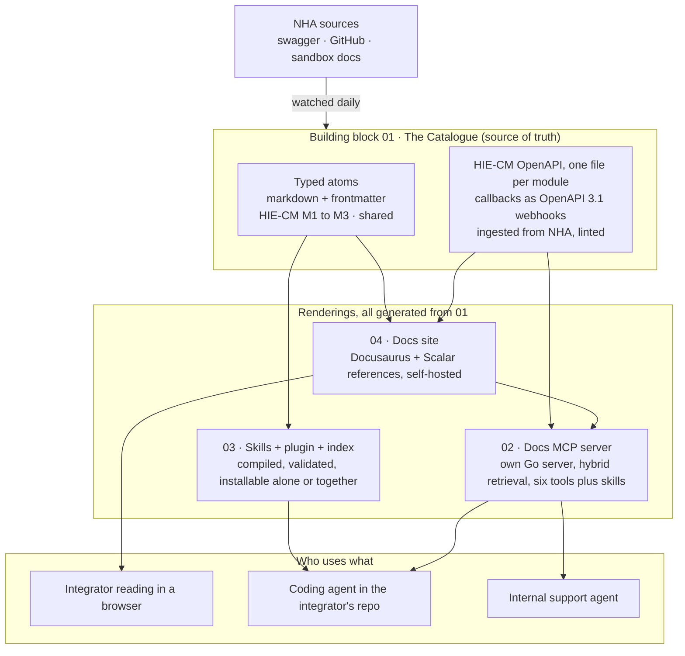
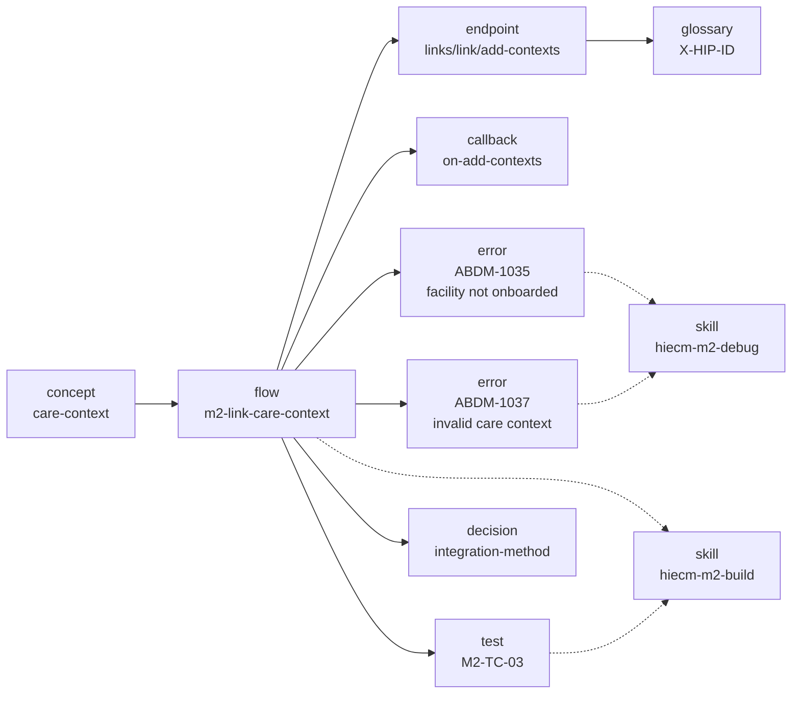
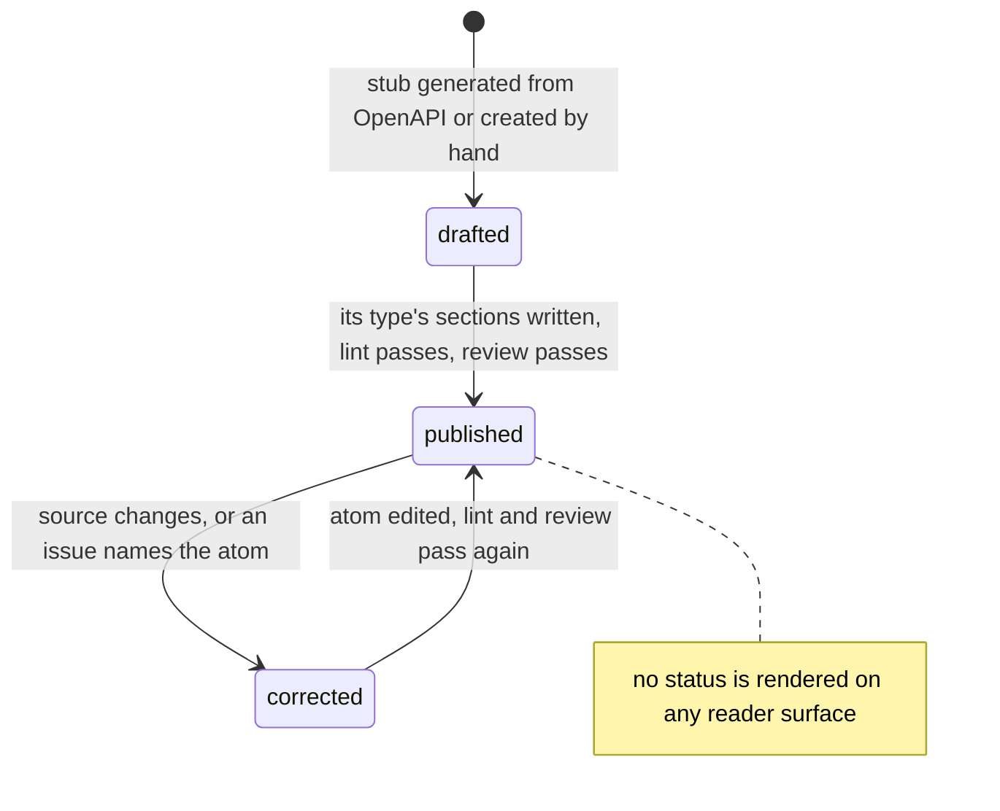
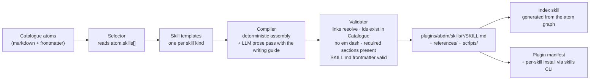
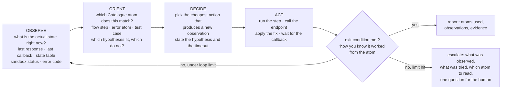
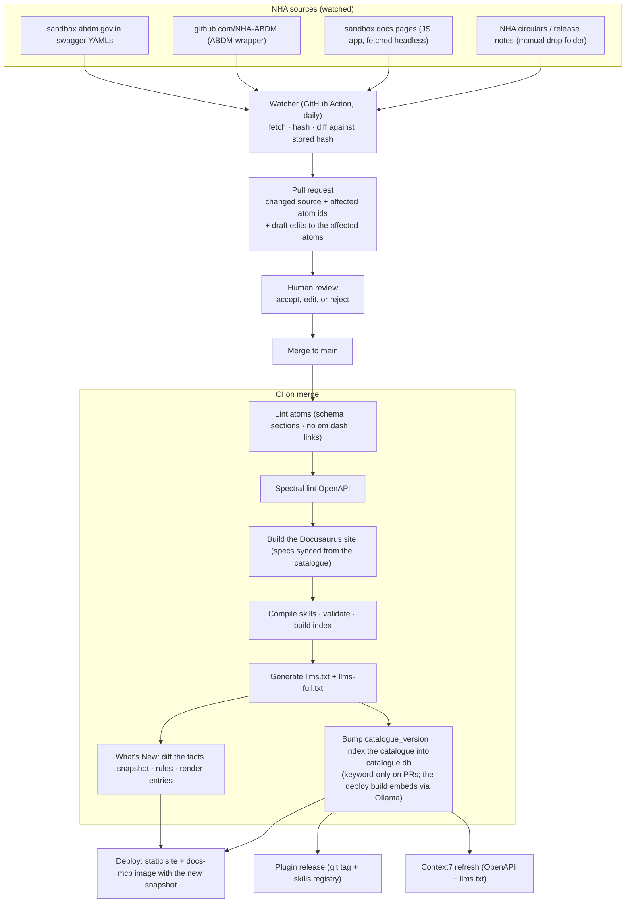
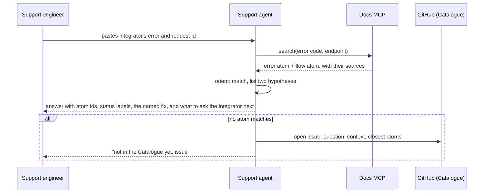
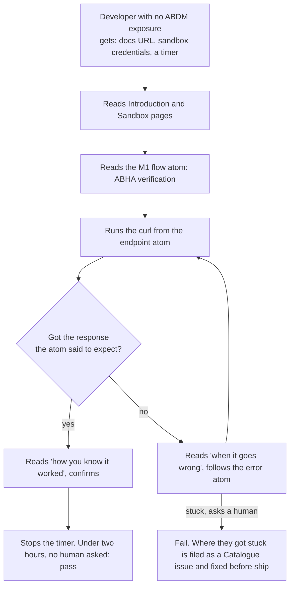

# ABDM Developer Portal, V1 Phase 1: Architecture and Execution Plan

**Bedrock:** "The ABDM Developer Portal, shipped in six weeks" deck (four building blocks, weekly increments)
**Target:** usable V1 in the first week of September 2026 (roughly ten working days from 23 August)
**Functional and strategic owner:** Product · **Technical owner:** Shyamjith
**Implementation:** `github.com/nha-in/docs`, MIT, published to GitHub Pages. This plan is reconciled against that repository, not against intent.
**Status:** Draft v1.0, refineable. No em dashes anywhere in this document or in anything it produces.

---

<a id="p0-summary"></a>
## 0. The one-paragraph version

We are building one knowledge catalogue of India's health gateways, scoped in phases: HIE-CM carries specifications and generated reference pages for the gateway, M1 to M4, P1 to P4 and the three use cases, Scan and Register, Record Share and Scan and Pay, UHI carries specifications and generated reference pages for its network, Physical Consultation and Ambulance Booking modules, NHCX carries specifications and pages, and atoms cover HIE-CM M1 to M4 and P1 to P3 plus the shared material that belongs to no single gateway (§7). Every gateway is open to atoms; which ones have them is a question of what the schedule reached. It is written so a first-day developer can follow it and structured so a machine can compile it. A self-hosted Docusaurus site with Scalar's open source reference component renders the human side; our own Go MCP server with hybrid retrieval serves the machine side. A build pipeline compiles the same catalogue into agent skills, a plugin, an index and the MCP's snapshot, and re-runs whenever NHA changes something. The first consumers of the MCP are integrators' coding agents and the site's search box. Everything is FOSS, self-hosted, and runs without Eka. Eka is the first user, not a dependency.

---

<a id="p1-building-blocks"></a>
## 1. The four building blocks and how they connect

Four things are built. One is the source, three are renderings of it.



| Block | What it is in V1 | Rule that keeps it honest |
|---|---|---|
| 01 Catalogue | NHA's HIE-CM M1 to M3 endpoints, written as atoms that a first-day developer can read and a compiler can parse (§3) | Nothing downstream is hand-maintained. CI fails if a skill names an endpoint or error the Catalogue does not have. |
| 02 MCP | Our own Go Docs MCP server: six read tools over one indexed snapshot of the Catalogue, hybrid keyword plus semantic retrieval (§6) | Retrieval only. Nothing executes against NHA. Every response carries the catalogue version. |
| 03 Skills | Compiled from atoms. One index skill, per-milestone build/test/debug skills, one plugin bundle. Every skill runs an OODA loop (§4.2) | The compiler may reword, never add facts. |
| 04 Docs | Docusaurus site with self-hosted Scalar API references, structured after developer.eka.care's flow pages | No page carries a status label. The watcher that would notice a changed source is designed and not built (§5). |

Every two days ends with something an integrator can actually use (§8.2).

<a id="p2-principles"></a>
## 2. Principles (the ones we will be held to)

| # | Principle | How it is enforced, not just stated |
|---|---|---|
| P1 | Scope is phased and declared, never implied, and what exists is declared separately from what is merely specified: HIE-CM M1 to M4 and P1 to P3 carry atoms now, and PHR application services, UHI and NHCX carry specifications or pages without atoms (§7) | Catalogue schema keeps the mandatory `gateway` field, and that is the whole of P1's mechanised enforcement today. Phasing itself is not mechanised. A coverage gate refusing to build when a Phase 1 milestone has zero atoms is wanted and is not implemented: nothing in `scripts/` or `.github/` checks coverage, so P1 rests on review rather than on CI. No gateway is refused by lint. Which gateways carry atoms is a scheduling fact, stated in §7 rather than enforced by a linter. |
| P2 | The documentation is the knowledge base that powers everything | Skills, llms.txt, MCP resources and the support agent are all build outputs of the Catalogue. Nothing is hand-maintained downstream. CI fails if a skill cites an atom id the Catalogue does not define, or a curl target recorded on no atom, in `scripts/validate-skills.mjs`. It does not yet check every error code a skill names. |
| P3 | No em dashes anywhere, write like a person | A lint rule in CI blocks any U+2014 character. A writing guide (§3.5) is part of the repo and the skill-compiler prompt. |
| P4 | Human readable and machine readable from one source, not two versions | Typed atoms with frontmatter plus structured blocks inside prose (§3). One file, many renderings. |
| P5 | Fool, idiot and dummy proof | Every atom must carry the dummy-proof sections its type requires (§3.4) or CI rejects it. A "first-day developer" test is part of the definition of done (§9). |
| P6 | FOSS, replicable, no Eka dependency, no vendor cloud | Catalogue in a public git repo under a neutral licence, copyright NHA. Everything self-hosted from day one: Docusaurus with the MIT Scalar packages vendored (no CDN, no Scalar cloud services, telemetry off), our own Go MCP server, embeddings from a self-hosted Ollama sidecar. The handover unit is one compose file. No `eka.care` URL anywhere in the core Catalogue. Eka-specific content, if any, lives in a separate overlay repo. |
| P7 | Update once, everything moves | Designed, not built. A source watcher is to open a pull request when NHA changes a spec, and merge is to trigger docs publish, skill recompile and plugin version bump. `scripts/check-source-freshness.mjs` runs in CI today and fails on a changed raw hash, which is the detection half; the pull request half does not exist yet (§5). |

---

<a id="p3-catalogue"></a>
## 3. The Catalogue: one source, many renderings

<a id="p3-1-problem"></a>
### 3.1 The problem we are solving

Humans need narrative, context, warnings and examples. Machines need schemas, identifiers, typed relationships and exact values. Most teams write both and they drift within a month. We will not write both. We will write atoms.

<a id="p3-2-atom"></a>
### 3.2 What an atom is

An atom is one markdown file with YAML frontmatter. The frontmatter is the machine half. The body is the human half. Structured facts inside the body live in fenced blocks with a declared schema so the compiler can lift them out without parsing prose.

Every fact is written once, and more and more that one place is a docs page. An atom's words live in one of two places, never both:

- **A hand-written file** under `catalogue/<gateway>/<type folder>/`, as every atom was until 28 September 2026.
- **A page section.** Each gateway's content map, `catalogue/<gateway>/map/*.yaml`, is its part of the atom registry, one file per batch so batches do not collide, and an id defined in two of them fails `check:sections`. The registry maps an atom id to a page and an explicit heading id, `### Link token {#link-token}` in a `.md` page and `### Link token {/* #link-token */}` in an `.mdx` page, because MDX reads `{#id}` as an expression. The section's visible text is the atom's `In plain words`. Rules written only for agents sit in `<AgentOnly>` on the same page, hidden from readers and from site search until a footer link or `?agent-notes=1` shows them, but present in the page's `.md` copy and llms-full.txt. An endpoint, callback or error atom has no hand-written page to sit on, because API pages are generated, so its section lives in a hand-written notes partial: `site/docs/_notes/<gateway>/<operationId>.mdx` renders on that operation's generated API page, and `site/docs/_notes/<gateway>/errors/<module>.mdx` on the module's error page. A partial holds only sections with explicit heading ids, and `lint:content` holds it to the page rules as hard errors. `scripts/build-sections.mjs` writes the atom file into the same `catalogue/<gateway>/<type folder>/` a hand-written atom sits in, marked `generated: true`, and `catalogue/registry.json`, which lists every atom and where its words live. Both are build outputs: a file marked `generated: true` holds the section's words and metadata and is never edited, and the build deletes or overwrites only files carrying that mark.

Content moves onto pages one class at a time, and a class is never in two places. Whatever has moved is edited on its page, whatever has not keeps its file, and the repository is coherent if the migration stops at any commit. The link token glossary term moved first. HIE-CM went further on 29 September 2026: 227 of the 256 atoms the 16 September source reset deleted came back as page sections and notes partials, a class the migration list had no row for because it only moved atoms that still existed. NHCX classes wait for a decision on the NHCX source (§10), and NHA's corrections are applied to pages by the runbook in `docs/runbook-nha-corrections.md`.

HIE-CM and UHI each own one folder holding everything they have, so a reader finds a gateway's specifications, sources, content map and atoms in one place. `npm run lint:atoms` fails on any name outside this tree and on any atom not at `catalogue/<gateway>/<type folder>/<id slug>.md`. A folder exists when it holds a file; each gateway's `README.md` lists the whole shape.

```
catalogue/
  README.md            the map of this tree
  VERSION              the catalogue version stamp
  hiecm/
    map/               content map: atom id to page and heading id, no prose
    openapi/
      v3/              twelve specifications, one self-contained file per module:
                       the gateway, M1 to M4, P1 to P4, Scan and Register, Record
                       Share, Scan and Pay. Callbacks live inside the module file
                       that owns them, as OpenAPI 3.1 webhooks. Eleven are
                       generated by scripts/ingest-nha.mjs from NHA's sets of 16,
                       22 and 24 September 2026, Record Share from NHA's document
                       of 21 September. journeys/<module>.yaml holds the call
                       order each module's reference and compiled skill follow;
                       errors/<module>.yaml the codes each module returns
      corrections/     recorded patches to upstream files, never silent fixes
      .raw/            upstream NHA files, stored untouched
    titles.yaml        HIE-CM reference page title overrides, by operationId
    postman.json       the published Postman collection ids
    concepts/ flows/ endpoints/ callbacks/ errors/ glossary/ tests/ decisions/ troubleshooting/
                       atom files: the 20 design rules in concepts/ are
                       hand-written; every other HIE-CM atom is written from its
                       page section or notes partial and marked generated: true
  nhcx/
    concepts/ flows/ endpoints/ callbacks/ errors/ tests/ decisions/ troubleshooting/
    glossary/ fhir/ sandbox/
                       hand-written atoms, not yet moved onto pages
  uhi/
    openapi/v1/        three specifications, generated by scripts/ingest-uhi.mjs
                       from NHA's UHI set of 28 September 2026, with journeys/,
                       and corrections/ and .raw/ beside v1/
    glossary/          EUA and HSPA, UHI's only atoms
  shared/
    vocabulary.yaml
    concepts/ decisions/ glossary/ fhir/ sandbox/
                       atoms that belong to no single gateway. A glossary term
                       stays here only when it means the same thing on every
                       gateway; a term one gateway owns sits in that gateway's
                       glossary/, as the site's glossary partials already split them
  openapi/             what has not moved into a gateway folder yet: NHCX's
                       fourteen specifications in nhcx/v1/, ported from the NHCX
                       package's collection, with NHCX's corrections/ and .raw/
                       sets; CONVENTIONS.md (the rules every specification
                       follows) and extensions.md; the pinned NRCeS FHIR package
                       in nrces/ and .raw/. NHCX moves into nhcx/ when NHCX is
                       restructured
  titles.yaml          NHCX reference page title overrides, until the same move
  annexure/            the sources atoms cite, not atoms
  changelog/           What's New facts and entries
  registry.json        every atom and where its words live (built)
  atom-routes.json     every atom's page route (built)
```

<a id="p3-3-frontmatter"></a>
### 3.3 The frontmatter schema (mandatory fields)

```yaml
id: hiecm.flow.m2-link-care-context      # stable, never reused
type: flow                               # concept | flow | endpoint | callback | error | test | decision | glossary | fhir | sandbox
gateway: hiecm                           # hiecm | uhi | nhcx | shared
milestone: M2                            # M1 | M2 | M3 | M4 | P1 | P2 | P3 | n/a
version: abdm-v3                         # the NHA spec version this is true for
title: Link a care context to a patient's ABHA
summary: >                               # one sentence a new developer understands
  Tell ABDM that this patient had a visit at your facility so their records can be found later.
sources:                                 # where this came from, always at least one
  - url: https://sandbox.abdm.gov.in/swagger/ndhm-hip.yaml
    fetched: 2026-08-24
    hash: sha256:...
related:
  endpoints: [hiecm.endpoint.links-link-add-contexts]
  callbacks: [hiecm.callback.on-add-contexts]
  errors: [hiecm.error.abdm-1035, hiecm.error.abdm-1037]
  tests: [hiecm.test.m2-tc-03]
  concepts: [hiecm.concept.care-context]
skills:                                  # which compiled skills consume this atom
  - hiecm-m2-build
  - hiecm-m2-test
```

Three optional fields exist beside the mandatory ones, each read by a script and each checked for shape by lint only when present. `audience: contributor` keeps an atom out of the MCP snapshot, for a note about how this catalogue is built rather than about how ABDM works; absent means integrator. `order`, a whole number from 1, places an atom within its compiled design section, where the default is to sort by id and design rules usually build on each other instead. `router`, a non-empty string, is the one line a compiled skill's always-loaded router carries for that atom, where its design section is loaded on demand.

Atom contract v2 adds five more, checked by lint and read by the indexer. `operation`, the operationId an endpoint or callback atom documents, is required on those types and must resolve in `catalogue/<gateway>/openapi/`; NHCX atoms may leave it out until the NHCX source is decided. `side` (provider, payer, hip, hiu, both) is a search filter that means something for NHCX, where `milestone` is `n/a`. `status` (current, the default, deprecated or draft) retires an atom without deleting its id: search hides a deprecated atom unless asked, and `superseded_by` names what replaced it. `facts`, a list of `{key, value, source}`, holds values to quote exactly, such as `http_status: 202`, each citing its index into `sources`.

The `related` map is what turns the Catalogue into a graph. The index skill is generated by walking it.

<a id="p3-4-dummy-proof"></a>
### 3.4 The five dummy-proof fields

Five headings exist, always in the order below, and each type must carry the ones it needs. One template for eleven types filled 310 error atoms with the same "Before you start" paragraph, and identical chunks compete in search. The compiler checks for them. A reviewer checks they are honest.

| Type | Sections it must carry |
|---|---|
| glossary, concept, decision, sandbox, fhir | In plain words |
| error | In plain words, When it goes wrong |
| troubleshooting | In plain words, What happens, When it goes wrong |
| flow, endpoint, callback, test | all five |
 A generated atom carries `In plain words` from its page section, and each of the other four only where the section's `<AgentOnly>` note has a paragraph labelled with it: `**Before you start.**`, `**What happens.**`, `**How you know it worked.**` or `**When it goes wrong.**`. An empty section is left out rather than filled, because the index makes one search chunk per section. An unlabelled agent paragraph, and an agent note that states an API literal neither its page nor any specification states, fail CI.

1. **In plain words.** What this is, for someone who has never heard of ABDM. No acronyms without a glossary link.
2. **Before you start.** What must already be true. Credentials, registrations, a previous step. Each item links to the atom that gets you there.
3. **What happens.** The sequence, with who calls whom. Flows get a mermaid sequence diagram. Endpoints get a working curl with every placeholder named like `<YOUR_CLIENT_ID>`.
4. **How you know it worked.** The exact response, callback or state change to look for. Not "success" but "you receive a callback at `/on-add-contexts` with `status: SUCCESS` within 60 seconds."
5. **When it goes wrong.** The three to five most common failures, each linking to an error atom that names the fix.

<a id="p3-5-writing-guide"></a>
### 3.5 Writing guide (short, binding)

- Short sentences. One idea per sentence.
- Say "you" and "your system." Say "NHA's gateway," not "the platform."
- Explain the why once, then get to the how.
- No em dashes. Use a full stop, a comma, or a colon.
- No "simply," "just," "obviously." If it were simple they would not be reading.
- Every acronym links to the glossary on first use in every atom.
- Every code sample runs against sandbox as written, once placeholders are filled.
- When we are not sure, we say what is not known, in the prose, in NHA's voice. Never guess, and never print a status word at the reader.

<a id="p3-6-scalar"></a>
### 3.6 How the docs site renders it

The site is Docusaurus, self-hosted, with Scalar's MIT licensed API Reference component embedded through `@scalar/docusaurus`. Docusaurus owns the guides, navigation, search (a local build-time index, no third party service), theming and versioning; Scalar renders one interactive reference per specification file, `/reference/hiecm-gateway` and `/reference/hiecm-m1` through `-m4`. Callbacks render inside each module's reference from its `webhooks` section. The catalogue version is stamped into the footer from `catalogue/VERSION`.

Self-hosting is total, not partial: the Scalar browser bundle is vendored into the site at build time (nothing loads from a CDN), and every Scalar cloud touchpoint is off: the request proxy, Ask AI, the hosted API client link, telemetry, the platform toolbar. The decision was made when the hosting requirement became "our infra now, NHA's later": the earlier hosted-for-speed stance in this plan is superseded.

What this choice costs, and what replaces it: Scalar's hosted platform would have provided a Docs MCP, Ask AI, and a mock server for free. Instead the Docs MCP is our own Go server (§6), answer synthesis is deliberately left to the consuming agent, and a mock server is unbuilt until something needs it. Spectral linting runs in our own CI.

What the site does not do: author long guides (that is the atom bodies), compile skills (§4), watch NHA for changes (§5), serve machine retrieval (§6).


<a id="p3-7-graph"></a>
### 3.7 What the Catalogue looks like as a graph

The `related` map turns files into a graph. This is what the index skill walks and what the support agent cites. A small slice for M2:



<a id="p3-8-atom-life"></a>
### 3.8 The life of an atom

An atom carries no status. The Catalogue is published as ABDM's statement of
how ABDM works, so a label telling a reader that NHA's own documentation is
unproven is indefensible, and an integrator treats the compiled skills as truth
whatever the label says.



A wrong atom is fixed
through a GitHub issue keyed by its id, then recompiled; a migrated atom is
fixed on its page.

<a id="p3-9-docs-ux"></a>
### 3.9 Docs site structure and UX

The rendered site follows the Mintlify pattern integrators already know from code.claude.com/docs and developer.eka.care: a top bar of tabs, a left sidebar per tab, and a content pane. Three features sit in the chrome on every page: a language selector, spotlight search (Cmd+K), and an agent path into the content. Search is the site's local build-time index. The agent path is the Docs MCP rather than an embedded assistant: answer synthesis stays in the consuming agent in V1, and an on-site assistant is a later addition in front of `/api/search`. The language selector ships when a second locale exists.

Four principles govern every page, on top of the writing guide (§3.5):

- Simple language, and never an em dash.
- Interlinked. Every mention of a concept, API, error or section is a hyperlink to its atom. No dead-end mentions.
- Chronological. A reader is always on a step of a journey, with the previous and next step visible. Pages order by when a developer needs them, not alphabetically.
- Progress based. A module page walks one ladder: overview and prerequisites, user journey with flow diagrams, use cases, agent skill install CTA per agent (Claude, Cursor and others), implementation methodology with mandatory and optional paths, API sequence with webhooks, per-API explanation, error mapping, then a Certification section pointing at the module's test cases in Developer resources.

Five tabs:

1. **Overview.** ABDM in plain words, get started and sandbox signup, the glossary, and the building blocks tree: gateways (HIE-CM with its modules and roles PHR, HMIS, EMR, LIMS, pharmacy, HIP, HIU; UHI with HSPA and EUA; NHCX), registries (ABHA, NHPR with HPR and HFR), and what you can build.
2. **API References.** Choose gateway, then role, then module, then descend the module ladder above. Depth differs by module and every page says which depth it is: every HIE-CM module, the gateway, M1 to M4, P1 to P4 and the three use cases, Scan and Register, Record Share and Scan and Pay, renders from its specification in the order its journey file declares, with a notes partial under the operations and error codes that have an atom, and each module's error page lists the codes its specification's response examples return, UHI's network, Physical Consultation and Ambulance Booking modules render from their specifications in the order twelve journeys declare, with no atoms behind them, alongside UHI's orientation pages, and NHCX renders from its fourteen specifications alongside its pages.
3. **Developer resources.** Routes are `/docs/<gateway>/<version>/resources/`. It holds the test cases, one page per module, stated functionally and technically, moved off the module page so a reader certifying is not scrolling an integration guide. Workflows and video explanations land here as they are written.
4. **What's New.** The changelog, generated from the catalogue by the update pipeline (§5): a facts snapshot of every operation contract, source hash, role, error list, skill and MCP tool is diffed against the working tree, each difference is mapped to one of the six entry kinds, and the entries are rendered from fixed templates. Wording, layout and navigation are never read, so they can never produce an entry.
5. **Support.** Contact channels and links to connectors.

The tab and sidebar tree is the specification the navigation generator (§3.6) targets. The API References sidebar is generated by `scripts/build-api-reference.mjs` from the specifications, ordered by the journey files under `catalogue/hiecm/openapi/v3/journeys/`, never hand-edited. Full detail lives in the `docs-ux` skill.

---

<a id="p4-skills"></a>
## 4. Skills, plugin and index: compiled, not written

<a id="p4-1-model"></a>
### 4.1 The model

The existing `abdm-connect` plugin is the structural template: a `plugins/<name>/` directory with `skills/`, `agents/`, `commands/`, and a manifest. We keep the shape and change the content source. Every skill is a build output of the Catalogue.



The LLM prose pass exists because deterministic assembly produces stilted text. It is constrained: it may reword, it may not add facts. The validator diffs every identifier, URL, header name and status code in the output against the Catalogue. Anything new fails the build.


<a id="p4-2-ooda"></a>
### 4.2 Every skill runs an OODA loop

Integration against NHA is asynchronous, the sandbox is flaky, and the counterparty you need (a PHR app, a live HIP) is often not there. A skill that reads like a recipe fails the first time the sandbox returns something the recipe did not expect. So every build, test and debug skill is written as a loop, not a list. The loop is Boyd's OODA: observe, orient, decide, act, and back to observe. Speed through the loop matters more than perfection in any one pass.



What each phase reads from the Catalogue, and what it writes:

| Phase | Reads | Writes | Time box |
|---|---|---|---|
| Observe | Nothing from the Catalogue. Only live facts: responses, callbacks, state, logs. The skill is forbidden from assuming the previous step worked. | An observation record: timestamp, request id, what came back. | The atom's "how you know it worked" wait time, for example 60 seconds for a callback. |
| Orient | The atom graph. Match the observation to a flow step, an error atom, or a test case. List at least two hypotheses when the match is not exact. | A short orientation note: "matches `hiecm.error.abdm-1035`, facility not onboarded; alternative: wrong `X-HIP-ID`." | One pass. No re-reading the whole Catalogue. |
| Decide | The matched atom's "when it goes wrong" and "before you start" sections. | A decision with a hypothesis, the observation that will confirm it, and a fallback. Reversible actions first. | Immediate. Seventy percent confidence now beats certainty after the sandbox session expires. |
| Act | The atom's curl, script or fix. | The action and its raw result, appended to the loop log. | The action's own timeout. |

Three rules make the loop dummy proof rather than merely iterative:

1. **Exit conditions come from the atom, not the agent.** A skill is done when the matched atom's "how you know it worked" is observed. It is never done because the agent feels finished.
2. **Loop limits are explicit.** Build skills allow eight loops per step, test skills allow three per test case, debug skills allow five per error. Hitting the limit is an escalation, and the escalation must name the observation, the hypotheses tried, and the one atom the human should read.
3. **Pre-planned responses skip Decide.** For error atoms with a single known fix (reused REQUEST-ID, missing X-CM-ID, clock skew), the skill goes Observe, Orient, Act. The Catalogue marks these atoms `fix.deterministic: true` and the compiler emits them as direct actions.

The skill kinds differ only in where they start and what counts as exit:

| Skill kind | Starts by observing | Exit condition | Typical loops |
|---|---|---|---|
| build | the repo: what exists, which credentials are configured, which steps are already done | every flow step's "how you know it worked" observed once against sandbox | one per flow step |
| test | the test atom's preconditions | every NHA test case in the milestone passes or is marked "needs human" with the reason | one per test case |
| debug | the error, the last request id, the state table | the error atom's fix applied and the original step's exit condition observed | one per hypothesis |

Parallel loops are allowed where steps are independent (FHIR bundles per hi_type, test cases without shared state). The index skill says which steps are independent; everything else runs one loop at a time because the state it depends on (token, hip id, patient id, consent id) is shared.


<a id="p4-3-skill-set"></a>
### 4.3 The skill set for V1

Each milestone has three independently installable skills, because an integrator debugging M2 on a Tuesday should not have to load M1 build instructions.

| Skill | Kind | Atoms it draws from | Installs alone? |
|---|---|---|---|
| `abdm-index` | router | whole graph | yes, and it is the recommended first install |
| `abdm-overview` | orient | shared concepts, milestones, which-do-I-need table | yes |
| `abdm-sandbox` | orient | sandbox registration, credentials, callback URL, test ABHAs | yes |
| `hiecm-m1-build` / `-test` / `-debug` | build, test, debug | M1 flows, endpoints, callbacks, tests, errors | yes, each |
| `hiecm-m2-build` / `-test` / `-debug` | same | M2 incl. discovery, on-fetch, ECDH | yes, each |
| `hiecm-m3-build` / `-test` / `-debug` | same | M3 incl. consent lifecycle, keysets, decryption | yes, each |
| `fhir-bundles` | build | shared FHIR atoms per hi_type, NRCeS validator | yes |
| `abdm-errors` | debug | every error atom in scope | yes |
| `abdm-plugin` | bundle | all of the above | the whole thing in one install |

`uhi-*` is Phase 2 and is not built. A module skill compiles from a specification and its journeys, which UHI now has, so the UHI skill is deferred as a scope choice, and UHI atoms stay in Phase 2 with it. NHCX skills ship in their own plugin, `plugins/nhcx/`. Nothing prevents a UHI skill. M4 and the PHR module skills were Phase 2 when this plan was first written and are built now.

How much of a module skill comes from atoms is worth stating precisely, because the answer is some of it rather than all or none. The calls come from the journey file and the specification: an operation has no atom behind it. What does come from atoms is every rule about the journey around those calls. `references/design.md` is compiled from the `hiecm` concept atoms carrying that milestone, ordered by their `order` field and cited by id; the line each of those atoms contributes to the always-loaded router comes from its `router` field; the practices come from `shared.concept.integration-practices`; and the survey that reads an existing codebase before the first journey comes from `shared.concept.survey-an-existing-codebase`. A design rule held in `scripts/build-skills.mjs` instead of in an atom is the only content no lint can see, no reader of the docs site meets and no skill can cite, which is why none is held there.

Compiled so far: `npm run compile:skills` writes a guided build loop per HIE-CM module to `skills-src/` from the journey files and the specifications, and `scripts/build-skills.mjs` folds each into one skill per module, with the error codes the specifications' response examples return. Thirteen ship in `plugins/abdm-integrators-assistant/skills/`: `abdm-gateway`, `abdm-m1` to `abdm-m4`, `abdm-p1` to `abdm-p4`, `abdm-scan-and-register`, `abdm-record-share`, `abdm-scan-and-pay`, and `abdm-fhir` from hand-written procedures. `npm run validate:skills` runs as a CI job. The per-kind split in the table above is still ahead of the compiler, as are the index generator and the bundle step.

Installing one is a folder copy, not a port. `SKILL.md` is a cross-agent format: Claude Code, Cursor, Codex CLI and Copilot read the identical file, so `scripts/install-skill.sh <skill> <claude|cursor|codex|copilot|all>` is the whole mechanism and there is no per-agent adapter to write.

`build` skills scaffold code and say exactly which atoms they used. All three kinds run the loop in §4.2. `test` skills drive the NHA functional test cases as runnable steps and mark which need a human (OTP). `debug` skills take an error or a stuck state and walk the error atoms to a named fix.

<a id="p4-4-index"></a>
### 4.4 The index skill

`abdm-index` is generated, not written. It lists every skill, every agent and every tool with a one-line trigger description, and a decision tree: "What are you building?" leads to "Which gateway?" leads to "Which milestone?" leads to "Build, test or debug?" It is the only skill that needs to be loaded for an agent to know what else exists. It also carries `catalogue_version`, so an agent can tell the developer "your skills are from catalogue 2026.08.30, the docs are at 2026.09.02, run update."

<a id="p4-5-accumulation"></a>
### 4.5 Agent and tool accumulation

Agents (sub-agent definitions) and tools (scripts under `skills/*/scripts/`) accumulate in the same plugin. V1 ships: a `fhir-validate` script wrapping the NRCeS validator, a `callback-tunnel` script that sets up a public URL for sandbox callbacks, a `request-id` helper, and an `error-decode` script that reads a response and prints the matching error atom. Each is registered in the index.

---

<a id="p5-update-pipeline"></a>
## 5. The update pipeline (the "RAG that updates skills")

Two different things hide behind the word RAG. We separate them.

**Retrieval at question time.** Our Docs MCP does this over the indexed Catalogue: hybrid keyword plus semantic search (§6). The site search box and the support agent use the same server. No separate vector database: embeddings live inside the same SQLite snapshot the indexer builds.

**Regeneration at change time.** This is the pipeline that makes skills follow the docs. It is not retrieval; it is a build.



Rules that make this dummy proof:

- A source change never edits an atom silently. It opens a PR naming the affected atom ids, and a person decides. No status is written into the atom and no banner is rendered: the atom is either correct or it is corrected.
- Every skill and every page carries the `catalogue_version` and the source hashes it was built from.
- The watcher cannot merge. A person does.

The What's New tab is the one output of this box that no model and no person writes. `scripts/lib/changelog-facts.mjs` extracts from a checkout every fact a reader can act on and nothing else: operation contracts, the `.raw` sources and their hashes, roles, error lists, skills, plugin versions, MCP tool names, and two declarations a person makes in page frontmatter, `page_type: procedure` and `corrections:` with `was` and `now`. The committed snapshot under `catalogue/changelog/facts/` is diffed against the working tree, `changelog-rules.mjs` maps each difference to one of the six entry kinds, and `changelog-render.mjs` writes `catalogue/changelog/entries/<date>.json` and from it the dated pages, the index and the sidebar order. `npm run changelog` does all of it, and `npm run check:changelog` fails CI when the snapshot or the pages are stale. A person still declares a correction or a new procedure in frontmatter, reviews the generated entries in the pull request, and deletes an entry a revert made moot.

As built, the CI box above runs on every push and pull request, plus `go vet`, `go test` and an indexer run for the MCP snapshot. The watcher, the hash store and the pull request bot are the half that does not exist yet, and until they do, `sources` entries carry `status: not-yet-hashed` rather than a hash. That is stated in the atoms rather than hidden, and it is the largest gap between this document and the repository.

---

<a id="p6-mcp"></a>
## 6. MCP in V1 and the internal support agent

<a id="p6-1-surfaces"></a>
### 6.1 What we stand up

One server, built by us, in Go: `docs-mcp`. It serves the Catalogue to machines the way the site serves it to people. A CI-run indexer compiles the Catalogue (atoms plus the OpenAPI files) into a single SQLite snapshot: full-text index, chunk embeddings, the atom relationship graph, error-code mappings, and every operation's contract. The server reads that snapshot read-only and exposes streamable HTTP MCP at `/mcp`, a JSON search endpoint for the site's search box at `/api/search`, and `/healthz`.

Six tools, each answering a different kind of question, all read-only. Tool choice degrades past about ten, so the thirteen the server began with became six on 28 September 2026:

| Tool | Answers |
|---|---|
| `search` | atoms (default), API operations by what they do or by path (`kind: operation`), or FHIR profiles (`kind: fhir_profile`); hybrid keyword plus semantic search; an empty query with a type or milestone lists atoms; `concise` hits by default, `detailed` on request |
| `get` | one item in full, the id's shape picking the kind: an atom id, an operationId, `fhir:<profile>` or `fhir-example:<hiType>` |
| `related` | the graph walk: a flow's errors, callbacks, tests, concepts, both directions |
| `decode_error` | paste an error code or raw gateway body, get the matching error atoms and fixes, and the specification rows: code, message, status and the operation whose response examples return it |
| `validate` | `kind: request` checks a candidate request body against its operation's schema, before the sandbox; `kind: fhir` is the structural pre-flight check of a document bundle against the pinned NRCeS profiles, tier 1 of two, never logging the bundle |
| `catalogue_info` | version, build time and coverage counts |

The eleven old names (`search_docs`, `get_atom`, `related_atoms`, `list_atoms`, `list_operations`, `get_operation`, `list_fhir_profiles`, `get_fhir_profile`, `get_fhir_example`, `validate_request`, `validate_fhir`) are deprecated aliases for one release, each returning exactly what it did, and the next release removes them.

Beside the tools, the server offers the compiled integrator skills two ways, because MCP clients reach for them differently. Each skill section is a resource at `skill://<skill>/<section>`, and each skill is a prompt taking an optional `section` argument, where omitting it returns the router that says which section to read. Both read the same rows of the snapshot, so a skill cannot say one thing on one surface and something else on the other, and both stamp `catalogue_version` the way every tool response does. This is what makes the loops vendor neutral: the plugin reaches Agent Plugins 1.0 hosts, and the MCP reaches everything else. A snapshot built without a skills directory registers neither, and serves its tools alone.

Retrieval is hybrid: FTS5 keyword ranking (error codes weighted highest) fused with cosine similarity over per-section chunk embeddings from a self-hosted Ollama sidecar running `nomic-embed-text`. Reciprocal rank fusion merges the two. Keyword search requires every word; when that finds too few and the query names an identifier (`ABDM-1035`, `txnId`, `X-CM-ID`, `/v3/link`), it retries on the identifiers alone, so a stray word cannot hide an exact name, while a question in plain words is left to the embeddings. Every API operation is indexed as one flat chunk (method, path, summary, parameter names, response and error codes), with its own keyword table so it cannot shift atom ranking; `search` with `kind: operation` finds an endpoint by what it does, and on an exact tie between an atom and an operation the atom, which carries the guidance, goes first. Any change here passes the retrieval gate (§9.3) first. Degradation is a design rule: without Ollama the indexer builds keyword-only and the server answers from keyword search alone, reporting `embeddings: false` on `/healthz`. Search never hard-depends on the sidecar.

The site publishes `/.well-known/mcp.json`, naming the `/mcp` endpoint by a relative URL, so a self-hosted copy points at its own server, and the six tools; a test fails when it names a tool the server does not register.

Rules that keep it honest: every response carries `catalogue_version`; an atom result carries no status, because atoms have none; an unknown id returns the closest valid ids, never a guess; `decode_error` with no matching atom says exactly that. Nothing executes against NHA: the earlier idea of a Scalar Installation MCP is superseded, its search-mode value covered by `get` and `validate`, and execute mode remains a Phase 2 concern with its own safety design (per-caller credentials, never shared).

| MCP | Where it comes from | Use in V1 |
|---|---|---|
| Docs MCP (`docs-mcp`) | this repo's `mcp/` module, one binary plus one snapshot, deployed with the site | integrators' coding agents; the site search box; later the internal support agent |
| Harness MCP | custom, Phase 2 | ledger, gate, evidence (per v0.2 architecture); not in V1 |

<a id="p6-2-support-agent"></a>
### 6.2 The internal support agent

A Slack or Claude-based agent for the portal's support team, connected to the Docs MCP's public endpoint. It answers integrator questions strictly from the Catalogue, cites the atom id, and names the source the atom was written from. It has no surface of its own on the site in V1: answer synthesis stays in the consuming agent, not the server. When it cannot answer, it opens a GitHub issue against the Catalogue with the question, which is how gaps get found. Paste an error, get the error atom and its fix.

The support agent runs the same loop as the skills, with a human in the Act phase:




---

<a id="p7-coverage"></a>
## 7. Gateway coverage and phasing in V1 (honest scope)

Scope is phased. What this section counts is what exists: a file in the repository and a page that renders from it.

What exists today, counted from the repository rather than from intent: `catalogue/hiecm/openapi/v3/` holds twelve OpenAPI specifications carrying 337 operations between them, 34 of them webhooks: the gateway plus M1, M2, M3, M4, P1, P2, P3, P4, and the use cases Scan and Register, Record Share and Scan and Pay. Subscriptions have no specification of their own: the ingest places those calls in P3 and the locker calls in P4. `catalogue/uhi/openapi/v1/` holds three, network, Physical Consultation and Ambulance Booking, carrying 5, 18 and 2 operations, generated by `scripts/ingest-uhi.mjs` from NHA's UHI set of 28 September 2026 and ordered by twelve journeys. `catalogue/openapi/nhcx/v1/` holds fourteen, carrying 79 operations, 19 of them webhooks. The site renders 459 HIE-CM pages, 405 of them under `api/` and 392 of those generated from the specifications, alongside 58 generated UHI reference pages, UHI's orientation pages, and NHCX's pages.

What the Catalogue holds today, which is a smaller and different claim: `npm run lint:atoms` prints the count and the split by type, and that command is the only figure worth quoting, because this one moves with every merge. Two things about its shape matter more than the number. HIE-CM atoms document the operations as well as the journey: 20 design rules in `catalogue/hiecm/concepts/` say what an integration has to do around the calls, per milestone, and 227 page-sourced atoms carry the concepts, flows, troubleshooting, endpoints, callbacks and error codes, the last three in notes partials on the generated API pages. They are the atoms the 16 September 2026 reset deleted, rebuilt on 29 September 2026 against the final set; 29 were not rebuilt because that set has no such call or code. And no atom carries a status. Nothing in the paragraph above is counted unless it is counted in this one.

**NHCX, pages and hand-written atoms.** NHCX has site pages under `site/docs/nhcx/` and atoms under `catalogue/nhcx/`: hand-written files, most citing NHA's NHCX site of 14 September 2026, which have not moved onto pages; `npm run lint:atoms` counts them. `catalogue/openapi/nhcx/v1/` holds fourteen NHCX specifications, and `CONTRIBUTING.md` documents the NHCX provider and payer roles. They move onto pages class by class, as HIE-CM did (§3.2), once the NHCX source is decided (§10). Until then an NHCX atom is edited in its file.

Out of Phase 1 does not mean an empty page. UHI and NHCX have orientation pages built from NHA's own documents, saying what the gateway is, whether the reader needs it, and where NHA documents it. Every HIE-CM module, UHI's three modules and NHCX go further, because each has a specification file, so its reference pages are generated and every operation appears, and M1 to M4 and P1 to P3 carry atoms on those pages. What UHI, NHCX, P4 and the three use cases lack is an atom, which is where the plain-words explanation and the agent rules live. A reader who lands on any of them leaves knowing where to go. Depth and phase are stated on the landing page, in the index skill, and in frontmatter.

| Gateway and module | Atoms and skills | What exists in the repository today | What "done" means |
|---|---|---|---|
| HIE-CM (ABDM V3) M1, M2, M3 | **Atoms rebuilt 29 September 2026** | `hiecm-m1.yaml`, `hiecm-m2.yaml` and `hiecm-m3.yaml`, 121, 20 and 12 operations, 14 of the M2 and M3 ones webhooks. 123, 21 and 13 generated pages, ordered by `journeys/m1.yaml` to `m3.yaml`. 74, 57 and 20 atoms: the 20 design rules and 131 page sections and notes partials. `abdm-m1`, `abdm-m2` and `abdm-m3` compile from the journeys and the specifications. | All five dummy-proof sections on every atom. Every NHA functional test case is an atom. All nine skills compile and pass validation. First-day developer test passes for M1 (§9). |
| HIE-CM M4 (HPR, HFR, bridge linkage) | **Atoms rebuilt 29 September 2026** | `hiecm-m4.yaml`, 87 operations. 87 generated pages under `api/m4/`. 11 atoms, 7 of them operation notes. `abdm-m4` compiles from its journeys and specification. | Atoms carry the registration order, the identifier formats, the recorded errors and NHA's test cases. One page maps every other M4 call NHA describes inside a screenshot, marked a map rather than a build guide. |
| HIE-CM PHR modules P1, P2, P3, P4 | **Atoms rebuilt 29 September 2026 for P1 to P3** | `hiecm-p1.yaml`, `hiecm-p2.yaml`, `hiecm-p3.yaml` and `hiecm-p4.yaml`, 11, 35, 14 and 5 operations, 7 of them webhooks. 110 generated endpoint and errors pages. 29, 18 and 36 atoms for P1, P2 and P3, and none tagged P4. `abdm-p1` to `abdm-p4` compile from their journeys and specifications. | Atoms carry the patient-side flows, the wording NHA specifies for each outcome, and the AS error codes NHA records once for the whole patient side. |
| HIE-CM use cases: Scan and Register, Record Share, Scan and Pay | No atoms, phase not yet decided | `hiecm-scan-and-register.yaml`, `hiecm-record-share.yaml` and `hiecm-scan-and-pay.yaml`, 2, 8 and 18 operations, 13 of them webhooks. 34 generated endpoint and errors pages. Zero atoms. `abdm-scan-and-register`, `abdm-record-share` and `abdm-scan-and-pay` compile from their specifications, not from atoms. | The specification and its generated reference pages exist. Nothing here is required to certify. |
| UHI | Phase 2 for atoms and skills | `uhi-network.yaml`, `uhi-consultation.yaml` and `uhi-ambulance.yaml`, 5, 18 and 2 operations, generated by `scripts/ingest-uhi.mjs` from NHA's UHI set of 28 September 2026 and ordered by twelve journeys under `journeys/`. 58 generated reference pages alongside the orientation pages under `site/docs/uhi/`. `catalogue/uhi/` holds the specifications and two glossary atoms, EUA and HSPA. No UHI skill compiles. | The specifications and journeys exist and render. Pages say what UHI is, which of the two roles to build, and that M2 on HIE-CM is the gate before any UHI onboarding. UHI atoms and a UHI skill remain Phase 2. The `gateway: uhi` value stays in the schema so Phase 2 adds atoms and needs no migration. |
| NHCX | Phase 2 for skills; atoms hand-written, not yet on pages | Pages under `site/docs/nhcx/`. Hand-written atoms under `catalogue/nhcx/`, counted by `npm run lint:atoms`. `catalogue/openapi/nhcx/v1/` holds fourteen specifications, 79 operations, 19 of them webhooks. | The pages say what NHCX is and who is on it, and its specifications render as reference pages. The atoms move onto pages once the NHCX source is decided. |

Three gateways in ten days could never all be dummy proof. Generated reference pages are cheap, because they fall out of a specification file, which is why every HIE-CM module renders. Atoms are expensive, because each one is written by hand. The HIE-CM writing came down with the 16 September reset and was rebuilt on 29 September against the final set. One gateway written out beats three gateways half-written. A confident wrong page is harmful; a generated page that states only what the specification carries is honest.

---

<a id="p8-schedule"></a>
## 8. Execution plan: 23 August to 5 September

Five workstreams, two owners, two-day increments. Functional and strategic work (Product) runs in front of technical work (Shyamjith) by about two days on every stream.

```mermaid
gantt
    dateFormat  YYYY-MM-DD
    axisFormat  %d %b
    section Catalogue
    Atom schema, writing guide, lint rules      :a1, 2026-08-24, 2d
    Ingest NHA HIE-CM OpenAPI, callbacks as webhooks :a2, 2026-08-25, 2d
    HIE-CM M1 atoms (all types)                  :a3, 2026-08-26, 2d
    HIE-CM M2 + M3 atoms                         :a4, 2026-08-28, 3d
    Shared FHIR, glossary, sandbox               :a5, 2026-08-31, 2d
    M1 to M3 verification sweep, gap fixes       :a6, 2026-09-01, 2d
    section Site and MCP
    Docusaurus + Scalar setup, theme, self-host  :b1, 2026-08-25, 2d
    Module specs, conventions, nav               :b2, 2026-08-27, 1d
    Docs MCP server (indexer + nine tools)       :b3, 2026-08-28, 1d
    Deploys, publish pipeline                    :b4, 2026-08-29, 1d
    section Skills
    Compiler, templates, validator               :c1, 2026-08-27, 3d
    Index generator, plugin manifest             :c2, 2026-08-30, 1d
    Compile M1 set, iterate with Catalogue       :c3, 2026-08-31, 2d
    Compile full set, per-skill install test     :c4, 2026-09-02, 2d
    section Pipeline
    Watcher, hash store, PR bot                  :d1, 2026-08-29, 2d
    CI: lint, spectral, compile, publish         :d2, 2026-08-31, 2d
    llms.txt, Context7 publish                   :d3, 2026-09-02, 1d
    section Proof
    Support agent on Docs MCP                    :e1, 2026-09-01, 2d
    First-day developer test (M1)                :e2, 2026-09-03, 1d
    Eval set, score, fix               :e3, 2026-09-03, 2d
    Ship V1                                      :milestone, 2026-09-05, 0d
```

<a id="p8-1-owners"></a>
### 8.1 Who does what

| Stream | Product (functional, strategic) | Shyamjith (technical) |
|---|---|---|
| Catalogue | Atom schema decisions, writing guide, every atom body's sections, review every PR for dummy-proofness, glossary | OpenAPI ingestion and cleanup, callbacks as webhooks per module file, endpoint atom stubs |
| Site and MCP | Information architecture mirroring developer.eka.care flows, theme, landing page copy, depth labels | Docusaurus and Scalar setup, spec conventions, the docs-mcp server and indexer, domains, deploys |
| Skills | Skill templates' prose, index decision tree, trigger descriptions, what each skill must refuse to guess | Compiler, validator, plugin manifest, per-agent adapters (Claude Code first, Cursor and Copilot by manifest) |
| Pipeline | Source inventory (which NHA URLs, which repos, who owns the manual drop folder), review rota | Watcher, PR bot, CI, publishers |
| Proof | Recruit the first-day developer, run the test, write up gaps | Wire the support agent, run the eval set, fix |

<a id="p8-2-increments"></a>
### 8.2 Two-day increments (what an integrator can use at each checkpoint)

| By end of | An integrator can |
|---|---|
| 26 Aug | Open the docs site with NHA's HIE-CM OpenAPI references rendered and searchable, with the sandbox registration guide. |
| 28 Aug | Read dummy-proof M1 pages, run the M1 curls against sandbox, ask the Docs MCP questions. |
| 30 Aug | Install `abdm-index` and `hiecm-m1-*` skills into Claude Code and scaffold M1. |
| 2 Sep | Read M2 and M3 at the same depth, install the full plugin, and see the phase scope stated on every landing page. |
| 5 Sep | Use the whole thing, file a gap from the support agent, and see that a source change to NHA's swagger opens a PR. |

---

<a id="p9-done"></a>
## 9. Definition of done for V1

Every item is checkable. None is a judgement call.

1. Catalogue lint passes on main: schema valid, the sections each type requires present on every hand-written atom and `In plain words` on every generated one, every endpoint and callback `operation` resolving (NHCX excepted until its source is decided), no em dash, all `related` ids resolve and none names its own atom, all sources have hashes, and `npm run check:sections` finds no missing heading id, no atom in two places and no stale generated file.
2. Every NHA functional test case for M1 to M3 exists as a test atom and is referenced by a `-test` skill.
3. All skills compile, validate, and install individually with the skills CLI into Claude Code; the plugin installs as one unit.
4. `abdm-index` is generated from the graph and lists every skill, agent and tool.
5. Docs site live (GitHub Pages first, custom domain when ready) with search and the module references; docs-mcp deployed with its six tools answering over the current snapshot, `/healthz` reporting the catalogue version.
6. The watcher has opened at least one real PR from a real NHA source change (or a staged one if NHA is quiet that week).
7. The support agent answered the six eval tasks (§9.1) from the Catalogue, citing atom ids, with the score recorded.
8. **First-day developer test:** a developer with no ABDM exposure, given only the docs URL and sandbox credentials, reaches a successful M1 ABHA verification sandbox call in under two hours without asking a human. Where they got stuck is filed as Catalogue issues.
9. The landing page, index entries and skill descriptions state the phase scope as §7 states it, keeping what exists separate from what is merely specified, and naming NHCX as present in site pages and in hand-written atoms.
10. Public repo, neutral licence, `CONTRIBUTING.md`, `SECURITY.md`, `GOVERNANCE.md`, and no `eka.care` reference in the core Catalogue.

<a id="p9-1-evals"></a>
### 9.1 The six eval tasks

Each is run by an agent using only the plugin and the MCP, scored pass or fail on the exit condition from the relevant atom, and re-run on every Catalogue change.

| # | Task | Exit condition observed |
|---|---|---|
| 1 | Scaffold an ABHA verification flow from an empty repo | sandbox returns a verified ABHA profile |
| 2 | Build and validate an OPConsultation bundle | NRCeS validator passes |
| 3 | Link a care context and push encrypted data | `on-add-contexts` callback with SUCCESS, then a data push acknowledged |
| 4 | Raise an HIU consent request and fetch records | consent artefact received, bundle decrypted and valid |
| 5 | Diagnose a failing HIP data push from its error | correct error atom cited, fix applied, original push succeeds |
| 6 | Walk the M1 to M3 test cases to completion | every test atom passed or marked "needs human" with reason |

<a id="p9-2-firstday"></a>
### 9.2 The first-day developer test, as a flow



<a id="p9-3-retrieval-gate"></a>
### 9.3 The retrieval gate

A change to how search finds things (chunking, ranking, indexing, the tools) ships only if the retrieval gate passes. `mcp/eval/gate.sh <name>` builds an Ollama-embedded index of the catalogue, serves it, asks 109 questions through `/api/search` and stops the server; `mcp/eval/compare.py <before> <after>` compares two runs. The questions are 30 written in a developer's own words plus 79 seeded from the single-turn Ask AI cases, each naming the atoms that answer it. Two runs on the same code give identical ranks, so a fall the gate reports is real.

The gate is per case: it fails when any question's first right answer falls in rank, or drops out of the results, or a content probe that passed now fails. Averages are reported beside it and never gated, because an average hides a trade: one question rising can mask two falling. The average reported is MRR, mean reciprocal rank: each question scores 1 over the rank of its first right answer (1 at rank 1, 0.5 at rank 2, 0 when not found), averaged over all questions, so 1.0 would mean every right answer came first. With it come hit@1, hit@3 and hit@10, how many questions have a right answer in the top 1, 3 or 10.

The gate runs on Ollama's `nomic-embed-text`, not production's Bedrock embeddings, so a pass is evidence, not proof. On 29 September 2026 it measured the baseline at MRR 0.503, rejected two proposals and shaped a third: keyword search retrying on any single word dropped 12 questions, so the retry was narrowed to identifiers; and a breadcrumb line prefixed to every chunk dropped 12 in both forms tried, so chunks carry none. Re-measure before proposing either again.

---

<a id="p10-risks"></a>
## 10. Risks and the decision each one needs

| Risk | Mitigation | Decision needed |
|---|---|---|
| NHA swagger YAMLs are inconsistent or incomplete (known 403s on some V3 endpoints in sandbox) | Ingest, then hand-correct with `sources` recording both the NHA file and our correction; record the correction and leave the atom stating what the specification carries | Decided: the atom states what the specification carries, and the correction is recorded |
| Docusaurus guides and Scalar references are two rendering systems on one site | Keep prose in plain markdown, avoid MDX beyond callouts and steps, so it ports anywhere; specs stay the single source under each gateway's `openapi/` folder | Decided: fully self-hosted from day one, no hosted-Scalar phase |
| abdm-docs.pages.dev overlaps heavily | Reach out to OHCN before 26 August; propose the Catalogue as the shared upstream | Product to make the call and the call |
| Ten days is not enough for three gateways at full depth | Atom depth is HIE-CM only: M1 to M4 and P1 to P3 carry atoms, rebuilt on 29 September 2026 after the 16 September reset deleted them. P4 and the three use cases Scan and Register, Record Share and Scan and Pay stay at specification depth, UHI carries only its two glossary terms, and NHCX's atoms are hand-written and not yet on pages (§7) | Already decided in this document, needs sign-off |
| LLM prose pass invents facts | `scripts/validate-skills.mjs` fails the build on any cited atom id the Catalogue does not define and any curl target recorded on no atom. It does not diff every token, so a fabricated sentence carrying no identifier still gets through | Residual, and it is why the compiled skills still need a reader |
| The Docs MCP is public with no auth in V1 | Read-only server over public docs; rate limiting at the reverse proxy; Ollama sidecar never exposed | Add auth and quotas only when abuse is observed |
| Ollama sidecar down at query time | Search degrades to keyword-only by design; `/healthz` reports `embeddings: false` | None, the degradation is tested |
| Notes for AI agents are hidden from readers and NHA does not review them | `check:sections` fails any agent note that states an API literal neither its page nor a specification states, and the runbook tells whoever applies a correction to read the note under it | Never relax that rule; it is the notes' only guard besides the editor |
| The page-canonical migration stops halfway | Every atom is either a file or a map entry, `registry.json` says which, and both kinds keep working | Owner to name a deadline and an owner: if class 3 has not merged by then, no further class migrates |
| NHCX atoms, 536 of 627 on 28 September 2026, are merged in from NHA's fork, so an edit here is lost or conflicts on the next merge | No NHCX class migrates, and the self-link lint rule skips NHCX, until the source is decided | Owner decision 1: this repository becomes the NHCX source, or heading ids and agent notes go into the NHCX package upstream. Unanswered, NHCX stays as it is |
| Nobody is named to apply NHA's corrections | `docs/runbook-nha-corrections.md` holds the steps; its owner fields are empty | Owner decision 2: a person and hours a week, before handover |
| Sandbox credentials take three to four days | Apply on 24 August, in parallel with schema work | Shyamjith applies today |

---

<a id="p11-not-in-v1"></a>
## 11. What is explicitly not in V1

- Atoms and skills for UHI. Its specifications, journeys and generated pages are in the repository already; only the atoms and skills are Phase 2 (§7). The `gateway` and `milestone` values already exist in the schema, so Phase 2 adds atoms rather than migrating any. PHR application services was on this list, and its specification was retired in the 16 September 2026 reset; the phase of atoms for P4 and the three use cases, Scan and Register, Record Share and Scan and Pay, is not decided here. HIE-CM M4 and the PHR modules came off this list: they carry compiled skills built from their journeys and specifications, and M4 and P1 to P3 carry atoms again since the 29 September 2026 rebuild.
- NHCX atoms and NHCX skills, in V1 only. Nothing rejects them: the gateway lints clean and Phase 2 may add them. They are absent because the ten days went to HIE-CM M1 to M3 (§7). NHCX site pages are not on this list: they exist and they ship.
- The conformance harness, ledger, gate and simulators from architecture v0.2. They are Phase 2 and depend on this Catalogue.
- Execute-mode MCP for the public.
- Any Eka-specific overlay (ABDM Connect endpoints, `X-Hip-Id`, `OHPL_001`). That becomes a separate overlay repo that depends on the Catalogue, built after V1.
- Multi-agent orchestration. The index skill routes; a single agent executes.
- Generated SDKs. Scalar can do this from the OpenAPI later; not needed to prove the model.

---

<a id="p12-sources"></a>
## 12. Sources consulted for this plan

- `github.com/nha-in/docs`, the implementation this plan is reconciled against
- The Phase 1 deck
- developer.eka.care ABDM Connect flow pages (information architecture reference)
- abdm-docs.pages.dev (OHCN community docs; already covers ABDM V3, UHI, NHCX; serves `.md` per page and `llms.txt`)
- Scalar product docs: Docs, Agent and MCP (Docs MCP versus Installation MCP, search versus execute, passthrough auth), Registry, CLI mock server, AsyncAPI support in API Reference 1.57, Enterprise self-host note
- NHA sources: sandbox.abdm.gov.in swagger YAMLs, github.com/NHA-ABDM (UHI, nhcx, ABDM-wrapper), sandbox documentation, functional test case templates
- Agent Skills specification (agentskills.io) for SKILL.md format and per-skill install
- Inkeep's docs-to-skills build pattern (frontmatter tagging, build-time extraction, GitHub Action publish to a dedicated repo)
- Eka `abdm-connect` plugin (structural template for the plugin layout)
