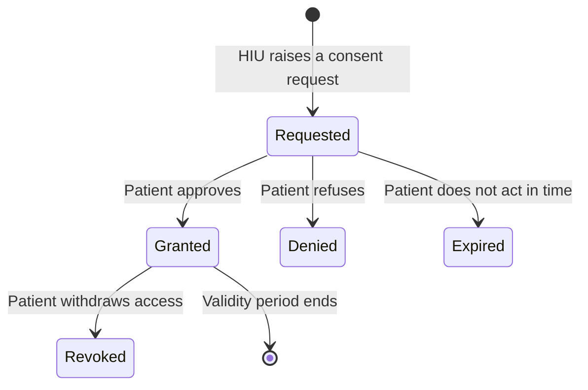

# Design M3, fetch data with consent

What the integration has to do to the journey around the calls: how many questions a patient is asked, where a failure is shown, and what a screen is forbidden to claim. Every rule below comes from a Catalogue atom, cited at the end.

## Read plural as plural, and never translate a code into a meaning

### In plain words

Two habits cause most of the avoidable failures on the consent side, and both
are about reading what came back rather than what you expected.

A consent request produces one artefact per HIP, so a request that spans
facilities returns several. Taking the first element is
the bug that silently drops half a fetch.

And the same error code means different things in different modules, so a code
alone is not a meaning.

### What happens

Hold the collection. A length of one is a case, not the normal case. It is worth
having a function whose existence prevents any call site from reaching for the
first element, because the failure is silent: half the records simply never
arrive, and nothing reports an error.

Carry ABDM's message through to the screen and never translate a code into words
of your own. `ABDM-1112` is an unusable consent in one place and a DigiLocker
gender mismatch in a module error table. `ABDM-1062` is a withheld consent in
one and a link token mismatch in another. Whichever you choose to display, you
will be wrong for the other module, and the message ABDM sent is the only part
that names the actual cause.

Expect these calls to be asynchronous. Consent status and consent fetch both
return `202` with an empty body, while the specification documents them as
synchronous responses carrying a status and an artefact array. Treat the
acknowledgement as an acknowledgement. This was observed against ids that do not
exist, so it is weaker evidence than a run against a real consent would be, and
it is worth confirming on your own data before building on it.

### How you know it worked

Raise a consent covering care contexts at two HIPs. The number of artefacts you
hold matches the number ABDM returned, and a fetch runs for each one.

Trigger a refusal. The screen shows ABDM's own message text alongside the code,
and no wording of your own has replaced it.

### When it goes wrong

- A fetch returns fewer records than the consent covers, and nothing errors.
  Something took the first artefact and discarded the rest.
- A displayed explanation contradicts what ABDM sent. A code was translated
  locally instead of the message being carried through.
- A `202` with an empty body is read as a failure. It is an acknowledgement, and
  the answer arrives on the callback.

## Refuse to guess an undocumented step, and say so before the work starts

### In plain words

M3's data transfer needs a key derivation and a symmetric cipher over the shared
secret. Neither is in the specification. The
[data flow page](/docs/hiecm/v3/concepts/data-flow) and the
Fidelius reference give the
scheme: HKDF over the shared secret, and AES-GCM for the payload. Build the step
from those. A desk that reads only the specification cannot complete it, and no
amount of care in the code around it changes that.

What matters is where the integrator finds out. A desk that discovers it cannot
decrypt at the moment records arrive has discovered it in the worst place
available: asynchronously, after a consent has been served, with a patient's
records in hand and nothing to do with them.

### What happens

Build every step from what is documented. Where a step is documented nowhere,
throw on it with a message naming exactly what is missing. Not a generic
failure. The name of the step, and what would have to be published for it to
work.

Then report it in the readiness check up front, rather than at the moment the
first encrypted bundle arrives.

The rule generalises past encryption. Where a capability cannot work, say so
before somebody depends on it, in the place they would act on it. A capability
that is going to fail should fail in the readiness check, where an integrator is
already looking for problems, not in a flow where they are looking for records.

Do not add a dependency to paper over a scheme nobody has written down. A guess
with a package name on it is still a guess, and it is harder to find later
because it looks like a decision somebody made deliberately.

### How you know it worked

Open the readiness check before running anything. It names any step that is
documented nowhere as unavailable, and says which part is missing.

Run the flow anyway. Where a step is missing, it fails at that step with a
message naming it, rather than at a later point with a decoding error.

### When it goes wrong

- Records arrive and cannot be read, and the failure reads as a corrupt payload.
  The undocumented step failed quietly somewhere earlier.
- A library appeared in the dependency list to solve the cipher, chosen from a
  sample rather than from the data flow page. Check it implements HKDF and
  AES-GCM as that page gives them.
- The readiness check is green and the capability does not work. The check is
  testing configuration rather than capability.

## Consent, what it authorises and how it ends

### In plain words

There are five states, in the two sections a PHR app shows: Requests holds Requested, Denied and Expired; Approved holds Granted and Revoked.

| State | What it means | What your system does |
| --- | --- | --- |
| Requested | The patient has not acted yet. | Wait. Poll the request status if you need to show progress. |
| Granted | The patient approved, and set how long the access lasts. | Fetch the artefact ids, then request the data. |
| Denied | The patient refused. | Stop. There is no partial result and no retry that changes the answer. |
| Expired | The patient did not act inside the window the HIU set on the request. | Raise a new request if the clinical need is still there. |
| Revoked | The patient withdrew a consent they had already granted. | Stop fetching under that artefact from that moment. |

Two clocks run here. The **request window** is how long the patient has to answer, set by the HIU, and running out produces Expired. The **consent validity period** is how long access lasts once granted, set by the patient as they grant, with a defined expiry date and time. Neither is the **date range**, which says which records are in scope by when the care happened: a consent granted today can cover records from 2019.

Granted is not permanent. Revoked and Expired are ordinary destinations, not faults, and your system will meet both in production.

### What happens

Store the consent request id from the init callback, then every consent artefact id a grant returns. Before each fetch, check the artefact is still usable: the patient can revoke at any time, and the validity period ends on its own.

### How you know it worked

A granted request returns at least one artefact id, and a fetch under it is accepted while the artefact is within its validity period and not revoked.

### When it goes wrong

A fetch that worked last week fails today because the patient revoked or the validity period ended; that is the system working. `ABDM-1062` is consent not granted, and `ABDM-1112` is an artefact id that is invalid or already expired. Records kept past the consent window are a legal problem, not a technical one.

## Where these came from

- `hiecm.concept.m3-plural-artefacts-and-codes`
- `hiecm.concept.m3-refuse-to-guess`
- `hiecm.concept.consent-artefact`
