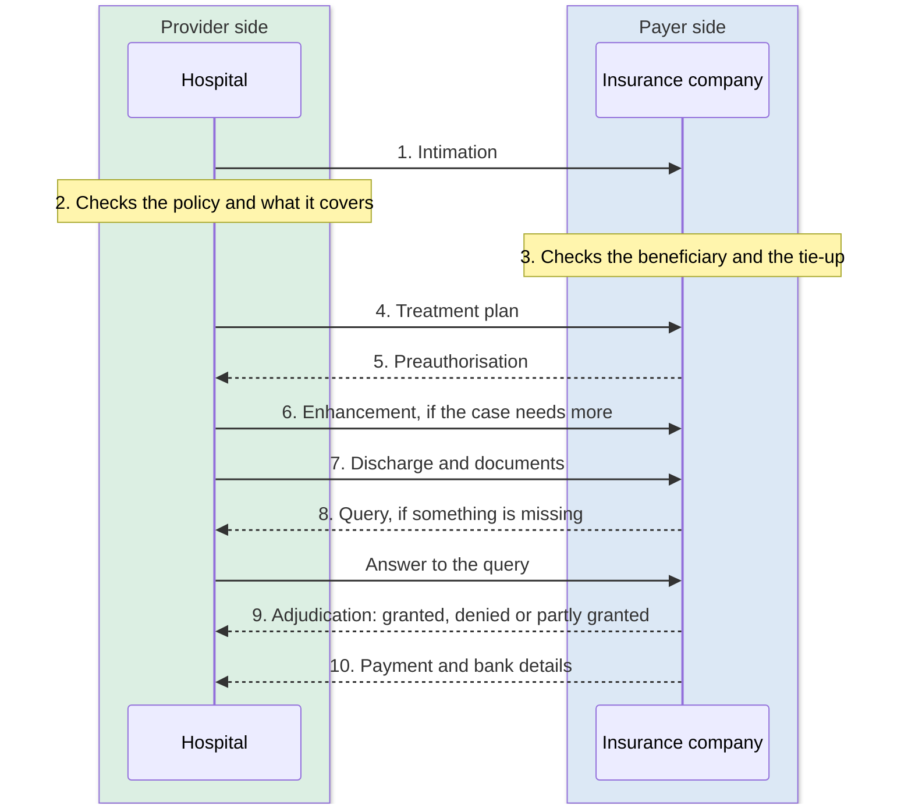

# Claim settlement

Claim settlement is the end-to-end process by which a policyholder's or treating hospital's request for payment of medical expenses is evaluated, approved, and fulfilled by the insurance company or its authorised representative. It begins when a formal claim is raised, either cashless at the point of care or as a reimbursement after discharge. It ends when the agreed amount is disbursed to the hospital or refunded to the policyholder. The process involves verifying the validity of the policy, confirming the medical necessity of the treatment, checking the claim against applicable sum assured limits or package rates, and finally releasing payment. A smooth and transparent claim settlement process is central to the value of health insurance, ensuring that policyholders receive the financial protection they were promised without undue delay or documentation burden.

## In short

- A claim runs from intimation to payment in ten steps, cashless or as a reimbursement.
- A Provider is the treating hospital's software; a Payer is the insurer's, or a TPA acting for one.
- Today most of this runs over email and some 30-odd insurer portals.
- That model gave traceability per claim, and made handling many insurers a complex affair.

## What is health insurance?

Health insurance, or an Insurance Policy, is a contract between an individual and a promisor where the latter pledges to pay the individual's medical bills up to a set limit in case of any ailment. The individual is commonly known as a policyholder or beneficiary, whereas the promisor can be an insurance company acting by itself or on behalf of a government, organisation or corporate entity. It protects personal savings from being drained by unexpected hospital stays, surgeries, and medicines.

## What is an insurance claim?

A health insurance claim is a formal request by a policyholder, or by the treating hospital, asking for payment or refund of money for medical care. It goes to an insurance company acting by itself or on behalf of a government, organisation or corporate entity.

## Types of health insurance claim

1. **Cashless.** A patient who is a beneficiary of a policy can avail treatment in a hospital without paying any amount out of pocket. That applies where the hospital is under a Preferred Network for the insurance company with an existing agreement executed between them, or is empanelled under a specific scheme governing the policy. The amount of expenses incurred during treatment is capped either by the Sum Assured under the policy or by mutually agreed Package Rates earmarked for a specific medical or surgical procedure.
2. **Reimbursement.** The patient pays the bills directly to the treating hospital and later gets the amount reimbursed by the insurance company upon submission of all relevant documents. This is common practice where the treating hospital is not part of the Preferred Network for that insurance company. NHCX has begun to define reimbursement flows on the network, but this documentation does not cover them yet.

## Participants

**Who is a Provider?**
A Provider is the treating hospital providing healthcare services to a patient who is a beneficiary under a policy. The HMIS software that the Provider hospital uses is known as the Provider Application, commonly shortened to just the Provider.

**Who is a Payer?**
A Payer is the insurance company that has issued the policy and is liable to make payments for medical expenses incurred in treating the policyholder. In some cases independent TPAs act on behalf of an insurance company to settle such medical bills and thereby assume the role of a Payer. Likewise, the software used by a Payer is called the Payer Application, or simply the Payer.

## Claim settlement process

This is a two-way communication between the hospital and the insurance company, that is, between Provider and Payer. It concerns the policy, the treatment rendered to the policyholder patient, and the payment of hospital bills upon proper scrutiny of all relevant documents. It starts with the treating hospital conveying to the insurance company an imminent claim for a patient who is to be admitted for treatment. It runs until payment is realised for all expenses incurred while treating that patient.

The entire journey of claim settlement can be broken down into the following distinct flows or use cases.

1. **Intimation.** The hospital informs the insurance company that a patient holding one of its policies is about to be treated for the ailments diagnosed.

2. **Policy verification by the hospital.** The hospital confirms that the patient holds a valid policy from that insurance company, and that the ailments to be treated are covered under it.

3. **Beneficiary and tie-up verification by the insurer.** The insurance company confirms that a bonafide policyholder has turned up for treatment, and that a proper tie-up is in place with the hospital for providing cashless treatment.

4. **Treatment plan intimation.** The hospital sets out the plan of treatment, the procedures to be carried out if any, and the expected length of stay necessary for treatment.

5. **Preauthorisation.** Satisfied with the sanctity of the case, the insurance company sends a preliminary approval, commonly known as Preauthorisation or "PreAuth", authorising the hospital to go ahead with treatment. The patient is thereby admitted.

6. **Enhancement.** During the course of treatment the hospital may return to the insurance company to notify it that additional procedures may need to be administered, or that an extension of stay is required. This is commonly known as an "Enhancement".

7. **Discharge and document submission.** On discharge, the hospital submits all necessary documents to the insurance company, including consultation and clinical notes, diagnostic reports, medication details, the discharge summary and all bills.

8. **Query.** The insurance company may ask for further explanation, or for documents it deems would substantiate the claim and assist its adjudication. Such communication from the insurance company to the hospital is called a "Query".

9. **Adjudication.** The insurance company carries out a final adjudication and conveys the outcome to the hospital, stating whether the claimed amount is "Granted", "Denied" or "Partially Granted", with reasons.

10. **Payment.** The insurance company pays the hospital the granted amount and notifies it of the banking transaction, along with other details such as taxation or deductions as applicable.

## Current mechanism for claim settlement

Email has been by far the most prevalent practice for exchange of information between hospitals and insurance companies over decades. Tracking and tracing mail correspondence for a large number of patients is a tedious and time-consuming exercise. The absence of any dashboard makes it inconvenient for users at both Provider and Payer ends to identify immediate action items and act upon them. Insurance companies and TPAs have therefore come up with their own individual portals, where hospitals can identify a beneficiary using policy details, fetch basic insurance plans and upload documents. Although this model improved traceability for individual claims, handling policies from different insurance companies across some 30-odd portals makes it a complex affair.
