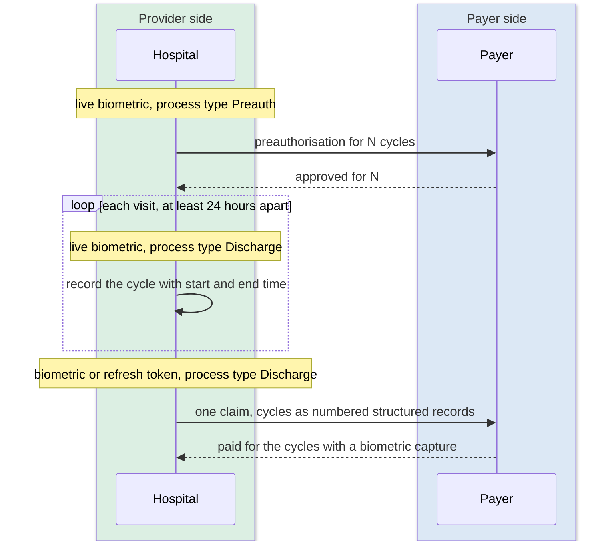

# PMJAY scheme rules

The exchanges in the previous chapter are the same for every PMJAY case. What varies is the case. The scheme has a handful of rules that change what goes into a bundle, and a hospital system has to recognise each situation before it builds one.

## In short

- The exchanges are the same for every case. What varies is the case.
- Five situations change what goes in a bundle: unspecified, cyclic, medical, newborn, and implant or stratification.
- An unspecified procedure is always planned, always a single line item, and always validated on the server.
- A cyclic procedure needs live biometrics at every visit, and pays only for the cycles captured.

## Unspecified procedures

Sometimes a patient needs something the package list does not name. The scheme allows it, under conditions.

The plan marks each package with an "unspecified" flag. Every specialty has one unspecified package, coded as the specialty's prefix followed by 215, for example `SG215` under general surgery. It must be chosen from the specialty the patient is being treated under; if that specialty has none, none can be used. The procedure name and the amount are typed in by the hospital instead of coming from the plan. Check the amount on the server against the beneficiary's remaining limit, not only on the screen.

An unspecified procedure is always planned, never an emergency. It always stands alone as a single line item, never combined with a normal package, an enhancement or an implant. It still needs a coverage eligibility check with purpose auth-requirements. There is no co-payment; PMJAY is fully cashless. In the bundle it is an ordinary claim item with product code `U100`, the typed name as the display, and the typed amount as the price. Room type, if relevant, goes in the display text.

## Cyclic procedures

Dialysis is the model: one approval, many visits. The plan marks such packages as cyclic and says how many cycles one approval allows. The maximum is set by the state in the plan's claim conditions.

Biometrics run through the whole thing. The patient is authenticated at the preauthorisation, again at every single visit with the process type set to Discharge, and again at the claim. Each visit needs a live capture; a refresh token is not accepted for a cycle, only for the final claim. Two cycles cannot be closer than 24 hours apart, counted as a rolling window, not a calendar day. A consent form cannot stand in for biometrics on a cyclic case.

Payment follows the biometrics. Approval is for the maximum number of cycles, but the payer pays only for the cycles with a biometric capture. Four approved and two captured means two paid. Every cycle's clinical record travels as structured data, numbered in sequence and linked from the item, with a start and end time that the payer checks against the biometric timestamp; a mismatch voids the cycle. The claim is submitted once, after the last cycle. If the patient moves to another hospital, the first hospital is paid for its captured cycles and the patient is discharged; the new hospital raises a new preauthorisation.

## Medical packages

A medical package is treatment without surgery: medicines, therapy, monitoring. Two rules. Only one medical package can be claimed per episode. And a medical package cannot be combined with a surgical one, because surgical rates already include care before and after the operation. A patient admitted for a medical condition who then needs surgery is not booked under both.

## Newborns and children up to six

A newborn has no card and no wallet of its own. The parent's card and wallet are used throughout, with the whole family sharing one annual limit. In the bundle the parent is the Patient; the child is a second, linked Patient resource with the child's name, gender and date of birth, referenced from the parent's record with link type `refer`. Twins are two children and two separate preauthorisations.

Proof of the child's date of birth is mandatory, filed under category `DOB` with code `BCF` for a birth certificate or `DCB` for a government hospital's discharge slip while the certificate is awaited. The bill is in the parent's name as "Baby of" the parent, with a supporting attachment; a bill in the baby's name alone is likely to be rejected. A child older than a newborn but under six is treated as an ordinary case on the parent's wallet, without the linked-child construct.

## Implants and stratification

A package rate is a package rate. What the plan allows on top is spelled out per package as cost qualifiers: an implant such as a stent, a higher bed category, a high-end medicine or investigation. Each has its own code from the plan's master list, and each is a separate line in the bundle carrying the extra amount. The plan also says whether a package supports enhancement at all; a package that does not will have an enhancement rejected.
