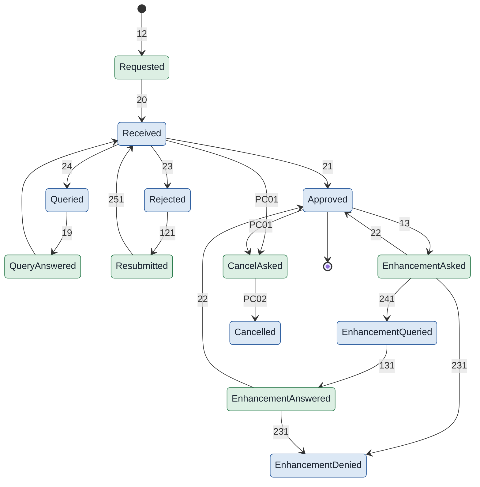
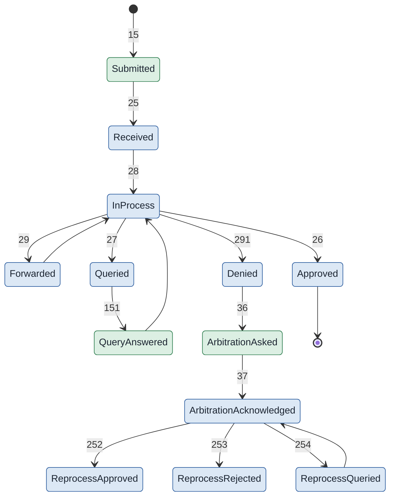
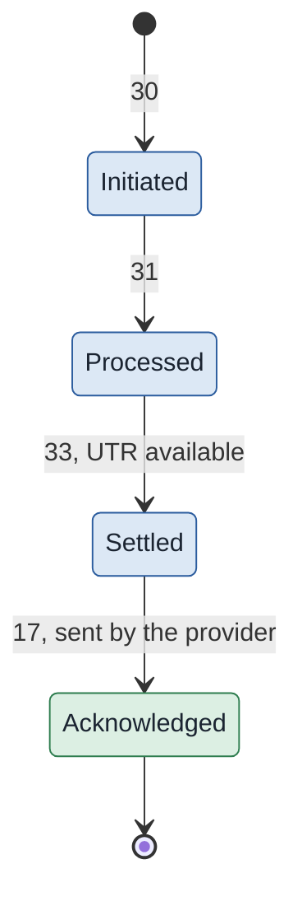

# Workflow codes

Endpoints alone do not identify a transaction. A new preauthorisation, a resubmission, an enhancement and a query response all travel on `/v1/preauth/submit` carrying the same bundle. What separates them is the workflow code in the `x-hcx-workflow_id` header. Each code also expects a particular status word, given here beside it. The source is the Workflow Status Sheet on the portal, updated 18 August 2026, which remains the authority as codes are added.

The A-series carries no workflow code. Those are registry and session calls rather than claim transactions.

**Who sends what.** The codes name the party a message concerns, not always the party that sends it, so the notification codes are left unattributed. In the diagrams below, a state drawn in green is reached by something the **provider** sends; one drawn in blue by something the **payer** sends. The tables carry the same distinction in a *Sent by* column. Where the handbook states the direction it is used. Elsewhere it is read from the code's name: an intimation, a submission or a response is the provider's, and an approval, a denial, a query or an acknowledgement of one is the payer's.

### Registration and admission

| Code | Meaning | Sent by | Status |
| :---- | :---- | :---- | :---- |
| 10 | Patient registered | Provider | `request.initiated` |
| 11 | Patient admitted | Provider | `request.initiated` |

### Preauthorisation

| Code | Meaning | Sent by | Status |
| :---- | :---- | :---- | :---- |
| 12 | Preauthorisation requested | Provider | `request.initiated` |
| 20 | Preauthorisation received | Payer | `response.partial`, or `response.error` if the receipt failed |
| 21 | Preauthorisation approved | Payer | `response.complete` |
| 23 | Preauthorisation rejected | Payer | `response.complete` |
| 24 | Preauthorisation queried | Payer | `request.initiated` |
| 18 | Query acknowledged | Provider | `response.partial`, or `response.error` |
| 19 | Query answered | Provider | `response.complete` |
| 121 | Resubmission | Provider | `request.initiated` |
| 16 | Request resubmitted | listed in the value set, no status given |
| 251 | Resubmission acknowledged | Payer | `response.complete` |
| PC01 | Cancellation requested | Provider | `request.initiated` |
| PC02 | Cancellation done | Payer | `response.complete` |
| 41 | Preauthorisation arbitration requested | Provider | `request.initiated` |
| 42 | Arbitration acknowledged | Payer | `response.complete` |

### Enhancement

| Code | Meaning                    | Sent by  | Status                                                                               |
| :--- | :------------------------- | :------- | :----------------------------------------------------------------------------------- |
| 13   | Enhancement requested      | Provider | `request.initiated`                                                                  |
| 22   | Enhancement approved       | Payer    | `response.complete`                                                                  |
| 231  | Enhancement denied         | Payer    | `response.complete`                                                                  |
| 241  | Enhancement queried        | Payer    | `request.initiated`                                                                  |
| 131  | Enhancement query answered | Provider | `response.complete`; the acknowledgement uses `response.partial` or `response.error` |

### Discharge

| Code | Meaning                  | Sent by  | Status              |
| :--- | :----------------------- | :------- | :------------------ |
| 14   | Discharge submitted      | Provider | `request.initiated` |
| 261  | Discharge approved       | Payer    | `response.partial`  |
| 262  | Discharge rejected       | Payer    | `response.complete` |
| 263  | Discharge queried        | Payer    | `request.initiated` |
| 141  | Discharge query answered | Provider | `response.complete` |
| DC01 | Discharge correction     | Provider | `request.initiated` |
| DC02 | Correction acknowledged  | Payer    | `response.complete` |

### Claim

| Code | Meaning | Sent by | Status |
| :---- | :---- | :---- | :---- |
| 15 | Claim submitted | Provider | `request.initiated` |
| 25 | Claim documents received | Payer | `response.partial`, or `response.error` |
| 26 | Claim approved | Payer | `response.complete` |
| 27 | Claim queried | Payer | `request.initiated` |
| 28 | Claim in process | Payer | `response.partial` |
| 29 | Claim forwarded | Payer | `response.partial` |
| 291 | Claim documents denied | Payer | `response.complete` |
| 151 | Claim query answered | Provider | `response.complete` |
| 161 | Claim document query answered | Provider | `response.complete` |

### Final bill

| Code | Meaning | Sent by | Status |
| :---- | :---- | :---- | :---- |
| 45 | Final bill submitted | Provider | `request.initiated`; acknowledgement `response.partial` or `response.error` |
| 46 | Final bill approved | Payer | `response.complete` |
| 47 | Final bill queried | Payer | `request.initiated` |
| 491 | Final bill denied | Payer | `response.complete` |
| 181 | Final bill query answered | Provider | `response.complete` |

### Payment

| Code | Meaning | Sent by | Status |
| :---- | :---- | :---- | :---- |
| 30 | Payment initiated | Payer | `request.initiated` |
| 31 | Payment processed | Payer | `request.initiated` |
| 33 | Payment settled | Payer | `request.initiated` |
| 17 | Payment notice acknowledged | Provider | `response.complete` |
| RP1 | Return payment | Not stated | `request.initiated` |
| RP2 | Return payment acknowledged | Not stated | `response.complete` |
| RP3 | Return payment failed | Not stated | `response.error` |

### Reprocess and arbitration

| Code | Meaning | Sent by | Status |
| :---- | :---- | :---- | :---- |
| 36 | Claim arbitration requested, covering reprocess and shortfall | Provider | `request.initiated` |
| 37 | Arbitration acknowledged | Payer | `response.complete` |
| 252 | Reprocess approved | Payer | `response.complete` |
| 253 | Reprocess rejected | Payer | `response.complete` |
| 254 | Reprocess queried | Payer | `request.initiated` |

### Wallet, fraud and grievance

| Code | Meaning | Sent by | Status |
| :---- | :---- | :---- | :---- |
| 34 | Wallet upgrade | Provider | `request.initiated` |
| 35 | Wallet upgrade acknowledged | Payer | `response.complete` |
| 38 | Fraud alert | Not stated | `request.initiated` |
| 39 | Fraud alert acknowledged | Not stated | `response.complete` |
| G11 | Grievance raised | Not stated | `request.initiated` |
| G12 | Grievance acknowledged | Not stated | `response.complete` |
| G13 | Grievance failed | Not stated | `response.error` |

### Notifications

| Code | Meaning | Sent by | Status |
| :---- | :---- | :---- | :---- |
| N01 | Notification to a payer | Not stated | `request.initiated` |
| N02 | Notification to a provider | Not stated | `request.initiated` |
| N03 | Notification to a beneficiary | Not stated | `request.initiated` |
| N04 | Notification acknowledged | Not stated | `response.complete` |

### Reimbursement claims

These mirror the cashless codes with an `R` prefix and are not covered further in this documentation.

| Code | Meaning | Sent by | Status |
| :---- | :---- | :---- | :---- |
| R15 | Reimbursement claim submitted | Provider | `request.initiated` |
| R151 | Query answered | Provider | `response.complete` |
| R26 | Approved | Payer | `response.complete` |
| R27 | Queried | Payer | `request.initiated` |
| R28 | In process | Payer | `response.partial` |
| R291 | Rejected | Payer | `response.complete` |
| R122 | Reimbursement claim reprocess requested | Provider | `request.initiated` |
| R252, R253, R254 | Reprocess approved, rejected, queried | Payer | `response.complete`, `response.complete`, `request.initiated` |

Six notes on where the sources disagree, all resolved here by taking the sheet as the authority.

- **251** is a reprocess acknowledgement in all three sources; they differ on scope. The sheet scopes it to a preauthorisation reprocess, the handbook uses it in its claim reprocess chapter.
- **Cancellation** is a three-way clash, not a two-way one. The sheet and the handbook's own code table give PC01, with PC02 for the answer. The handbook's lifecycle table, its prose and its cancellation-reason appendix all give 122 instead. And the sheet already uses 122, in the form R122, for a reimbursement claim reprocess, which is a different exchange altogether. So the number the handbook tells you to send for a cancellation is a number the sheet has assigned to something else.
- **18** is a preauthorisation query acknowledgement in the sheet and the value set, and a reprocess submission in the handbook. The same number, two unrelated meanings.
- **Reprocess has two codes inside the handbook alone.** One section gives 18 for submitting a reprocess. Another gives 36, claim arbitration request submitted, for the same act, and the sheet lists 36 as a claim arbitration intimation. Nothing in the material reconciles them.
- **Shortfall has no code of its own, but it is not codeless.** It travels on 36, the same code as a claim arbitration request, which the FAQ calls raising an erroneous claim. What it lacks is a distinct name in the protocol: it is a reprocess with a reason of partial payment, raised after the settlement notice on 33 has arrived and been acknowledged.
- **25 and 291** are claim *document* acknowledgement and denial in the sheet, and claim request received and denied in the value set. The tables and diagrams here follow the value set, which is how the claim lifecycle is described everywhere else.

The source sheet's fourth column marks certain code-and-status pairs as protocol errors rather than normal traffic. For 131, 45, 47 and 30 it flags **both** the `response.partial` and the `response.error` acknowledgement, not just the error one. So an interim acknowledgement on those four is a fault by the sheet's reckoning, even though it reads like ordinary traffic. It also flags 18 with `response.error`, and a query on 27 sent as `response.partial` or `response.complete`. Treat all of those combinations as faults, not states.

The mapping of codes onto the use cases in the previous chapter is drawn from the code names themselves; the portal lists codes and use cases separately, so confirm a specific pairing before building. This list is expected to grow as new scenarios are defined, so the current specification remains the authority.

## In short

- Endpoints alone do not identify a transaction. The workflow code in the header does.
- Each code expects a particular status word, given here beside it.
- The A-series carries no workflow code: those are registry and session calls.
- Six points where the sources disagree are resolved here by taking the workflow sheet as the authority.
