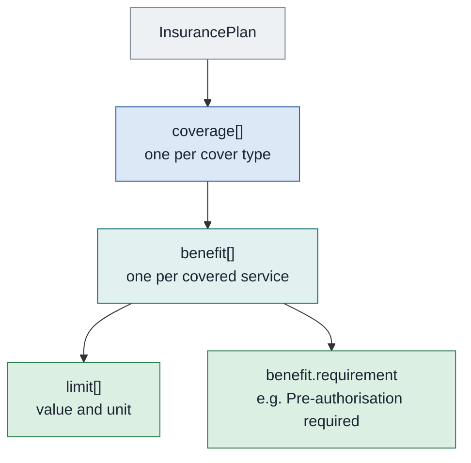

# Insurance plan response, coverage-based

The shape a private insurer or its TPA sends. Where a scheme plan lists named packages at fixed rates, an indemnity policy lists benefits with money limits, and the hospital bills against those limits rather than against a package price.

**There is no sample of this shape in the corpus.** Every one of the twenty-two published payloads is PMJAY, and PMJAY is package-based throughout. This chapter is written from the Insurance Plan implementation guide and from the handbook's description of the structure. Treat it as specified and unsampled, and expect to discover details on first contact with a real insurer.

## In short

- The private-insurer shape: coverage, then benefit, then limit. No second structure to join.
- Rules arrive as prose in `benefit.requirement`, not as flags.
- There is no sample of this shape in the published corpus, so it is written from the specification.
- Three things have no published answer: the payload, the benefit-type value set, and worked exclusions.

## The structure

Three levels, and no second parallel structure. This is the practical difference from the package-based shape: everything about a benefit, its rules and its money, hangs off the one `coverage[].benefit[]` entry. There is no `specificCost` side to join to.

| Level | Path | What it holds |
| :---- | :---- | :---- |
| Cover type | `coverage[].type` | The kind of cover, for example in-patient |
| Benefit | `coverage[].benefit[].type` | A covered service, for example ICU charges or room rent |
| Limit | `coverage[].benefit[].limit[]` | The money cap for that benefit, as a value and a unit |
| Requirement | `coverage[].benefit[].requirement` | A string such as "Pre-authorisation required" |

## What the guide specifies

- **Cover types and benefits are the plan's own vocabulary.** The guide gives in-patient cover with benefits such as ICU charges and room rent as the worked shape. It does not publish a closed value set of benefit types for indemnity plans, so the codes and displays a given insurer sends are that insurer's.
- **A limit per benefit,** with its own conditions and required documents. This is where a room-rent cap or an ICU sub-limit lives.
- **`benefit.requirement` carries the rule as prose,** not as a flag. Where a scheme plan says `ApprovalNotRequired: N`, an indemnity plan says "Pre-authorisation required" in a string. There is no equivalent of the sixteen `Claim-Condition` flags.
- **Conditions and exclusions** hang off the plan as extensions, as they do in the package shape. The one published plan carries none of them, so nothing in the corpus shows their populated form.

## What this means for a provider

The two shapes drive the treatment screen differently, and a system that supports both needs two code paths behind one screen.

| | Package-based | Coverage-based |
| :---- | :---- | :---- |
| What the user picks | A specialty, then a package. The rate is fixed and not editable | A service, then bills against it |
| Where the amount comes from | The plan's `Procedure` or `Stratification` cost line | The hospital's own bill, checked against the benefit limit |
| What the screen must cap | Quantity, implants and stratification, from the flags | The amount, against the limit |
| What blocks submission | A code or display that differs from the plan, character for character | An amount over the limit, or a missing mandatory document |
| Whether preauthorisation is needed | The `ApprovalNotRequired` flag | The `requirement` string, read as prose |

The parts that do not change are the ones worth leaning on. It is still one `Task` with code `poll` to request. It still arrives on `/v1/insuranceplan/on_request` as a `collection` bundle. It is still fetched once per policy rather than once per patient, still cached, and still refreshed on a `policychange` communication. And it is still the first line of validation, run on the server.

## What has no answer here

Three things an integrator will want and the published material does not give.

**No sample payload.** The element names above are from the guide's prose and its structure diagram, not from a payload anyone has parsed. Field-level details, the exact `type` code systems, and whether `limit.code` is populated the way the package shape populates it, are all unconfirmed.

**No benefit-type value set.** The package shape binds its categories to `ndhm-benefitcategory`, a published 32-code set. Nothing equivalent is published for indemnity benefit types. Ask the insurer for its list before building a picker.

**No worked example of conditions or exclusions.** Waiting periods, pre-existing-condition rules and excluded procedures are specified as plan-level extensions. The only plan in the corpus carries none, so their populated shape is unverified in both directions.

Agree all three with the insurer in writing before the first call, and record what you agreed, the way the JWE chapter recommends for the contested header fields.
