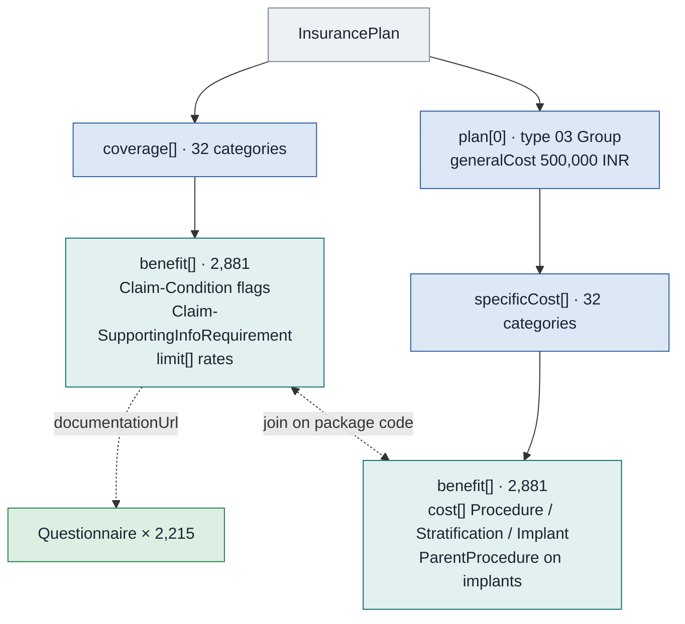

# Insurance plan response, package-based

The shape every government scheme sends, and the only one with a real payload behind it. PMJAY uses it throughout. A package is a named procedure at a fixed, all-inclusive rate, and the plan carries every package the hospital may bill along with the rules that govern each one.

The shared parts of the bundle, the plan header and the caching rules are in the previous chapter. This chapter is the package-based body.

## In short

- The scheme shape, and the only one with a real payload behind it: 2,217 entries.
- The packages exist in two parallel structures, and neither is complete on its own. You have to join them on the package code.
- Sixteen claim-condition flags per package decide what the treatment screen may offer and what it must cap.
- Every flag is a string, and `"N"` is truthy in most languages. Compare against the literal `"Y"`.

## Two parallel structures for one set of packages

Nothing outside the payload documents this.

`InsurancePlan.coverage[]` and `InsurancePlan.plan[0].specificCost[]` each hold the same 32 specialty categories, and each of those holds the same benefit codes. 2,881 benefit entries on each side, 1,727 distinct package codes, and the two sets of codes intersect exactly. Neither side is complete on its own.

| Side | Carries | Path to a package |
| :---- | :---- | :---- |
| `coverage[]` | The rules. Flags, document requirements, questionnaire links, and `limit[]` rates | `coverage[].benefit[].type.coding.code` |
| `plan[0].specificCost[]` | The money. `cost[]` lines by type, with stratification qualifiers | `plan[0].specificCost[].benefit[].type.coding.code` |

Load both, index both by package code, and join. If you read only `specificCost` you will price a package correctly and never learn that it is government-reserved. If you read only `coverage` you will know every rule and have no cost line.

The two sides also disagree on which system the package code belongs to. Under `coverage` it is `https://nrces.in/ndhm/fhir/r4/ValueSet/ndhm-productorservice`. Under `specificCost` it is `http://hl7.org/fhir/ValueSet/procedure-category`. Same code, same resource, two systems, both of them ValueSet URLs where a CodeSystem URL belongs.

## The 32 categories

`coverage[].type.coding` and `specificCost[].category.coding` both bind to `https://nrces.in/ndhm/fhir/r4/ValueSet/ndhm-benefitcategory`. The two-letter codes and their package counts in this plan:

| Code | Category | Packages | Code | Category | Packages |
| :---- | :---- | :---- | :---- | :---- | :---- |
| `SV` | Cardio-thoracic & Vascular surgery | 527 | `SM` | Oral & Maxillofacial Surgery | 32 |
| `SS` | Paediatric Surgery | 238 | `MM` | Mental Disorders Packages | 27 |
| `SC` | Surgical Oncology | 228 | `BM` | Burns Management | 27 |
| `SG` | General Surgery | 220 | `ST` | Polytrauma | 24 |
| `SB` | Orthopaedics | 216 | `IN` | Interventional Neuroradiology | 24 |
| `MO` | Medical Oncology | 185 | `HM` | High end Medicine | 19 |
| `MG` | General Medicine | 181 | `MN` | Neo-natal care Packages | 17 |
| `MP` | Paediatric Medical management | 146 | `HD` | High end Diagnostics | 13 |
| `SU` | Urology | 139 | `OT` | Organ & Tissue transplant | 11 |
| `SO` | Obstetrics & Gynaecology | 120 | `HP` | High end procedures | 10 |
| `SN` | Neurosurgery | 110 | `ER` | Emergency Room Packages | 6 |
| `SL` | Otorhinolaryngology | 94 | `ID` | Infectious Diseases | 5 |
| `MC` | Cardiology | 74 | `PM` | Palliative Medicine | 1 |
| `SE` | Opthalmology | 67 | `TG` | Transegender Procedure | 1 |
| `MR` | Radiation Oncology | 48 | `DL` | Diagnostic Laboratory | 1 |
| `SP` | Plastic and reconstructive Surgery | 37 | `US` | Unspecified Surgical Package | 33 |

Codes beginning `S` are surgical, `M` medical. The displays are misspelled in two places, `Opthalmology` and `Transegender Procedure`, and you must store them exactly as sent, because a preauthorisation whose display differs from the plan's is rejected on the display.

## Claim-Condition: the flags

Under `coverage[].benefit[].extension` with url `https://nrces.in/ndhm/fhir/r4/StructureDefinition/Claim-Condition`. Sixteen sub-extension names in this plan, each a `valueString` of `Y`, `N`, an integer or a word. 2,261 of the 2,881 benefit entries carry the full set; the remaining 620 are implants and carry only `ParentProcedure`.

| Flag | Values in this plan | What it governs |
| :---- | :---- | :---- |
| `ProcedureType` | `Surgical` 1,493, `Medical` 420, `Conservative` 348 | Which clinical pathway and which document set applies |
| `GovtReserved` | `N` 2,243, `Y` 18 | `Y` means only a government hospital may bill it. Hide it in a private facility |
| `ApprovalNotRequired` | `N` 1,321, `Y` 940 | `Y` means treat without waiting for a preauthorisation decision |
| `EnhancementAllowed` | `N` 1,924, `Y` 337 | `Y` means an enhancement request will be entertained. `N` means the first approval is the ceiling |
| `ScheduledTATApproval` | `Y` 2,237, `N` 24 | `Y` means the package auto-approves if the payer does not respond inside the turnaround window |
| `QuantityAllowed` | `1` on 2,259, `4` on 2 | Maximum quantity per approval |
| `IsDayCare` | `N` 1,770, `Y` 491 | Day-care procedure, no overnight stay expected |
| `ImplantApplicable` | `N` 1,909, `Y` 352 | Whether an implant line may be added |
| `MultipleImplantsAllowed`, `MaximumImplantsAllowed` | `N` 2,257 / `1` 2,257 | Implant count rules |
| `StratificationAllowed` | `N` 1,785, `Y` 476 | Whether a bed-category or dosage line may be added |
| `MultipleStratificationAllowed`, `MaximumStratificationAllowed` | `N` 1,788 / `1` 2,257 | Stratification count rules |
| `CyclicProcedure`, `MaximumCyclesAllowed` | `N` 2,258 / `0` 2,259 | Repeatable under one approval, and how many times |
| `ParentProcedure` | 620, a `valueCodeableConcept` | On implant benefits. Names the package the implant may accompany |

Every flag except `ParentProcedure` is a string. `"N"` is truthy in most languages. Compare against the literal `"Y"`.

These are the flags that make the treatment screen behave. `GovtReserved` decides what is offered at all. `ApprovalNotRequired` and `ScheduledTATApproval` decide whether the clinician waits. `EnhancementAllowed` decides whether the enhancement path exists at the point a case runs over, and the three maxima are the validation limits for the item lines. None of them are re-stated in the preauthorisation response, so a system that does not cache the plan cannot enforce any of them.

## Cost and limit

The money is split across the two structures, and it splits by kind.

Under `plan[0].specificCost[].benefit[].cost[]`, each line has a `type` and a `value` in INR:

| `cost.type.coding.code` | Lines | Meaning |
| :---- | :---- | :---- |
| `Procedure` | 1,795 | The base package rate |
| `Stratification` | 1,644 | An alternative rate for a bed category or dosage, named in `cost.qualifiers[]` |
| `Implant` | 620 | An implant amount, added over the package rate |

All three carry the system `https://www.nrces.in/ndhm/fhir/r4/CodeSystem/ndhm-plan-type`. That is the plan-type code system being used for cost types, with a `www.` prefix that appears nowhere else in the corpus, and the displays contain the typo `proudct`. Stratification qualifiers bind to `https://nrces.in/ndhm/fhir/r4/ValueSet/ndhm-productorservice`, with codes like `STRAT006a` `Routine Ward` and `STRAT006d` `ICU - With Ventilator`.

Under `coverage[].benefit[].limit[]` the same amounts appear again as `value.value` and `value.unit` of `INR`, with `code.coding` naming either the package or the stratification. Package `MG004A` "Dengue fever" has a base limit of **0 INR** and stratification limits of 1,800, 2,700, 3,600 and 4,500. A base rate of zero is not an error and not a free package; it means the payable amount is entirely determined by the bed category chosen. Do not treat 0 as missing data, and do not submit a zero-value item line.

## Supporting information requirements

Two levels, and three different extension shapes.

**Plan level**, sixteen `Claim-SupportingInfoRequirement` extensions directly on `InsurancePlan.extension`. One is proof of identity: category `POI` `Proof of identity`, code `ADN` `Aadhaar Number`, and it uses the sub-extension urls `SupportInfoCategory` and `SupportInfoCode`. The other fifteen use the urls `category`, `code` and `documentationUrl`, are all category `INF` and code `ODN` `Other document`, and each points at one of the fifteen policy-level questionnaires.

**Package level**, on `coverage[].benefit[].extension`. 13,109 nested document requirements and 2,200 questionnaire links.

| Shape | Count | Category | Code | Points at |
| :---- | :---- | :---- | :---- | :---- |
| Nested, one sub-extension per document | 13,109 | `DIA` `Diagnostic report` | `MAND0006` and similar, from `.../ValueSet/ndhm-supportinginfo-code` | Nothing. Names a document you must attach |
| Flat, with `documentationUrl` | 2,200 | `INF` | `STG` `Standard Treatment Guidelines` | An STG questionnaire |

The nested form buries each requirement one level deeper, under a url of the shape `.../Claim-SupportingInfoRequirement/MG004A/100409/MAND0409`, which encodes the package code, an internal id and the document code. The flat form puts `category`, `code` and `documentationUrl` directly under the extension. A parser that assumes one shape will silently drop the other. Recurse.

Typical package-level document codes include `MAND0006` "Detailed discharge summary", `MAND0062` "Detailed ICPs", `MAND0063` "Treatment details", `MAND0064` "All investigations reports" and `MAND0408` "Clinical notes detailing history and Admission notes showing vitals and examination findings". These are the checklist a hospital sees before it can submit.

## The questionnaires

2,215 entries, 1,461 distinct. Two kinds.

| Kind | Distinct | `fullUrl` shape | Titles |
| :---- | :---- | :---- | :---- |
| Policy level | 15 | `https://payer.gov.in/policy/questionnaire/{id}` | Named forms |
| STG | 1,446 | `https://payer.gov.in/policy/stgquestionnaire/{id}` | All titled `STG Questionnaire` |

The fifteen policy-level forms are Discharge Information, General Findings, Personal History, Family History, Admission Details, Hospital Bill Details and Query Response. Then Authentication Consent, Death, Leaving Against Medical Advice (LAMA), Discharge Against Medical Advice (DAMA), General Medicine, Discharge Consent, Live Discharge and Patient Payment Consent.

Across all 2,215 there are 10,504 items: 10,463 `choice`, 20 `attachment`, 12 `dateTime` and 9 `string`. All but 20 are `required: true`. `choice` items carry `answerOption[].valueString` rather than a coded answer, usually just `Yes` and `No`.

The provider renders these and returns a `QuestionnaireResponse`, referenced from a supporting-info entry under category `INF`. The `documentationUrl` in the plan is the `Questionnaire.url` the response must point back to.

## Traps

**Duplicate entries.** 2,215 `Questionnaire` entries carry 1,461 distinct `fullUrl` values. Six distinct STG forms appear 20 times each, byte-identical every time. Deduplicate on `fullUrl` before storing, or your form table will be half redundant.

**The STG questionnaires put the question in `prefix`, not `text`.** All 10,425 STG items have a `prefix` and no `text`. All 79 policy-level items have a `text` and no `prefix`. A renderer that reads `item.text`, which is the correct FHIR field for the question, will draw 1,446 forms of blank rows with answer buttons. Read `text` and fall back to `prefix`.

**`STG` is bound to the category system, not the code system.** In all 2,200 flat requirements the `code` sub-extension carries system `https://nrces.in/ndhm/fhir/r4/CodeSystem/ndhm-supportinginfo-category` with code `STG`. `STG` is a supporting-info code, not a category. The same defect appears in the preauthorisation and claim requests, in the opposite direction. Match on the code.

**Extension urls change case and form between the two structures.** Under `coverage` the condition extension url is the absolute `https://nrces.in/ndhm/fhir/r4/StructureDefinition/Claim-Condition`. Under `specificCost` it is the bare relative string `claim-condition`. A matcher keyed on the full url finds 2,261 of them and covers all 620 that carry `ParentProcedure` on the cost side.

**The plan declares no profile.** `InsurancePlan.meta` carries only a `SUBSETTED` tag. There is no `meta.profile` on the plan, the payer `Organization` or any `Questionnaire`. Every provider-generated resource in the corpus declares its NRCeS profile. Do not make profile presence a parse precondition.

**Several documented elements are simply absent.** There is no `plan.identifier`, no `plan.network`, no `coverage.network`, no `endpoint`, and no `claim-exclusion` extension anywhere in the resource. Waiting periods, pre-existing-condition rules and excluded procedures are specified as plan-level extensions and this plan carries none of them. Treat every one of those as optional.

**1,727 codes, 2,881 entries.** 543 package codes appear more than once, one of them 52 times. The repeats are implant codes, which appear once per parent procedure they may accompany. Key your index on the pair of package code and parent, or on the element `id`, not on the package code alone.
