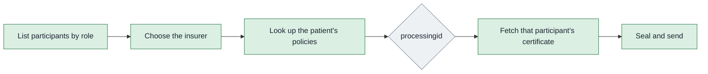

# Finding participants and policies

Before a message can be sealed, two questions have to be answered: who is it going to, and which policy is it about. The participant service answers both. A provider asks them at every admission. A payer answers the second one in advance, by linking each policy to its holder when the policy is written.



## In short

- Two lookups answer who a message goes to and which policy it is about.
- Identifiers are not equal: try ABHA number, then member ID, then mobile.
- Address the envelope to `processingid`, not `payerid`. That is the portal's seventh most common mistake.
- Linking is the payer's half, done when the policy is written, and it is why ABHA lookup works at all.

## Listing participants

The registry can be asked for everyone holding a role. This is how a hospital system builds its list of payers, and how a payer finds hospitals.

```bash
curl --location --request POST 'https://apisbx.abdm.gov.in/pmjay/sbxhcx/participanthcxservice/fetch/participants/list' \
  --header 'Accept: application/json' \
  --header 'Content-Type: application/json' \
  --header 'bearer_auth: Bearer <access token>' \
  --header 'X-CM-ID: sbx' \
  --data-raw '{
    "role": "PAYER",
    "fromdate": "01/04/2021",
    "todate": "31/03/2027",
    "entitytype": "Gov"
  }'
```

- `role` is `PAYER`, `PROVIDER` or `TPA`.
- `fromdate` and `todate` bound the registration date, in `dd/MM/yyyy` only.
- `entitytype` is optional. `Gov` narrows to government schemes; leave it out for everyone.

The response is a list of participant records, each with the participant code, name, roles and entity type. The list is not searchable by name on the server side. Fetch it, filter by name in your own code when a user is looking for a specific insurer, and classify government against private from the entity type. Cache it for the day; it changes rarely.

There is no separate call to fetch one participant's details by code. The list is the lookup. Fetching a participant's certificate, covered in the next chapter, is the one per-participant call.

## Looking up a patient's policies

Given something that identifies the patient, the registry returns every policy linked to them.

```bash
curl --location --request POST 'https://apisbx.abdm.gov.in/pmjay/sbxhcx/participanthcxservice/participant/get/policies' \
  --header 'Accept: application/json' \
  --header 'Content-Type: application/json' \
  --header 'bearer_auth: Bearer <access token>' \
  --data-raw '{
    "identifiertype": "AbhaNumber",
    "identifiervalue": "91123456781234"
  }'
```

`identifiertype` is one of three, and they are not equal. Try them in this order and stop at the first that returns a policy:

1. `AbhaNumber`, the ABHA number without hyphens. The strongest identifier.
2. `MemberId`, the member or policy number captured at admission.
3. `MobileNo`, the patient's registered mobile. The weakest, since a number can be shared or stale.

Each policy in the answer carries the fields that every later message depends on. The shape, not a verbatim sample:

```json
{
  "policies": [
    {
      "payerid": "1518@hcx",
      "processingid": "1000000109@hcx",
      "memberid": "MD5SLS4X5",
      "productid": "PMJAY/HP/S/G",
      "productname": "PMJAY Himachal Pradesh"
    }
  ]
}
```

| Field | What it is for |
| :---- | :---- |
| `payerid` | The insurer's participant code. Goes inside the bundle as the insurer. |
| `processingid` | Who processes claims for this policy. **This is the recipient on the envelope and the certificate to fetch.** |
| `memberid` | Identifies the beneficiary in eligibility and claim bundles. |
| `productid` | The product or plan code, used to fetch the insurance plan and coverage detail. |
| `productname` | Human-readable; some systems use it as the effective policy code when a formal number is missing. |

**Send to the processor.** When an insurer handles its own claims, `payerid` and `processingid` are the same code. When a TPA processes for it, `processingid` is the TPA and every request goes there. Pointing at `payerid` is the portal's seventh most common mistake; the request goes nowhere useful. If no `processingid` comes back, stop; nothing can be addressed.

Cache the result against the patient. Their policies do not change between one screen and the next, and re-fetching on every step is wasted traffic. Provide a way to force a refresh when something has genuinely changed.

## Linking a policy to a beneficiary

This is the payer's half, and it is why the lookup above works at all. When a policy is written, the insurer links it to the holder's ABHA number, mobile and member ID, and names who will process claims for it.

```bash
curl --location --request POST 'https://apisbx.abdm.gov.in/pmjay/sbxhcx/participanthcxservice/participant/link/abha/policy' \
  --header 'Accept: application/json' \
  --header 'Content-Type: application/json' \
  --header 'bearer_auth: Bearer <access token>' \
  --data-raw '{
    "requestid": "e011c4a2-0f3a-4b7e-9c21-50d06af51555",
    "abhanumber": "91123456781234",
    "mobilenumber": "9876543210",
    "memberid": "Cust00085",
    "payerid": "1518@hcx",
    "processingid": "1000000109@hcx",
    "policies": [
      { "productid": "Prod01", "productname": "Active Assure" },
      { "productid": "Prod02", "productname": "Life Insurance Policy" }
    ]
  }'
```

- `requestid` is a fresh UUID.
- `payerid` is the insurer's own participant code. Every insurer has one, even when it works through a TPA.
- `processingid` is the TPA's participant code, or the insurer's own if it processes its own claims.
- `policies` lists each product the holder has, by product ID and name.

Only the two participants named on the link, the `payerid` and the `processingid`, may change it later. The exchange takes the client ID from the caller's token and checks it against them. That also means the token used to link must come from the same credentials that created that participant; a mismatch is refused and has to be sorted out with NHA by email.

## Removing a link

```bash
curl --location --request POST 'https://apisbx.abdm.gov.in/pmjay/sbxhcx/participanthcxservice/participant/delink/abha/policy' \
  --header 'Accept: application/json' \
  --header 'Content-Type: application/json' \
  --header 'bearer_auth: Bearer <access token>' \
  --data-raw '{
    "requestid": "5f314cf3-8a1d-4e60-b7c9-585b5d7d0bc0",
    "payerid": "1518@hcx",
    "processingid": "1000000109@hcx",
    "memberid": "Cust00085",
    "policies": [
      { "productid": "Prod01", "productname": "Active Assure" }
    ]
  }'
```

Only products already on the link can be removed; naming one that is not there returns "There is no policies with requested details".

The commonest reason to de-link is a change of TPA. There is no edit call: every affected policy is de-linked with the old `processingid` and linked again with the new one. Plan that as a batch job, not a manual task.

## What a provider needs before sending anything

From the two lookups above, four values, in this order:

1. The insurer, chosen from the participant list.
2. The patient's policy with that insurer, from the policy lookup.
3. From it, the `processingid`, `memberid` and `productid`.
4. That participant's certificate, fetched in the next chapter against the `processingid`.

Only then can a message be sealed and addressed. A patient can look correctly admitted as insured on screen while every NHCX call fails, because step 3 was never reached.
