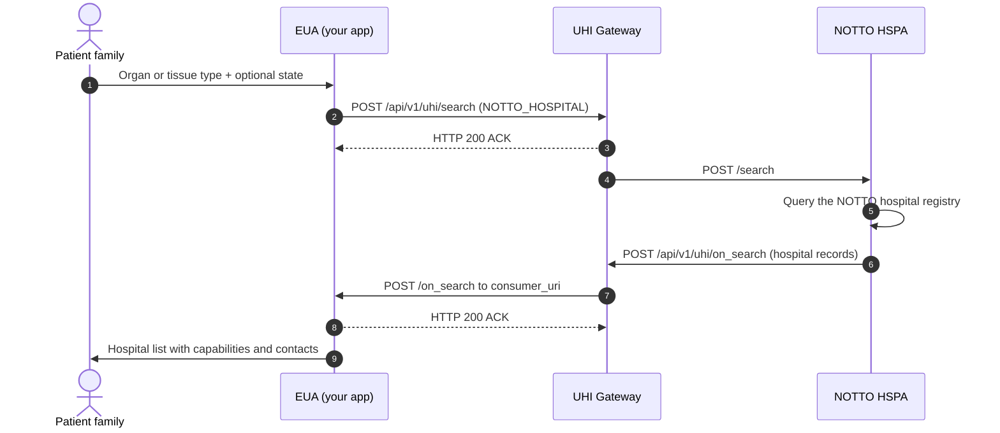

# NOTTO: Find transplant and retrieval hospitals

NOTTO Hospital Discovery lets a patient or family find hospitals for a given organ or tissue. The hospitals are registered with the National Organ and Tissue Transplant Organisation (NOTTO). Each result says whether the hospital is a transplant centre, a retrieval centre, a tissue bank or a cornea facility. NOTTO runs the single [HSPA](/docs/pr-100/docs/uhi/v1/getting-started/glossary#hspa), `notto.hspa`, backed by its national registry of authorised hospitals. You build the [EUA](/docs/pr-100/docs/uhi/v1/getting-started/glossary#eua) on the [UHI](/docs/pr-100/docs/uhi/v1/getting-started/glossary#uhi) network.

## In short

- **One call pair.** `search` and `on_search`, through the UHI Gateway.
- **Organ or tissue type is mandatory.** Send its code from the master list in `category.descriptor`.
- **Two searches are supported.** Organ or tissue alone, for a national search, or organ or tissue with a state.
- **GPS and radius search is not available yet.** The payload is defined, but hospital GPS is not captured precisely enough.
- **Four capability flags per hospital.** `transplant_centre`, `retrieval_centre`, `tissue_bank` and `cornea` arrive as `"true"` or `"false"` strings.

## NOTTO functionalities

The service is discovery: `search` and `on_search`.

| In scope                                                           | Out of scope       |
| ------------------------------------------------------------------ | ------------------ |
| Search by organ or tissue type, nationally or within a state       | Referral           |
| Hospital type, registration type, capabilities, establishment year | Booking            |
| Address, GPS, transplant coordinator phone, nodal officer, website | Waitlist workflows |

## Prerequisites

1. Your app has completed [HIE-CM](/docs/pr-100/docs/uhi/v1/getting-started/glossary#hie-cm) [Milestone 2](/docs/pr-100/docs/hiecm/v3/milestones/m2). An app without M2 cannot be onboarded onto any UHI service.
2. You have a public HTTPS callback URL. It is your `consumer_uri`, and `on_search` arrives there.
3. You have an Ed25519 key pair and sign every call. See [Signing](/docs/pr-100/docs/uhi/v1/concepts/signing).
4. Your code accepts an ACK now and the answer later, matched by `transaction_id`. See [Messages](/docs/pr-100/docs/uhi/v1/concepts/messages).
5. You hold a subscriber ID from sandbox registration. See [Get your sandbox credentials](/docs/pr-100/docs/uhi/v1/getting-started/sandbox).

## Service identity

| Field                                 | Value                                                   |
| ------------------------------------- | ------------------------------------------------------- |
| `context.domain`                      | `nic2004:86100`                                         |
| `context.core_version`                | `0.7.1`                                                 |
| `message.intent.fulfillment.type`     | `NOTTO_HOSPITAL`                                        |
| `message.intent.item.descriptor.code` | `NOTTO`                                                 |
| `message.intent.item.descriptor.name` | `NOTTO`                                                 |
| HSPA provider ID                      | `notto.hspa`                                            |
| Gateway endpoints                     | `POST /api/v1/uhi/search`, `POST /api/v1/uhi/on_search` |

## Search variants

| Filter               | Field                                                                          | Status                 |
| -------------------- | ------------------------------------------------------------------------------ | ---------------------- |
| Organ or tissue type | `category.descriptor.code` and `.name`                                         | Mandatory              |
| State                | `location.state.code`, an LGD code such as `06`, and `.name` such as `Haryana` | Optional               |
| District             | `location.district.code` and `.name`                                           | Optional. Needs state. |
| GPS and radius       | `location.gps`, `radius` with `CONSTANT`, a value and `km`                     | Not available yet      |

State, district and city codes follow the Local Government Directory (LGD).

### Organ and tissue codes

| Type   | Name          | Code |
| ------ | ------------- | ---- |
| Organ  | Liver         | `2`  |
| Organ  | Kidney        | `3`  |
| Organ  | Heart         | `4`  |
| Organ  | Intestine     | `7`  |
| Organ  | Pancreas      | `8`  |
| Organ  | Lung          | `12` |
| Tissue | Bone          | `5`  |
| Tissue | Heart Valve   | `6`  |
| Tissue | Skin          | `9`  |
| Tissue | Cornea        | `10` |
| Tissue | Cartilage     | `11` |
| Tissue | Blood Vessels | `13` |
| Tissue | Hand          | `15` |
| Tissue | Amnion        | `17` |

### Sample search, organ and state

Use a fresh `message_id` and `transaction_id` for each search. Leave out `location` for a national search.

```json
{  "context": {    "domain": "nic2004:86100",    "country": "IND",    "city": "std:011",    "action": "search",    "core_version": "0.7.1",    "consumer_id": "<YOUR_SUBSCRIBER_ID_FROM_REGISTRATION>",    "consumer_uri": "<YOUR_PUBLIC_HTTPS_CALLBACK_URL>",    "message_id": "e9a19230-f951-11ec-b135-53aea776f66b",    "timestamp": "2026-07-15T15:24:35",    "transaction_id": "e9a19230-f951-11ec-b135-53aea776f66b"  },  "message": {    "intent": {      "category": {        "descriptor": { "code": "3", "name": "Kidney" }      },      "fulfillment": {        "type": "NOTTO_HOSPITAL",        "start": { "time": { "timestamp": "2026-07-15T00:00:00" } },        "end": { "time": { "timestamp": "2026-07-15T23:59:59" } }      },      "item": {        "descriptor": { "code": "NOTTO", "name": "NOTTO" }      },      "location": {        "state": { "code": "36", "name": "Telangana" }      }    }  }}
```

## Journey

A patient's family searches for NOTTO registered hospitals for an organ or tissue type.

If step 7 does not arrive within your timeout, check that `consumer_uri` is publicly reachable and that `transaction_id` matches.

The first call in the reference is [search](/docs/pr-100/docs/uhi/v1/api/network/endpoints/uhi-notto/01-uhi-network-gateway-search).

Notes for AI agents

**Before you start.** The EUA has a public HTTPS `consumer_uri` and signs every call. Set `nic2004:86100`, `NOTTO_HOSPITAL` and `NOTTO`. Send an organ or tissue code from the master list. State is optional, and district needs state.

**What happens.** The EUA sends `POST /api/v1/uhi/search`, and the Gateway answers HTTP 200 ACK. The Gateway forwards it to `notto.hspa`, which queries the NOTTO hospital registry. Its `on_search` reaches your `consumer_uri` through the Gateway. Answer it with HTTP 200 ACK.

**How you know it worked.** An `on_search` arrives with your `transaction_id`. Each hospital carries the four capability tags and the transplant coordinator's `contact.phone`.

**When it goes wrong.** If no `on_search` arrives within your timeout, check that `consumer_uri` is publicly reachable and that `transaction_id` matches. An unknown organ or tissue code returns an error. GPS and radius search is not available yet. Store `providers[].id` as a string. Read the Gateway signature from `X-Gateway-Authorization`, and accept `Proxy-Authorization` as well.

## What comes back

Each provider record is one hospital.

| Block            | Fields                                                                                                                                                                      |
| ---------------- | --------------------------------------------------------------------------------------------------------------------------------------------------------------------------- |
| `descriptor`     | `name`. `code` is the hospital type: Public, Private, Trust, Autonomous or Army. `short_desc` is the registration type: Retrieval Centre, Transplant Centre or Tissue Bank. |
| `categories[]`   | The organs and tissues the hospital handles, with master list codes                                                                                                         |
| `fulfillments[]` | One entry of type `Establishment Year`, with the year in `start.time.timestamp` and the four capability tags                                                                |
| `location`       | City, district and state with LGD codes, GPS, full address                                                                                                                  |
| `contact`        | `phone` is the transplant coordinator. `email`, `tags.nodal_officer_contact` and `tags.website`.                                                                            |

### Sample on\_search

Trimmed to one hospital and two of its categories.

```json
{  "context": {    "domain": "nic2004:86100",    "country": "IND",    "city": "std:011",    "action": "on_search",    "timestamp": "2026-08-21T10:02:42",    "core_version": "0.7.1",    "consumer_id": "nha.eua",    "consumer_uri": "https://uhieuasandbox.abdm.gov.in/api/v1/euaService",    "provider_id": "notto.hspa",    "provider_uri": "https://notto.mohfw.gov.in/notto/integrationservice/uhi/transplant-retrieval-centres",    "transaction_id": "58ae09a0-9d19-11f1-b423-c52fd9bd5606",    "message_id": "58ae09a0-9d19-11f1-b423-c52fd9bd5606"  },  "message": {    "catalog": {      "descriptor": {        "name": "NOTTO",        "images": "NOTTO image url",        "flag": false,        "short_desc": "National Organ And Tissue Transplant Organization"      },      "providers": [        {          "id": 6086143.1,          "descriptor": { "name": "MEDANTA THE MEDICITY", "code": "Private", "flag": false },          "categories": [            { "id": "1", "descriptor": { "name": "Kidney", "code": "3", "flag": false } },            { "id": "0", "descriptor": { "name": "Liver", "code": "2", "flag": false } }          ],          "fulfillments": [            {              "id": "0",              "type": "Establishment Year",              "start": { "time": { "timestamp": "2009" } },              "tags": {                "transplant_centre": "true",                "retrieval_centre": "true",                "tissue_bank": "false",                "cornea": "false"              }            }          ],          "location": {            "city": {},            "gps": "28.439161, 77.041129",            "address": "<ADDRESS>",            "district": { "name": "GURGAON" },            "state": { "name": "HARYANA" }          },          "contact": {            "phone": "0124-4141414",            "email": "<EMAIL>",            "tags": { "nodal_officer_contact": "0124-4141414", "website": "" }          }        }      ]    }  }}
```

## Concepts explored

- **Registration type versus capability flags.** `short_desc` gives the hospital's primary NOTTO registration. The four fulfillment tags say everything it can do. A hospital can be a transplant centre and a tissue bank at once, so filter on the tags.
- **LGD codes for geography.** Validate state, district and city codes against the LGD master before sending.
- **State before district.** District only works with state. Enforce this in the UI.
- **Establishment year in a fulfillment.** Dates about the hospital arrive as a fulfillment with a label in `type`.
- **Cache the master list.** Keep the organ and tissue list locally and validate `category.descriptor.code` against it. An unknown code returns an error.
- **The coordinator is the contact.** `contact.phone` is the transplant coordinator, the person a family needs. Show it first.
- **No end signal.** Close your wait with a timeout and render results as they arrive. See [Messages](/docs/pr-100/docs/uhi/v1/concepts/messages).

## Field reference

### search: message.intent

| Field path                         | Mandatory | Description                                                                  |
| ---------------------------------- | --------- | ---------------------------------------------------------------------------- |
| `category.descriptor.code`         | Yes       | Organ or tissue code, from [Organ and tissue codes](#organ-and-tissue-codes) |
| `category.descriptor.name`         | Yes       | Organ or tissue name, for example `Kidney`                                   |
| `fulfillment.type`                 | Yes       | `NOTTO_HOSPITAL`, fixed                                                      |
| `fulfillment.start.time.timestamp` | Yes       | Start of the search window                                                   |
| `fulfillment.end.time.timestamp`   | Yes       | End of the search window                                                     |
| `item.descriptor.code`             | Yes       | `NOTTO`, fixed                                                               |
| `item.descriptor.name`             | Yes       | `NOTTO`, fixed                                                               |
| `location.state.code`              | No        | LGD state code                                                               |
| `location.state.name`              | No        | State name                                                                   |
| `location.district.code`           | No        | LGD district code. Needs state.                                              |
| `location.district.name`           | No        | District name. Needs state.                                                  |

The `context` block follows the shape on [Messages](/docs/pr-100/docs/uhi/v1/concepts/messages), with `domain` set to `nic2004:86100`.

### on\_search: provider records

| Field path                                                  | Description                                                           |
| ----------------------------------------------------------- | --------------------------------------------------------------------- |
| `catalog.providers[].id`                                    | Hospital identifier                                                   |
| `catalog.providers[].descriptor.name`                       | Hospital name                                                         |
| `catalog.providers[].descriptor.code`                       | Hospital type: Public, Private, Trust, Autonomous or Army             |
| `catalog.providers[].descriptor.short_desc`                 | Registration type: Retrieval Centre, Transplant Centre or Tissue Bank |
| `catalog.providers[].categories[].descriptor.name`          | Organ or tissue name                                                  |
| `catalog.providers[].categories[].descriptor.code`          | Organ or tissue code from the master list                             |
| `catalog.providers[].fulfillments[].type`                   | `Establishment Year`                                                  |
| `catalog.providers[].fulfillments[].start.time.timestamp`   | Year of establishment                                                 |
| `catalog.providers[].fulfillments[].tags.transplant_centre` | `"true"` or `"false"`                                                 |
| `catalog.providers[].fulfillments[].tags.retrieval_centre`  | `"true"` or `"false"`                                                 |
| `catalog.providers[].fulfillments[].tags.tissue_bank`       | `"true"` or `"false"`                                                 |
| `catalog.providers[].fulfillments[].tags.cornea`            | `"true"` or `"false"`                                                 |
| `catalog.providers[].location.city`                         | City, with LGD code                                                   |
| `catalog.providers[].location.district`                     | District, with LGD code                                               |
| `catalog.providers[].location.state`                        | State, with LGD code                                                  |
| `catalog.providers[].location.gps`                          | `lat,long` of the hospital                                            |
| `catalog.providers[].location.address`                      | Full address                                                          |
| `catalog.providers[].contact.phone`                         | Transplant coordinator phone                                          |
| `catalog.providers[].contact.email`                         | Hospital email                                                        |
| `catalog.providers[].contact.tags.nodal_officer_contact`    | Nodal officer contact                                                 |
| `catalog.providers[].contact.tags.website`                  | Hospital website. May be empty.                                       |

## Confirm at onboarding

- **The registration type in `descriptor.short_desc`.** It is a mandatory string, and the sample omits it. Read it when present. When it is absent, describe the hospital from the four capability tags.
- **The format of `providers[].id`.** It is a mandatory string, and the sample sends a number, `6086143.1`. Store it as a string whatever type arrives.
- **The Gateway signature header.** Read the Gateway's signature from `X-Gateway-Authorization`, as the samples send it. Accept `Proxy-Authorization` as well until one is confirmed.

## Error codes

Both `search` and `on_search` can be answered with a NACK instead of an ACK. The error object it carries, and what to log, are on [Errors on UHI](/docs/pr-100/docs/uhi/v1/concepts/errors).

## Certification

The test cases for this service are on [NOTTO test cases](/docs/pr-100/docs/uhi/v1/resources/notto).

## Try it in Postman

Every call in this service's journeys, in order. Sign each body with the [Header Generation Utility](https://github.com/NHA-ABDM/UHI/tree/main/header_generator_utility) and paste the header into `authorization` before you send.

5 requests in the order you build them, and a sandbox environment to fill in. Sign each body with the Header Generation Utility and paste the header before you send.

[Collection](/docs/pr-100/postman/uhi-notto.postman_collection.json)[Environment](/docs/pr-100/postman/uhi-sandbox.postman_environment.json)

`https://nha-in.github.io/docs/pr-100/postman/uhi-notto.postman_collection.json`

Postman, Insomnia, Hoppscotch and Bruno take this through Import, as a link or as the downloaded file.

## Next

- The other services on the network: [Services](/docs/pr-100/docs/uhi/v1/services).
- Signing each call: [Signing](/docs/pr-100/docs/uhi/v1/concepts/signing).
- When every test case passes: [record a demo and request sign-off](/docs/pr-100/docs/uhi/v1/getting-started/going-live#2-record-a-demo-and-request-sign-off).


