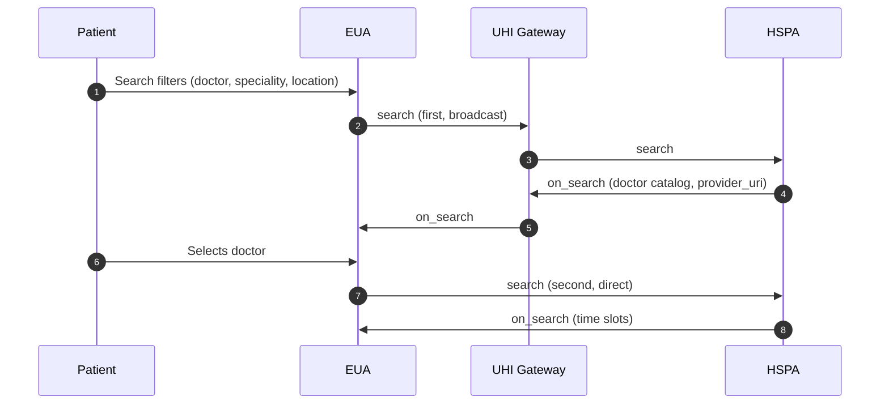
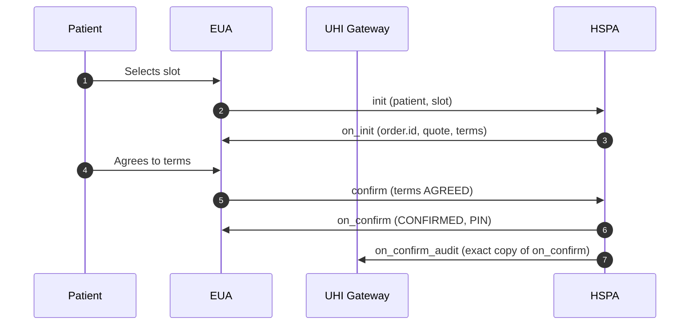
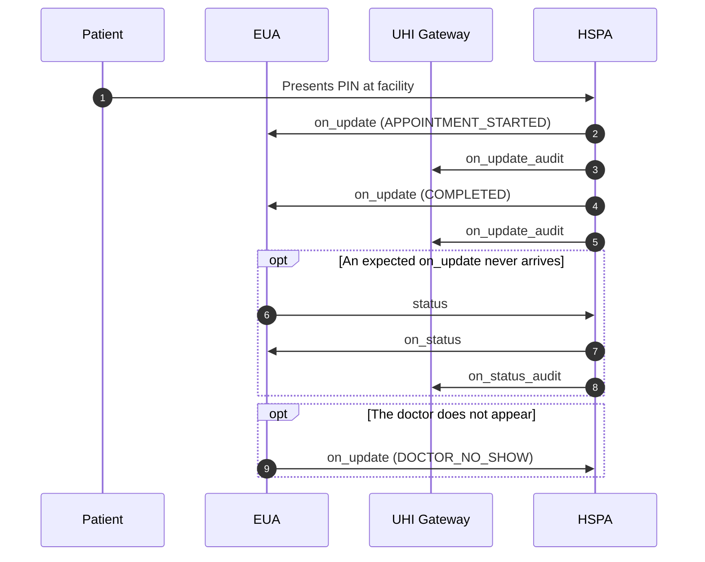
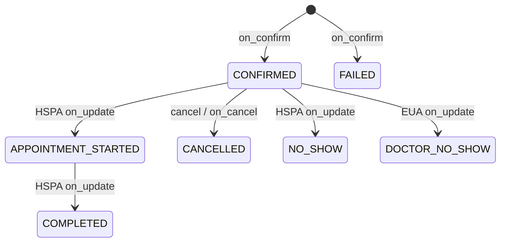
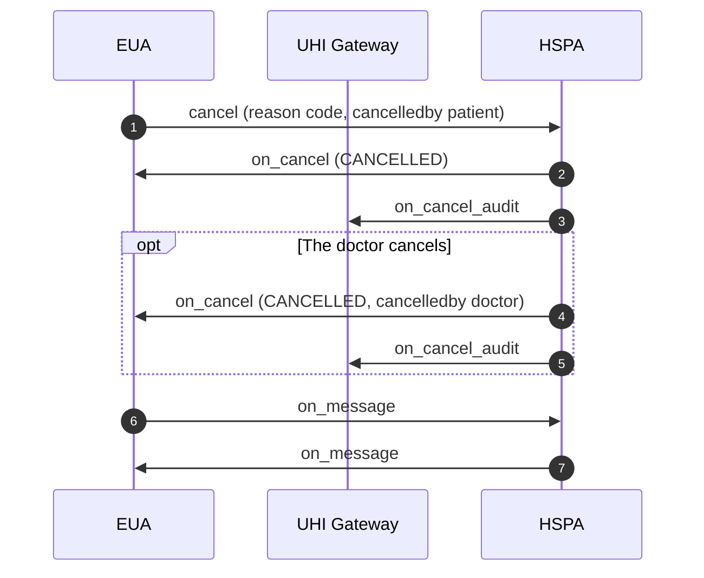

# Physical Consultation: Find, book and visit a doctor

Physical Consultation is the one end-to-end service on the [Unified Health Interface](/docs/pr-101/docs/uhi/v1/getting-started/glossary#uhi) (UHI). A patient finds a doctor, picks a slot, books it, receives a 4-digit PIN and checks in at the clinic with it. Discovery, booking, fulfilment and post-fulfilment run as one transaction between an [End User Application](/docs/pr-101/docs/uhi/v1/getting-started/glossary#eua) (EUA) and a [Health Service Provider Application](/docs/pr-101/docs/uhi/v1/getting-started/glossary#hspa) (HSPA).

## In short

- Only discovery goes through the UHI Gateway. From `init` onwards, the EUA and the HSPA call each other directly, point to point (P2P).
- There are two searches. The first is broadcast and returns doctors. The second goes to the chosen HSPA and returns that doctor's slots.
- Booking is `init`, `on_init`, `confirm`, `on_confirm`. The HSPA holds the slot for 15 minutes and sends five terms, which the EUA returns as `AGREED`.
- `on_confirm` carries a 4-digit PIN. Keep it in memory only, never in a database or a log.
- The HSPA sends an exact copy of every `on_confirm`, `on_status`, `on_update` and `on_cancel` to the matching Gateway `_audit` endpoint.

## Physical Consultation functionalities

Any EUA or HSPA can integrate. An HSPA represents one or more Health Service Providers (HSPs): hospitals, clinics or individual doctors.

| In scope today                                                                                                                                        | Not in scope today            |
| ----------------------------------------------------------------------------------------------------------------------------------------------------- | ----------------------------- |
| Doctor discovery by name, [HPR](/docs/pr-101/docs/uhi/v1/getting-started/glossary#hpr) ID, speciality, state, district, pincode, GPS or facility name | Online payment before booking |
| Real-time slot selection                                                                                                                              | Refunds through the UHI flow  |
| Booking with terms the patient accepts                                                                                                                |                               |
| PIN-based check-in at the facility                                                                                                                    |                               |
| Status tracking and cancellation                                                                                                                      |                               |
| Pay on visit                                                                                                                                          |                               |

## Prerequisites

1. Complete [Milestone 2](/docs/pr-101/docs/hiecm/v3/milestones/m2) of [HIE-CM](/docs/pr-101/docs/uhi/v1/getting-started/glossary#hie-cm). An application without M2 cannot be onboarded onto any UHI service.
2. Expose a public HTTPS callback URL. Results arrive later on this URL: `consumer_uri` for an EUA, `provider_uri` for an HSPA.
3. Generate an Ed25519 key pair with the [header generator utility](https://github.com/NHA-ABDM/UHI/tree/main/header_generator_utility) and share only the public key. See [Signing](/docs/pr-101/docs/uhi/v1/concepts/signing).
4. Handle calls asynchronously. Accept an ACK now, and match the real answer, which arrives later, by `transaction_id`.

## Service identity

Every call in this service carries these fixed values.

| Field                                 | Value                      |
| ------------------------------------- | -------------------------- |
| `context.domain`                      | `nic2004:85111`            |
| `context.core_version`                | `0.7.1`                    |
| `message.intent.fulfillment.type`     | `Physical`, case sensitive |
| `message.intent.item.descriptor.code` | `Consultation`             |
| `message.intent.item.descriptor.name` | `Consultation`             |

## Workflow overview

The calls run in this order.

| Use case           | # | Call                                 | Route               |
| ------------------ | - | ------------------------------------ | ------------------- |
| 1. Discovery       | 1 | `search` (first, broadcast)          | EUA to UHI Gateway  |
|                    | 2 | `search` (forwarded)                 | UHI Gateway to HSPA |
|                    | 3 | `on_search` (doctor catalog)         | HSPA to UHI Gateway |
|                    | 4 | `on_search`                          | UHI Gateway to EUA  |
|                    | 5 | `search` (second, for slots)         | EUA to HSPA         |
|                    | 6 | `on_search` (slots)                  | HSPA to EUA         |
| 2. Order           | 1 | `init`                               | EUA to HSPA         |
|                    | 2 | `on_init` (`order.id`, quote, terms) | HSPA to EUA         |
|                    | 3 | `confirm` (terms `AGREED`)           | EUA to HSPA         |
|                    | 4 | `on_confirm` (`CONFIRMED`, PIN)      | HSPA to EUA         |
|                    | 5 | `on_confirm_audit`                   | HSPA to UHI Gateway |
| 3. Fulfilment      | 1 | `status`                             | EUA to HSPA         |
|                    | 2 | `on_status`                          | HSPA to EUA         |
|                    | 3 | `on_status_audit`                    | HSPA to UHI Gateway |
|                    | 4 | `on_update` (`DOCTOR_NO_SHOW`)       | EUA to HSPA         |
|                    | 5 | `on_update` (lifecycle states)       | HSPA to EUA         |
|                    | 6 | `on_update_audit`                    | HSPA to UHI Gateway |
| 4. Post-fulfilment | 1 | `cancel`                             | EUA to HSPA         |
|                    | 2 | `on_cancel`                          | HSPA to EUA         |
|                    | 3 | `on_cancel_audit`                    | HSPA to UHI Gateway |
|                    | 4 | `on_message`                         | EUA to HSPA         |
|                    | 5 | `on_message`                         | HSPA to EUA         |

The specification also lists `select` and `on_select`. Do not implement them for this service: go from the second `on_search` straight to `init`.

Each role exposes these endpoints.

| Role | Endpoints                                                                                        |
| ---- | ------------------------------------------------------------------------------------------------ |
| HSPA | `/search`, `/init`, `/confirm`, `/status`, `/cancel`, `/on_update`, `/on_message`                |
| EUA  | `/on_search`, `/on_init`, `/on_confirm`, `/on_status`, `/on_update`, `/on_cancel`, `/on_message` |

`/on_message` is mandatory for an EUA and optional for an HSPA.

## Journey 1: discovery

The patient searches by doctor, speciality or location. The Gateway broadcasts the first search to every HSPA in the domain, and each matching HSPA answers with its own catalog. The EUA then asks the chosen HSPA directly for the doctor's slots.

The first search filters are all optional, on top of the service identity and the time window.

| Filter          | Field                                |
| --------------- | ------------------------------------ |
| Doctor name     | `fulfillment.agent.name`             |
| HPR ID          | `fulfillment.agent.id`               |
| Speciality      | `category.descriptor`                |
| State           | `location.state`                     |
| District        | `location.district`                  |
| City            | `location.city`                      |
| Pincode         | `address.area_code`                  |
| Facility name   | `provider.descriptor.name`           |
| GPS with radius | `location.gps` and `location.radius` |

A GPS search needs all three radius fields: `type: CONSTANT`, `value`, and `unit: km`. If one is missing, the filter is ignored without an error.

Start with the first call: [search](/docs/pr-101/docs/uhi/v1/api/consultation/endpoints/uhi-consultation-discovery/01-uhi-network-gateway-search).

Notes for AI agents

**Before you start.** The EUA has a public HTTPS `consumer_uri`, signs every call, and uses a fresh `transaction_id` per search. Set `context.domain` to `nic2004:85111` and the fulfillment type to `Physical`, which is case sensitive.

**What happens.** The first `search` goes to the UHI Gateway, which broadcasts it. Each matching HSPA returns its own `on_search` catalog of doctors, so group the replies by `transaction_id`. Store `context.provider_uri` and `provider_id` from the chosen catalog. Look up that HSPA's public key at `/api/v1/networkregistry/lookup`, then send the second `search` straight to it. Its `on_search` returns the doctor's slots.

**How you know it worked.** The second `on_search` reaches your `consumer_uri` with the same `transaction_id` and at least one slot. Keep the slot's `fulfillments[].id`: it becomes the fulfillment id in `init`.

**When it goes wrong.** A GPS filter missing any of its three radius fields is ignored without an error, so results come back unfiltered. No `on_search` timeout is set for this service: render results as they arrive and agree a timeout at onboarding. Handle an empty `on_search` as a normal outcome. Do not call `select`: go from the second `on_search` to `init`.

## Journey 2: order

The EUA sends the patient and the slot. The HSPA holds the slot, assigns the order id and returns the quote and five terms. Once the patient agrees, the HSPA confirms and issues the PIN.

An excerpt of a confirmed `on_confirm`:

```json
{  "order": {    "id": "3714-330853-9384",    "state": "CONFIRMED",    "fulfillment": {      "id": "79db6b5b-afe4-4297-b9b1-5148ed45372c",      "type": "Physical",      "tags": {        "@abdm/gov.in/slot_id": "79db6b5b-afe4-4297-b9b1-5148ed45372c",        "@abdm/gov.in/messaging_support": "true",        "@abdm/gov.in/helpline_number": ""      }    },    "authorization": {      "type": "PIN",      "token": "3774",      "valid_from": "2026-06-18T00:00:00",      "valid_to": "2026-06-18T23:59:00",      "status": "GENERATED"    }  }}
```

Start with the first call: [init](/docs/pr-101/docs/uhi/v1/api/consultation/endpoints/uhi-consultation-order/01-uhi-consultation-init).

Notes for AI agents

**Before you start.** Hold the chosen HSPA's `provider_uri` and `provider_id`, and the slot's `fulfillments[].id`, from the second `on_search`. Every call from here goes directly to the HSPA, signed, after looking up its public key.

**What happens.** The EUA sends `init` with the patient and the slot UUID as the fulfillment id, also in `@abdm/gov.in/slot_id`. The HSPA holds the slot for 15 minutes and returns `on_init` with `order.id`, the quote and five terms as `INITIATED`. Show all five. Send `confirm` with the HSPA's `order.id` and the terms unchanged, except `termsState` set to `AGREED`. The HSPA returns `on_confirm` and sends an exact copy to `on_confirm_audit`.

**How you know it worked.** `on_confirm` arrives with state `CONFIRMED` and `authorization.type: PIN`, a 4-digit token with status `GENERATED`. Show the PIN to the patient and keep it in memory only.

**When it goes wrong.** A slot UUID that does not match `on_search` makes the HSPA reject the request or fail to hold the slot. One term left as `INITIATED` in `confirm` causes rejection. Use the `order.id` from `on_init` in `confirm` and every call after it. `FAILED` in `on_confirm` means the booking did not complete. Never write the PIN to a database or a log.

## Journey 3: fulfilment

The patient shows the PIN at the facility. The HSPA pushes each state change to the EUA with `on_update`. The EUA calls `status` only when an expected update never arrives.

The appointment moves through these states. Only `DOCTOR_NO_SHOW` starts from the EUA. Every other state change comes from the HSPA.

Start with the first call: [status](/docs/pr-101/docs/uhi/v1/api/consultation/endpoints/uhi-consultation-fulfilment/01-uhi-consultation-status).

Notes for AI agents

**Before you start.** The order is `CONFIRMED` and you hold its `order.id`. The EUA exposes `/on_update` and `/on_status`. The HSPA exposes `/status` and `/on_update`.

**What happens.** At check-in the PIN status moves from `GENERATED` to `VERIFIED`, or to `HSPAOVERRIDE` with an override reason code. The HSPA pushes `on_update` for `APPOINTMENT_STARTED`, then `COMPLETED`, or for `NO_SHOW`. It copies each one to `on_update_audit`. The EUA sends `status` only when an expected update never arrives, and the HSPA copies its `on_status` to `on_status_audit`.

**How you know it worked.** An `on_update` with `COMPLETED` reaches the EUA, carrying `@abdm/gov.in/care_context_id`. Keep that id. With the doctor's `@abdm/gov.in/hip_id`, it lets the EUA fetch the records later.

**When it goes wrong.** If no `on_update` arrives when expected, call `status`. The EUA sets one state only, `DOCTOR_NO_SHOW`, through `on_update`. Do not send or depend on `NOT_VERIFIED`. An HSPA sends every `on_update_audit`, because it is the copy that counts for DHIS.

## Journey 4: post-fulfilment

A cancellation takes the place of fulfilment. The patient cancels through the EUA, or the doctor cancels through the HSPA. Either side sends the other a message with `on_message`.

Start with the first call: [cancel](/docs/pr-101/docs/uhi/v1/api/consultation/endpoints/uhi-consultation-post-fulfilment/01-uhi-consultation-cancel).

Notes for AI agents

**Before you start.** Hold the order's `order.id`. Pick the reason code from the lists under Cancellation and override reason codes, and send it exactly as listed.

**What happens.** A patient cancellation is a `cancel` from the EUA with `@abdm/gov.in/cancelledby: patient` and the reason in `@abdm/gov.in/cancel_reason`. The HSPA answers `on_cancel` with `CANCELLED` and copies it to `on_cancel_audit`. A doctor cancellation is an `on_cancel` the HSPA sends unprompted, with `@abdm/gov.in/cancelledby: doctor`. Either side can send `on_message`.

**How you know it worked.** An `on_cancel` with `CANCELLED` reaches the EUA, and the HSPA has sent its copy to `on_cancel_audit`.

**When it goes wrong.** `@abdm/gov.in/cancelledby` is mandatory, because it decides which terms apply. `PATIENT_OTHER` and `DOCTOR_OTHER` need free text. `/on_message` is mandatory for an EUA and optional for an HSPA.

## Concepts explored

- **Broadcast, then direct.** The Gateway handles only `search` and `on_search`. From the first `on_search`, store `context.provider_uri` and `provider_id`, and call the HSPA directly.
- **Look up the other side's key.** Before each direct call, both sides fetch the counterparty's public key from `/api/v1/networkregistry/lookup`.
- **Many answers to one search.** Each matching HSPA replies separately. Group the replies by their shared `transaction_id`.
- **The slot UUID is the link.** Send `fulfillments[].id` from `on_search` as the fulfillment id in `init`. A mismatch means the HSPA rejects the request or fails to hold the slot.
- **`order.id` comes from `on_init`.** Use the HSPA's `order.id` in `confirm` and in every call after it.
- **Five terms, returned unchanged.** `on_init` sends Commercial, Settlement, Cancellation, Refund and Payment terms as `INITIATED`. Show all five, then send them back in `confirm` with only `termsState` changed to `AGREED`. One `INITIATED` term causes rejection.
- **The PIN.** `on_confirm` returns `authorization.type: PIN` with a 4-digit token, valid to the end of the appointment day. Its status moves from `GENERATED` to `VERIFIED` at check-in, or to `HSPAOVERRIDE` when staff bypass it with an override reason.
- **Payment.** Pay on visit is the only model. An unpaid order carries `payment.status: NOT_PAID`.
- **Who owns which state.** The HSPA sets `CONFIRMED`, `APPOINTMENT_STARTED`, `COMPLETED`, `NO_SHOW` and `FAILED`. The EUA sets only `DOCTOR_NO_SHOW`. `CANCELLED` comes through `cancel` and `on_cancel`.
- **Cancellation tags.** `@abdm/gov.in/cancelledby`, set to `patient` or `doctor`, is mandatory, so the right terms apply. The reason goes in `@abdm/gov.in/cancel_reason`.
- **Health records afterwards.** The HSPA sends doctor tags including `@abdm/gov.in/hip_id`, so the EUA can fetch prescriptions later.
- **The care context id.** It travels as `@abdm/gov.in/care_context_id` in `on_status`, `on_update` and their audit copies. `on_update_audit` is the copy that counts for the Digital Health Incentive Scheme (DHIS).
- **Communication tags.** `on_confirm` carries `@abdm/gov.in/messaging_support` and a helpline or facility number in `@abdm/gov.in/helpline_number`.

The order tags from `init` onwards:

| Tag                              | Carries                                                                                    | Sent in                  |
| -------------------------------- | ------------------------------------------------------------------------------------------ | ------------------------ |
| `@abdm/gov.in/abha_number`       | The patient's [ABHA number](/docs/pr-101/docs/uhi/v1/getting-started/glossary#abha-number) | From `init`              |
| `@abdm/gov.in/slot_id`           | The chosen slot, in `order.fulfillment.tags`                                               | From `init`              |
| `@abdm/gov.in/cancelledby`       | `patient` or `doctor`                                                                      | `cancel`, `on_cancel`    |
| `@abdm/gov.in/cancel_reason`     | The reason code                                                                            | `cancel`, `on_cancel`    |
| `@abdm/gov.in/messaging_support` | Whether messaging is supported                                                             | From `on_confirm`        |
| `@abdm/gov.in/helpline_number`   | Helpline or facility number                                                                | From `on_confirm`        |
| `@abdm/gov.in/care_context_id`   | The care context id                                                                        | `on_status`, `on_update` |

## Terms content

`on_init` carries the text the patient reads before confirming. Keep it plain and patient friendly. You may add detail, but keep the substance of every clause below. Replace each value in brackets with your own.

| Term         | What it must say                                                                                                                                                                                                                                                 |
| ------------ | ---------------------------------------------------------------------------------------------------------------------------------------------------------------------------------------------------------------------------------------------------------------- |
| Commercial   | UHI is a technology gateway only. It does not control or supervise any provider, and carries no liability for the availability, quality, safety, timeliness or outcome of the service. It does not collect, hold or route any payment. This clause is mandatory. |
| Commercial   | Every payment, billing arrangement, refund, cancellation charge and pricing dispute is between the patient and the provider. UHI and \[EUA name] carry no liability for them.                                                                                    |
| Commercial   | The consultation is with \[doctor's name, qualifications and HPR ID] at \[facility], on \[date and slot]. If the doctor has an emergency, the facility may offer a substitute or a reschedule.                                                                   |
| Commercial   | Expect up to 30 minutes of waiting beyond the booked slot. If a doctor's emergency causes a longer delay, the patient may wait, accept a substitute or reschedule.                                                                                               |
| Cancellation | Rescheduling, cancellation, refund and compensation follow the provider's own policies. UHI and \[EUA name] are not liable for them.                                                                                                                             |
| Cancellation | Cancel at least 4 hours before the appointment starts. The facility aims to notify the patient at least 2 hours before the start, with a reason.                                                                                                                 |
| Payment      | The patient pays at the facility on the day of the visit, by the modes it accepts. The fee is set by the facility. UHI and \[EUA name] do not collect, hold, settle or refund it.                                                                                |
| Payment      | \[Total payable, GST included.] This is the final amount and does not change at the desk. Any change is the facility's responsibility.                                                                                                                           |
| Settlement   | Your own text. Online payment is not part of the flow today.                                                                                                                                                                                                     |
| Refund       | Your own text. Refunds are not part of the flow today.                                                                                                                                                                                                           |

Notes for AI agents

**What happens.** These texts travel in the five terms of `on_init`, each with `termsState` set to `INITIATED`. The EUA shows every term before `confirm`, then returns all five unchanged with `termsState` set to `AGREED`.

## Cancellation and override reason codes

Send the reason codes exactly as listed. The labels are yours to choose.

Patient cancellations are sent in `cancel` with `@abdm/gov.in/cancelledby: patient`.

| #  | Reason code                          | Label                                  |
| -- | ------------------------------------ | -------------------------------------- |
| P1 | `PATIENT_PERSONAL_EMERGENCY`         | Personal or family emergency           |
| P2 | `PATIENT_HEALTH_IMPROVED`            | Condition resolved, no longer required |
| P3 | `PATIENT_UNABLE_TO_VISIT_PHYSICALLY` | Scheduling conflict or unable to visit |
| P4 | `DOCTOR_ASKED_TO_CANCEL`             | Doctor requested cancellation          |
| P5 | `PATIENT_BOOKED_IN_ERROR`            | Booked by mistake                      |
| P6 | `PATIENT_SEEKING_ALTERNATIVE`        | Seeking another doctor or provider     |
| P7 | `PATIENT_OTHER`                      | Other. The EUA must capture free text  |

Doctor and facility cancellations are sent in `on_cancel` with `@abdm/gov.in/cancelledby: doctor`.

| #  | Reason code                 | Label                                              |
| -- | --------------------------- | -------------------------------------------------- |
| D1 | `DOCTOR_PERSONAL_EMERGENCY` | Doctor personal emergency                          |
| D2 | `DOCTOR_UNAVAILABLE`        | Doctor unavailable, or a patient medical emergency |
| D3 | `DOCTOR_SCHEDULE_CHANGE`    | Schedule or slot change                            |
| D4 | `FACILITY_CLOSURE`          | Facility or clinic closure                         |
| D5 | `TECHNICAL_SYSTEM_ISSUE`    | Technical or system issue                          |
| D6 | `DOCTOR_OTHER`              | Other. The HSPA must provide free text             |

Facility staff use an override reason when a confirmed patient cannot check in with the PIN.

| #  | Reason code                       | Label                                                      |
| -- | --------------------------------- | ---------------------------------------------------------- |
| O1 | `OVERRIDE_EMERGENCY_CONSULTATION` | Medical emergency at the facility                          |
| O2 | `OVERRIDE_PIN_TECH_FAILURE`       | The app cannot show the PIN. Identity checked another way  |
| O3 | `OVERRIDE_PIN_DELIVERY_FAILURE`   | The PIN never reached the patient                          |
| O4 | `OVERRIDE_VULNERABLE_PATIENT`     | Elderly, differently abled or low digital literacy patient |
| O5 | `OVERRIDE_EUA_OUTAGE`             | The EUA platform is down                                   |
| O6 | `OVERRIDE_MISMATCH`               | PIN mismatch after 3 attempts                              |
| O6 | `OVERRIDE_OTHER`                  | Other. The HSPA must provide free text                     |

Notes for AI agents

**When it goes wrong.** `OVERRIDE_MISMATCH` and `OVERRIDE_OTHER` share the number O6. Key your handling on the reason code string, never on the number.

## Go-live checklist

Work through this list before you request sign-off for production.

| #  | Item                                                                                                |
| -- | --------------------------------------------------------------------------------------------------- |
| 1  | [ABDM](/docs/pr-101/docs/uhi/v1/getting-started/glossary#abdm) M2 milestone with HIE-CM completed   |
| 2  | Ed25519 key pair generated with the header generator utility; public key submitted                  |
| 3  | Sandbox onboarding form completed                                                                   |
| 4  | Sandbox access received and environment configured                                                  |
| 5  | HTTPS `consumer_uri` callback URL live and reachable                                                |
| 6  | Direct EUA endpoints `/on_init`, `/on_confirm`, `/on_status` and `/on_update` exposed and exercised |
| 7  | Request signing implemented: Ed25519 and BLAKE-512                                                  |
| 8  | Discovery run for every filter type: doctor name, GPS, state and district, city, pincode            |
| 9  | Booking run: `init`, `on_init`, `confirm`, `on_confirm`                                             |
| 10 | PIN received in `on_confirm` and shown to the user correctly                                        |
| 11 | Status run: `status`, `on_status`                                                                   |
| 12 | `on_update` handled for `APPOINTMENT_STARTED`, `COMPLETED` and `CANCELLED`                          |
| 13 | `DOCTOR_NO_SHOW` sent from the EUA                                                                  |
| 14 | Edge cases handled: empty `on_search`, slot unavailable, cancellation terms                         |
| 15 | Terms shown before `confirm`; confirmed only with every term `AGREED`                               |
| 16 | Caching policy in place: TTL compliance, a parallel live search, 48 hours at most                   |
| 17 | All test cases passed in sandbox                                                                    |
| 18 | Sign-off requested with sandbox evidence                                                            |
| 19 | Production `consumer_uri` and direct endpoints updated                                              |
| 20 | Integration promoted to the production UHI network                                                  |

## Confirm at onboarding

- **The two O6 codes.** `OVERRIDE_MISMATCH` and `OVERRIDE_OTHER` share the number O6. Key your handling on the reason code string, never on the number.
- **`NOT_VERIFIED` as a PIN status.** Build for `GENERATED`, `VERIFIED` and `HSPAOVERRIDE`. Do not send or depend on `NOT_VERIFIED` until it is confirmed.
- **How long to wait for `on_search`.** No timeout is set for this service. Show results as they arrive, and agree a timeout at onboarding.

## Error codes

Every call can return an error object with `type` and `code`, and optionally `path` and `message`. See [UHI error codes](/docs/pr-101/docs/uhi/v1/concepts/errors).

## Certification

Find the test cases this service is certified against on [Physical Consultation test cases](/docs/pr-101/docs/uhi/v1/resources/consultation).

## Try it in Postman

Every call in this service's journeys, in order. Sign each body with the [Header Generation Utility](https://github.com/NHA-ABDM/UHI/tree/main/header_generator_utility) and paste the header into `authorization` before you send.

23 requests in the order you build them, and a sandbox environment to fill in. Sign each body with the Header Generation Utility and paste the header before you send.

[Collection](/docs/pr-101/postman/uhi-consultation.postman_collection.json)[Environment](/docs/pr-101/postman/uhi-sandbox.postman_environment.json)

`https://nha-in.github.io/docs/pr-101/postman/uhi-consultation.postman_collection.json`

Postman, Insomnia, Hoppscotch and Bruno take this through Import, as a link or as the downloaded file.

## Next

- The calls, one page each: [Physical Consultation API reference](/docs/pr-101/docs/uhi/v1/api/consultation).
- How every call is signed: [Signing](/docs/pr-101/docs/uhi/v1/concepts/signing).
- When every test case passes: [record a demo and request sign-off](/docs/pr-101/docs/uhi/v1/getting-started/going-live#2-record-a-demo-and-request-sign-off).










