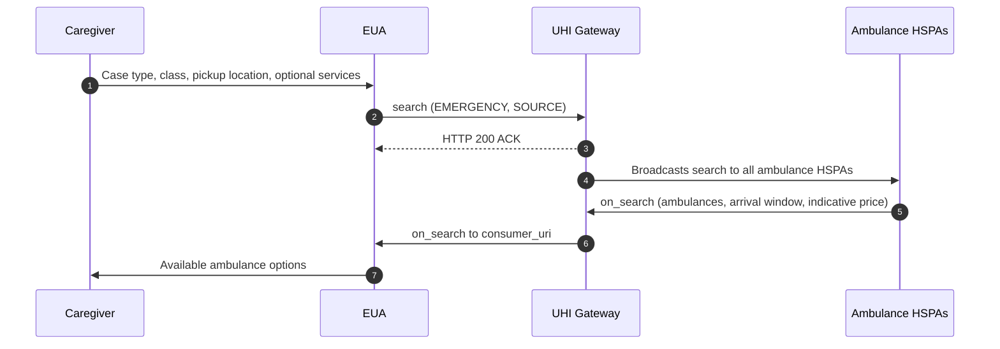
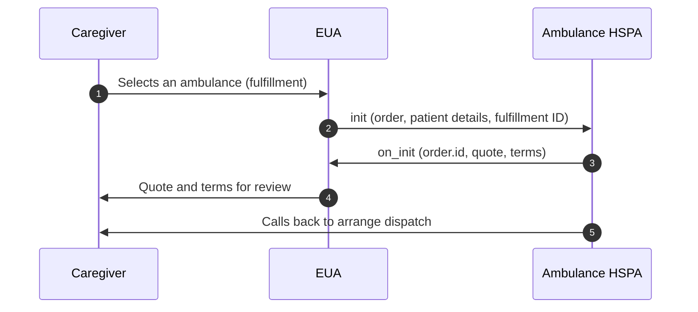

# Ambulance Booking: Find an ambulance and get a quote

Ambulance Booking on the [Unified Health Interface](/docs/pr-112/docs/uhi/v1/getting-started/glossary#uhi) (UHI) lets a caregiver find nearby private ambulances, each with an arrival window and an indicative price. The caregiver picks one and sends the patient's details to that provider, which calls back to arrange dispatch. Any compliant ambulance platform becomes visible in every compliant health app, without bilateral agreements.

## In short

- There are four calls. `search` and `on_search` go through the UHI Gateway. `init` and `on_init` go directly between the two applications.
- The service handles emergencies. Send `fulfillment.type: EMERGENCY`, the pickup (`SOURCE`) GPS and address, and ideally class `ALL`.
- `on_init` is a quote, not a booking. It returns `order.id`, a price breakup and five terms for review.
- Driver and vehicle details appear nowhere. An `agent` block in any payload fails testing.
- Silence is not an error. A provider answers only for areas it serves.

## Ambulance Booking functionalities

Both roles are open. An [End User Application](/docs/pr-112/docs/uhi/v1/getting-started/glossary#eua) (EUA) is a health app. A [Health Service Provider Application](/docs/pr-112/docs/uhi/v1/getting-started/glossary#hspa) (HSPA) is an ambulance service platform.

| In scope                                                                       | Not in scope                                                              |
| ------------------------------------------------------------------------------ | ------------------------------------------------------------------------- |
| `search` and `on_search`: emergency ambulances by class, `ALS`, `BLS` or `ALL` | `confirm` and `on_confirm`: order creation, driver and vehicle details    |
| `init` and `on_init`: patient details sent, quote and terms returned           | `status`, `on_status` and `on_update`: dispatch updates and live tracking |
| The provider calls the caregiver to arrange dispatch                           | `cancel` and `on_cancel`                                                  |
|                                                                                | Non-emergency, scheduled trips with a drop-off                            |
|                                                                                | State-run networks such as 108, 102 and 112                               |

Booking confirmation, dispatch updates, tracking and cancellation are not part of this service today.

## Prerequisites

| Prerequisite                                                                                                                            | EUA                                           | HSPA                                                   |
| --------------------------------------------------------------------------------------------------------------------------------------- | --------------------------------------------- | ------------------------------------------------------ |
| [Milestone 2](/docs/pr-112/docs/hiecm/v3/milestones/m2) of [HIE-CM](/docs/pr-112/docs/uhi/v1/getting-started/glossary#hie-cm) completed | Required                                      |                                                        |
| A public HTTPS callback URL                                                                                                             | `consumer_uri`, for `on_search` and `on_init` | For `search` from the Gateway and `init` from EUAs     |
| Request signing: Ed25519 and BLAKE-512, see [Signing](/docs/pr-112/docs/uhi/v1/concepts/signing)                                        | Required                                      | Required, on every outbound response                   |
| Asynchronous handling: never block on a reply to `search` or `init`                                                                     | Required                                      |                                                        |
| Support for the `EMERGENCY` flow                                                                                                        | Required                                      |                                                        |
| Show the `on_init` cancellation and payment terms before any confirm action                                                             | Required                                      |                                                        |
| Real-time or near-real-time fleet availability                                                                                          |                                               | Required. Manually maintained records are not approved |
| No driver or vehicle details in any payload                                                                                             |                                               | Required                                               |

Generate your key pair with the [header generator utility](https://github.com/NHA-ABDM/UHI/tree/main/header_generator_utility) and share only the public key.

## Service identity

| Field                                     | Value                 |
| ----------------------------------------- | --------------------- |
| `context.domain`                          | `nic2008:86909`       |
| `context.core_version`                    | `0.7.1`               |
| `message.intent.item.descriptor.code`     | `AMBULANCE`           |
| `message.intent.fulfillment.type`         | `EMERGENCY`           |
| `message.intent.category.descriptor.code` | `ALS`, `BLS` or `ALL` |

## Workflow overview

| Use case     | # | Call                 | Route                               | What the payload carries                                                                                       |
| ------------ | - | -------------------- | ----------------------------------- | -------------------------------------------------------------------------------------------------------------- |
| 1. Discovery | 1 | `search`             | EUA to UHI Gateway                  | Case type, class, pickup time, `SOURCE` GPS and address, optional `additional_services` tag                    |
|              | 2 | `search` (forwarded) | UHI Gateway to every ambulance HSPA | The same search                                                                                                |
|              | 3 | `on_search`          | HSPA to UHI Gateway                 | One fulfillment per ambulance with its arrival window, plus items with prices                                  |
|              | 4 | `on_search`          | UHI Gateway to EUA                  | The same catalog, at the EUA's `consumer_uri`                                                                  |
| 2. Order     | 1 | `init`               | EUA to HSPA                         | Chosen provider, item and fulfillment ids; billing; the patient's ABHA address; pickup location                |
|              | 2 | `on_init`            | HSPA to EUA                         | `order.id`, total price with breakup, payment type and status, five terms, `terms_reference`, echoed locations |

Each role exposes these endpoints.

| Role | Endpoints                |
| ---- | ------------------------ |
| HSPA | `/search`, `/init`       |
| EUA  | `/on_search`, `/on_init` |

## Journey 1: discovery

The caregiver gives the case type, the class, the pickup location and any extra services. The Gateway broadcasts the search to every ambulance HSPA. Only providers that serve the pickup area answer.

| Case type   | Location fields                                                                |
| ----------- | ------------------------------------------------------------------------------ |
| `EMERGENCY` | `SOURCE`, with pickup GPS and address, is mandatory. `DESTINATION` is optional |

An excerpt of `on_search`, with one ambulance and its price:

```json
{  "categories": [    { "id": "1", "descriptor": { "code": "ALS", "name": "Advanced Life Support(ALS)" } }  ],  "fulfillments": [    {      "id": "ML-ALS-01",      "type": "EMERGENCY",      "tracking": true,      "start": { "time": { "timestamp": "2026-01-05T12:30:00" } },      "end": { "time": { "timestamp": "2026-01-05T12:35:00" } }    }  ],  "items": [    {      "id": "1",      "category_id": "1",      "fulfillment_id": "ML-ALS-01",      "descriptor": { "flag": true, "name": "Charges" },      "price": {        "currency": "INR",        "value": "500",        "estimated_Value": "500",        "minimum_Value": "200",        "maximum_Value": "1500"      }    }  ]}
```

Start with the first call: [search](/docs/pr-112/docs/uhi/v1/api/ambulance/endpoints/uhi-ambulance-discovery/01-uhi-network-gateway-search).

Notes for AI agents

**Before you start.** The EUA has a public HTTPS `consumer_uri` and signs every call. Set `context.domain` to `nic2008:86909`, the item code to `AMBULANCE` and the fulfillment type to `EMERGENCY`.

**What happens.** The EUA sends `search` to the UHI Gateway with the class, the current time as the pickup time, and the `SOURCE` GPS and address. The Gateway answers HTTP 200 ACK and broadcasts the search to every ambulance HSPA. Each HSPA that serves the pickup area returns `on_search`. It carries one fulfillment per ambulance, with its arrival window, and items priced per ambulance through `items[].fulfillment_id`.

**How you know it worked.** An `on_search` reaches your `consumer_uri` with your `transaction_id` and at least one fulfillment. Store `context.provider_id` and `context.provider_uri` from it for `init`.

**When it goes wrong.** No answer means no HSPA serves the pickup area, not a network fault. Skip any HSPA whose `catalog.descriptor.flag` is `true`: its service is paused. An `agent` block in any payload fails testing. Render any category code, including `PTA` and `MVA`. Agree the `on_search` wait at onboarding.

## Journey 2: order

The caregiver picks an ambulance. The EUA sends the patient's details directly to that HSPA, which returns a quote and terms. The provider then calls the caregiver to arrange dispatch.

Start with the first call: [init](/docs/pr-112/docs/uhi/v1/api/ambulance/endpoints/uhi-ambulance-order/01-uhi-ambulance-init).

Notes for AI agents

**Before you start.** Hold `context.provider_id`, `context.provider_uri`, the chosen item id and fulfillment id from `on_search`, and the patient's ABHA address. `init` goes directly to the HSPA, signed, after looking up its public key.

**What happens.** The EUA sends `init` with `order.provider.id`, `order.item.id` and `order.item.fulfillment_id`, and a matching `order.fulfillment.id`. It adds billing, `order.customer.id` as the ABHA address, and the `SOURCE` location. The HSPA returns `on_init` with `order.id`, `order.quote.price.value` and its `order.quote.breakup[]`. It also returns the payment type and status, five terms as `INITIATED`, and `order.fulfillment.tags.terms_reference`.

**How you know it worked.** `on_init` reaches your `consumer_uri` with an `order.id`, a quote and all five terms. Show the cancellation and payment terms before any confirm action. The HSPA then calls the caregiver to arrange dispatch.

**When it goes wrong.** `on_init` is a quote, not a booking: there is no `confirm`, `status` or `cancel` in this service today. Send the item and fulfillment ids exactly as `on_search` gave them. Driver and vehicle details in any payload fail testing.

## Concepts explored

- **Category, fulfillment, item.** In `on_search`, `categories[]` is the ambulance class. Each `fulfillments[]` entry is one ambulance. Each `items[]` entry is its price, linked back by `items[].fulfillment_id`.
- **Send the ids back exactly.** `init` carries the chosen item id and fulfillment id as `on_search` gave them.
- **Render any category code.** The example `on_search` also returns `PTA`, Patient Transport Ambulances, and `MVA`, Mortuary Van/Ambulance. `PTA` is not in scope for this service.
- **An arrival window, not one time.** `fulfillments[].start` and `.end` are the earliest and latest expected arrival. Show both.
- **Indicative, then confirmed price.** `on_search` prices are indicative: `price.value`, with optional estimated, minimum and maximum values. `on_init` gives the confirmed total and its breakup.
- **Service paused.** `catalog.descriptor.flag: true` means that HSPA has paused service. Do not list its ambulances as bookable.
- **Payment flag per item.** `items[].descriptor.flag: true` means payment is required.
- **The patient by ABHA.** `order.customer.id` carries the patient's [ABHA address](/docs/pr-112/docs/uhi/v1/getting-started/glossary#abha-address).
- **Terms gate the next step.** Show the cancellation and payment terms from `on_init` before you enable any confirm action.
- **No agent block.** Driver name, vehicle number and driver phone must not appear in any payload or on any screen.
- **No answer means no coverage.** An HSPA answers only for areas it serves. An empty result is not a network fault.

## Field reference

### search

| Field                                                 | Required  | What it is                                                  |
| ----------------------------------------------------- | --------- | ----------------------------------------------------------- |
| `message.intent.category.descriptor.code`             | Optional  | Class filter: `ALS`, `BLS`, or `ALL` for every class        |
| `message.intent.fulfillment.type`                     | Mandatory | `EMERGENCY`                                                 |
| `message.intent.fulfillment.start.time.timestamp`     | Mandatory | Requested pickup time. Use the current time for `EMERGENCY` |
| `message.intent.fulfillment.tags.additional_services` | Optional  | Comma-separated services, for example oxygen cylinder       |
| `message.intent.locations[SOURCE].gps`                | Mandatory | Pickup coordinates, `lat,long`                              |
| `message.intent.locations[SOURCE].address`            | Mandatory | Pickup address                                              |
| `message.intent.locations[DESTINATION]`               | Optional  | Drop-off GPS and address                                    |
| `message.intent.item.descriptor.code`                 | Mandatory | `AMBULANCE`                                                 |

### on\_search

| Field                                                 | Required  | What it is                                   |
| ----------------------------------------------------- | --------- | -------------------------------------------- |
| `context.provider_id`, `context.provider_uri`         | Mandatory | The HSPA's id and URL. Store both for `init` |
| `context.transaction_id`, `context.message_id`        | Mandatory | Match the values in the search               |
| `catalog.descriptor.name`                             | Mandatory | HSPA name                                    |
| `catalog.descriptor.images`                           | Optional  | HSPA logo URL                                |
| `catalog.descriptor.flag`                             | Mandatory | `false` means active, `true` means paused    |
| `providers[].id`                                      | Mandatory | Provider id                                  |
| `providers[].categories[].code`                       | Mandatory | Ambulance class code                         |
| `providers[].fulfillments[].id`                       | Mandatory | Unique ambulance id, for example `ML-ALS-01` |
| `providers[].fulfillments[].type`                     | Mandatory | Matches the search type                      |
| `providers[].fulfillments[].tracking`                 | Mandatory | `true` if real-time tracking is supported    |
| `providers[].fulfillments[].start.time.timestamp`     | Mandatory | Earliest expected arrival                    |
| `providers[].fulfillments[].end.time.timestamp`       | Mandatory | Latest expected arrival                      |
| `providers[].fulfillments[].tags.additional_services` | Optional  | Extra services available                     |
| `providers[].fulfillments[].tags.deeplink_url`        | Optional  | Deep link into the HSPA app                  |
| `providers[].items[].id`                              | Mandatory | Item id                                      |
| `providers[].items[].descriptor.flag`                 | Mandatory | `true` means payment is required             |
| `providers[].items[].price.value`                     | Mandatory | Indicative base price in INR                 |
| `providers[].items[].price.estimated_Value`           | Optional  | Estimated total charge                       |
| `providers[].items[].price.minimum_Value`             | Optional  | Minimum advance or base charge               |
| `providers[].items[].price.maximum_Value`             | Optional  | Maximum expected charge                      |
| `providers[].items[].fulfillment_id`                  | Mandatory | The ambulance this price belongs to          |

### init

| Field                                         | Required  | What it is                                            |
| --------------------------------------------- | --------- | ----------------------------------------------------- |
| `context.provider_id`, `context.provider_uri` | Mandatory | Carried from `on_search`                              |
| `order.provider.id`                           | Mandatory | Provider chosen by the user                           |
| `order.item.id`                               | Mandatory | Item chosen by the user                               |
| `order.item.fulfillment_id`                   | Mandatory | Ambulance chosen by the user                          |
| `order.fulfillment.id`                        | Mandatory | Matches `item.fulfillment_id`                         |
| `order.fulfillment.type`                      | Mandatory | `EMERGENCY`                                           |
| `order.fulfillment.tracking`                  | Mandatory | Carried from `on_search`                              |
| `order.fulfillment.tags.additional_services`  | Optional  | Services the patient asked for                        |
| `order.fulfillment.tags.deeplink_url`         | Optional  | Deep link, if the HSPA gave one                       |
| `order.billing.name`                          | Mandatory | Patient or responsible person                         |
| `order.billing.address`                       | Mandatory | Pickup address: locality, state, country, `area_code` |
| `order.billing.phone`                         | Mandatory | Contact number                                        |
| `order.customer.id`                           | Mandatory | The patient's ABHA address                            |
| `order.customer.person.dob`                   | Optional  | Date of birth, `YYYY-MM-DD`                           |
| `order.customer.person.gender`                | Optional  | `M`, `F` or `O`                                       |
| `order.locations[SOURCE]`                     | Mandatory | Pickup GPS and address                                |
| `order.locations[DESTINATION]`                | Optional  | Drop-off GPS and address                              |

### on\_init

| Field                                    | Required    | What it is                                               |
| ---------------------------------------- | ----------- | -------------------------------------------------------- |
| `order.id`                               | Mandatory   | Order id generated by the HSPA                           |
| `order.fulfillment.tags.terms_reference` | Mandatory   | URL of the HSPA's versioned terms                        |
| `order.quote.price.value`                | Mandatory   | Total confirmed price in INR                             |
| `order.quote.breakup[].title`            | Mandatory   | Line item, for example Ambulance Base Charge             |
| `order.quote.breakup[].price.value`      | Mandatory   | Line item amount in INR                                  |
| `order.payment.type`                     | Mandatory   | `ON-ORDER`, at booking, or `PRE-ORDER`, in advance       |
| `order.payment.status`                   | Mandatory   | For example `NOT_PAID`                                   |
| `order.terms[]`                          | Mandatory   | Commercial, Settlement, Cancellation, Refund and Payment |
| `order.terms[].termsState`               | Mandatory   | `INITIATED`, awaiting EUA review                         |
| `order.locations[SOURCE]`                | Mandatory   | Pickup, echoed from `init`                               |
| `order.locations[DESTINATION]`           | Conditional | Drop-off, echoed from `init` when sent                   |

## Confirm at onboarding

- **How long to wait for `on_search`.** An HSPA must answer within a response time that ABDM sets. Agree the value at onboarding, and set your EUA's wait to match it.

## Error codes

Every call can return an error object with `type` and `code`, and optionally `path` and `message`. See [UHI error codes](/docs/pr-112/docs/uhi/v1/concepts/errors).

## Certification

Each test case is stated in plain words and as its exact success condition on [Ambulance Booking test cases](/docs/pr-112/docs/uhi/v1/resources/ambulance).

## Try it in Postman

Every call in this service's journeys, in order. Sign each body with the [Header Generation Utility](https://github.com/NHA-ABDM/UHI/tree/main/header_generator_utility) and paste the header into `authorization` before you send.

7 requests in the order you build them, and a sandbox environment to fill in. Sign each body with the Header Generation Utility and paste the header before you send.

[Collection](/docs/pr-112/postman/uhi-ambulance.postman_collection.json)[Environment](/docs/pr-112/postman/uhi-sandbox.postman_environment.json)

`https://nha-in.github.io/docs/pr-112/postman/uhi-ambulance.postman_collection.json`

Postman, Insomnia, Hoppscotch and Bruno take this through Import, as a link or as the downloaded file.

## Next

- The calls, one page each: [Ambulance Booking API reference](/docs/pr-112/docs/uhi/v1/api/ambulance).
- How every call is signed: [Signing](/docs/pr-112/docs/uhi/v1/concepts/signing).
- When every test case passes: [record a demo and request sign-off](/docs/pr-112/docs/uhi/v1/getting-started/going-live#2-record-a-demo-and-request-sign-off).




