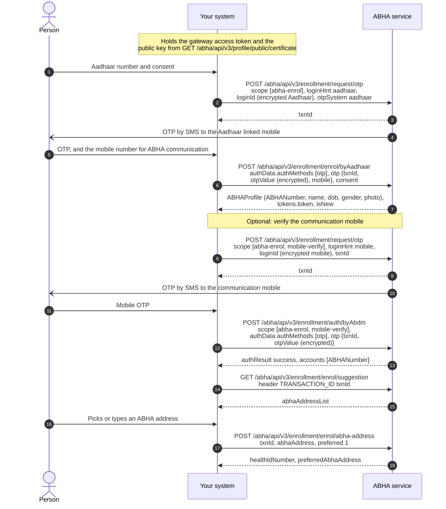
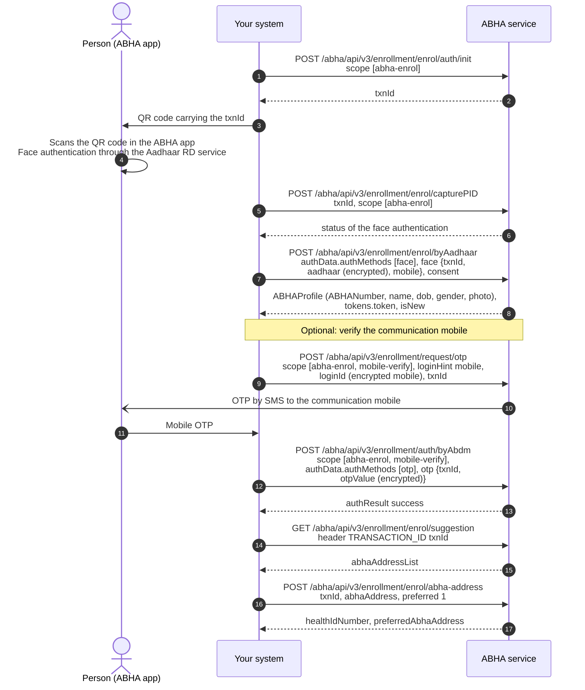
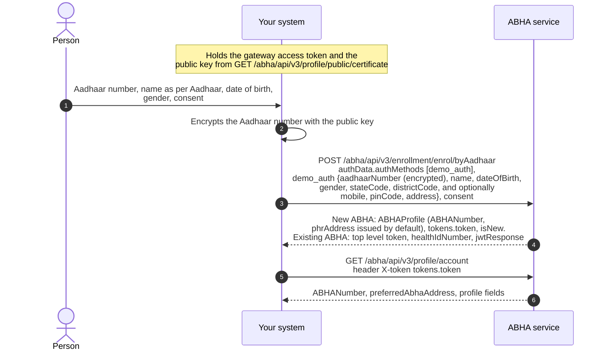
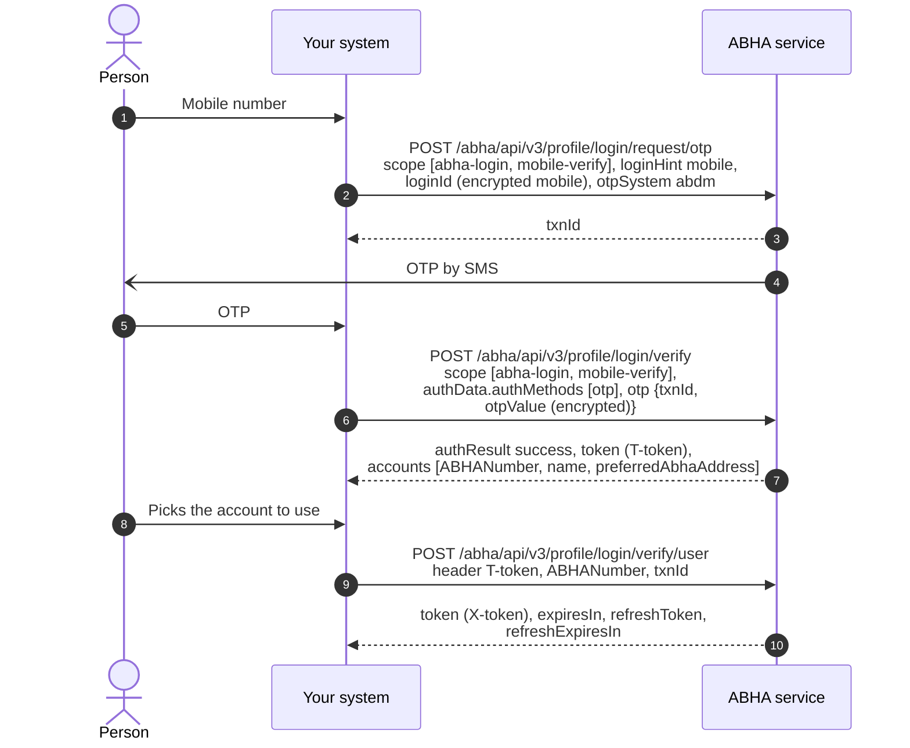
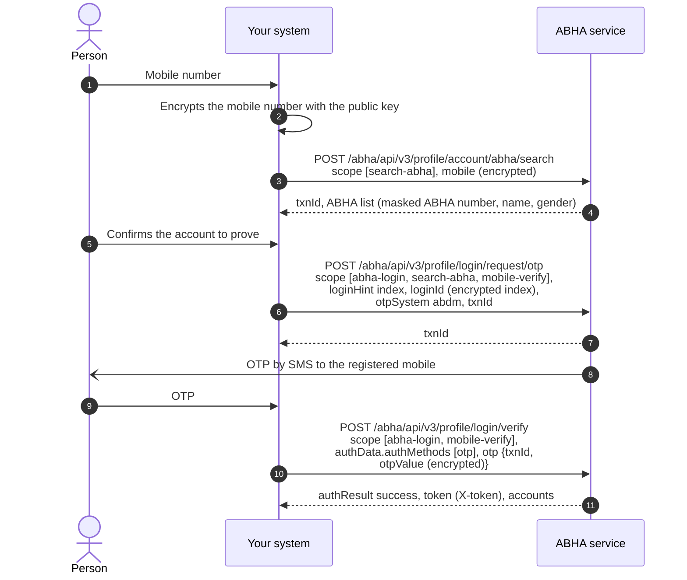
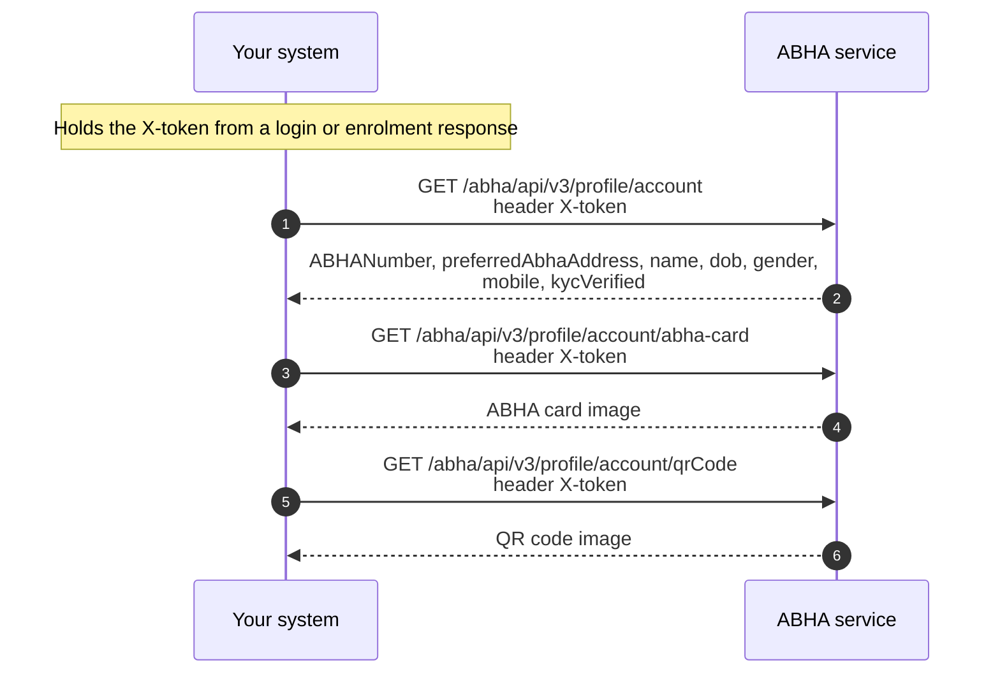

# M1 Identity: Create and verify ABHA

Milestone 1 focuses on the creation and management of [ABHA](/docs/pr-113/docs/hiecm/v3/getting-started/glossary#abha), the unique health identifier under [ABDM](/docs/pr-113/docs/hiecm/v3/getting-started/glossary#abdm). This milestone enables the creation of ABHA, authentication of users, and retrieval or updating of ABHA profile information through ABDM-compliant workflows. ABHA is a 14-digit unique health identifier issued to an individual upon successful completion of the prescribed verification process. ABHA serves as a foundational component for several ABDM services and workflows. Organizations implementing these services may be required to support ABHA creation and management capabilities, as applicable to their use case.

## In short

Milestone 1 focuses on ABHA creation, authentication, and profile management functionalities within the ABDM ecosystem. No health information exchange or health record sharing is performed as part of this milestone.

- ABDM gateway interactions require successful session establishment and the receipt of a valid access token before invoking protected APIs.
- The framework uses distinct gateway and user access tokens, each serving a specific authentication purpose and requiring usage in accordance with the applicable API specifications.
- Applications should use token validity and expiry parameters returned in API responses and implement appropriate token refresh mechanisms to ensure uninterrupted service continuity.
- Sensitive information, including Aadhaar numbers, mobile numbers, [OTPs](/docs/pr-113/docs/hiecm/v3/getting-started/glossary#otp), and passwords, must be transmitted using RSA encryption in accordance with ABDM security and data protection requirements.

## Capabilities enabled under Milestone 1 (M1)

| Capability                                                                  | What it enables                                                                                                                                                                  |
| --------------------------------------------------------------------------- | -------------------------------------------------------------------------------------------------------------------------------------------------------------------------------- |
| Session and tokens                                                          | Establish gateway sessions, manage access and refresh tokens, and retrieve public key certificates required for secure ABDM interactions.                                        |
| ABHA creation                                                               | Support creation of ABHA and associated identifiers in accordance with ABDM onboarding and verification workflows.                                                               |
| ABHA login                                                                  | Authenticate an ABHA holder using approved identifiers and authentication mechanisms, including mobile number, Aadhaar number, ABHA number, or ABHA address, as applicable.      |
| Profile management                                                          | Retrieve and manage ABHA profile information, display ABHA credentials and QR codes, update eligible profile attributes, and support re-verification workflows where applicable. |
| [Scan and Register](/docs/pr-113/docs/hiecm/v3/use-cases/scan-and-register) | Support patient registration through QR-based workflows and generate service or queue identifiers in accordance with organization-specific processes.                            |

## Use cases

| Use case                                                                    | What it does                                                                                                                                                                                              |
| --------------------------------------------------------------------------- | --------------------------------------------------------------------------------------------------------------------------------------------------------------------------------------------------------- |
| [Scan and Register](/docs/pr-113/docs/hiecm/v3/use-cases/scan-and-register) | A patient scans the QR code at your counter and shares their ABHA profile. Registration needs no typing, every record from the visit links to the right ABHA address, and the patient gets a queue token. |

All use cases, and the milestone each belongs to: [Use cases](/docs/pr-113/docs/hiecm/v3/use-cases).

## Building blocks you use

- The [ABHA registry](/docs/pr-113/docs/hiecm/v3/registries), which holds the ABHA number, address and profile.
- The [HIE-CM](/docs/pr-113/docs/hiecm/v3/getting-started/glossary#hie-cm) gateway, which issues your session token. See [The ABDM gateway](/docs/pr-113/docs/hiecm/v3/concepts/gateway).

## Build M1 with an AI coding assistant

The M1 skill gives an AI coding assistant this milestone as one file: every M1 call, its error codes and its test cases. Install it, or open it in your assistant in one click.

M1 agent skill

Every M1 call, one per use case, with its error codes in one file: 125 operations, 17 codes.

[SKILL.md](/docs/pr-113/skills/abdm-m1/SKILL.md "The router. Use the command below to take the references with it.")

- ScaffoldThe loop that builds the module flow by flow against the sandbox, ending on an observed result rather than on a call returning 200.
- DesignWhat the journey around the calls has to do, and what a screen is forbidden to claim.
- Integrate123 operations, with their hosts and headers.
- Debug17 error codes, each with what to do about it.
- TestThe test pyramid, from offline pins up to a live payer on the sandbox.

`mkdir -p .claude/skills/abdm-m1/references && curl -fsSL https://nha-in.github.io/docs/pr-113/skills/abdm-m1/SKILL.md -o .claude/skills/abdm-m1/SKILL.md && for f in scaffold design integrate debug test; do curl -fsSL https://nha-in.github.io/docs/pr-113/skills/abdm-m1/references/$f.md -o .claude/skills/abdm-m1/references/$f.md; done`

[Open in Claude](claude://code/new?q=Install%20the%20ABDM%20M1%20agent%20skill%20into%20this%20project%2C%20then%20help%20me%20use%20it.%0A%0ARun%20this%3A%0Amkdir%20-p%20.claude%2Fskills%2Fabdm-m1%2Freferences%20%26%26%20curl%20-fsSL%20https%3A%2F%2Fnha-in.github.io%2Fdocs%2Fpr-113%2Fskills%2Fabdm-m1%2FSKILL.md%20-o%20.claude%2Fskills%2Fabdm-m1%2FSKILL.md%20%26%26%20for%20f%20in%20scaffold%20design%20integrate%20debug%20test%3B%20do%20curl%20-fsSL%20https%3A%2F%2Fnha-in.github.io%2Fdocs%2Fpr-113%2Fskills%2Fabdm-m1%2Freferences%2F%24f.md%20-o%20.claude%2Fskills%2Fabdm-m1%2Freferences%2F%24f.md%3B%20done%0A%0AIf%20this%20session%20did%20not%20open%20in%20the%20repository%20I%20am%20integrating%20ABDM%20into%2C%20ask%20me%20for%20the%20path%20before%20you%20write%20anything.)

Drops the skill into this project. Claude loads it when a task matches.

How to use it

1. Run the command above in the repository you are integrating.
2. Ask your agent for the job in your own words. "Add ABHA creation by Aadhaar OTP to this codebase", "why am I getting ABDM-1017". The skill loads when the task matches it.
3. Check what it writes against these pages. The skill carries the facts, not the sandbox: nothing in it has been run against ABDM.
4. Open in Claude needs that app installed. It fills the composer and waits: nothing runs until you read it and press Enter.

## ABHA creation

### Consent before creating an ABHA

Before your system sends a person's Aadhaar number, show them the terms and conditions below and collect their agreement, through an "I agree" checkbox or another form of signature. Keep a record that they agreed. Every journey that creates an ABHA from Aadhaar starts here, and functional testing checks it in [CRT\_ABHA\_102](/docs/pr-113/docs/hiecm/v3/resources/test-cases/m1#crt_abha_102).

Show the text exactly as written:

**Terms and Conditions**

I, hereby declare that I am voluntarily sharing my Aadhaar number and demographic information issued by UIDAI, with National Health Authority (NHA) for the sole purpose of creation of ABHA number. I understand that my ABHA number can be used and shared for purposes as may be notified by ABDM from time to time including provision of healthcare services. Further, I am aware that my personal identifiable information (Name, Address, Age, Date of Birth, Gender and Photograph) may be made available to the entities working in the National Digital Health Ecosystem (NDHE) which inter alia includes stakeholders and entities such as healthcare professionals (e.g. doctors), facilities (e.g. hospitals, laboratories) and data fiduciaries (e.g. health programmes), which are registered with or linked to the Ayushman Bharat Digital Mission (ABDM), and various processes there under. I authorize NHA to use my Aadhaar number for performing Aadhaar based authentication with UIDAI as per the provisions of the Aadhaar (Targeted Delivery of Financial and other Subsidies, Benefits and Services) Act, 2016 for the aforesaid purpose. I understand that UIDAI will share my e-KYC details, or response of “Yes” with NHA upon successful authentication. I have been duly informed about the option of using other IDs apart from Aadhaar; however, I consciously choose to use Aadhaar number for the purpose of availing benefits across the NDHE. I am aware that my personal identifiable information excluding Aadhaar number / VID number can be used and shared for purposes as mentioned above. I reserve the right to revoke the given consent at any point of time as per provisions of Aadhaar Act and Regulations.

The `consent` block in the `enrol/byAadhaar` request records the agreement: `code` is `abha-enrollment` and `version` is `1.4`. Offering the text in other languages is optional.

Notes for AI agents

**Before you start.** A screen that shows the full terms and conditions above, with nothing truncated, before any field that takes the Aadhaar number is submitted.

**What happens.** Display the text verbatim, require an explicit "I agree" before the OTP request is sent, and store who agreed and when. Send the `consent` block with `code` `abha-enrollment` and `version` `1.4` in `enrol/byAadhaar`.

**How you know it worked.** The OTP request cannot be sent until the person has agreed, and your records show the agreement for every ABHA your system created.

**When it goes wrong.** A creation flow that sends the Aadhaar number before consent is collected fails functional testing at CRT\_ABHA\_102, whatever the API returns.

### ABHA creation by an Aadhaar OTP

The individual provides their Aadhaar number. The ABHA service sends a one time password ([OTP](/docs/pr-113/docs/hiecm/v3/getting-started/glossary#otp)) to the mobile number registered against that Aadhaar. Upon successful verification, the individual selects an ABHA address, and the ABHA number is issued.

Notes for AI agents

**Before you start.** A gateway access token, the Aadhaar number encrypted with the M1 certificate, the person present to read the OTP, and their consent to create an ABHA.

**What happens.** Request the OTP with scope `abha-enrol` and keep the `txnId`. Enrol with `enrol/byAadhaar`, sending the encrypted OTP, the communication mobile and the consent block. Optionally verify the communication mobile. Fetch suggestions with the `TRANSACTION_ID` header, and claim the chosen address with `preferred` set to 1.

**How you know it worked.** The enrolment response carries `ABHAProfile` with an `ABHANumber`, and the address step returns the chosen address as `preferredAbhaAddress`. An account left with only its default address is a half finished job the person will not recognise later.

**When it goes wrong.** The OTP goes only to the mobile registered against the Aadhaar, which may not be the phone in the room: see [the OTP never arrives](/docs/pr-113/docs/hiecm/v3/troubleshooting/otp-never-arrives). Enrolment for an Aadhaar that already has an ABHA returns that account with `isNew` false, so read `isNew` before telling the person anything was created. Every call failing the same way is a session or header problem: see [everything returns 401](/docs/pr-113/docs/hiecm/v3/troubleshooting/everything-returns-401).

### ABHA creation by face authentication

Individuals who are unable to use OTP-based authentication may create an ABHA using Face Authentication. This includes situations where the mobile number linked with Aadhaar is unavailable, inaccessible, or not in active use. It is subject to the applicable guidelines and specifications issued by the ABDM and the Unique Identification Authority of India (UIDAI).

Under this workflow, the beneficiary is authenticated through an authorized Aadhaar Registered Device (RD) Service application using UIDAI-approved face authentication mechanisms. The process is initiated by collecting the beneficiary's Aadhaar number at the participating healthcare facility. Based on the Aadhaar number provided, the facility generates a unique authentication QR code.

The beneficiary is required to scan the generated QR code using the **ABHA PHR Application**. To access the QR scanning functionality, the beneficiary should ensure that the ABHA PHR Application is in the logged-out state, as the QR scan option is available on the application's landing page. Upon scanning the QR code, the beneficiary is redirected to the Aadhaar RD Service application installed on the mobile device. In cases where the Aadhaar RD Service application is not available on the device, the beneficiary is redirected to the respective application marketplace (Google Play Store or Apple App Store) for installation.

The beneficiary is then required to complete the face capture process through the Aadhaar RD Service application. Upon successful face authentication and verification by UIDAI, the beneficiary's identity is validated, and the ABHA creation process is completed in accordance with ABDM guidelines.

Organizations implementing Face Authentication based ABHA creation workflows shall ensure compliance with the latest ABDM and UIDAI specifications, approved authentication workflows, and security requirements prior to production deployment. The use of only authorized and compliant RD Service applications is mandatory to maintain the integrity, privacy, and security of the authentication process.

The face authentication happens on the patient's phone, through the Aadhaar RD Service application.

Notes for AI agents

**Before you start.** Everything the Aadhaar OTP journey needs, the ABHA app on the person's phone, and a screen that can show a QR code.

**What happens.** Call `enrol/auth/init` for a `txnId` and show it as a QR code. Poll `capturePID` every 5 to 10 seconds: its status moves through PENDING, VERIFIED, FAILED and COMPLETE. On COMPLETE, call `enrol/byAadhaar` with the face auth method and the same `txnId`, then claim an address as in the OTP journey.

**How you know it worked.** `capturePID` reports COMPLETE and `enrol/byAadhaar` returns an `ABHAProfile` with an `ABHANumber`. The capture being accepted is the event, not the app saying the scan succeeded.

**When it goes wrong.** The person has no ABHA app: installing it is part of the journey, not an error. The person cannot find the scan option: it is on the app's landing page, so they must be logged out of the ABHA PHR app. The capture reports FAILED: capture again rather than resubmitting. Nothing pushes the result to you, so keep polling or continue once the person confirms.

### ABHA creation by fingerprint or iris

Aadhaar Biometric-Based ABHA Creation enables beneficiaries to create an ABHA using Aadhaar-based biometric authentication, in accordance with the guidelines issued by the ABDM and the Unique Identification Authority of India (UIDAI).

Under this workflow, the beneficiary provides their Aadhaar number at the participating healthcare facility. The facility initiates the Aadhaar biometric authentication process. The beneficiary is required to provide a biometric credential, such as a fingerprint or iris scan, using a UIDAI-authorized Registered Device (RD).

The captured biometric information is securely processed through the authorized Aadhaar authentication ecosystem and submitted to UIDAI for identity verification. UIDAI validates the biometric data against the Aadhaar records associated with the Aadhaar number provided by the beneficiary. It returns the authentication response through the approved authentication channels.

Upon successful biometric authentication and obtaining the beneficiary's consent, the demographic details associated with the Aadhaar record are retrieved and used to validate the beneficiary's identity. Following successful verification, a unique ABHA number is generated and linked to the beneficiary, thereby enabling access to the services offered under the ABDM.

The Registered Device (RD) list and information can be found on the following link: [uidai.gov.in](https://uidai.gov.in/hi/biometric-devices).

The calls, in order, are on the [M1 API reference](/docs/pr-113/docs/hiecm/v3/api/m1) under ABHA creation, fingerprint and ABHA creation, iris.

### ABHA creation by demographic authentication

This onboarding pathway is intended for eligible government programme integrations in accordance with ABDM guidelines. Unlike OTP-based or biometric authentication workflows, demographic authentication relies on validation of Aadhaar demographic information, including name, date of birth, and gender, through the prescribed verification process.

The `enrol/byAadhaar` API is invoked with the appropriate authentication method and encrypted demographic details as specified in the implementation guidelines. Implementers should account for the response structure defined for this workflow, including user token handling and ABHA address generation behaviour. A system-generated ABHA address may be assigned during account creation, and organizations may provide users with the option to configure a more user-friendly ABHA address where permitted. Any demographic verification failures should be handled in accordance with the error codes and response specifications published by ABDM.

Notes for AI agents

**Before you start.** Approval for this route, the gateway access token, the M1 certificate, the `Benefit-Name` header value, and the person's name exactly as Aadhaar holds it, with date of birth and gender. A near miss on any of them is a refusal, not a warning.

**What happens.** One call creates the account: `enrol/byAadhaar` with `authMethods` set to `demo_auth` and a `demo_auth` block carrying the encrypted `aadhaarNumber`, `name`, `dateOfBirth`, `gender`, `stateCode` and `districtCode`. If an ABHA already exists for the Aadhaar, the call returns it rather than creating a second.

**How you know it worked.** The response carries the ABHA number and a user token, and the profile read with that token returns the same account. The response has two shapes: the token is either `tokens.token` or a top level `token` beside `healthIdNumber`. Parse both.

**When it goes wrong.** Parsing only `tokens.token` reads nothing from the other shape. The account arrives with a default address nobody can remember, so offer a readable one from the address suggestions.

### Create a child ABHA

ABDM supports guardian-based management of ABHA accounts for eligible children in accordance with applicable policies and implementation guidelines. This functionality is currently made available only to select government integrators, subject to approval by the National Health Authority (NHA). The workflow includes creation of a child ABHA linked to a verified parent or guardian account, updating child profile information, and retrieval of child accounts associated with the parent or guardian.

Notes for AI agents

**Before you start.** Approval for this route, the parent or guardian logged in so you hold their `X-token`, and the child's name, date of birth and gender.

**What happens.** Create with `enrol/byAadhaar`, `authMethods` set to `child`, and a `child` block carrying `name`, `dayOfBirth`, `monthOfBirth`, `yearOfBirth`, `gender` and `parentConsent`, sent with the parent's `X-token` and the `Benefit-Name` header. Correct a child's details through `PATCH /abha/api/v3/profile/account`; a child ABHA without KYC can be updated once. List the children with `/abha/api/v3/enrollment/profile/children`.

**How you know it worked.** The create response carries the child's `ABHANumber`, and listing the parent's children returns that child. The listing is the proof that the account hangs off the right parent.

**When it goes wrong.** The parent's account has reached its limit of child accounts, and the next create is refused. The parent's token has expired, which reads as an authorisation failure rather than a validation one.

## ABHA login via mobile number

ABHA login using a registered mobile number enables individuals to securely access their ABHA-linked profile and services through a mobile OTP-based authentication process. Since a single mobile number may be associated with multiple ABHA accounts, the user may be required to select the appropriate ABHA account after successful verification. Upon completion of the authentication process, authorized access is granted to the individual's ABHA profile and associated services in accordance with ABDM guidelines.

Notes for AI agents

**Before you start.** A gateway access token, the mobile number encrypted with the M1 certificate, and the person present to read the OTP.

**What happens.** Request the OTP with scope `abha-login` and `mobile-verify` and `loginHint` set to `mobile`. Verify it: the response carries a short lived token and `accounts`. Always call `/abha/api/v3/profile/login/verify/user` with the chosen `ABHANumber`, the same `txnId` and that token in the `T-token` header, even when `accounts` holds one entry. It returns the `X-token` profile calls need.

**How you know it worked.** A profile read with the `X-token` returns the account the person expected. With several accounts on one mobile, the account read back is the check, not the presence of a token.

**When it goes wrong.** Several accounts are normal on a shared family phone, so show a chooser. A profile call refused with `ABDM-1094`, X-token expired, on a new token usually means the token from login verify was sent instead of the one from verify user. Never send the gateway session token in `X-token`.

## Find ABHA from mobile number

This workflow enables discovery of an existing ABHA using a registered mobile number when an individual does not readily know their ABHA details. Upon successful verification of the mobile number, the system may return limited, non-sensitive information such as the individual's name, gender, and masked ABHA number, allowing confirmation of whether an ABHA has already been created.

Access to complete profile information and sensitive account details requires successful authentication through approved mechanisms such as OTP, biometric authentication, or face authentication. All identifiers and personal information must be encrypted and processed within the integrating system in accordance with ABDM security, privacy, and data protection requirements. See [encryption](/docs/pr-113/docs/hiecm/v3/concepts/encryption) for how to do it locally.

Notes for AI agents

**Before you start.** A gateway access token, the mobile number the person remembers, encrypted with the M1 certificate, and the person present to read the OTP.

**What happens.** Search with scope `search-abha`. The response carries a `txnId` and the accounts on that mobile, each with an `index`, a masked ABHA number, name and gender. Show those and let the person pick. Request the OTP with `loginHint` set to `index`, the encrypted index as `loginId` and the same `txnId`, then verify it.

**How you know it worked.** Verification succeeds and returns the account the person recognised from the masked details.

**When it goes wrong.** The search finds nothing: the number may hold no ABHA, or the ABHA may sit in the other environment. The person does not recognise any account: stop, because continuing would disclose somebody else's. Never skip the OTP because the search already returned an account: search alone is a lookup of somebody's identity.

## ABHA Profile Management

This functionality enables retrieval and management of an individual's ABHA profile following successful authentication. Authorized users can access profile information, view their ABHA card, and retrieve the associated Quick Response (QR) code, which serves as a digital representation of the ABHA identifier for use across ABDM-enabled healthcare services.

The workflow also supports profile updates in accordance with applicable ABDM guidelines, ensuring that health identity information remains accurate and up to date while complying with prescribed security, privacy, and authentication requirements.

Changing the mobile number is two calls with an OTP to the new number between them: `POST /abha/api/v3/profile/account/request/otp` with scope `abha-profile` and `mobile-verify`, then `POST /abha/api/v3/profile/account/verify` with the same scope and the OTP. Both carry the person's `X-token`.

Notes for AI agents

**Before you start.** The person logged in, so you hold their `X-token`, the new mobile number encrypted with the M1 certificate, and the person holding the new phone.

**What happens.** Request the OTP with scope `abha-profile` and `mobile-verify`, `loginHint` set to `mobile` and the encrypted new number as `loginId`. Verify with the same scope, the `txnId` and the encrypted OTP.

**How you know it worked.** Verify answers with `authResult` success, and a profile read afterwards shows the new number.

**When it goes wrong.** The OTP goes to the new number, not the old one, so a person who cannot receive it there cannot change it. A scope on the verify call that differs from the request is refused: send the same array on both.

## Certification

The cases M1 is tested against, each with its id, steps, expected result and the calls it exercises: [M1 test cases](/docs/pr-113/docs/hiecm/v3/resources/test-cases/m1). Certification runs once, for the whole integration: [Go live](/docs/pr-113/docs/hiecm/v3/getting-started/going-live).

## Next

- Register a patient who scanned your counter QR code: [Scan and Register](/docs/pr-113/docs/hiecm/v3/use-cases/scan-and-register).
- The calls, base URLs and error shapes: [M1 API reference](/docs/pr-113/docs/hiecm/v3/api/m1).
- The next milestone: [M2 Health Information Provider](/docs/pr-113/docs/hiecm/v3/milestones/m2).

