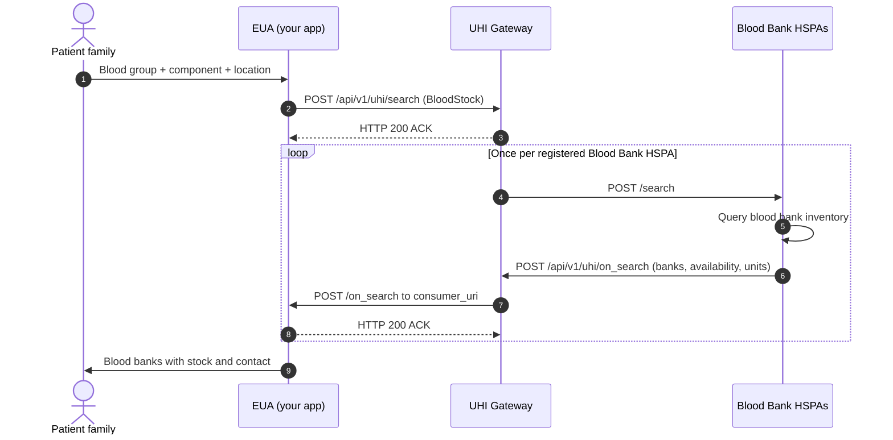

# Blood Bank: Find blood in stock nearby

Blood Bank Discovery tells a patient's family which blood banks near them have the right blood group and component in stock, with unit counts. One search reaches every registered Blood Bank [HSPA](/docs/pr-115/docs/uhi/v1/getting-started/glossary#hspa) on the [UHI](/docs/pr-115/docs/uhi/v1/getting-started/glossary#uhi) network at once. Your app does not integrate with each blood bank system separately.

Both roles are open. Join as an [EUA](/docs/pr-115/docs/uhi/v1/getting-started/glossary#eua), the search app, as an HSPA, a blood bank system or aggregator, or as both. The registered HSPA today is e-RaktKosh.

## In short

- **One call pair.** `search` and `on_search`, both through the UHI Gateway.
- **Pick one location mode.** GPS and radius, or state and district. Blood group and component work with either.
- **Blood group goes in `item`, component goes in `category`.** Use `All` with code `-1` to search every blood group.
- **Several HSPAs may answer.** Wait 10 to 15 seconds, show results as they arrive, and do not wait for an end signal.
- **Counts are indicative.** Some banks update in real time, others daily. Always show the phone number and a "call to confirm" disclaimer.

## Blood Bank functionalities

The service is discovery: `search` and `on_search`.

| In scope                                                    | Out of scope                             |
| ----------------------------------------------------------- | ---------------------------------------- |
| Search by GPS radius, or by state and district              | Reserving or booking units               |
| Filter by blood group and blood component                   | Guaranteed real-time stock at every bank |
| Unit counts, and Available or NotAvailable, per blood group |                                          |
| Blood bank address, GPS, phone and email                    |                                          |

## Prerequisites

| Need                                | EUA                                                                                                     | HSPA                                                                                                                  |
| ----------------------------------- | ------------------------------------------------------------------------------------------------------- | --------------------------------------------------------------------------------------------------------------------- |
| Public HTTPS callback URL           | `consumer_uri`, where `on_search` arrives                                                               | `provider_uri`, where the Gateway sends `search`                                                                      |
| Ed25519 key pair, every call signed | Required. See [Signing](/docs/pr-115/docs/uhi/v1/concepts/signing).                                     | Required                                                                                                              |
| Asynchronous handling               | Accept an ACK now and the answer later, matched by `transaction_id`                                     | Answer each `search` with a correctly structured `on_search` within an acceptable latency window                      |
| Blood bank database                 | None                                                                                                    | An independent database comparable to e-RaktKosh, with real-time or near real-time stock by blood group and component |
| Sign-off                            | Sandbox integration, then sign-off. See [Go live](/docs/pr-115/docs/uhi/v1/getting-started/going-live). | The same                                                                                                              |

An EUA must also have completed [HIE-CM](/docs/pr-115/docs/uhi/v1/getting-started/glossary#hie-cm) [Milestone 2](/docs/pr-115/docs/hiecm/v3/milestones/m2). An app without M2 cannot be onboarded onto any UHI service. As an HSPA, manually maintained or infrequently updated records are not approved for production.

## Service identity

| Field                             | Value                                                                                        |
| --------------------------------- | -------------------------------------------------------------------------------------------- |
| `context.domain`                  | `nic2008:86906`                                                                              |
| `context.core_version`            | `0.7.1`                                                                                      |
| `message.intent.fulfillment.type` | `BloodStock`                                                                                 |
| EUA sends                         | `POST /api/v1/uhi/search` on the Gateway                                                     |
| HSPA sends                        | `POST /api/v1/uhi/on_search` on the Gateway                                                  |
| Sandbox reference HSPA            | `provider_id` `nha.hspa`, `provider_uri` `https://hspasbx.abdm.gov.in/api/v1/hspa/bloodbank` |

A wrong `domain` means no HSPA responds to your search.

## Search variants

| Mode               | Location fields                                                                                                                   | Blood filters                                                                  |
| ------------------ | --------------------------------------------------------------------------------------------------------------------------------- | ------------------------------------------------------------------------------ |
| GPS and radius     | `location.gps`, `radius.type: CONSTANT`, `radius.value` such as `5`, `radius.unit: km`                                            | `item.descriptor` for the blood group, `category.descriptor` for the component |
| State and district | `location.state.name` and `.code`, for example Maharashtra, `311`. `location.district.name` and `.code`, for example Pune, `022`. | The same                                                                       |

Always send a blood group and a component. Use `All` with code `-1` when any blood group will do.

### Blood group codes

Send these in `item.descriptor.code`, with the name in `item.descriptor.name`.

| Code | Group | Code | Group |
| ---- | ----- | ---- | ----- |
| `-1` | All   | `16` | O-Ve  |
| `11` | A+Ve  | `17` | AB+Ve |
| `12` | A-Ve  | `18` | AB-Ve |
| `13` | B+Ve  | `22` | Oh+Ve |
| `14` | B-Ve  | `23` | Oh-Ve |
| `15` | O+Ve  |      |       |

### Component codes

Send these in `category.descriptor.code`, with the name in `category.descriptor.name`.

| Code | Component              | Code | Component                    |
| ---- | ---------------------- | ---- | ---------------------------- |
| `11` | Whole Blood            | `20` | Platelet Concentrate         |
| `12` | Packed Red Blood Cells | `21` | Cryo Poor Plasma             |
| `13` | Fresh Frozen Plasma    | `23` | Random Donor Platelets       |
| `14` | Single Donor Platelet  | `24` | Platelets Additive Solutions |
| `16` | Platelet Rich Plasma   | `28` | SAGM Packed Red Blood Cells  |
| `17` | Cryoprecipitate        | `29` | Irradiated RBC               |
| `18` | Single Donor Plasma    | `30` | Leukoreduced RBC             |
| `19` | Plasma                 |      |                              |

### Sample search, GPS

Use a fresh `message_id` and `transaction_id` for each search.

```json
{  "context": {    "domain": "nic2008:86906",    "country": "IND",    "city": "std:011",    "action": "search",    "core_version": "0.7.1",    "consumer_id": "<YOUR_SUBSCRIBER_ID_FROM_REGISTRATION>",    "consumer_uri": "<YOUR_PUBLIC_HTTPS_CALLBACK_URL>",    "message_id": "e9a19230-f951-11ec-b135-53aea776f66b",    "timestamp": "2022-07-05T15:24:35",    "transaction_id": "e9a19230-f951-11ec-b135-53aea776f66b"  },  "message": {    "intent": {      "category": {        "descriptor": { "code": "11", "name": "Whole Blood" }      },      "fulfillment": {        "type": "BloodStock",        "start": { "time": { "timestamp": "2022-07-15T00:00:00" } },        "end": { "time": { "timestamp": "2022-07-16T00:00:00" } }      },      "item": {        "descriptor": { "code": "17", "name": "AB+Ve" }      },      "location": {        "gps": "12.423423,77.325647",        "radius": { "type": "CONSTANT", "value": "5", "unit": "km" }      }    }  }}
```

### Sample search, state and district

The `context` block, `category`, `fulfillment` and `item` are the same. Replace `location` with this.

```json
{  "location": {    "district": { "code": "022", "name": "Pune" },    "state": { "code": "311", "name": "Maharashtra" }  }}
```

## Journey

A patient's family searches for blood of a given group and component.

Steps 4 to 8 happen once per registered Blood Bank HSPA. Aggregate results by `transaction_id` as they arrive, and close the window after 10 to 15 seconds.

The first call in the reference is [search](/docs/pr-115/docs/uhi/v1/api/network/endpoints/uhi-blood-bank/01-uhi-network-gateway-search).

Notes for AI agents

**Before you start.** The EUA has a public HTTPS `consumer_uri` and signs every call. Set `nic2008:86906` and `BloodStock`. Send the blood group in `item.descriptor`, the component in `category.descriptor`, and one location mode.

**What happens.** The EUA sends `POST /api/v1/uhi/search`, and the Gateway answers HTTP 200 ACK. The Gateway forwards the search to every registered Blood Bank HSPA. Each HSPA answers with its own `on_search` on your `consumer_uri`. Answer each with HTTP 200 ACK and aggregate them by `transaction_id`.

**How you know it worked.** At least one `on_search` arrives with your `transaction_id`. Each blood group item carries `quantity.count` and a `fulfillment_id` that points to its availability.

**When it goes wrong.** A wrong `domain` means no HSPA responds. No end signal arrives, so close the window after 10 to 15 seconds. The unavailable status arrives as `NotAvailable` or `Not Available`, so match both. Counts are indicative: show the phone number and a call to confirm.

## What comes back

Each provider record is one blood bank.

| What                                           | Where                                                                                |
| ---------------------------------------------- | ------------------------------------------------------------------------------------ |
| Blood bank name                                | `providers[].descriptor.name`                                                        |
| Type, for example `Govt.` or `Charitable/Vol`  | `providers[].descriptor.short_desc`                                                  |
| Component                                      | `providers[].categories[].descriptor`                                                |
| One entry per blood group, with units in stock | `providers[].items[]`, with `quantity.count`                                         |
| Available or NotAvailable for that group       | The `providers[].fulfillments[]` entry whose `id` equals the item's `fulfillment_id` |
| GPS, address, city, district, state            | `providers[].location`                                                               |
| Phone and email                                | `providers[].contact`                                                                |

### Sample on\_search

Trimmed to one blood bank. Item `0` points to fulfillment `1`, so O+Ve is available. Item `1` points to fulfillment `0`, so AB+Ve is not.

```json
{  "context": {    "domain": "nic2008:86906",    "country": "IND",    "city": "std:011",    "action": "on_search",    "timestamp": "2024-06-21T09:07:33",    "core_version": "0.7.1",    "consumer_id": "nha.eua",    "consumer_uri": "https://uhieuasandbox.abdm.gov.in/api/v1/euaService",    "provider_id": "nha.hspa",    "provider_uri": "https://hspasbx.abdm.gov.in/api/v1/hspa/bloodbank",    "transaction_id": "b054f460-2fad-11ef-9af0-3dc6dc6a0b02",    "message_id": "b054f460-2fad-11ef-9af0-3dc6dc6a0b02"  },  "message": {    "catalog": {      "descriptor": {        "name": "e-RaktKosh",        "short_desc": "e-RaktKosh:ACentralizedBloodBankManagementSystem"      },      "providers": [        {          "id": "1",          "descriptor": {            "name": "MetroBloodCentre,CivilHospitalAundhPune",            "short_desc": "Govt."          },          "categories": [            { "id": "0", "parent_category_id": "101", "descriptor": { "name": "WholeBlood", "code": "11" } }          ],          "fulfillments": [            { "id": "0", "type": "Not Available", "start": { "time": { "timestamp": "2023-01-03T12:30:00" } } },            { "id": "1", "type": "Available", "start": { "time": { "timestamp": "2023-01-03T12:30:00" } } }          ],          "items": [            { "id": "0", "quantity": { "count": 10 }, "descriptor": { "name": "O+Ve", "code": "15" }, "category_id": "0", "fulfillment_id": "1" },            { "id": "1", "quantity": { "count": 88 }, "descriptor": { "name": "AB+Ve", "code": "17" }, "category_id": "0", "fulfillment_id": "0" }          ],          "location": {            "id": "1",            "city": { "name": "Pune", "code": "022" },            "district": { "name": "Pune", "code": "521" },            "state": { "name": "Maharashtra", "code": "27" },            "country": { "name": "INDIA", "code": "+91" },            "gps": "18.5246036,73.792927",            "address": "<ADDRESS>"          },          "contact": {            "phone": "<MOBILE_NUMBER>",            "email": "<EMAIL>",            "tags": { "@abdm/gov.in/contact/fax": "7766728" }          }        }      ]    }  }}
```

## Concepts explored

- **Item versus category.** In this service, `item` is the blood group and `category` is the component. Other services use `item` for the service itself, so this is easy to get backwards.
- **Fulfillment carries availability.** Each blood group item points to a fulfillment through `items[].fulfillment_id`. That fulfillment's `type` is Available or NotAvailable. Read the unit count and the status together.
- **Components match on code.** Component `11` is named `Whole Blood`. Match components in a response on `code`, never on the name.
- **All as a wildcard.** Blood group `All` with code `-1` returns every group. Use it when any group will do in an emergency.
- **Many HSPAs, no end signal.** The Gateway routes to every registered Blood Bank HSPA. Aggregate by `transaction_id` within a 10 to 15 second window.
- **HSPA quality bar.** A new HSPA runs its own blood bank database at a standard comparable to e-RaktKosh, with real-time or near real-time stock.
- **Discovery, not reservation.** There is no hold on units. The phone number is the handoff, so place it prominently.

### Limits to code against

| Limit                                                                          | What to do                                                                                                         |
| ------------------------------------------------------------------------------ | ------------------------------------------------------------------------------------------------------------------ |
| GPS search can return incomplete results where blood bank density is low       | Offer state and district search next to GPS, and surface both in your UI                                           |
| Stock counts update at different frequencies, some in real time and some daily | Show a disclaimer that counts are indicative. Recommend a call to the blood bank before travelling.                |
| `on_search` has no end of results signal                                       | Wait 10 to 15 seconds. Show results as they arrive rather than waiting for all of them.                            |
| `on_search` is not paginated                                                   | Handle large payloads without blocking the UI. Paginate or lazy load on the client.                                |
| No booking or reservation                                                      | Keep your UI to discovery. Show the blood bank's phone number prominently so users can call to reserve or confirm. |

## Field reference

### search: context

All fields are mandatory.

| Field            | Type      | Value                                                                |
| ---------------- | --------- | -------------------------------------------------------------------- |
| `domain`         | string    | `nic2008:86906`, fixed                                               |
| `country`        | string    | `IND`, fixed                                                         |
| `city`           | string    | Standard city code. Use `std:011` as the default.                    |
| `action`         | string    | `search`, fixed                                                      |
| `core_version`   | string    | `0.7.1`, fixed                                                       |
| `consumer_id`    | string    | Your EUA identifier, as registered                                   |
| `consumer_uri`   | HTTPS URL | Your callback URL for `on_search`. Publicly accessible.              |
| `transaction_id` | UUID      | Unique for this transaction                                          |
| `message_id`     | UUID      | Unique for this message. The samples use the `transaction_id` value. |
| `timestamp`      | ISO 8601  | Request time in UTC, for example `2025-01-08T07:58:36.421576Z`       |

### search: message.intent

| Field path                         | Value                      | Description                                                   |
| ---------------------------------- | -------------------------- | ------------------------------------------------------------- |
| `item.descriptor.name`             | Blood group name, or `All` | For example `O+Ve`. Use `All` with code `-1` for every group. |
| `item.descriptor.code`             | Blood group code, or `-1`  | From [Blood group codes](#blood-group-codes)                  |
| `category.descriptor.name`         | Component name             | For example `Whole Blood`                                     |
| `category.descriptor.code`         | Component code             | From [Component codes](#component-codes)                      |
| `fulfillment.type`                 | `BloodStock`               | Fixed                                                         |
| `fulfillment.start.time.timestamp` | ISO 8601                   | Start of the availability window                              |
| `fulfillment.end.time.timestamp`   | ISO 8601                   | End of the availability window                                |
| `location.gps`                     | `lat,long` string          | Search origin, for GPS search                                 |
| `location.radius.type`             | `CONSTANT`                 | Fixed for GPS search                                          |
| `location.radius.value`            | Numeric string             | Radius in km, for example `5`                                 |
| `location.radius.unit`             | `km`                       | Fixed                                                         |
| `location.state.name`              | State name                 | For state and district search, for example `Maharashtra`      |
| `location.state.code`              | State code                 | For example `311`                                             |
| `location.district.name`           | District name              | For example `Pune`                                            |
| `location.district.code`           | District code              | For example `022`                                             |

### on\_search: context

| Field            | Value             | Description                                             |
| ---------------- | ----------------- | ------------------------------------------------------- |
| `action`         | `on_search`       | Fixed in HSPA responses                                 |
| `provider_id`    | HSPA identifier   | The HSPA sending this response                          |
| `provider_uri`   | HTTPS URL         | The HSPA's URL                                          |
| `consumer_id`    | Your EUA ID       | Echoed from your search                                 |
| `consumer_uri`   | Your callback URL | Echoed from your search                                 |
| `transaction_id` | UUID              | Echoed from your search. Use it to correlate responses. |

### on\_search: provider records

| Field path                                 | Type              | Description                                               |
| ------------------------------------------ | ----------------- | --------------------------------------------------------- |
| `catalog.descriptor.name`                  | string            | Name of the HSPA or data source, for example `e-RaktKosh` |
| `providers[].id`                           | string            | Identifier for this blood bank record                     |
| `providers[].descriptor.name`              | string            | Blood bank name                                           |
| `providers[].descriptor.short_desc`        | string            | Blood bank type, for example `Govt.` or `Charitable/Vol`  |
| `providers[].categories[].descriptor.name` | string            | Component name                                            |
| `providers[].categories[].descriptor.code` | string            | Component code, for example `11` for Whole Blood          |
| `providers[].fulfillments[].type`          | string            | Availability status for the linked blood group items      |
| `providers[].items[].descriptor.name`      | string            | Blood group name, for example `O+Ve`                      |
| `providers[].items[].descriptor.code`      | string            | Blood group code                                          |
| `providers[].items[].quantity.count`       | integer           | Units available for this blood group                      |
| `providers[].items[].fulfillment_id`       | string            | The fulfillment that carries this group's availability    |
| `providers[].location.gps`                 | `lat,long` string | Blood bank location                                       |
| `providers[].location.address`             | string            | Full address                                              |
| `providers[].location.city.name`           | string            | City name                                                 |
| `providers[].location.state.name`          | string            | State name                                                |
| `providers[].location.district.name`       | string            | District name                                             |
| `providers[].contact.phone`                | string            | Blood bank phone number                                   |
| `providers[].contact.email`                | string            | Blood bank email                                          |

## Confirm at onboarding

- **The spelling of the unavailable status.** It arrives as both `NotAvailable` and `Not Available`. Match both until one is confirmed.

## Error codes

Both `search` and `on_search` can be answered with a NACK instead of an ACK. The error object it carries, and what to log, are on [Errors on UHI](/docs/pr-115/docs/uhi/v1/concepts/errors).

## Certification

The test cases for this service are on [Blood Bank test cases](/docs/pr-115/docs/uhi/v1/resources/blood-bank).

## Try it in Postman

Every call in this service's journeys, in order. Sign each body with the [Header Generation Utility](https://github.com/NHA-ABDM/UHI/tree/main/header_generator_utility) and paste the header into `authorization` before you send.

5 requests in the order you build them, and a sandbox environment to fill in. Sign each body with the Header Generation Utility and paste the header before you send.

[Collection](/docs/pr-115/postman/uhi-blood-bank.postman_collection.json)[Environment](/docs/pr-115/postman/uhi-sandbox.postman_environment.json)

`https://nha-in.github.io/docs/pr-115/postman/uhi-blood-bank.postman_collection.json`

Postman, Insomnia, Hoppscotch and Bruno take this through Import, as a link or as the downloaded file.

## Next

- The other services on the network: [Services](/docs/pr-115/docs/uhi/v1/services).
- Signing each call: [Signing](/docs/pr-115/docs/uhi/v1/concepts/signing).
- When every test case passes: [record a demo and request sign-off](/docs/pr-115/docs/uhi/v1/getting-started/going-live#2-record-a-demo-and-request-sign-off).


