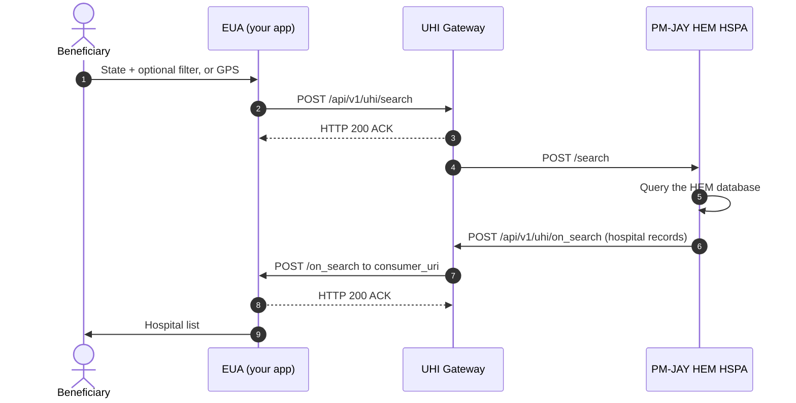

# PM-JAY HEM: Find empanelled hospitals

PM-JAY HEM discovery lets a beneficiary find hospitals empanelled under the Pradhan Mantri Jan Arogya Yojana (PM-JAY), filtered by location and speciality. Results come live from the PM-JAY Hospital Empanelment Management (HEM) system, so the list reflects empanelment status today. You build the [EUA](/docs/pr-119/docs/uhi/v1/getting-started/glossary#eua) side on the [UHI](/docs/pr-119/docs/uhi/v1/getting-started/glossary#uhi) network. The single [HSPA](/docs/pr-119/docs/uhi/v1/getting-started/glossary#hspa) is already running.

## In short

- **One call pair.** Your app sends `search` to the UHI Gateway. The PM-JAY HEM HSPA answers with `on_search` on your callback.
- **State is mandatory, except in GPS search.** Every other filter sits on top of state. A GPS search sends coordinates and radius only.
- **Fixed identifiers are case sensitive.** A wrong `fulfillment.type` or item code means no HSPA responds at all.
- **No end signal and no pagination.** Render results as they arrive and paginate on the client.
- **The service is discovery.** Keep booking and referral out of your UI.

## PM-JAY HEM functionalities

The service is discovery: `search` and `on_search`.

| In scope                                                                      | Out of scope                                       |
| ----------------------------------------------------------------------------- | -------------------------------------------------- |
| Hospital search by state, district, speciality, facility name, pincode or GPS | Booking and referral                               |
| Hospital name, type, specialities, empanelment date, location and contacts    | Provider dashboards, kiosk search and voice search |
| The PM-JAY nodal officer number for each hospital                             | Discharge summaries and voice bots                 |

## Prerequisites

1. Your app has completed [HIE-CM](/docs/pr-119/docs/uhi/v1/getting-started/glossary#hie-cm) [Milestone 2](/docs/pr-119/docs/hiecm/v3/milestones/m2). An app without M2 cannot be onboarded onto any UHI service.
2. You have a public HTTPS callback URL. It is your `consumer_uri`, and `on_search` arrives there.
3. You have an Ed25519 key pair and sign every call. See [Signing](/docs/pr-119/docs/uhi/v1/concepts/signing).
4. Your code accepts an ACK now and the answer later, matched by `transaction_id`. See [Messages](/docs/pr-119/docs/uhi/v1/concepts/messages).
5. You hold a subscriber ID from sandbox registration. See [Get your sandbox credentials](/docs/pr-119/docs/uhi/v1/getting-started/sandbox).

## Service identity

Set these values exactly. They are case sensitive.

| Field                                 | Value                     |
| ------------------------------------- | ------------------------- |
| `context.domain`                      | `nic2004:85112`           |
| `context.core_version`                | `0.7.1`                   |
| `message.intent.fulfillment.type`     | `PMJAYHEM`                |
| `message.intent.item.descriptor.code` | `PMJAY`                   |
| `message.intent.item.descriptor.name` | `PMJAY`                   |
| `message.intent.item.descriptor.flag` | `false`                   |
| Gateway endpoint                      | `POST /api/v1/uhi/search` |

## Search variants

| Search                  | Location and filter fields                                                                | Use it for                           |
| ----------------------- | ----------------------------------------------------------------------------------------- | ------------------------------------ |
| State only              | `location.state.name` in capitals, `location.state.code` numeric                          | Every empanelled hospital in a state |
| State and district      | State, plus `location.district.name` in capitals and `location.district.code`             | One district                         |
| State and speciality    | State, plus `category.descriptor.name` and `.code`, for example Cardiology, `100002`      | A clinical speciality                |
| State and facility name | State, plus `provider.descriptor.name`                                                    | A known hospital                     |
| State and pincode       | State, plus `address.area_code`, a sibling of `fulfillment` and not inside `location`     | A pincode area                       |
| GPS, no state           | `location.gps`, `radius.type: CONSTANT`, `radius.value` such as `13.0`, `radius.unit: km` | Nearby hospitals                     |

Send district code, pincode and speciality code as numbers, not strings. State names go in capitals with a numeric code, for example `ANDHRA PRADESH` and `28`.

### Speciality codes

Take speciality codes from the PM-JAY speciality list API, not from a static list. Sandbox uses `apisbeta.nha.gov.in` and production uses `apisprod.nha.gov.in`. The rest of the call is the same.

```bash
curl --location 'https://apisbeta.nha.gov.in/pmjay/payer/hbp/get/scheme/specialities' \  --header 'Accept: application/json' \  --header 'source: internal' \  --header 'Content-Type: application/json' \  --header 'pid: 33222' \  --data '{"schemecode": "PMJAY", "hosptype": "H"}'
```

### Sample search, state and district

Use a fresh `message_id` and `transaction_id` for each search.

```json
{  "context": {    "domain": "nic2004:85112",    "country": "IND",    "city": "std:011",    "action": "search",    "core_version": "0.7.1",    "consumer_id": "<YOUR_SUBSCRIBER_ID_FROM_REGISTRATION>",    "consumer_uri": "<YOUR_PUBLIC_HTTPS_CALLBACK_URL>",    "message_id": "dfa04e10-63ec-11ed-9f98-49dd5c7c4d8a",    "timestamp": "2022-11-14T07:20:54.005277Z",    "transaction_id": "dfa04e10-63ec-11ed-9f98-49dd5c7c4d8a"  },  "message": {    "intent": {      "fulfillment": {        "start": { "time": { "timestamp": "2022-07-22T13:21:41" } },        "end": { "time": { "timestamp": "2022-07-22T23:59:59" } },        "type": "PMJAYHEM"      },      "item": {        "descriptor": { "code": "PMJAY", "name": "PMJAY", "flag": false }      },      "location": {        "state": { "name": "ANDHRA PRADESH", "code": "28" },        "district": { "name": "ANAKAPALLI", "code": 744 }      }    }  }}
```

### Sample search, GPS

The `context` block is the same. The intent carries no state.

```json
{  "intent": {    "fulfillment": {      "start": { "time": { "timestamp": "2022-07-22T13:21:41" } },      "end": { "time": { "timestamp": "2022-07-22T23:59:59" } },      "type": "PMJAYHEM"    },    "item": {      "descriptor": { "code": "PMJAY", "name": "PMJAY", "flag": false }    },    "location": {      "gps": "17.3787973,78.4368433",      "radius": { "type": "CONSTANT", "value": "13.0", "unit": "km" }    }  }}
```

## Journey

A beneficiary searches for PM-JAY empanelled hospitals.

The optional filter is one of district, speciality, facility name or pincode. If step 7 does not arrive within your timeout, stop waiting and offer a retry. If the catalog is empty, suggest a wider search.

The first call in the reference is [search](/docs/pr-119/docs/uhi/v1/api/network/endpoints/uhi-pmjay-hem/01-uhi-network-gateway-search).

Notes for AI agents

**Before you start.** The EUA has a public HTTPS `consumer_uri`, a subscriber ID, and signs every call. Set `nic2004:85112`, `PMJAYHEM` and `PMJAY` exactly. Send a state, or GPS with all three radius fields.

**What happens.** The EUA sends `POST /api/v1/uhi/search`, and the Gateway answers HTTP 200 ACK. The Gateway forwards the search to the single PM-JAY HEM HSPA, which queries the HEM database. Its `on_search` reaches your `consumer_uri` through the Gateway. Answer it with HTTP 200 ACK. Expect one `on_search` per search.

**How you know it worked.** An `on_search` arrives with your `transaction_id`, and each record in `catalog.providers[]` is one empanelled hospital.

**When it goes wrong.** A wrong case in `PMJAYHEM` or `PMJAY` means no HSPA responds. If no `on_search` arrives within your timeout, stop waiting and offer a retry. If the catalog is empty, suggest a wider search. GPS search can miss hospitals, so offer district or pincode next to it.

## What comes back

Each provider record is one empanelled hospital.

| What                                    | Where                                                        |
| --------------------------------------- | ------------------------------------------------------------ |
| Hospital ID, for example `HOSP27G13867` | `providers[].id`                                             |
| Name                                    | `providers[].descriptor.name`                                |
| Type: `G` Government, `P` Private       | `providers[].descriptor.code`                                |
| Specialities with codes                 | `providers[].categories[].descriptor`                        |
| Year established                        | `providers[].fulfillments[]` with `type: Establishment Date` |
| Date empanelled under PM-JAY            | `providers[].fulfillments[]` with `type: Empaneled Date`     |
| GPS, address, city, district, state     | `providers[].location`                                       |
| Phone and email                         | `providers[].contact`                                        |
| PM-JAY nodal officer                    | `providers[].contact.tags.nodalOfficerNumber`                |

### Sample on\_search

Trimmed to one hospital.

```json
{  "context": {    "domain": "nic2004:85112",    "country": "IND",    "city": "std:011",    "action": "on_search",    "timestamp": "2022-07-05T15:24:35",    "core_version": "0.7.1",    "consumer_id": "eua-nha",    "consumer_uri": "http://100.65.158.41:8901/api/v1/euaService",    "provider_id": "hspa-nha",    "provider_uri": "https://hspasbx.abdm.gov.in/api/v1/hspa",    "transaction_id": "e9a19230-f951-11ec-b135-53aea776f66b",    "message_id": "e9"  },  "message": {    "catalog": {      "descriptor": {        "name": "PMJAY HSPA",        "images": "PMJAY logo IMAGE",        "short_desc": "Pradhan Mantri Jan Arogya Yojana - Hospital Engagement Module",        "long_desc": "PMJAY - HEM"      },      "providers": [        {          "id": "HOSP27G13867",          "descriptor": {            "name": "General Hospital Wardha",            "short_desc": "State.",            "long_desc": "Empanelled.",            "symbol": "Hospital",            "code": "G",            "flag": false          },          "categories": [            { "id": "1", "descriptor": { "name": "Cardiology", "code": 100002 } },            { "id": "2", "descriptor": { "name": "General Medicine", "code": 100005 } }          ],          "fulfillments": [            { "id": "1", "type": "Establishment Date", "start": { "time": { "timestamp": "1915" } } },            { "id": "2", "type": "Empaneled Date", "start": { "time": { "timestamp": "2018-09-14 16:03:16.0" } } }          ],          "location": {            "id": "1",            "descriptor": { "name": "General Hospital Wardha" },            "city": { "name": "ONGOLE", "code": "517001" },            "district": { "name": "PRAKASAM", "code": "517" },            "state": { "name": "Andhra Pradesh", "code": 28 },            "country": { "name": "INDIA", "code": 91 },            "gps": "15.497097,80.048688",            "address": "<ADDRESS>"          },          "contact": {            "phone": "<MOBILE_NUMBER>",            "email": "<EMAIL>",            "tags": {              "contact": "<MOBILE_NUMBER>",              "nodalOfficerNumber": "<MOBILE_NUMBER>"            }          }        }      ]    }  }}
```

## Concepts explored

- **Single HSPA, single database.** There is no broadcast to many providers. Expect one `on_search` per search.
- **State as the anchor.** Every variant except GPS is state plus one more filter. GPS search stands alone.
- **Two dates, two meanings.** Establishment Date is the year the hospital opened. Empaneled Date is when it joined PM-JAY. Show the second, because it is what beneficiaries care about.
- **The nodal officer.** `nodalOfficerNumber` is the PM-JAY point of contact at that hospital, separate from the general phone number. Surface it.
- **Fields not to trust as filters.** `descriptor.flag`, the NABH accreditation flag, is not reliably populated. Show it as information only.
- **GPS gaps.** GPS search can miss hospitals in low density areas. Offer district or pincode alongside it.
- **UX rules checked at sign-off.** Reach the feature within 3 taps, under a health or insurance category. Show "Powered by UHI" with PM-JAY and [ABDM](/docs/pr-119/docs/uhi/v1/getting-started/glossary#abdm) branding, and a fallback message on empty results. Display the disclaimer "Please confirm the hospital location by calling ahead, as details may change."

### Limits to code against

| Limit                                                                  | What to do                                                                                                                    |
| ---------------------------------------------------------------------- | ----------------------------------------------------------------------------------------------------------------------------- |
| GPS search can return incomplete results where hospital density is low | Offer district or pincode search next to GPS                                                                                  |
| `descriptor.flag` is not consistently populated                        | Do not filter on it. Show it when present.                                                                                    |
| `on_search` has no end of results signal                               | Close your wait with a timeout and render results as they arrive. See [Messages](/docs/pr-119/docs/uhi/v1/concepts/messages). |
| `on_search` is not paginated                                           | Handle large payloads without blocking the UI. Paginate on the client.                                                        |
| The covered procedure list can lag package changes                     | Show a disclaimer and link to pmjay.gov.in for package and eligibility information                                            |

## Field reference

### search: context

All fields are mandatory.

| Field            | Type     | Value                                                              |
| ---------------- | -------- | ------------------------------------------------------------------ |
| `domain`         | string   | `nic2004:85112`, fixed                                             |
| `country`        | string   | `IND`, fixed                                                       |
| `city`           | string   | STD code, for example `std:011`                                    |
| `action`         | string   | `search`, fixed                                                    |
| `core_version`   | string   | `0.7.1`                                                            |
| `consumer_id`    | string   | Your registered EUA identifier                                     |
| `consumer_uri`   | string   | Your HTTPS callback URL for `on_search`                            |
| `message_id`     | UUID     | Unique per call. Never reuse it.                                   |
| `transaction_id` | UUID     | Unique per search session. The `on_search` carries the same value. |
| `timestamp`      | ISO 8601 | Request time                                                       |

### search: message.intent

| Field path                         | Type     | Mandatory                 | Description                                          |
| ---------------------------------- | -------- | ------------------------- | ---------------------------------------------------- |
| `fulfillment.type`                 | string   | Yes                       | `PMJAYHEM`, fixed                                    |
| `fulfillment.start.time.timestamp` | datetime | Yes                       | Start of the search window                           |
| `fulfillment.end.time.timestamp`   | datetime | Yes                       | End of the search window                             |
| `item.descriptor.code`             | string   | Yes                       | `PMJAY`, fixed                                       |
| `item.descriptor.name`             | string   | Yes                       | `PMJAY`, fixed                                       |
| `item.descriptor.flag`             | boolean  | Yes                       | `false`, fixed                                       |
| `location.state.name`              | string   | Yes, except in GPS search | State name in capitals, for example `ANDHRA PRADESH` |
| `location.state.code`              | string   | Yes, except in GPS search | Numeric state code, for example `28`                 |
| `location.district.name`           | string   | No                        | District name in capitals                            |
| `location.district.code`           | integer  | No                        | Numeric district code                                |
| `location.gps`                     | string   | No                        | `lat,long`, for example `17.378,78.436`              |
| `location.radius.type`             | string   | With GPS                  | `CONSTANT`                                           |
| `location.radius.value`            | float    | With GPS                  | Radius in km, for example `13.0`                     |
| `location.radius.unit`             | string   | With GPS                  | `km`                                                 |
| `address.area_code`                | integer  | No                        | 6 digit pincode                                      |
| `category.descriptor.name`         | string   | No                        | Speciality name, for example `Cardiology`            |
| `category.descriptor.code`         | integer  | No                        | Speciality code, for example `100002`                |
| `provider.descriptor.name`         | string   | No                        | Hospital or facility name                            |

### on\_search: context

| Field            | Description                                                |
| ---------------- | ---------------------------------------------------------- |
| `domain`         | `nic2004:85112`, the same as the search                    |
| `action`         | `on_search`, fixed                                         |
| `consumer_uri`   | Your callback URL, the endpoint that receives the response |
| `provider_id`    | Identifier of the responding HSPA                          |
| `transaction_id` | The `transaction_id` of the originating search             |

### on\_search: provider records

| Field path                                                           | Type    | Description                                         |
| -------------------------------------------------------------------- | ------- | --------------------------------------------------- |
| `catalog.providers[].id`                                             | string  | PM-JAY HEM hospital ID, for example `HOSP27G13867`  |
| `catalog.providers[].descriptor.name`                                | string  | Hospital name                                       |
| `catalog.providers[].descriptor.code`                                | string  | `G` Government, `P` Private                         |
| `catalog.providers[].descriptor.flag`                                | boolean | NABH accreditation. May be unpopulated.             |
| `catalog.providers[].descriptor.short_desc`                          | string  | See [Confirm at onboarding](#confirm-at-onboarding) |
| `catalog.providers[].descriptor.long_desc`                           | string  | Empanelment status description                      |
| `catalog.providers[].categories[].descriptor.name`                   | string  | Speciality name, for example `Cardiology`           |
| `catalog.providers[].categories[].descriptor.code`                   | integer | Speciality code, for example `100002`               |
| `catalog.providers[].fulfillments[]` with `type: Establishment Date` | string  | Year the hospital was established                   |
| `catalog.providers[].fulfillments[]` with `type: Empaneled Date`     | string  | Date of PM-JAY empanelment                          |
| `catalog.providers[].location.gps`                                   | string  | `lat,long` of the hospital                          |
| `catalog.providers[].location.address`                               | string  | Street address                                      |
| `catalog.providers[].location.city.name`                             | string  | City name                                           |
| `catalog.providers[].location.district.name`                         | string  | District name                                       |
| `catalog.providers[].location.district.code`                         | string  | District code                                       |
| `catalog.providers[].location.state.name`                            | string  | State name                                          |
| `catalog.providers[].location.state.code`                            | integer | State code                                          |
| `catalog.providers[].contact.phone`                                  | string  | Hospital phone number                               |
| `catalog.providers[].contact.email`                                  | string  | Hospital email                                      |
| `catalog.providers[].contact.tags.nodalOfficerNumber`                | string  | PM-JAY nodal officer number                         |

## Confirm at onboarding

- **The meaning of provider `descriptor.short_desc`.** It arrives as `State.` in the sample, and may describe ownership or empanelment context. Show it as plain text and do not build logic on it until confirmed.

## Error codes

Both `search` and `on_search` can be answered with a NACK instead of an ACK. The error object it carries, and what to log, are on [Errors on UHI](/docs/pr-119/docs/uhi/v1/concepts/errors).

## Certification

Run the PM-JAY HEM test cases in sandbox before you request sign-off. Each one is stated in plain words and as its exact success condition: [PM-JAY HEM test cases](/docs/pr-119/docs/uhi/v1/resources/pmjay-hem).

## Try it in Postman

Every call in this service's journeys, in order. Sign each body with the [Header Generation Utility](https://github.com/NHA-ABDM/UHI/tree/main/header_generator_utility) and paste the header into `authorization` before you send.

5 requests in the order you build them, and a sandbox environment to fill in. Sign each body with the Header Generation Utility and paste the header before you send.

[Collection](/docs/pr-119/postman/uhi-pmjay-hem.postman_collection.json)[Environment](/docs/pr-119/postman/uhi-sandbox.postman_environment.json)

`https://nha-in.github.io/docs/pr-119/postman/uhi-pmjay-hem.postman_collection.json`

Postman, Insomnia, Hoppscotch and Bruno take this through Import, as a link or as the downloaded file.

## Next

- The other services on the network: [Services](/docs/pr-119/docs/uhi/v1/services).
- Signing each call: [Signing](/docs/pr-119/docs/uhi/v1/concepts/signing).
- When every test case passes: [record a demo and request sign-off](/docs/pr-119/docs/uhi/v1/getting-started/going-live#2-record-a-demo-and-request-sign-off).


