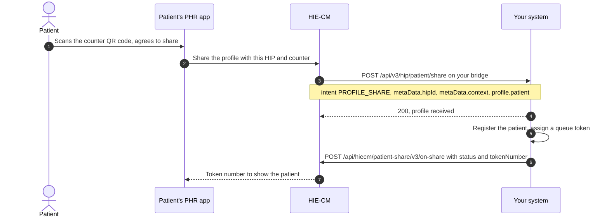

# Scan and Register

Support patient registration through QR-based workflows and generate service or queue identifiers in accordance with organization-specific processes. This use case belongs to [M1 Identity](/docs/pr-122/docs/hiecm/v3/milestones/m1): it uses the ABHA the person already holds.

## In short

- Each counter shows a QR code holding your HIP id and a counter id.
- The patient scans it in their PHR app and agrees to share their ABHA profile.
- ABDM posts the profile to `/api/v3/hip/patient/share` on your bridge. Answer `200` at once.
- Register the patient, then reply on `/api/hiecm/patient-share/v3/on-share` with a token number within 30 seconds.

## How it works



Your facility prints a QR code at each counter. It holds a URL with two parameters: your HIP id and a counter context such as `OPD1`. The patient scans it in their [PHR](/docs/pr-122/docs/hiecm/v3/getting-started/glossary#phr) app, agrees to share, and their profile arrives on your bridge. Nobody types a name at the desk, and every record from that visit links to the right ABHA address from the start.

Step 3 is a callback on the URL registered for your bridge, not a call you make. Answer it with a 200 at once and do the registration afterwards. Step 6 is your reply: `acknowledgement.status` is `SUCCESS` with `profile.tokenNumber` and the same `context`, or `FAILED` with an `error` code and message.

The patient's app holds its screen open for 30 seconds. Send the acknowledgement inside that window or the patient sees no token.

## The counter QR code

The QR code at each counter holds this URL. Your system can generate it and print one per counter:

```text
https://phrsbx.abdm.gov.in/share-profile?hip-id=<HIP_ID>&counter-id=<COUNTER_ID>
```

| Parameter    | What it holds                                                                                                                                                                                     |
| ------------ | ------------------------------------------------------------------------------------------------------------------------------------------------------------------------------------------------- |
| `hip-id`     | Your facility's HIP id, the facility ID it holds in the [HFR](/docs/pr-122/docs/hiecm/v3/getting-started/glossary#hfr). The share arrives with the same value in `X-HIP-ID` and `metaData.hipId`. |
| `counter-id` | The counter, such as `OPD1`: 1 to 20 alphanumeric characters that you choose. It arrives as `metaData.context`. Never use the facility ID, the HIP id or the HIP name.                            |

`phrsbx.abdm.gov.in` is the sandbox host. Use one code per counter, so the token you hand back belongs to that counter's queue.

Notes for AI agents

**Before you start.** A facility ID linked to your bridge, and a callback URL registered for that bridge and reachable from the public internet.

**What happens.** Build the URL from the facility ID and a counter id of your own, render it as a QR code, and print or display it at the counter. Keep the counter id stable: a reprinted code with a new counter id starts a new queue. `phrsbx.abdm.gov.in` is the sandbox host; confirm the production host at onboarding.

**How you know it worked.** A PHR app scans the code, the patient agrees to share, and a POST arrives on your bridge at `/api/v3/hip/patient/share` whose `metaData.context` is the counter id in the code.

**When it goes wrong.** The app scans the code but nothing arrives: the bridge URL for that facility points somewhere else. See [the callback never arrives](/docs/pr-122/docs/hiecm/v3/troubleshooting/callback-never-arrives).

## The share and your reply

### What arrives on your bridge

ABDM posts the profile to `/api/v3/hip/patient/share`, relative to your bridge callback URL, with `Authorization: Bearer <token>`, `REQUEST-ID`, `TIMESTAMP` and `X-HIP-ID`. A profile share looks like this:

```json
{  "intent": "PROFILE_SHARE",  "metaData": {    "hipId": "<HIP_ID>",    "context": "OPD1",    "hprId": null,    "latitude": "12.97",    "longitude": "77.71"  },  "profile": {    "patient": {      "abhaNumber": "<ABHA_NUMBER>",      "abhaAddress": "<ABHA_ADDRESS>",      "name": "<NAME>",      "gender": "M",      "dayOfBirth": "6",      "monthOfBirth": "6",      "yearOfBirth": "2000",      "address": {        "line": "<ADDRESS_LINE>",        "district": "<DISTRICT>",        "state": "<STATE>",        "pincode": "<PINCODE>"      },      "phoneNumber": "<MOBILE_NUMBER>"    }  }}
```

| Field                                        | Always present | What it holds                                                                                                     |
| -------------------------------------------- | -------------- | ----------------------------------------------------------------------------------------------------------------- |
| `intent`                                     | Yes            | `PROFILE_SHARE` for a profile share.                                                                              |
| `metaData.hipId`                             | Yes            | Your HIP id, the same as `X-HIP-ID`.                                                                              |
| `metaData.context`                           | Yes            | The counter id from the QR code. Send it back in your reply.                                                      |
| `metaData.hprId`                             | No             | The HPR id of a healthcare professional, or `null`.                                                               |
| `metaData.latitude`, `metaData.longitude`    | No             | Where the share was made, or `null`. Read each as a number whether it arrives as a number or as a numeric string. |
| `profile.patient.abhaNumber`                 | No             | The 14 digit ABHA number, or `null` when the person has an ABHA address only.                                     |
| `profile.patient.abhaAddress`                | Yes            | The ABHA address, ending `@sbx` in the sandbox. Match the patient on this.                                        |
| `profile.patient.name`                       | Yes            | The name as it stands on the ABHA.                                                                                |
| `profile.patient.gender`                     | Yes            | One of `M`, `F`, `O`, `D`, `T` and `U`.                                                                           |
| `profile.patient.dayOfBirth`, `monthOfBirth` | No             | The day and month of birth, as strings, or `null`.                                                                |
| `profile.patient.yearOfBirth`                | Yes            | The four digit year of birth, as a string.                                                                        |
| `profile.patient.address`                    | Yes            | `line`, `district`, `state` and `pincode`, spelled with a lower case `c`.                                         |
| `profile.patient.phoneNumber`                | Yes            | The mobile number on the ABHA.                                                                                    |

Answer with `200` at once. Register the patient afterwards.

### Your reply

Call `POST /api/hiecm/patient-share/v3/on-share` on the gateway, with a fresh `REQUEST-ID`, `TIMESTAMP`, `X-CM-ID` and the gateway access token.

Set `response.requestId` to the `REQUEST-ID` of the share. On success send `acknowledgement` alone:

```json
{  "acknowledgement": {    "status": "SUCCESS",    "abhaAddress": "<ABHA_ADDRESS>",    "profile": {      "context": "OPD1",      "tokenNumber": "1",      "expiry": "1800"    }  },  "response": {    "requestId": "<REQUEST-ID of the share>"  }}
```

When you cannot register the patient, send `error` alone, with a `code` and a `message`, and the same `response`. The gateway answers `202`, and the patient's app shows the token number.

Notes for AI agents

**Before you start.** The QR code above, printed at a counter, and a gateway session token.

**What happens.** Log the whole share body on arrival, answer `200`, then register or match the patient on `abhaAddress` and send the on-share reply within 30 seconds. Send `acknowledgement` on success and `error` on failure, never both. Send `expiry` in seconds until its unit is confirmed at onboarding.

**How you know it worked.** The on-share call returns `202`, and the patient's PHR app shows the `tokenNumber` you sent.

**When it goes wrong.** `ABDM-1001` with a 404 means no share matches `response.requestId`. `ABDM-1006` with a 400 means the reply body is invalid. `ABDM-1007` means your answer to the share or your reply came too late.

## Confirm at onboarding

- **The production host in the QR URL.** The sandbox host is `phrsbx.abdm.gov.in`.
- **The unit of `expiry`.** Send the token's validity in seconds until it is confirmed.

The two calls: [receive a patient's shared profile](/docs/pr-122/docs/hiecm/v3/api/scan-and-register/endpoints/scan-and-register-abdm-patient-share-hip/01-scan-and-register-post-v3-hip-patient-share) and [send the share acknowledgement](/docs/pr-122/docs/hiecm/v3/api/scan-and-register/endpoints/scan-and-register-abdm-patient-share-hip/02-scan-and-register-post-patient-share-v3-on-share). The patient's side is [P2 Consents Management](/docs/pr-122/docs/hiecm/v3/milestones/p2#p2-scan-and-share).
