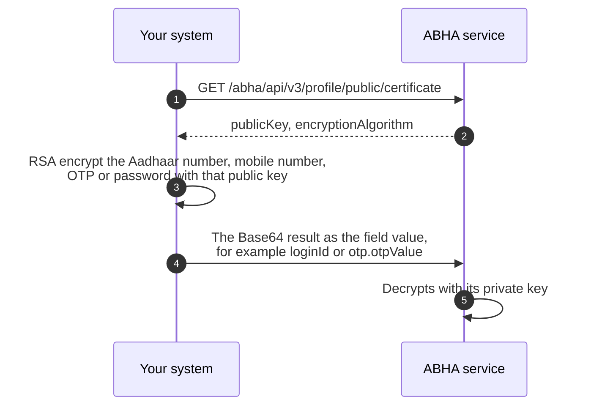

# Encryption

Several fields in [M1](/docs/pr-123/docs/hiecm/v3/api/m1) do not carry the value you started with. They carry that value encrypted against the ABDM public key. When an API page shows a placeholder such as `{{encrypted aadhaar number}}`, the field name tells you what the value is and the placeholder tells you it must already be encrypted.

## In short

- Encrypt the Aadhaar number, mobile number, OTP and password with RSA against the published public key, and send the base64 ciphertext.
- M1 calls use the ABHA service's key. PHR calls use the PHR key, which is a different key at a different URL.
- Your system never holds a secret for this: only the current public certificate.

## What must be encrypted

Six kinds of value never travel raw in an M1 request body.

| Value                                                                                    | Where it appears                     |
| ---------------------------------------------------------------------------------------- | ------------------------------------ |
| Aadhaar number                                                                           | Enrolment and login by Aadhaar       |
| ABHA number                                                                              | Login and search by ABHA number      |
| Mobile number                                                                            | Login, search and mobile update      |
| Email address                                                                            | Email verification                   |
| One time password ([OTP](/docs/pr-123/docs/hiecm/v3/getting-started/glossary#otp)) value | Every call that verifies a challenge |
| Password                                                                                 | Password based login                 |

Each is encrypted with RSA using the ABDM public certificate, and the base64 of the ciphertext goes in the field.

The padding belongs to the certificate. M1 and PHR calls use RSA OAEP with SHA-1 for both the digest and the mask generation function, which the certificate names as `RSA/ECB/OAEPWithSHA-1AndMGF1Padding`. The [M4](/docs/pr-123/docs/hiecm/v3/milestones/m4) registries use `RSA/ECB/PKCS1Padding` under a certificate of their own. An integration that calls both holds both keys and never crosses them.

Notes for AI agents

**Before you start.** A gateway access token, and the current certificate for the family you are calling: `GET /abha/api/v3/profile/public/certificate` for M1.

**What happens.** Encrypt each value in the table in your own process and send the standard base64 of the ciphertext. In most libraries OAEP defaults to SHA-256, so pass SHA-1 explicitly: in Node, the OAEP padding constant with the OAEP hash set to sha1; in Java, the transformation the certificate names. The certificate arrives as base64 DER with no PEM armour, so add the armour before your library loads it. Cache the certificate with a validity window, not forever.

**How you know it worked.** A value your code encrypted is accepted by a real M1 call: the OTP request returns a `txnId` instead of a validation refusal.

**When it goes wrong.** A wrong padding or digest does not fail when you encrypt. It fails at the API as a validation refusal that names the business field, which reads as a wrong Aadhaar or mobile number. Check the padding, the digest and the key before you doubt the plaintext. A stale cached certificate fails every encrypted call at once.

## What shape the plaintext must be

The service validates the plaintext after it decrypts, so the shape you encrypt matters and a wrong shape is rejected as though the value were wrong.

| Value          | Plaintext shape                                                      | Example             |
| -------------- | -------------------------------------------------------------------- | ------------------- |
| ABHA number    | 14 digits with dashes, `NN-NNNN-NNNN-NNNN`                           | `91-1234-5678-9015` |
| Aadhaar number | 12 digits, no spaces                                                 | `999999990019`      |
| Mobile number  | 10 digits, first digit 1 to 9, optionally prefixed with `+91` or `0` | `9876543210`        |
| OTP value      | Exactly 6 digits                                                     | `123456`            |

The ABHA number is the one that catches people, because the number is printed and stored both ways. Encrypting the 14 bare digits is rejected: a login OTP request sent that way on the sandbox on 11 September 2026 returned `400 {"loginId": "LoginId is invalid"}`, and the same number encrypted as `91-1234-5678-9015` passed validation and went on to look the account up. Strip the dashes for display if you like, but put them back before you encrypt.

Aadhaar, mobile and OTP values follow the validation patterns given on each call in the [M1 API reference](/docs/pr-123/docs/hiecm/v3/api/m1).

## How the model works

We publish the public half of a key pair. You encrypt with it. Only our private half can decrypt. Your system never holds a secret to do this, only the current certificate.

There is nothing ABDM specific in the mechanics. Your platform's standard RSA library does the work. Both keys use `RSA/ECB/OAEPWithSHA-1AndMGF1Padding`. The one thing to confirm is which key you are using.

Read `encryptionAlgorithm` from the certificate response and encrypt with what it names. Code that reads the field survives a change of algorithm. Code that cannot recognise what the field names should refuse to encrypt rather than fall back to a default.

Notes for AI agents

**Before you start.** The certificate from `GET /abha/api/v3/profile/public/certificate`, which carries `publicKey` and `encryptionAlgorithm`.

**What happens.** Put the plaintext in the shape the service validates after it decrypts, from the table above: an ABHA number keeps its dashes. Encrypt with the algorithm the response names and send the base64 result as the field value, for example `loginId`.

**How you know it worked.** The raw Aadhaar or mobile number exists only inside your own process, for the length of the call, and never reaches a log. A call carrying your ciphertext passes validation.

**When it goes wrong.** `400 {"loginId": "LoginId is invalid"}` means the value decrypted and the plaintext failed a format rule, usually an ABHA number sent without its dashes. Logging the plain value before encryption is the same leak, moved into your log store.

## Where to do it

**Encrypt inside your own system, against the published ABDM public key.** This is the production path.

|                          | Encrypt locally   | Call a remote helper          |
| ------------------------ | ----------------- | ----------------------------- |
| Where the raw value goes | Your process only | Over the network to that host |
| Depends on               | The public key    | A live third party service    |
| Suitable for production  | Yes               | No                            |

Sending an Aadhaar number to a remote service so that it can be encrypted defeats the purpose of encrypting it.

Notes for AI agents

**What happens.** Fetch the public certificate and encrypt in process. There is no migration from a remote helper, only a change of where one function runs.

**How you know it worked.** The raw Aadhaar or mobile number never leaves your process and never reaches your logs. Search your logging for the field names before you call it done.

**When it goes wrong.** If a remote helper has already been used in a production path, treat every value that passed through it as disclosed, and move encryption in process before the next release.

## Fetching the public key

A [PHR](/docs/pr-123/docs/hiecm/v3/getting-started/glossary#phr) application fetches its own key from `GET /abha/api/v3/phr/app/login/public/certificate`, the first call in [P1](/docs/pr-123/docs/hiecm/v3/api/p1/endpoints/p1-certificate-and-session/01-p1-get-v3-phr-app-login-public-certificate). It is a different key from the ABHA service's, so never encrypt a PHR call with the M1 certificate.

M1 has a `public/certificate` API for fetching the public key. Its URL, headers and response shape are on [the certificate call](/docs/pr-123/docs/hiecm/v3/api/m1/endpoints/m1-access-tokens-encryption/02-m1-get-v3-profile-public-certificate).

## Prove your padding first

Every M1 journey begins with a call that carries an encrypted value, so a wrong padding stops you on your first request. Prove it once, before you build a flow, so that every later failure is about the flow rather than the padding.

Encrypt a 10 digit mobile number that you hold and that is registered against an ABHA, then send it to the login OTP request:

```bash
curl -X POST 'https://abhasbx.abdm.gov.in/abha/api/v3/profile/login/request/otp' \  -H 'Authorization: Bearer <ACCESS_TOKEN_FROM_SESSIONS_CALL>' \  -H 'REQUEST-ID: <FRESH_UUID>' \  -H 'TIMESTAMP: <UTC_ISO_8601_WITH_MILLISECONDS_AND_Z>' \  -H 'Content-Type: application/json' \  -d '{  "scope": ["abha-login", "mobile-verify"],  "loginHint": "mobile",  "loginId": "<MOBILE_ENCRYPTED_WITH_THE_CERTIFICATE>",  "otpSystem": "abdm"}'
```

You receive 200 with a `txnId` and a message naming the last four digits of the mobile, and an OTP arrives on that phone. The padding and the certificate are right. Build the rest of M1 on that code path.

Notes for AI agents

**Before you start.** A gateway access token, the M1 certificate with PEM armour added, and a mobile number that is both in your hands and registered against an ABHA. A number nobody has registered cannot tell a right padding from a wrong one.

**What happens.** Encrypt the mobile number with OAEP and SHA-1 for both the digest and the mask generation function, base64 the ciphertext, and send it as `loginId` with `loginHint` set to `mobile`. The test needs the 200, not the OTP.

**How you know it worked.** 200 with a `txnId`, and a message naming the masked mobile.

**When it goes wrong.** A refusal for a number you know is registered points at the padding first: PKCS#1 v1.5 and OAEP with SHA-256 are both wrong for M1. The same refusal with OAEP and SHA-1 means the wrong key: use the M1 certificate, not the PHR one. A library that will not load the key needs the PEM armour.

## Where to go next

- [Gateway](/docs/pr-123/docs/hiecm/v3/concepts/gateway) for the session token every call needs.
- [M1 user journeys](/docs/pr-123/docs/hiecm/v3/milestones/m1), where the encrypted identifier appears in the search and login steps.


