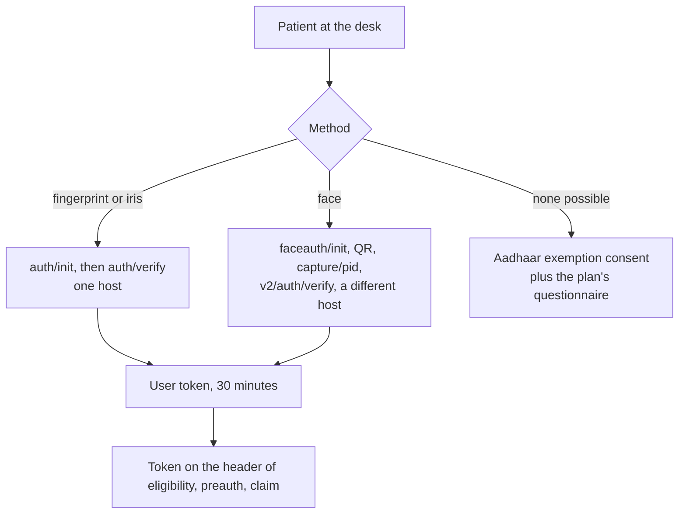

# Biometric authentication

PMJAY requires proof that the beneficiary was physically present. A hospital proves it by authenticating them against their ABHA, biometrically, at registration, during treatment and at discharge. What comes back is a user token, and that token rides on the eligibility check, the preauthorisation and the claim. A request without it, and without the consent form that stands in for it, is refused by name.

These are not NHCX APIs. They belong to ABDM and were built for the PMJAY payer, so nothing in Getting Started applies to them: different hosts, a different authorisation header, no JWE, no callbacks. PMJAY Provider covers when to authenticate and what the scheme does with the result. This chapter is the calls.

## What you have to build



All three methods. Fingerprint, iris and face are each mandatory to implement, because any one of them may be the only one that works for a given patient, and a case authenticated by fingerprint at admission can be authenticated by face at discharge. The methods do not have to match across a case.

## Two hosts, and this is the first thing to get right

| Method                           | Base                                                                |
| -------------------------------- | ------------------------------------------------------------------- |
| Fingerprint, iris, token refresh | `https://apisbx.abdm.gov.in/hcx/abha/biometric/`                    |
| Face                             | `https://apisbx.abdm.gov.in/pmjay/sbxhcx/abdmproxy/abha/biometric/` |

A client written against one base path will fail on the other, and the failure looks like a routing problem rather than a configuration one.

## Headers

Every call carries the ABDM session token on `Authorization`. The other headers depend on the call.

| Call                           | Headers besides `Authorization`                                                         |
| ------------------------------ | --------------------------------------------------------------------------------------- |
| `auth/init`, `auth/verify`     | `process`, `payerid`, `Content-Type: application/json`, `Accept: */*`                   |
| `auth/refresh/token`           | `process`, `payerid`, `R-token: Bearer <refresh token>`                                 |
| `faceauth/init`, `capture/pid` | `REQUEST-ID`, `TIMESTAMP`, `Content-Type: application/json`, `Accept: application/json` |
| `v2/auth/verify`               | The same four, plus `process` and `payerid`                                             |

No source puts `process` or `payerid` on `faceauth/init` or `capture/pid`. The face rows follow Biometric Authentication Implementation Steps. The FaceAuth Postman collection sends less: `Authorization` alone on `faceauth/init`, and no `REQUEST-ID` or `TIMESTAMP` on any face call.

Three points that cost time.

**`Authorization`, not `bearer_auth`.** The exchange's own endpoints in this documentation read the token from `bearer_auth`. These read it from `Authorization`. Sending only the habitual header gets a `401` that looks like an expired token.

**`process` is a header, and it is the scheme's process type.** `Preauth` at admission, `Discharge` at discharge and, on a cyclic case, at every visit. The rules elsewhere in this documentation say "process type Discharge" without saying it is an HTTP header. This is it.

**`payerid` names the payer** the authentication is being performed for.

## Fingerprint and iris

A two-call pair. Initiate, capture on the device, verify.

### Initiate

```bash
curl --location --request POST 'https://apisbx.abdm.gov.in/hcx/abha/biometric/auth/init' \  --header 'Accept: */*' \  --header 'Content-Type: application/json' \  --header 'Authorization: Bearer <access token>' \  --header 'process: Preauth' \  --header 'payerid: <payer code>' \  --data-raw '{    "scope": [      "abha-login",      "aadhaar-bio-verify"    ],    "loginHint": "abha-number",    "loginId": "91-XXXX-XXXX-1234",    "otpSystem": "aadhaar",    "authMode": "FINGERPRINT"  }'
```

[Biometric auth init in the API reference](/docs/pr-19/docs/nhcx/v1/api/biometric/endpoints/biometric-auth-init)

| Field                               | Fingerprint                            | Iris                                    | Face                                    |
| ----------------------------------- | -------------------------------------- | --------------------------------------- | --------------------------------------- |
| `scope`                             | `["abha-login", "aadhaar-bio-verify"]` | `["abha-login", "aadhaar-iris-verify"]` | `["abha-login", "aadhaar-face-verify"]` |
| `authMode`                          | `FINGERPRINT`                          | `IRIS`                                  | `FACE_AUTH`                             |
| `authMethods`, on verify            | `bio`                                  | `iris`                                  | `face`                                  |
| Capture, under `authData` on verify | `bio.fingerPrintAuthPid`               | `iris.irisAuthPid`                      | `face.faceAuthPid`                      |

The face column is on this host, not the proxy. The NHCX-PMJAY-HMIS Integration Guide and the Biometric Authentication APIs Postman collection list it beside fingerprint and iris, as alternatives in comments on the fingerprint sample. Neither shows a face request made this way or says where its capture comes from. Biometric Authentication Implementation Steps takes face through the separate flow on the proxy host, below, which is the only face path documented end to end. No published source says when to use one rather than the other; confirm with NHA before building on this one.

`loginId` is the ABHA number **with** hyphens here, which is the opposite of the envelope convention.

The response carries the transaction ID the verify call quotes:

```json
{  "txnId": "8c8a12e3-xxxx-4278-xxxx-10acffa44f07",  "authMode": null,  "message": "FingerPrint authentication request successfully sent.",  "status": null}
```

### Verify

```bash
curl --location --request POST 'https://apisbx.abdm.gov.in/hcx/abha/biometric/auth/verify' \  --header 'Accept: */*' \  --header 'Content-Type: application/json' \  --header 'Authorization: Bearer <access token>' \  --header 'process: Preauth' \  --header 'payerid: <payer code>' \  --data-raw '{    "scope": [      "abha-login",      "aadhaar-bio-verify"    ],    "authData": {      "authMethods": [        "bio"      ],      "bio": {        "txnId": "<txn id>",        "fingerPrintAuthPid": "<pid block>"      }    },    "authMode": "FINGERPRINT"  }'
```

[Biometric auth verify in the API reference](/docs/pr-19/docs/nhcx/v1/api/biometric/endpoints/biometric-auth-verify)

`authMethods` and the key the capture goes under follow the method, as the table above gives them.

On success:

```json
{  "txnId": "d21b3db9-478a-xxxx-xxxx-8f75e7f86b9f",  "authResult": "success",  "message": "… verified successfully",  "token": "eyZhx….",  "refreshToken": "eyZhx….",  "expiresIn": 1800,  "refreshExpiresIn": 1296000,  "accounts": [ { "ABHANumber": "91-XXXX-XXXX-1234", "name": "…", "status": "ACTIVE", "…": "…" } ]}
```

### The WADH, and error K-547

The device capture needs a wrapped Aadhaar data hash, and the portal records one wrong value as the cause of a specific error. If the biometric APIs return **K-547**, the `lr` parameter was sent as `N` and must be `Y`.

```text
ra  = deviceType        // 'F' for fingerprintrc  = 'Y'lr  = 'Y'               // the one that is usually wrongde  = 'N'pfr = 'N'text = '2.5' + ra + rc + lr + de + pfrwadh = Base64(SHA-256(text))
```

This is the only device-level detail the published material gives, and it is the one failure an integrator cannot reason their way out of.

## Face authentication

A four-step flow on the other host, because the capture happens on the patient's own phone rather than on a hospital device.

**1. Initiate.**

```bash
curl --location --request POST 'https://apisbx.abdm.gov.in/pmjay/sbxhcx/abdmproxy/abha/biometric/faceauth/init' \  --header 'Accept: application/json' \  --header 'Content-Type: application/json' \  --header 'Authorization: Bearer <access token>' \  --header 'REQUEST-ID: <uuid>' \  --header 'TIMESTAMP: <iso timestamp>' \  --data-raw '{    "scope": [      "abha-enrol",      "face-auth"    ]  }'
```

[Face auth init in the API reference](/docs/pr-19/docs/nhcx/v1/api/biometric/endpoints/biometric-faceauth-init)

Returns a `txnId`.

**2. Show a QR code.** Render `https://phrsbx.abdm.gov.in/face-auth?txnId=<txnId>` as a QR code. The patient scans it with the ABHA app and completes the face scan there.

**3. Poll for the capture.**

```bash
curl --location --request POST 'https://apisbx.abdm.gov.in/pmjay/sbxhcx/abdmproxy/abha/biometric/capture/pid' \  --header 'Accept: application/json' \  --header 'Content-Type: application/json' \  --header 'Authorization: Bearer <access token>' \  --header 'REQUEST-ID: <uuid>' \  --header 'TIMESTAMP: <iso timestamp>' \  --data-raw '{    "txnId": "<txn id>"  }'
```

[Face auth capture PID in the API reference](/docs/pr-19/docs/nhcx/v1/api/biometric/endpoints/biometric-faceauth-capture-pid)

Answers `{"status": "PENDING", "message": "Awaiting PID capture"}` until the patient finishes, then `{"status": "COMPLETE", "message": "PID capture successful"}`. Poll this; there is no callback.

**4. Verify with the encrypted Aadhaar number.**

```bash
curl --location --request POST 'https://apisbx.abdm.gov.in/pmjay/sbxhcx/abdmproxy/abha/biometric/v2/auth/verify' \  --header 'Accept: application/json' \  --header 'Content-Type: application/json' \  --header 'Authorization: Bearer <access token>' \  --header 'REQUEST-ID: <uuid>' \  --header 'TIMESTAMP: <iso timestamp>' \  --header 'payerid: <payer code>' \  --header 'process: Preauth' \  --data-raw '{    "authData": {      "authMethods": [        "face_auth"      ],      "face": {        "txnId": "<txn id>",        "aadhaar": "<encrypted aadhaar>",        "mobile": "<aadhaar mobile>"      }    },    "authMode": "FACE_AUTH"  }'
```

[Face auth verify in the API reference](/docs/pr-19/docs/nhcx/v1/api/biometric/endpoints/biometric-faceauth-v2-auth-verify)

**The Aadhaar number is encrypted, not sent in the clear.** Use the X.509 public key the portal publishes with the transformation `RSA/ECB/OAEPWithSHA-1AndMGF1Padding`. The ciphertext is roughly 680 base64 characters for a 4096-bit key. Never log it, never store it, and never attempt to validate it as a twelve-digit number.

The response carries the same token pair plus a full ABHA profile: name, date of birth, gender, photo, address, state and district. Take from it only what your record needs.

## The tokens

| Token         | Life                       | Header it is sent on later    |
| ------------- | -------------------------- | ----------------------------- |
| User token    | 1,800 seconds, 30 minutes  | The PMJAY claim-event header  |
| Refresh token | 1,296,000 seconds, 15 days | `R-token` on the refresh call |

```bash
curl --location --request GET 'https://apisbx.abdm.gov.in/hcx/abha/biometric/auth/refresh/token' \  --header 'R-token: Bearer <refresh token>' \  --header 'Authorization: Bearer <access token>' \  --header 'payerid: <payer code>' \  --header 'process: Preauth'
```

[Biometric auth refresh token in the API reference](/docs/pr-19/docs/nhcx/v1/api/biometric/endpoints/biometric-auth-refresh-token)

Refreshing returns a **new refresh token** whose 15 days run from that moment. The portal's advice is to call the refresh endpoint once within every ten days and store the new token, which keeps a chain alive indefinitely.

Two rules the scheme enforces on top of the lifetimes.

- **Refresh automatically for the duration of a transaction cycle.** If the user token lapses mid-case, start a fresh biometric authentication. It is not enough to have authenticated once at some point.
- **A refresh token is not a capture.** On a cyclic procedure the payer pays only for cycles with a live biometric, and a refresh token is accepted only at the final claim. Every visit needs a real capture, with `process` set to `Discharge`.

## When biometrics are not possible

Two separate situations, and they are handled differently.

**The beneficiary's ABHA is not linked to their PMJAY card.** Biometric authentication does not apply at all. Follow the scheme's existing KYC protocols.

**Biometrics are possible in principle but fail in practice.** Capture an Aadhaar exemption consent document, signed by both the patient and a hospital representative, store it digitally against the beneficiary record, and answer the scheme's authentication-consent questionnaire in the bundle.

There are two such questionnaires and they come from different places:

| Form                   | Where it comes from                                                               | Used at          |
| ---------------------- | --------------------------------------------------------------------------------- | ---------------- |
| Authentication Consent | The coverage eligibility response, purpose auth-requirements, and the plan master | Preauthorisation |
| Discharge Consent      | The insurance plan                                                                | Claim            |

Both are the plan's own forms, found by title in the package master, so read the URL and the link ids off the master rather than writing them into code. The answers travel as a `QuestionnaireResponse` referenced from a supporting-info entry of category `INF`, code `ODN`. The payer refuses a request with neither a valid token nor the matching response, and names which is missing: `PAYR-1256` at preauthorisation, `PAYR-1363` at the claim.

The consent has a prescribed format that the payer's fraud engine checks, and the exemption undertaking is submitted to the payer at claim time.

**The one case with no fallback is a cyclic procedure**, where live biometrics are required at every step and a consent form cannot stand in.

## What to store

- The user token and its expiry, against the case rather than the session.
- The transaction ID of every authentication, the method used and the moment it succeeded. On a cyclic case the payer checks each cycle's recorded start and end against the biometric timestamp, and a mismatch voids the cycle.
- The exemption consent document, linked to the beneficiary record, where one was used.
- Nothing else from the ABHA profile beyond what the encounter needs, and never the encrypted Aadhaar value.

## What to test

- Each of the three methods end to end.
- Token expiry mid-case, and automatic refresh.
- A refresh token older than fifteen days.
- The consent fallback at preauthorisation and again at discharge.
- A case authenticated by one method at admission and another at discharge.
- A cyclic case with a capture at every visit, and one deliberately missing, to confirm the payer pays only for captured cycles.
