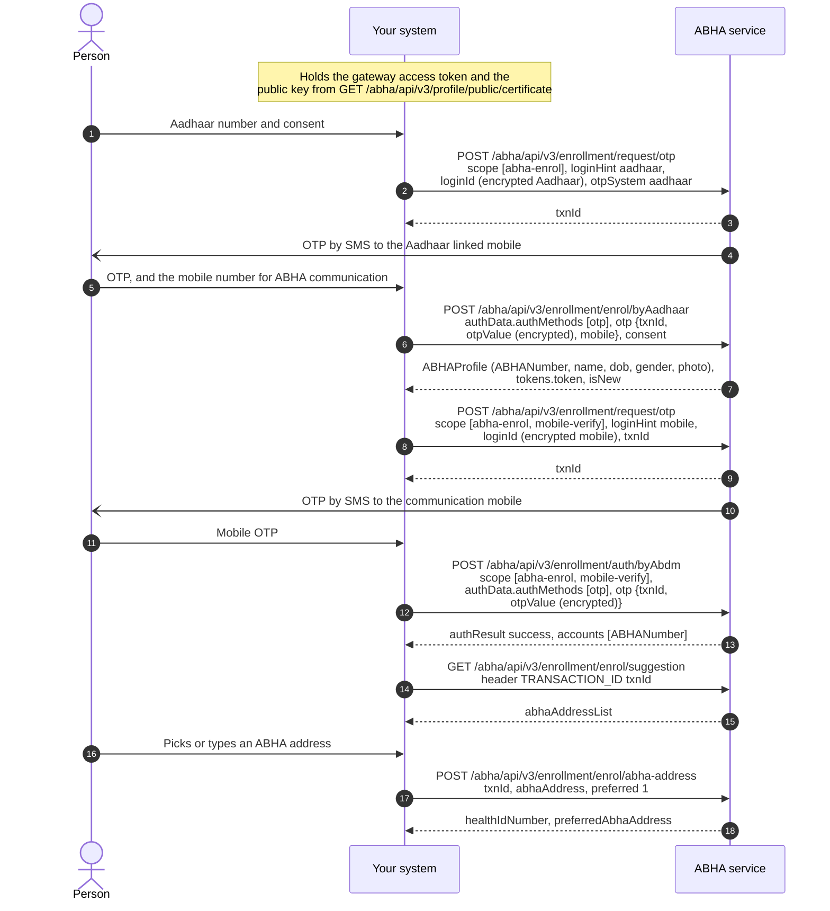
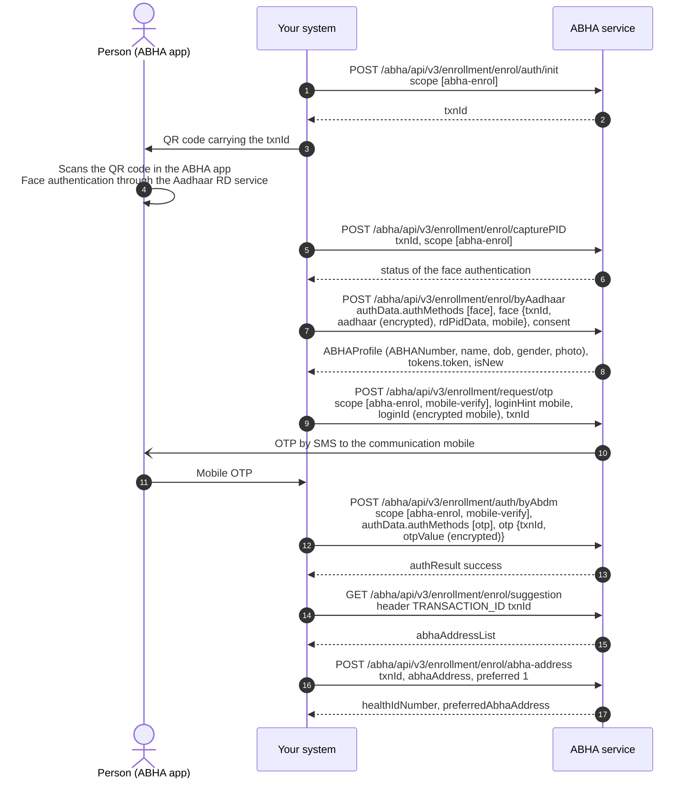
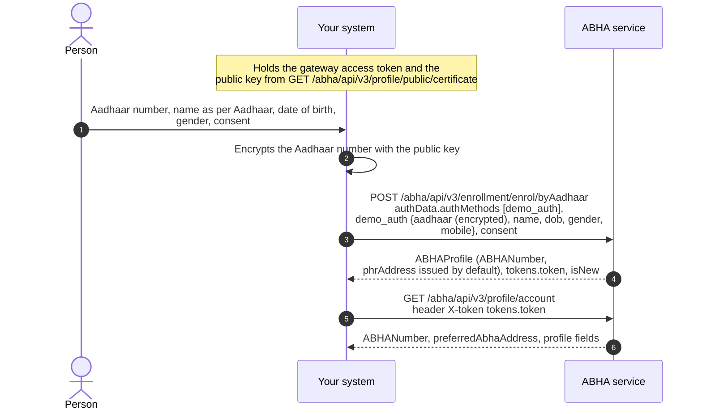
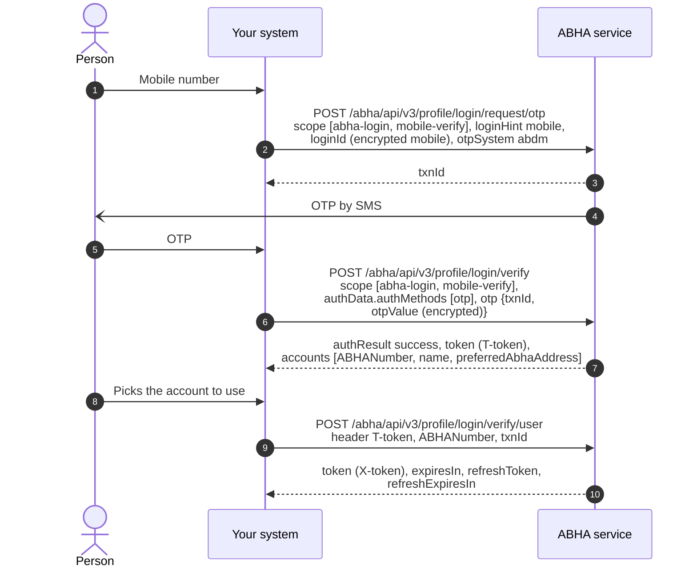
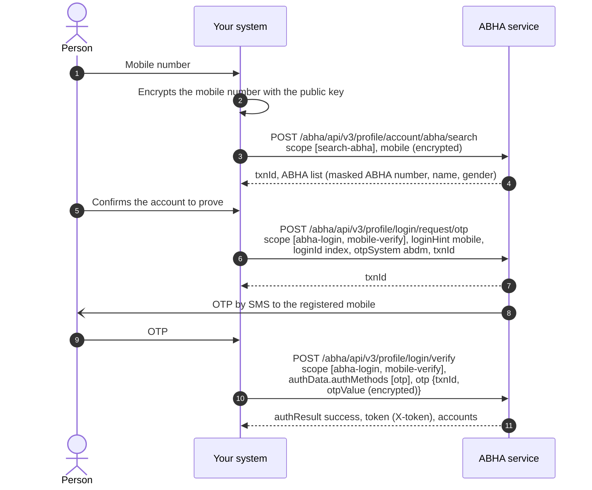
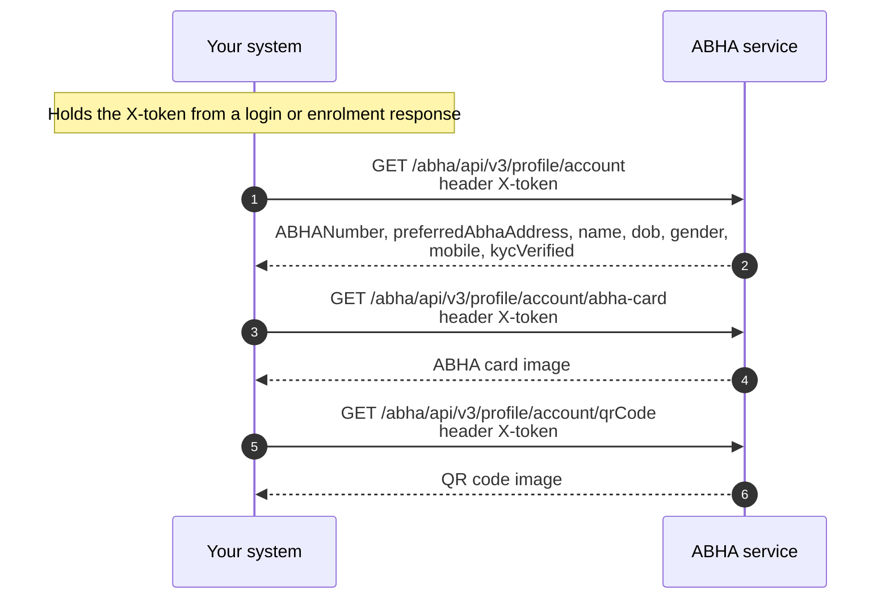

# M1 Identity: Create and verify ABHA

Milestone 1 focuses on the creation and management of [ABHA](/docs/pr-20/docs/hiecm/v3/getting-started/glossary#abha), the unique health identifier under [ABDM](/docs/pr-20/docs/hiecm/v3/getting-started/glossary#abdm). This milestone enables the creation of ABHA, authentication of users, and retrieval or updating of ABHA profile information through ABDM-compliant workflows. ABHA is a 14-digit unique health identifier issued to an individual upon successful completion of the prescribed verification process. ABHA serves as a foundational component for several ABDM services and workflows. Organizations implementing these services may be required to support ABHA creation and management capabilities, as applicable to their use case.

## In short

Milestone 1 focuses on ABHA creation, authentication, and profile management functionalities within the ABDM ecosystem. No health information exchange or health record sharing is performed as part of this milestone.

- ABDM gateway interactions require successful session establishment and the receipt of a valid access token before invoking protected APIs.
- The framework uses distinct gateway and user access tokens, each serving a specific authentication purpose and requiring usage in accordance with the applicable API specifications.
- Applications should use token validity and expiry parameters returned in API responses and implement appropriate token refresh mechanisms to ensure uninterrupted service continuity.
- Sensitive information, including Aadhaar numbers, mobile numbers, [OTPs](/docs/pr-20/docs/hiecm/v3/getting-started/glossary#otp), and passwords, must be transmitted using RSA encryption in accordance with ABDM security and data protection requirements.

## Capabilities enabled under Milestone 1 (M1)

| Capability                                                                 | What it enables                                                                                                                                                                  |
| -------------------------------------------------------------------------- | -------------------------------------------------------------------------------------------------------------------------------------------------------------------------------- |
| Session and tokens                                                         | Establish gateway sessions, manage access and refresh tokens, and retrieve public key certificates required for secure ABDM interactions.                                        |
| ABHA creation                                                              | Support creation of ABHA and associated identifiers in accordance with ABDM onboarding and verification workflows.                                                               |
| ABHA login                                                                 | Authenticate an ABHA holder using approved identifiers and authentication mechanisms, including mobile number, ABHA number, or ABHA address, as applicable.                      |
| Profile management                                                         | Retrieve and manage ABHA profile information, display ABHA credentials and QR codes, update eligible profile attributes, and support re-verification workflows where applicable. |
| [Scan and Register](/docs/pr-20/docs/hiecm/v3/use-cases/scan-and-register) | Support patient registration through QR-based workflows and generate service or queue identifiers in accordance with organization-specific processes.                            |

## Use cases

| Use case                                                                   | What it does                                                                                                                                                                                              |
| -------------------------------------------------------------------------- | --------------------------------------------------------------------------------------------------------------------------------------------------------------------------------------------------------- |
| [Scan and Register](/docs/pr-20/docs/hiecm/v3/use-cases/scan-and-register) | A patient scans the QR code at your counter and shares their ABHA profile. Registration needs no typing, every record from the visit links to the right ABHA address, and the patient gets a queue token. |

All use cases, and the milestone each belongs to: [Use cases](/docs/pr-20/docs/hiecm/v3/use-cases).

## Building blocks you use

- The [ABHA registry](/docs/pr-20/docs/hiecm/v3/registries), which holds the ABHA number, address and profile.
- The [HIE-CM](/docs/pr-20/docs/hiecm/v3/getting-started/glossary#hie-cm) gateway, which issues your session token. See [The ABDM gateway](/docs/pr-20/docs/hiecm/v3/concepts/gateway).

## Build M1 with an AI coding assistant

The M1 skill gives an AI coding assistant this milestone as one file: every M1 call, its error codes and its test cases. Install it, or open it in your assistant in one click.

M1 agent skill

Every M1 call, one per use case, with its error codes in one file: 132 operations, 17 codes.

[SKILL.md](/docs/pr-20/skills/abdm-m1/SKILL.md "The router. Use the command below to take the references with it.")

- ScaffoldThe loop that builds the module flow by flow against the sandbox, ending on an observed result rather than on a call returning 200.
- Design
- Integrate132 operations, with their hosts, headers and the rules that hold across them.
- Debug17 recorded error codes, each with its message and what to do about it.

`mkdir -p .claude/skills/abdm-m1/references && curl -fsSL https://nha-in.github.io/docs/pr-20/skills/abdm-m1/SKILL.md -o .claude/skills/abdm-m1/SKILL.md && for f in scaffold design integrate debug; do curl -fsSL https://nha-in.github.io/docs/pr-20/skills/abdm-m1/references/$f.md -o .claude/skills/abdm-m1/references/$f.md; done`

[Open in Claude](claude://code/new?q=Install%20the%20ABDM%20M1%20agent%20skill%20into%20this%20project%2C%20then%20help%20me%20use%20it.%0A%0ARun%20this%3A%0Amkdir%20-p%20.claude%2Fskills%2Fabdm-m1%2Freferences%20%26%26%20curl%20-fsSL%20https%3A%2F%2Fnha-in.github.io%2Fdocs%2Fpr-20%2Fskills%2Fabdm-m1%2FSKILL.md%20-o%20.claude%2Fskills%2Fabdm-m1%2FSKILL.md%20%26%26%20for%20f%20in%20scaffold%20design%20integrate%20debug%3B%20do%20curl%20-fsSL%20https%3A%2F%2Fnha-in.github.io%2Fdocs%2Fpr-20%2Fskills%2Fabdm-m1%2Freferences%2F%24f.md%20-o%20.claude%2Fskills%2Fabdm-m1%2Freferences%2F%24f.md%3B%20done%0A%0AIf%20this%20session%20did%20not%20open%20in%20the%20repository%20I%20am%20integrating%20ABDM%20into%2C%20ask%20me%20for%20the%20path%20before%20you%20write%20anything.)

Drops the skill into this project. Claude loads it when a task matches.

How to use it

1. Run the command above in the repository you are integrating.
2. Ask your agent for the job in your own words. "Add ABHA creation by Aadhaar OTP to this codebase", "why am I getting 404". The skill loads when the task matches it.
3. Check what it writes against these pages. The skill carries the facts, not the sandbox: nothing in it has been run against ABDM.
4. Open in Claude needs that app installed. It fills the composer and waits: nothing runs until you read it and press Enter.

## ABHA creation

### ABHA creation by an Aadhaar OTP

The individual provides their Aadhaar number. The ABHA service sends a one time password ([OTP](/docs/pr-20/docs/hiecm/v3/getting-started/glossary#otp)) to the mobile number registered against that Aadhaar. Upon successful verification, the individual selects an ABHA address, and the ABHA number is issued.

### ABHA creation by face authentication

Individuals who are unable to use OTP-based authentication, including cases where the mobile number linked to Aadhaar is unavailable or inaccessible, may use face authentication as an alternative verification mechanism, subject to ABDM and UIDAI guidelines. Face authentication is performed through authorized Aadhaar Registered Device (RD) services using approved authentication workflows.

ABDM documentation references biometric-based ABHA creation workflows, including face authentication and other supported biometric modalities where applicable. Organizations should implement authentication methods in accordance with the officially published specifications and follow them before proceeding with production deployment.

### ABHA creation by fingerprint or iris

Aadhaar Biometric-Based ABHA Creation enables users to create an Ayushman Bharat Health Account (ABHA) by securely verifying their identity using biometric authentication through an Aadhaar Registered Device (RD). The RD Service captures the user's biometric data and generates an encrypted, digitally signed PID block, which is submitted along with the Aadhaar details for verification. Upon successful authentication and user consent, the user's profile is validated and a unique ABHA number is generated, enabling secure onboarding into the ABDM digital health ecosystem.

The Registered Device (RD) List and information can be found on the following link: [uidai.gov.in](https://uidai.gov.in/en/ecosystem/authentication-devices-documents/biometric-devices.html).

The calls, in order, are on the [M1 API reference](/docs/pr-20/docs/hiecm/v3/api/m1) under ABHA creation, fingerprint and ABHA creation, iris.

### ABHA creation by demographic authentication

This onboarding pathway is intended for eligible government programme integrations in accordance with ABDM guidelines. Unlike OTP-based or biometric authentication workflows, demographic authentication relies on validation of Aadhaar demographic information, including name, date of birth, and gender, through the prescribed verification process.

The `enrol/byAadhaar` API is invoked with the appropriate authentication method and encrypted demographic details as specified in the implementation guidelines. Implementers should account for the response structure defined for this workflow, including user token handling and ABHA address generation behaviour. A system-generated ABHA address may be assigned during account creation, and organizations may provide users with the option to configure a more user-friendly ABHA address where permitted. Any demographic verification failures should be handled in accordance with the error codes and response specifications published by ABDM.

### Create a child ABHA

ABDM supports guardian-based management of ABHA accounts for eligible children in accordance with applicable policies and implementation guidelines. This functionality is currently made available only to select government integrators, subject to approval by the National Health Authority (NHA). The workflow includes creation of a child ABHA linked to a verified parent or guardian account, updating child profile information, and retrieval of child accounts associated with the parent or guardian.

## ABHA login via mobile number

ABHA login using a registered mobile number enables individuals to securely access their ABHA-linked profile and services through a mobile OTP-based authentication process. Since a single mobile number may be associated with multiple ABHA accounts, the user may be required to select the appropriate ABHA account after successful verification. Upon completion of the authentication process, authorized access is granted to the individual's ABHA profile and associated services in accordance with ABDM guidelines.

## Find ABHA from mobile number

This workflow enables discovery of an existing ABHA using a registered mobile number when an individual does not readily know their ABHA details. Upon successful verification of the mobile number, the system may return limited, non-sensitive information such as the individual's name, gender, and masked ABHA number, allowing confirmation of whether an ABHA has already been created.

Access to complete profile information and sensitive account details requires successful authentication through approved mechanisms such as OTP, biometric authentication, or face authentication. All identifiers and personal information must be encrypted and processed within the integrating system in accordance with ABDM security, privacy, and data protection requirements. See [encryption](/docs/pr-20/docs/hiecm/v3/concepts/encryption) for how to do it locally.

## ABHA Profile Management

This functionality enables retrieval and management of an individual's ABHA profile following successful authentication. Authorized users can access profile information, view their ABHA card, and retrieve the associated Quick Response (QR) code, which serves as a digital representation of the ABHA identifier for use across ABDM-enabled healthcare services.

The workflow also supports profile updates in accordance with applicable ABDM guidelines, ensuring that health identity information remains accurate and up to date while complying with prescribed security, privacy, and authentication requirements.

## Next

- Register a patient who scanned your counter QR code: [Scan and Register](/docs/pr-20/docs/hiecm/v3/use-cases/scan-and-register).
- The calls, base URLs and error shapes: [M1 API reference](/docs/pr-20/docs/hiecm/v3/api/m1).
- Certification runs once, for the whole integration: [Go live](/docs/pr-20/docs/hiecm/v3/getting-started/going-live).
- The next milestone: [M2 Health Information Provider](/docs/pr-20/docs/hiecm/v3/milestones/m2).
