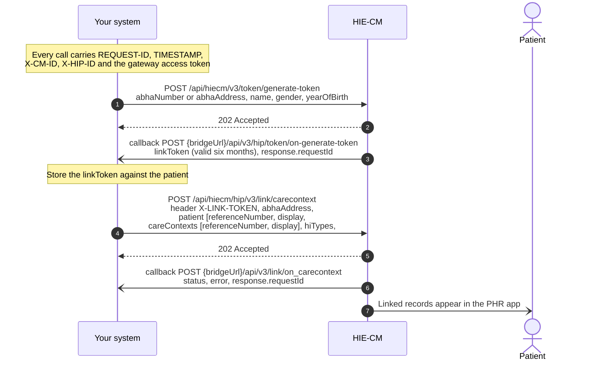
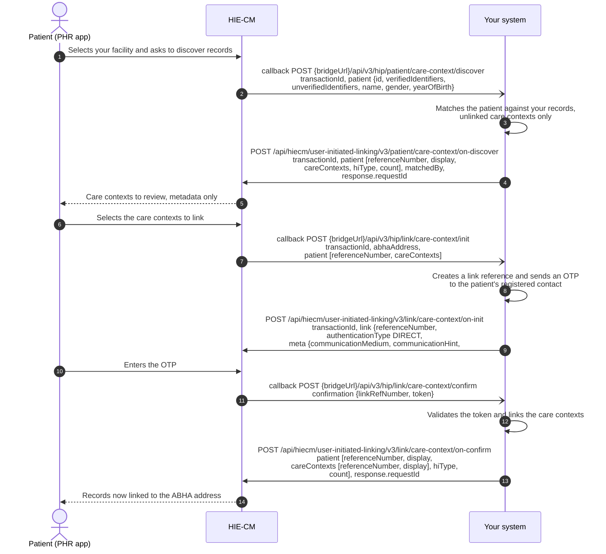
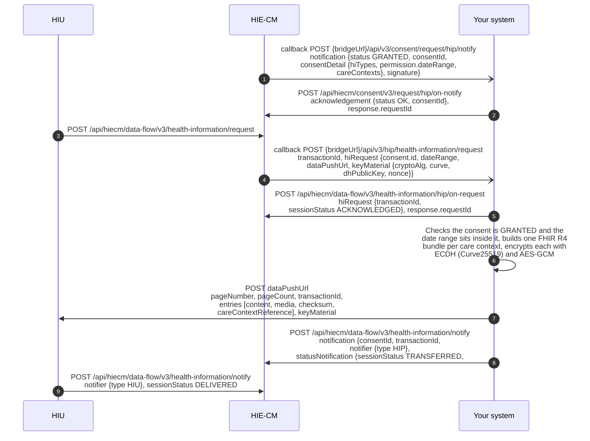

# M2 Health Information Provider: Create and link records

Milestone 2 enables a [Health Information Provider](/docs/pr-20/docs/hiecm/v3/getting-started/glossary#hip) (HIP) to create digital health records and to generate and link [care contexts](/docs/pr-20/docs/hiecm/v3/concepts/care-context) with a patient's [ABHA Address](/docs/pr-20/docs/hiecm/v3/getting-started/glossary#abha-address). It also enables the HIP to facilitate record [discovery](/docs/pr-20/docs/hiecm/v3/getting-started/glossary#discovery) through a Personal Health Record ([PHR](/docs/pr-20/docs/hiecm/v3/getting-started/glossary#phr)) application, and to securely share encrypted health information across the ABDM ecosystem.

## In short

Milestone 2 enables a Healthcare Facility, acting as a Health Information Provider (HIP), to link a patient's health records with the patient's ABHA Address and make such records available within the ABDM ecosystem. The linkage of records may be carried out through either HIP-Initiated Linking or User-Initiated Linking.

- **HIP-Initiated Linking.** In this workflow, an ABDM-enabled Healthcare Facility links the patient's health records and care contexts with the patient's ABHA Address during the course of care, following successful patient authentication. The linked records are subsequently made available through the patient's PHR application.
- **User-Initiated Linking.** In this workflow, a patient initiates the linkage of previously generated health records through a PHR application. The HIP validates the patient details, identifies the corresponding records, and links the associated care contexts with the patient's ABHA Address upon successful verification.
- **Data Transfer.** Health information is structured in accordance with the HL7 [FHIR](/docs/pr-20/docs/hiecm/v3/getting-started/glossary#fhir) R4 standard. The FHIR bundle is encrypted and securely exchanged through the ABDM ecosystem.

## Capabilities under M2

The following capabilities shall be supported by an ABDM-compliant HIP system, as applicable to the integrating entity.

| Capability                              | What it enables                                                                                                                                                                         |
| --------------------------------------- | --------------------------------------------------------------------------------------------------------------------------------------------------------------------------------------- |
| Care contexts                           | Organise health records relating to a visit, admission or other episode of care into an identifiable care context that can be linked with the patient's ABHA Address.                   |
| HIP-initiated linking                   | Enables a Healthcare Facility to link a patient's health records with the patient's ABHA Address at the point of care, following successful verification of the patient's ABHA Address. |
| Notification to mobile                  | Enables the HIP to notify the patient upon successful linkage of health records.                                                                                                        |
| Discovery and linking                   | Enables the identification and linkage of a patient's previously generated health records with the patient's ABHA Address through a discovery request initiated via a PHR application.  |
| Health-information request and transfer | Enables the secure, consent-based exchange of a patient's health records in ABDM-prescribed HL7 FHIR R4 format within the ABDM ecosystem.                                               |

## Use cases

| Use case                                                         | What it does                                                                                                                                                                                                                                 |
| ---------------------------------------------------------------- | -------------------------------------------------------------------------------------------------------------------------------------------------------------------------------------------------------------------------------------------- |
| [Scan and Pay](/docs/pr-20/docs/hiecm/v3/use-cases/scan-and-pay) | A patient scans the QR code at your counter, sees their open orders in their PHR app and pays there. You answer with the orders and the payment bundle, and report the payment status. The callbacks land on the bridge you register for M2. |

All use cases, and the milestone each belongs to: [Use cases](/docs/pr-20/docs/hiecm/v3/use-cases).

## Who needs it

M2 is applicable to healthcare facilities and systems that create and maintain digital health records, including hospitals, clinics, laboratories, pharmacies and diagnostic or imaging centres.

## Prerequisites

Prior to implementation of Milestone 2, the following requirements shall be fulfilled:

1. The Healthcare Facility shall have a valid Health Facility Registry ([HFR](/docs/pr-20/docs/hiecm/v3/getting-started/glossary#hfr)) ID, and the integrating software shall be registered and mapped to the facility as a Health Information Provider (HIP).
2. The system shall support capture and verification of the patient's ABHA Address through the applicable ABDM authentication mechanism.
3. The system shall generate and maintain digital health records for linking with the patient's ABHA Address.
4. Health information shall be packaged in HL7 FHIR R4 format and conform to the applicable ABDM FHIR profiles published by NRCeS at [nrces.in](https://nrces.in/ndhm/fhir/r4/index.html).

## Health record formats

Each applicable health-information type shall be represented as a FHIR document Bundle. Depending on the applicable profile and use case, the Bundle may contain structured clinical data and, where permitted, an attachment such as a PDF document or image.

[HRP](/docs/pr-20/docs/hiecm/v3/getting-started/glossary#hrp) can only link the following type of health records to an ABHA Address. All health records must be structured as FHIR (Fast Healthcare Interoperability Resources) formats. The FHIR specifications used by ABDM are published and maintained by the National Resource Centre for E-Health Standards (NRCES) at [nrces.in](https://nrces.in/ndhm/fhir/r4/index.html).

All health records have been designed to be used in 2 ways:

- A simple FHIR bundle with a PDF or image attachment containing the detailed health information
- A structured FHIR bundle with coded health information.

Here is a list of Health Records, based on FHIR's specifications:

| Name                     | Definition                                                                                                                           |
| ------------------------ | ------------------------------------------------------------------------------------------------------------------------------------ |
| Diagnostic Report Record | Represents diagnostic reports including radiology and laboratory reports that can be shared across the health ecosystem.             |
| Discharge Summary Record | Clinical document representing the discharge summary record for ABDM HDE data set.                                                   |
| Health Document Record   | Represents unstructured historical health records as single or multiple documents, typically uploaded by patients via Health Locker. |
| Immunization Record      | Represents immunization records along with additional documents such as vaccine certificates and next dose recommendations.          |
| OP Consult Record        | Represents outpatient consultation notes including examinations, procedures, medications, and clinical advice.                       |
| Prescription Record      | Represents medication advice compliant with Pharmacy Council of India (PCI) guidelines.                                              |
| Wellness Record          | Represents routine wellness information including vitals, physical examination, and general health data captured via PHR apps.       |
| Invoice Record           | Represents billing details such as pharmacy invoices, consultation invoices, and other financial records.                            |

Note: Implementing all HI types is mandatory for [HMIS](/docs/pr-20/docs/hiecm/v3/getting-started/glossary#hmis).

## Care contexts

A Care Context represents a logical grouping of a patient's health records. Each HMIS/[LMIS](/docs/pr-20/docs/hiecm/v3/getting-started/glossary#lmis) system should define how patient data is organised into one or more care contexts in a meaningful and consistent way. A care context serves as the unit that is associated with a patient's ABHA address within the system.

The components of a care context, the recommended structure per visit and per admission, and the JSON shape are on [Care contexts](/docs/pr-20/docs/hiecm/v3/concepts/care-context).

## Build M2 with an AI coding assistant

The M2 skill gives an AI coding assistant this milestone as one file: every M2 call and callback, its error codes and its test cases. Install it, or open it in your assistant in one click.

M2 agent skill

Every M2 call and callback, its error codes and its certification cases in one file: 31 operations, 120 codes, 46 cases.

[SKILL.md](/docs/pr-20/skills/abdm-m2/SKILL.md "The router. Use the command below to take the references with it.")

- ScaffoldThe loop that builds the module flow by flow against the sandbox, ending on an observed result rather than on a call returning 200.
- Design
- Integrate31 operations, with their hosts, headers and the rules that hold across them.
- DebugNo error code is recorded for this module yet.

`mkdir -p .claude/skills/abdm-m2/references && curl -fsSL https://nha-in.github.io/docs/pr-20/skills/abdm-m2/SKILL.md -o .claude/skills/abdm-m2/SKILL.md && for f in scaffold design integrate debug; do curl -fsSL https://nha-in.github.io/docs/pr-20/skills/abdm-m2/references/$f.md -o .claude/skills/abdm-m2/references/$f.md; done`

[Open in Claude](claude://code/new?q=Install%20the%20ABDM%20M2%20agent%20skill%20into%20this%20project%2C%20then%20help%20me%20use%20it.%0A%0ARun%20this%3A%0Amkdir%20-p%20.claude%2Fskills%2Fabdm-m2%2Freferences%20%26%26%20curl%20-fsSL%20https%3A%2F%2Fnha-in.github.io%2Fdocs%2Fpr-20%2Fskills%2Fabdm-m2%2FSKILL.md%20-o%20.claude%2Fskills%2Fabdm-m2%2FSKILL.md%20%26%26%20for%20f%20in%20scaffold%20design%20integrate%20debug%3B%20do%20curl%20-fsSL%20https%3A%2F%2Fnha-in.github.io%2Fdocs%2Fpr-20%2Fskills%2Fabdm-m2%2Freferences%2F%24f.md%20-o%20.claude%2Fskills%2Fabdm-m2%2Freferences%2F%24f.md%3B%20done%0A%0AIf%20this%20session%20did%20not%20open%20in%20the%20repository%20I%20am%20integrating%20ABDM%20into%2C%20ask%20me%20for%20the%20path%20before%20you%20write%20anything.)

Drops the skill into this project. Claude loads it when a task matches.

How to use it

1. Run the command above in the repository you are integrating.
2. Ask your agent for the job in your own words. "Link a care context for this patient". The skill loads when the task matches it.
3. Check what it writes against these pages. The skill carries the facts, not the sandbox: nothing in it has been run against ABDM.
4. Open in Claude needs that app installed. It fills the composer and waits: nothing runs until you read it and press Enter.

## Workflow overview

This section presents the principal M2 workflows through separate sequence diagrams to provide an overview of the interactions among the participating systems before the detailed API specifications are described.

For the diagrams, "Your system" refers to the HMIS, LMIS, [EMR](/docs/pr-20/docs/hiecm/v3/getting-started/glossary#emr) or other ABDM-compliant software used by the health facility to perform HIP functions. "HIE-CM" refers to the Health Information Exchange and Consent Manager that facilitates consent management and the secure exchange of health information within the ABDM ecosystem.

## Linking care context

### HIP initiated linking

This workflow is applicable when the user has shared their ABHA address at the time of registration with the healthcare facility.

The HIP generates a [link token](/docs/pr-20/docs/hiecm/v3/getting-started/glossary#link-token) using the patient's ABHA address and demographic details, which is then shared with the patient for authentication. Upon successful verification, a linking token valid for 6 months is created, and the patient's care context is linked to the corresponding ABHA address.

Process flow:

1. **Assigning Records to Care Contexts.** Whenever a new health record is created, the HRP (HMIS/LMIS) must determine which care context the record belongs to. This ensures that records are grouped logically (e.g., per OPD or IPD visit).
2. **Linking Care Contexts to ABHA.** The HRP must link the care context to the user's ABHA address as soon as the health record is ready to be shared. Linking is essential for enabling the user to access their records through PHR applications.
3. **Linking Token Requirement.** A linking token is required to perform care context linking. This token is generated and stored at the time of user registration, and used as an authorization mechanism for linking.
4. **Token Validation and Validity.** The linking token should be validated (e.g., via tools like jwt.io) before use. Current validity period: 6 months. Expired or invalid tokens must not be used for linking.
5. **Token Regeneration.** If a valid linking token is not available, the HRP must regenerate the token using demographic authentication.
6. **Notifications to PHR Applications.** Whenever a new care context is linked, or an existing care context is updated with new health records, a notification is automatically sent to all PHR (Personal Health Record) applications that are subscribed to the user's ABHA address.

Step 6 is the acknowledgement. Step 7 is the answer. The link is confirmed only when the callback arrives at `/api/v3/link/on_carecontext` on your bridge, so do not mark a record as linked on the strength of the 202. See [the outcome of a care context linking call](/docs/pr-20/docs/hiecm/v3/api/m2/endpoints/m2-callbacks/02-m2-post-v3-link-on-carecontext).

Which steps are callbacks?

A step drawn from the HIE-CM to your system is a POST to the callback URL registered for your bridge. It arrives on its own. Do not poll for it.

One call links a care context. When an existing care context is updated with new health records, call `POST /api/hiecm/hip/v3/link/context/notify` instead of linking it again; the acknowledgement arrives at `/api/v3/links/context/on-notify` on your bridge.

### Notification to mobile

This workflow applies when a user does not share an ABHA address during registration, but provides basic demographic details such as:

- Mobile number
- Name
- Age
- Gender

Process overview:

1. **Health Record Creation.** When a new health record is generated for such a user, the Health Information Provider (HIP) must initiate the process to make the record discoverable.
2. **ABDM Notification Trigger.** The HIP calls the relevant ABDM API once the health record is ready to be shared. This triggers ABDM to notify the user.
3. **User Notification via SMS.** ABDM sends an SMS notification to the user's registered mobile number. The SMS informs the user that a new health record is available for access.
4. **Deep Link for PHR Access.** The SMS contains a secure deep link. Clicking the link launches the user's PHR (Personal Health Record) application (if installed), or redirects them to install and access a PHR app.
5. **ABHA Creation and Record Linking.** Through the PHR app, the user can create an ABHA address, if not already available, discover the newly created health record, and link the record to their ABHA.

The call is `POST /api/hiecm/hip/v3/link/patient/links/sms/notify2`, and the acknowledgement arrives at `/api/v3/patients/sms/on-notify` on your bridge.

### Discovery and link

ABDM enables users to discover and link their health records from any health facility they have visited through a standardized discovery process.

Overview of the discovery process:

- **Initiation via PHR Application.** The user initiates a Discovery request using a PHR (Personal Health Record) application. The user selects the health facility where they received care.
- **Request Routing.** The HIE-CM (Health Information Exchange & Consent Manager) forwards the discovery request to the relevant HRP/HIP associated with the selected health facility.
- **Mandatory API Implementation.** All HRPs/HIPs must correctly implement the Discovery API to ensure compliance and interoperability.
- **Response from HRP/HIP.** The HRP searches for matching patient records. If records are found, it returns a list of care contexts associated with the user. The user can then review and link these care contexts to their ABHA address.

Implementing the discovery algorithm. When a discovery request is received, the HRP/HIP is provided with verified and unverified identifiers to help match patient records.

1. **Input Data for Matching.** Verified identifiers are reliable, system-verified attributes: ABHA address, mobile number, name, gender, year of birth. Unverified / user-declared information may include health facility-issued identifiers (e.g., medical registration number / patient ID).
2. **Record Matching Logic.** The HRP must implement a robust matching algorithm to identify the correct patient records. Matching should be based on a combination of verified identifiers (preferred and higher weight) and supplementary unverified information.
3. **Response Construction.** Once matching records are identified, the HRP must organize the records into care contexts. Each care context should follow the defined structure (reference ID + display name). The response must include a list of care contexts associated with the patient.
4. **Important Compliance Requirement.** No clinical or sensitive information (e.g., diagnosis, reports, test results) must be included in the discovery response. Only metadata describing the care context should be shared.

Steps 7 to 13 are the link init and confirm exchange: the gateway calls your `init` and `confirm` callbacks, and you answer each with `on-init` and `on-confirm`. The fields are on the [M2 API reference](/docs/pr-20/docs/hiecm/v3/api/m2).

## Request for health records and data transfer

The process for requesting and transferring health records between the [HIU](/docs/pr-20/docs/hiecm/v3/getting-started/glossary#hiu) (Health Information User), HIE-CM, and HIP (Health Information Provider) is carried out in three stages.

**Stage 1: Initiation of Health Information Request.** The HIU initiates a request for a patient's health information from the HIP, routed through the HIE-CM, based on a valid [consent artefact](/docs/pr-20/docs/hiecm/v3/getting-started/glossary#consent-artefact). The HIE-CM generates a Transaction ID for the entire data exchange, and shares this ID with both the HIU and HIP repositories to track the request lifecycle. The HIU includes the following key elements in the request:

- **Consent ID.** Identifies the consent artefact under which the data request is authorized.
- **Data Push URL (Callback URL).** Specifies where the HIP should send the requested data. This may differ from the HIU's registered gateway URL to enhance privacy and anonymity.
- **Request Parameters.** Date-time range for which health records are requested, and encryption parameters, including keys required for secure data transfer. ABDM uses Elliptic Curve Diffie–Hellman ([ECDH](/docs/pr-20/docs/hiecm/v3/getting-started/glossary#ecdh)) for encrypting health information.

**Stage 2: Validation and Data Transfer by HIP.** Upon receiving the request, the HIP repository performs validation checks: verify the Consent ID status (must be valid and active, not expired, paused, or revoked), ensure the requested date-time range falls within the permitted range defined in the consent artefact, and validate encryption parameters. After successful validation, the HIP retrieves the requested health records, encrypts the data using the provided ECDH-based encryption parameters, and digitally signs the encrypted payload using its long-term private key. The encrypted data, along with the Transaction ID, is then sent to the HIU's Data Push URL.

**Stage 3: Notifications and Completion.** The HIP repository notifies the HIE-CM that the requested health data has been successfully transmitted. The HIU repository notifies the HIE-CM of the outcome: success (data received and processed) or failure (data transfer failed or could not be processed).

Pushing the data to HIU. Once the health records are prepared and encrypted, the HIP/HRP is responsible for transmitting the data to the HIU within the defined timelines and protocols.

1. **Timely Data Transmission.** The encrypted health data must be pushed to the HIU within a defined time window. The current timeout limit is 20 minutes from the initiation of the request. Delays beyond this limit may result in request failure or timeout handling.
2. **Handling Large Data Volumes.** For large datasets (e.g., CT scans, MRI images, or files in hundreds of MBs), data may be split and transmitted in multiple parts. This ensures reliable transfer without overloading network or system limits.
3. **Streaming for Large Files.** For very large files, it is recommended to use a streaming approach rather than sending the entire payload at once. Streaming improves transfer efficiency, reliability and resource utilization.
4. **Completion Notification.** After successfully pushing the data, the HIP/HRP must notify the HIE-CM. This is done via the designated API endpoint: `health-information/notify`. This notification confirms that the data transfer has been completed.

Testing and verifying data transfer, with the PHR application:

1. On the PHR app, log in with an SBX ABHA address.
2. Register a patient with the same SBX ABHA address in your HIP/HRP.
3. Create a new health record for this patient.
4. Link a care context for this health record using HIP initiated linking.
5. PHR App should automatically make a request for the health record along with apt consents.
6. Prepare the health record, encrypt & transfer to the data push URL provided by the PHR app.
7. Your record should be successfully displayed in the ABHA PHR app.

## Packaging health data

The base FHIR envelope contains all the data that you want to transfer, compiled as a FHIR Bundle. A FHIR Bundle, referred to as data content, allows for packaging information of multiple types or as a Document. You can send over multiple such bundles through the data transfer API. Note that the bundle itself must be encrypted.

The bundle structure, the Composition rules and the document type codes are on [FHIR and health record formats](/docs/pr-20/docs/hiecm/v3/concepts/fhir#the-bundle-shape).

## Validation of FHIR bundle

Validate every bundle against the NRCeS implementation guide before you send it. The validator, the command and what it checks are on [Validate before you ship](/docs/pr-20/docs/hiecm/v3/concepts/fhir#validate-before-you-ship).

## Encryption of the health data

The primary goal of encryption in the ABDM ecosystem is to ensure that only the authorized Health Information User (HIU), who has received patient consent, can access the patient's health data. This process ensures secure, consent-driven data exchange between the HIP (Health Information Provider) and the HIU.

The key exchange, the derivation of the session key and the reference implementations are on [How a record travels](/docs/pr-20/docs/hiecm/v3/concepts/data-flow#the-encryption).

## Custom error codes

During ABDM integration, systems may encounter issues across discovery, linking, consent, encryption, and data exchange workflows. The codes are in one place on [M2 custom error codes](/docs/pr-20/docs/hiecm/v3/api/m2/custom-error-codes).

## Next

- Take payment for open orders from a patient's app: [Scan and Pay](/docs/pr-20/docs/hiecm/v3/use-cases/scan-and-pay).
- Requesting records from other facilities is [M3 Health Information User](/docs/pr-20/docs/hiecm/v3/milestones/m3).
- The calls, callbacks and error codes: [M2 API reference](/docs/pr-20/docs/hiecm/v3/api/m2).
- The cases M2 is tested against: the certification pack NHA issues. Certification runs once, for the whole integration: [Go live](/docs/pr-20/docs/hiecm/v3/getting-started/going-live).
