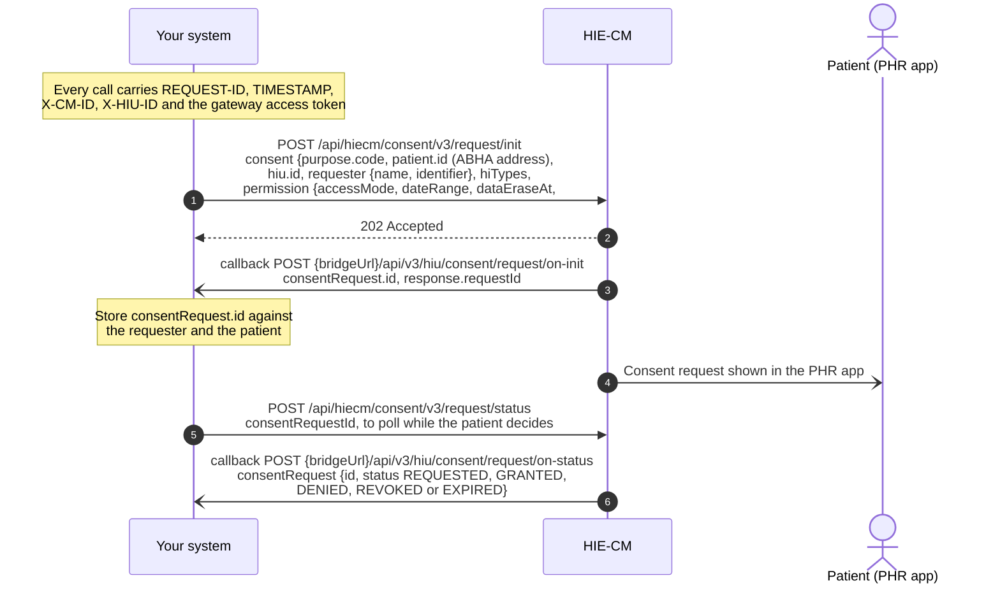
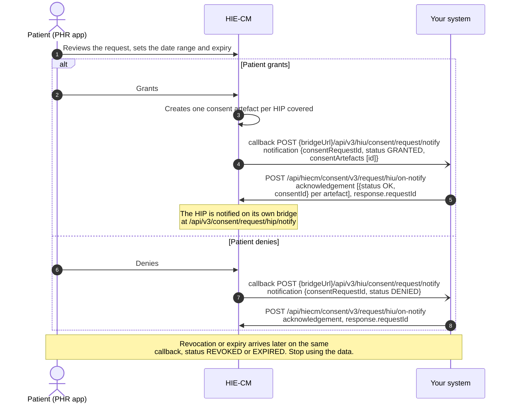
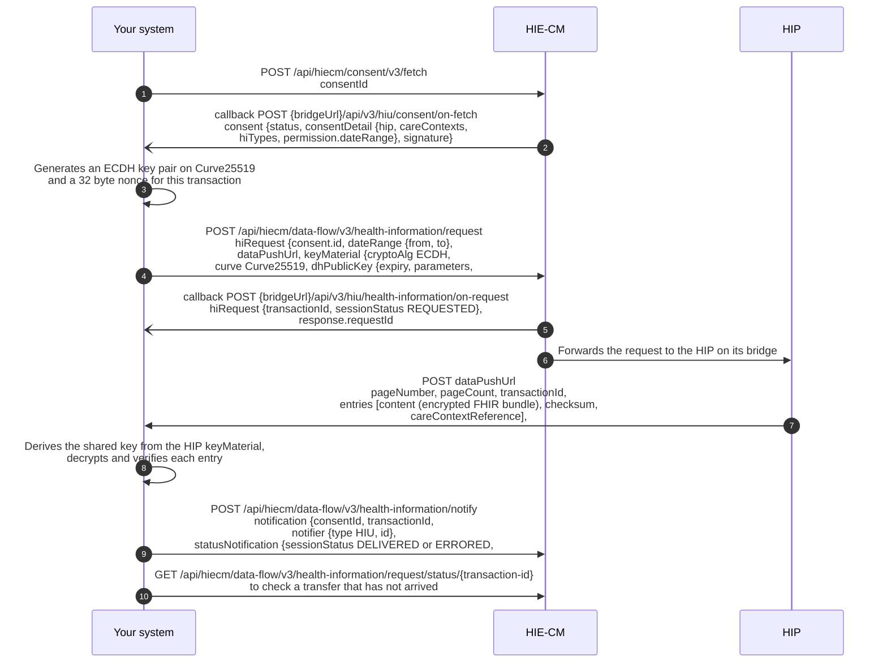

# M3 Retrieve: Health Information User Services

Milestone 3 enables a participating entity, acting as a [Health Information User](/docs/pr-20/docs/hiecm/v3/getting-started/glossary#hiu) (HIU), to request and retrieve a patient's health information through the ABDM consent-management framework. The HIU initiates a consent request with the prescribed parameters. Upon the patient's approval, the [HIE-CM](/docs/pr-20/docs/hiecm/v3/getting-started/glossary#hie-cm) provides the applicable [consent artefact](/docs/pr-20/docs/hiecm/v3/getting-started/glossary#consent-artefact) details. These enable the HIU to request and retrieve authorised health information from the concerned Health Information Provider(s).

## In short

The HIU initiates a consent request using the patient's [ABHA Address](/docs/pr-20/docs/hiecm/v3/getting-started/glossary#abha-address). The HIE-CM notifies the patient and communicates the consent status through the ABDM Gateway. Upon approval, the HIU fetches the generated consent artefact(s) and requests the authorised health information. The concerned [HIP](/docs/pr-20/docs/hiecm/v3/getting-started/glossary#hip) encrypts and transfers the information to the HIU's specified data-push URL.

## M3 functionality

1. Initiate a consent request using the patient's ABHA Address, specified health-information types and defined date range.
2. Track the consent status as Granted, Revoked, Expired or Denied.
3. Receive and fetch all consent artefacts generated upon approval.
4. Request health information under a valid consent artefact.
5. Receive and decrypt the information through the specified data-push URL and submit the prescribed receipt-status notification.

## Applicable for

Milestone 3 applies to entities or applications performing the Health Information User (HIU) role and requiring access to health information held by one or more Health Information Providers. These may include healthcare facilities, insurers, referral-service providers, clinical decision-support applications and [PHR](/docs/pr-20/docs/hiecm/v3/getting-started/glossary#phr) applications acting on behalf of the patient.

## Prerequisites

Before implementing Milestone 3, the healthcare facility must complete [Milestone 1](/docs/pr-20/docs/hiecm/v3/milestones/m1) requirements and should be registered as an HIU.

## Consent management

- Initiate the consent request and receive its identifier through the prescribed callback.
- Track the consent status as Granted, Revoked, Expired or Denied.
- Fetch all consent artefacts generated against the approved request.
- Initiate the health-information request against the relevant valid consent artefact.
- Receive and decrypt the information through the specified data-push URL and submit the prescribed receipt-status notification.
- Discontinue access upon consent expiry or revocation.

## Build M3 with an AI coding assistant

The M3 skill gives an AI coding assistant this milestone as one file: every M3 call and callback with its error codes. Install it, or open it in your assistant in one click.

M3 agent skill

Every M3 call and callback with its error codes in one file: 25 operations, 95 codes.

[SKILL.md](/docs/pr-20/skills/abdm-m3/SKILL.md "The router. Use the command below to take the references with it.")

- ScaffoldThe loop that builds the module flow by flow against the sandbox, ending on an observed result rather than on a call returning 200.
- Design
- Integrate23 operations, with their hosts, headers and the rules that hold across them.
- DebugNo error code is recorded for this module yet.

`mkdir -p .claude/skills/abdm-m3/references && curl -fsSL https://nha-in.github.io/docs/pr-20/skills/abdm-m3/SKILL.md -o .claude/skills/abdm-m3/SKILL.md && for f in scaffold design integrate debug; do curl -fsSL https://nha-in.github.io/docs/pr-20/skills/abdm-m3/references/$f.md -o .claude/skills/abdm-m3/references/$f.md; done`

[Open in Claude](claude://code/new?q=Install%20the%20ABDM%20M3%20agent%20skill%20into%20this%20project%2C%20then%20help%20me%20use%20it.%0A%0ARun%20this%3A%0Amkdir%20-p%20.claude%2Fskills%2Fabdm-m3%2Freferences%20%26%26%20curl%20-fsSL%20https%3A%2F%2Fnha-in.github.io%2Fdocs%2Fpr-20%2Fskills%2Fabdm-m3%2FSKILL.md%20-o%20.claude%2Fskills%2Fabdm-m3%2FSKILL.md%20%26%26%20for%20f%20in%20scaffold%20design%20integrate%20debug%3B%20do%20curl%20-fsSL%20https%3A%2F%2Fnha-in.github.io%2Fdocs%2Fpr-20%2Fskills%2Fabdm-m3%2Freferences%2F%24f.md%20-o%20.claude%2Fskills%2Fabdm-m3%2Freferences%2F%24f.md%3B%20done%0A%0AIf%20this%20session%20did%20not%20open%20in%20the%20repository%20I%20am%20integrating%20ABDM%20into%2C%20ask%20me%20for%20the%20path%20before%20you%20write%20anything.)

Drops the skill into this project. Claude loads it when a task matches.

How to use it

1. Run the command above in the repository you are integrating.
2. Ask your agent for the job in your own words. "Raise a consent request and fetch the records it covers". The skill loads when the task matches it.
3. Check what it writes against these pages. The skill carries the facts, not the sandbox: nothing in it has been run against ABDM.
4. Open in Claude needs that app installed. It fills the composer and waits: nothing runs until you read it and press Enter.

## Workflow overview

Milestone 3 covers the consent-management and health-information exchange workflow of a Health Information User (HIU). The HIU initiates a consent request for specified health information. Upon the patient's approval, the HIU fetches the applicable consent artefact and initiates the health-information request. The following diagrams illustrate this workflow and shall be read with the applicable [M3 API specifications](/docs/pr-20/docs/hiecm/v3/api/m3).

| In the diagram     | Description                                                                                                                            |
| ------------------ | -------------------------------------------------------------------------------------------------------------------------------------- |
| Patient            | The individual whose health records are requested, acting through the PHR application.                                                 |
| Application/System | The organisation's software application through which the request is initiated.                                                        |
| HIE-CM Gateway     | The ABDM [gateway](/docs/pr-20/docs/hiecm/v3/getting-started/glossary#gateway) responsible for routing all API requests and callbacks. |
| HIE-CM             | The consent manager responsible for managing consent and notifying the patient.                                                        |
| HIP                | The healthcare facility holding the records and acting as the Health Information Provider.                                             |

## Journey 1: raising a consent request

- An HIU requests access to a patient's health data by sending a consent request with the patient's ABHA address via the HIE-CM.
- The HIE-CM acknowledges the request and returns a Consent Request ID through the Gateway.
- The patient is notified by the HIE-CM and can review, approve, or deny the consent request.
- The HIE-CM then communicates the patient's consent status back to the HIU through the Gateway.

The consent request ID is the handle for everything that follows. Store it against the requester and the patient.

## Journey 2: the patient grants or denies

- If the request is approved, the HIE-CM shares the consent artefact IDs generated for that request with the HIU.
- If the request is denied, the HIE-CM notifies the HIU that the consent request has been rejected.

* A consent grant is valid for a specific period decided by the patient.
* One consent grant may generate multiple consent artefacts, so all consent artefact IDs should be stored.
* If the patient revokes consent or it expires, access to the health information must be stopped.

## Journey 3: fetching the records

Using the consent artefact ID, the HIU fetches the consent artefact and requests the health information covered under that consent. The requested health data is then securely delivered to the data push URL provided by the HIU.

## Next

- The calls, callbacks and error codes: [M3 API reference](/docs/pr-20/docs/hiecm/v3/api/m3).
- The cases M3 is tested against: the certification pack NHA issues. Certification runs once, for the whole integration: [Go live](/docs/pr-20/docs/hiecm/v3/getting-started/going-live).
- The next milestone: [M4 Enrol](/docs/pr-20/docs/hiecm/v3/milestones/m4).
